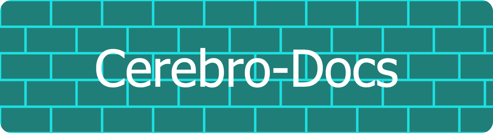

# Cerebro Docs



Documentation site for the Gnosis Analytics platform, built with [MkDocs Material](https://squidfunk.github.io/mkdocs-material/).

**Live site:** [docs.analytics.gnosis.io](https://docs.analytics.gnosis.io)

---

## Quick Start

```bash
pip install -r requirements.txt
mkdocs serve
# http://127.0.0.1:8000
```

## Build & Deploy

```bash
mkdocs build --strict          # static site → site/
docker build -t cerebro-docs . # Docker image (Nginx)
```

## Auto-Update Scripts

Model catalogs, API endpoints, and dashboard metrics are auto-generated from live data sources. Sections between `<!-- BEGIN/END AUTO-GENERATED -->` markers are overwritten by these scripts.

```bash
python scripts/update_docs.py                  # regenerate from dbt manifest
python scripts/update_docs.py --dry-run        # preview changes

DUNE_API_KEY=xxx python scripts/sync_dune_queries.py   # sync 1,288 Dune queries
python scripts/sync_dune_queries.py --cache dune_cache.json  # use cached data
```

## Structure

```
docs/
├── getting-started/     Platform overview, quickstart, architecture
├── data-pipeline/       Ingestion, crawlers, transformation
├── api/                 Authentication, endpoints, filtering, rate limits
├── models/              dbt model catalog (8 modules, 387 models)
├── esg-reporting/       ESG methodology, carbon footprint, data pipeline
├── mcp/                 MCP server tools, reports, setup
├── dashboard/           Sectors and configuration
├── developer/           Adding endpoints, models, scrapers
├── operations/          Infrastructure, deployment, monitoring
└── reference/           Env vars, glossary, data dictionary, Dune queries
```

## Contributing

1. Edit markdown in `docs/`
2. Preview with `mkdocs serve`
3. Verify with `mkdocs build --strict`
4. Open a PR
