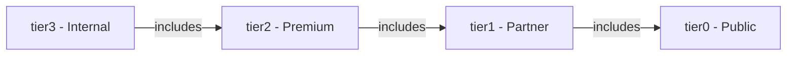

# Authentication

The Gnosis Analytics API uses header-based API key authentication with a tiered access control system. Higher-tier keys inherit access to all endpoints at or below their tier level, and public (tier0) endpoints can be called without any authentication.

## How It Works

Every API request is evaluated through a two-step process:

1. **Key validation** -- The `X-API-Key` header is checked against the server's key registry. Invalid keys are rejected immediately with a 403 error.
2. **Tier check** -- The user's tier is compared against the endpoint's required tier. If the user's tier is lower than required, the request is denied.

For tier0 endpoints, both steps are relaxed: no key is required, and anonymous users are granted tier0 access by default.

## The `X-API-Key` Header

Include your API key in the `X-API-Key` HTTP header on every request to non-public endpoints:

```bash
curl "https://api.analytics.gnosis.io/v1/consensus/blob_commitments/daily" \
  -H "accept: application/json" \
  -H "X-API-Key: YOUR_API_KEY"
```

!!! info "Header name is case-sensitive"
    The header must be exactly `X-API-Key`. Other casings (e.g., `x-api-key`) may not be recognized depending on your HTTP client and any intermediary proxies.

## Obtaining an API Key

| Tier | How to Obtain |
|------|---------------|
| `tier0` | No key required. All public endpoints are openly accessible. |
| `tier1` | Available to partner organizations. Contact the Gnosis Analytics team to request a partner key. |
| `tier2` | Premium access for organizations needing higher rate limits and expanded data coverage. Contact the Gnosis Analytics team. |
| `tier3` | Internal use only. Reserved for Gnosis core team and infrastructure services. |

API keys follow the format `sk_live_<identifier>`. Each key is associated with:

- A **user** name (for logging and audit)
- An **organization** name
- A **tier** level that determines access and rate limits

## Access Tier Hierarchy

The tier system is hierarchical: a key at tier N can access all endpoints requiring tier N or below. A tier2 key, for example, has access to tier0, tier1, and tier2 endpoints.

| Tier | Access Level | Rate Limit | Can Access | API Key Required |
|------|-------------|------------|------------|------------------|
| `tier0` | Public | 20 req/min | `tier0` only | No |
| `tier1` | Partner | 100 req/min | `tier0`, `tier1` | Yes |
| `tier2` | Premium | 500 req/min | `tier0`, `tier1`, `tier2` | Yes |
| `tier3` | Internal | 10,000 req/min | All endpoints | Yes |



## Tier0: Public Endpoints

Endpoints tagged as `tier0` are publicly accessible and do **not** require an API key. You can call them with no authentication header at all:

```bash
curl "https://api.analytics.gnosis.io/v1/consensus/blob_commitments/latest" \
  -H "accept: application/json"
```

!!! warning "Invalid keys are still rejected on tier0 endpoints"
    If you provide an API key on a tier0 endpoint, it **must** be valid. Sending an invalid key -- even to a public endpoint -- results in a 403 error. Omit the header entirely if you do not have a key.

When a valid API key is provided on a tier0 endpoint, the rate limit is keyed by that API key rather than the client's IP address. This gives authenticated users their own rate-limit bucket on public endpoints.

## Example Requests by Tier

=== "tier0 (Public, no key)"

    ```bash
    curl -s "https://api.analytics.gnosis.io/v1/consensus/blob_commitments/latest" \
      -H "accept: application/json"
    ```

=== "tier1 (Partner)"

    ```bash
    curl -s "https://api.analytics.gnosis.io/v1/consensus/blob_commitments/daily" \
      -H "accept: application/json" \
      -H "X-API-Key: sk_live_partner_key"
    ```

=== "tier2 (Premium)"

    ```bash
    curl -s "https://api.analytics.gnosis.io/v1/execution/token_balances/daily?symbol=GNO&limit=100" \
      -H "accept: application/json" \
      -H "X-API-Key: sk_live_premium_key"
    ```

=== "tier3 (Internal)"

    ```bash
    curl -s -X POST "https://api.analytics.gnosis.io/v1/execution/token_balances/daily" \
      -H "Content-Type: application/json" \
      -H "X-API-Key: sk_live_internal_key" \
      -d '{
        "symbol": "GNO",
        "address": ["0xabc", "0xdef"],
        "start_date": "2024-01-01",
        "end_date": "2024-06-30",
        "limit": 1000
      }'
    ```

## Using API Keys in Code

=== "Python (requests)"

    ```python
    import requests

    API_KEY = "sk_live_your_key_here"
    BASE_URL = "https://api.analytics.gnosis.io/v1"

    response = requests.get(
        f"{BASE_URL}/consensus/blob_commitments/daily",
        headers={
            "accept": "application/json",
            "X-API-Key": API_KEY,
        },
        params={"start_date": "2024-01-01", "limit": 100},
    )

    data = response.json()
    ```

=== "JavaScript (fetch)"

    ```javascript
    const API_KEY = "sk_live_your_key_here";
    const BASE_URL = "https://api.analytics.gnosis.io/v1";

    const response = await fetch(
      `${BASE_URL}/consensus/blob_commitments/daily?start_date=2024-01-01&limit=100`,
      {
        headers: {
          "accept": "application/json",
          "X-API-Key": API_KEY,
        },
      }
    );

    const data = await response.json();
    ```

=== "curl"

    ```bash
    curl -s "https://api.analytics.gnosis.io/v1/consensus/blob_commitments/daily?start_date=2024-01-01&limit=100" \
      -H "accept: application/json" \
      -H "X-API-Key: sk_live_your_key_here"
    ```

## Authentication Error Responses

All authentication failures return HTTP **403 Forbidden** with a JSON body containing a `detail` field.

### Missing API Key

Returned when a non-public endpoint (tier1+) is called without the `X-API-Key` header:

```json
{
  "detail": "Missing authentication header: X-API-Key"
}
```

### Invalid API Key

Returned when the provided key does not exist in the server's key registry. This applies to **all** endpoints, including tier0:

```json
{
  "detail": "Invalid API Key"
}
```

### Insufficient Tier Access

Returned when the key's tier is lower than the endpoint's required tier. The message includes both the required tier and the user's actual tier for debugging:

```json
{
  "detail": "Access denied. This endpoint requires tier2 access. User 'bob' has tier1 access."
}
```

!!! tip "Diagnosing tier errors"
    The error message tells you exactly which tier the endpoint requires and which tier your key has. If you need access to higher-tier endpoints, contact the Gnosis Analytics team to discuss upgrading.

## Security Best Practices

- **Never embed API keys in client-side code** (browser JavaScript, mobile apps). Use a backend proxy to keep your key server-side.
- **Do not commit keys to version control.** Use environment variables or a secrets manager.
- **Use the minimum tier needed.** If your application only reads public data, there is no need for a higher-tier key.
- **Rotate keys periodically.** If you suspect a key has been compromised, request a replacement from the Gnosis Analytics team.
- **One key per application.** Do not share keys across unrelated services -- this makes it easier to track usage and revoke access if needed.

## Next Steps

- [Endpoints](endpoints.md) -- Understand the URL structure and available data categories.
- [Rate Limits](rate-limits.md) -- Learn about per-tier rate limits and how to handle throttling.
- [Error Handling](errors.md) -- Full reference of all error codes and response formats.
