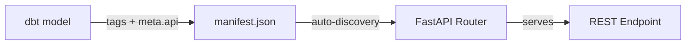

# Endpoints

API endpoints are auto-generated from dbt model metadata. Each dbt model tagged with `production` and an `api:*` tag becomes a REST endpoint. No Python code is needed to add or modify endpoints -- changes to dbt models are automatically reflected in the API after the next manifest refresh.

## Base URL

All endpoints are served under a versioned base path:

```
https://api.analytics.gnosis.io/v1
```

## URL Convention

Endpoint paths follow a three-segment structure:

```
/v1/{category}/{resource}/{granularity}
```

| Segment | Source | Required | Example |
|---------|--------|----------|---------|
| `v1` | API version prefix (fixed) | Yes | `v1` |
| `category` | First non-system dbt tag | Yes | `consensus`, `execution`, `bridges` |
| `resource` | Value from `api:{name}` tag | Yes | `blob_commitments`, `validators`, `transactions` |
| `granularity` | Value from `granularity:{period}` tag | No | `daily`, `latest`, `all_time` |

### Path Examples

| dbt Tags | Generated Path |
|----------|----------------|
| `production`, `consensus`, `api:blob_commitments`, `granularity:daily` | `/v1/consensus/blob_commitments/daily` |
| `production`, `consensus`, `api:blob_commitments`, `granularity:latest` | `/v1/consensus/blob_commitments/latest` |
| `production`, `execution`, `api:transactions` | `/v1/execution/transactions` |
| `production`, `financial`, `tier2`, `api:treasury` | `/v1/financial/treasury` |
| `production`, `bridges`, `tier1`, `api:transfers`, `granularity:weekly` | `/v1/bridges/transfers/weekly` |

## How Endpoints Are Generated

The API reads the dbt `manifest.json` file and discovers all models that meet two conditions:

1. The model has the `production` tag
2. The model has an `api:{resource_name}` tag

For each qualifying model, the API builds a route from the model's tags and registers it on the FastAPI router. The manifest is refreshed on a configurable interval (default: every 5 minutes), so newly deployed dbt models become API endpoints without restarting the service.



!!! info "Manifest auto-refresh"
    The API polls the remote manifest URL periodically and rebuilds routes when it detects changes. Internal users with tier3 access can also trigger an immediate refresh via `POST /v1/system/manifest/refresh`.

## Categories

Categories correspond to the first non-system tag on a dbt model. They serve as both the URL prefix and the grouping header in the Swagger UI. Common categories include:

| Category | Description | Example Endpoints |
|----------|-------------|-------------------|
| `consensus` | Consensus layer data: validators, attestations, blobs, block proposals | `/v1/consensus/blob_commitments/daily` |
| `execution` | Execution layer data: transactions, blocks, gas usage, contracts | `/v1/execution/transactions/daily` |
| `bridges` | Cross-chain bridge transfers and volume | `/v1/bridges/transfers/weekly` |
| `p2p` | Peer-to-peer network: client diversity, node geography, topology | `/v1/p2p/client_diversity/latest` |
| `financial` | Financial metrics: treasury balances, token economics | `/v1/financial/treasury/monthly` |
| `esg` | Energy, sustainability, and governance metrics | `/v1/esg/energy_consumption/daily` |
| `contracts` | Smart contract activity and decoded events | `/v1/contracts/deployments/daily` |

Categories are **dynamic** -- any tag value that is not a system tag (`production`, `view`, `table`, `incremental`, `staging`, `intermediate`), not a tier tag (`tier0`-`tier3`), and not a prefixed tag (`api:*`, `granularity:*`) becomes the category. New categories appear automatically when dbt models use new tag values.

## Supported Granularities

Granularity defines the time aggregation level of the data. It appears as the final URL segment and is set via the `granularity:{period}` dbt tag. Multiple granularities can exist for the same resource -- each is backed by a separate dbt model.

| Granularity | URL Suffix | Description | Typical Use Case |
|-------------|-----------|-------------|------------------|
| `daily` | `/daily` | One row per calendar day | Time-series dashboards |
| `weekly` | `/weekly` | One row per week | Weekly reports |
| `monthly` | `/monthly` | One row per month | Monthly summaries |
| `latest` | `/latest` | Most recent value(s) only | Live status displays |
| `last_7d` | `/last_7d` | Rolling 7-day window | Recent trend analysis |
| `last_30d` | `/last_30d` | Rolling 30-day window | Monthly rolling metrics |
| `in_ranges` | `/in_ranges` | Data bucketed into ranges | Distribution analysis (e.g., validator index ranges) |
| `all_time` | `/all_time` | Complete historical dataset | Full historical research |

!!! note "Granularity is purely a URL convention"
    Granularity tags **only** affect the URL path segment. They do not imply automatic date filtering, aggregation behavior, or data windowing. The actual data shape is determined by the underlying dbt model's SQL. If you want date filtering, declare it explicitly in [`meta.api.parameters`](filtering.md#full-metaapi-reference).

### Granularity Ordering in Swagger UI

Endpoints in the Swagger UI are sorted deterministically within each resource group:

1. Endpoints without a granularity suffix appear first
2. Then: `latest`, `daily`, `weekly`, `monthly`, `last_7d`, `last_30d`, `in_ranges`, `all_time`
3. Unknown granularity values appear last, sorted alphabetically

## Multiple Granularities for One Resource

A single resource often has multiple granularity endpoints, each backed by a separate dbt model with the same `api:` tag but different `granularity:` and tier tags:

```
GET /v1/consensus/blob_commitments/latest    (tier0 -- public)
GET /v1/consensus/blob_commitments/daily     (tier1 -- partner)
GET /v1/consensus/blob_commitments/last_30d  (tier1 -- partner)
GET /v1/consensus/blob_commitments/all_time  (tier2 -- premium)
```

A common pattern is to expose `/latest` at tier0 (free, no key needed) so anyone can check current values, while historical data at `/daily` or `/all_time` requires partner or premium access.

## HTTP Methods

Each endpoint supports one or more HTTP methods as declared in the dbt model's `meta.api.methods` field:

| Method | Default | When to Use |
|--------|---------|-------------|
| `GET` | Yes (included by default) | Simple queries with query string parameters |
| `POST` | No (must be explicitly declared) | Complex filters, large list values, structured JSON bodies |

When both GET and POST are enabled for an endpoint, the POST variant appears as a separate entry in the Swagger UI with a `(POST)` suffix in its summary.

=== "GET"

    ```bash
    curl "https://api.analytics.gnosis.io/v1/execution/token_balances/daily?symbol=GNO&limit=50" \
      -H "X-API-Key: YOUR_API_KEY"
    ```

=== "POST"

    ```bash
    curl -X POST "https://api.analytics.gnosis.io/v1/execution/token_balances/daily" \
      -H "Content-Type: application/json" \
      -H "X-API-Key: YOUR_API_KEY" \
      -d '{"symbol": "GNO", "limit": 50}'
    ```

See [Filtering & Pagination](filtering.md) for full details on request formats.

## Legacy vs Metadata-Driven Endpoints

Endpoints fall into two categories based on whether the dbt model includes a `meta.api` configuration block:

| Behavior | Legacy (no `meta.api`) | Metadata-Driven (`meta.api` present) |
|----------|------------------------|--------------------------------------|
| HTTP Methods | GET only | Declared in `meta.api.methods` |
| Query Filters | None -- any query param returns 400 | Only declared parameters accepted |
| Pagination | Disabled | Enabled via `meta.api.pagination` |
| Sort | None (database default order) | Explicit `ORDER BY` from `meta.api.sort` |
| Unfiltered requests | Always allowed (full result returned) | Controlled by `allow_unfiltered` |
| Response | Complete table contents | Filtered, paginated, and sorted |

!!! tip "Prefer metadata-driven endpoints"
    Legacy endpoints return the entire result set with no filtering, pagination, or sorting. All new dbt models should include a `meta.api` block to enable fine-grained query control. See the [developer guide](../developer/meta-api-contract.md) for authoring instructions.

## Tag Reference

dbt tags control every aspect of how a model becomes an API endpoint:

| Tag Type | Format | Purpose | Required |
|----------|--------|---------|----------|
| Production | `production` (literal) | Marks model for API exposure | Yes |
| Category | `consensus`, `execution`, `bridges`, etc. | URL prefix + Swagger UI section | Yes |
| Access Tier | `tier0`, `tier1`, `tier2`, `tier3` | Access control level | No (default: `tier0`) |
| Resource | `api:{resource_name}` | Resource segment in URL path | Yes |
| Granularity | `granularity:{period}` | Time dimension suffix in URL | No |
| Ignored | `view`, `table`, `incremental`, `staging`, `intermediate` | Silently filtered out from URL and grouping | N/A |

### Example dbt Model Configuration

```sql
{{
    config(
        materialized='view',
        tags=[
            'production',       -- Required: marks for API exposure
            'consensus',        -- Category: URL prefix + Swagger group
            'tier1',            -- Access: requires partner key or above
            'api:blob_commitments',    -- Resource: URL segment
            'granularity:daily'        -- Granularity: URL suffix
        ],
        meta={
            "api": {
                "methods": ["GET", "POST"],
                "allow_unfiltered": false,
                "parameters": [
                    {"name": "start_date", "column": "date", "operator": ">=", "type": "date"},
                    {"name": "end_date", "column": "date", "operator": "<=", "type": "date"}
                ],
                "pagination": {"enabled": true, "default_limit": 100, "max_limit": 5000},
                "sort": [{"column": "date", "direction": "DESC"}]
            }
        }
    )
}}

SELECT date, total_blob_commitments AS value
FROM {{ ref('int_consensus_blocks_daily') }}
```

**Result:**

- **Endpoint:** `GET /v1/consensus/blob_commitments/daily` and `POST /v1/consensus/blob_commitments/daily`
- **Swagger Section:** Consensus
- **Access:** tier1 (partner and above)
- **Filters:** `start_date`, `end_date`
- **Pagination:** default 100 rows, max 5000
- **Sort:** `date DESC`

## System Endpoints

In addition to auto-generated data endpoints, the API provides built-in system routes:

| Endpoint | Method | Tier | Description |
|----------|--------|------|-------------|
| `/` | GET | Public | Health check -- returns service status |
| `/docs` | GET | Public | Swagger UI interactive documentation |
| `/redoc` | GET | Public | ReDoc documentation |
| `/openapi.json` | GET | Public | Raw OpenAPI specification |
| `/v1/system/manifest/refresh` | POST | tier3 | Force an immediate manifest refresh |

## Endpoint Catalog

The following table lists all auto-generated data endpoints currently exposed by the API. This section is regenerated from the dbt manifest by `scripts/update_docs.py`.

<!-- BEGIN AUTO-GENERATED: api-endpoints -->
| Path | Methods | Tier | Description |
|------|---------|------|-------------|
| `/v1/bridges/bridges_count/latest` | GET | tier0 | This model provides the most recent count of distinct bridges tracked over time, serving as a key... |
| `/v1/bridges/chains_count/latest` | GET | tier0 | This dbt view provides the most recent count of distinct API bridge chains, serving as a key perf... |
| `/v1/bridges/cum_netflow_per_bridge/weekly` | GET | tier1 | This view aggregates cumulative net flow in USD per bridge on a weekly basis, supporting trend an... |
| `/v1/bridges/inflow/in_ranges` | GET | tier0 | This view aggregates inbound token transfer flows between sources and targets over specified time... |
| `/v1/bridges/inflow_per_token/last_7d` | GET | tier0 | This model aggregates inbound transfer values for each token over the last 7 days, facilitating a... |
| `/v1/bridges/netflow/last_7d` | GET | tier0 | The api_bridges_kpi_netflow_7d model provides a snapshot of net flow metrics over the last 7 days... |
| `/v1/bridges/netflow/all_time` | GET | tier0 | This dbt view aggregates the total net flow in USD over all time periods, providing a comprehensi... |
| `/v1/bridges/netflow_per_token_per_bridge/daily` | GET | tier1 | This view aggregates daily net flow values for each token across individual bridges and provides ... |
| `/v1/bridges/outflow/in_ranges` | GET | tier0 | This view aggregates outflow token transfer data across different time ranges for API bridges, su... |
| `/v1/bridges/outflow_per_token/last_7d` | GET | tier0 | This view aggregates the total outflow values of tokens between sources and targets over the last... |
| `/v1/bridges/volume/last_7d` | GET | tier0 | The api_bridges_kpi_volume_7d model provides a snapshot of API volume metrics over the last 7 day... |
| `/v1/bridges/volume/all_time` | GET | tier0 | The `api_bridges_kpi_total_volume_all_time` model provides the most recent total volume in USD ac... |
| `/v1/consensus/ deposits_and_withdrawals_volume/daily` | GET | tier1 | The api_consensus_deposits_withdrawls_volume_daily model provides a daily summary of deposit and ... |
| `/v1/consensus/attestations/daily` | GET | tier1 | The api_consensus_attestations_daily model provides a daily summary of consensus attestations, ca... |
| `/v1/consensus/blob_commitments/daily` | GET | tier1 | The api_consensus_blob_commitments_daily model provides a daily overview of total blob commitment... |
| `/v1/consensus/blocks/daily` | GET | tier1 | The api_consensus_blocks_daily model aggregates daily consensus block data, providing insights in... |
| `/v1/consensus/blocks_and_blobs/daily` | GET | tier1 | This view provides daily aggregated counts of consensus blocks with and without zero blob commitm... |
| `/v1/consensus/credentials/latest` | GET | tier0 | The api_consensus_credentials_latest model provides a snapshot of the most recent count of differ... |
| `/v1/consensus/credentials/daily` | GET | tier1 | The api_consensus_credentials_daily model provides daily aggregated counts and percentage shares ... |
| `/v1/consensus/deposits_and_withdrawals/daily` | GET | tier1 | The model aggregates daily counts of consensus deposits and withdrawals to monitor transaction ac... |
| `/v1/consensus/deposits_cnt/latest` | GET | tier0 | The model provides the latest consensus information on the total number of deposits, serving as a... |
| `/v1/consensus/entry_queue/daily` | GET | tier1 | The api_consensus_entry_queue_daily model provides daily aggregated statistics on the validator e... |
| `/v1/consensus/forks_info` | GET | tier0 | The api_consensus_forks model provides a consolidated view of consensus fork information used in ... |
| `/v1/consensus/graffities_labels/daily` | GET | tier1 | The api_consensus_graffiti_label_daily model aggregates daily counts of graffiti labels to suppor... |
| `/v1/consensus/graffities_labels/in_ranges` | GET | tier0 | The api_consensus_graffiti_cloud model aggregates consensus data related to graffiti labels and t... |
| `/v1/consensus/staked_gno/latest` | GET | tier0 | The api_consensus_info_staked_latest model provides the most recent total staked GNO value and it... |
| `/v1/consensus/staked_gno/daily` | GET | tier1 | The api_consensus_staked_daily model provides daily aggregated data on the effective staked GNO a... |
| `/v1/consensus/validators_active_ongoing/latest` | GET | tier0 | The model provides the latest consensus information on active and ongoing items, serving as a key... |
| `/v1/consensus/validators_active_ongoing/daily` | GET | tier1 | The api_consensus_validators_active_daily model provides a daily snapshot of the number of valida... |
| `/v1/consensus/validators_apy/latest` | GET | tier0 | The api_consensus_info_apy_latest model provides the most recent annual percentage yield (APY) da... |
| `/v1/consensus/validators_apy_dististribution/last_30d` | GET | tier0 | This view provides a distribution of validator APYs over the last 30 days, enabling analysis of A... |
| `/v1/consensus/validators_apy_distribution/daily` | GET | tier1 | This view provides daily distribution metrics of validator APYs, enabling analysis of validator p... |
| `/v1/consensus/validators_balance_dististribution/last_30d` | GET | tier0 | This view provides the distribution of validator balances over the last 30 days, summarized throu... |
| `/v1/consensus/validators_balances/daily` | GET | tier1 | The api_consensus_validators_balances_daily model provides a daily overview of validator balances... |
| `/v1/consensus/validators_balances_distribution/daily` | GET | tier1 | This view provides daily distribution percentiles of validator balances in GNO, enabling analysis... |
| `/v1/consensus/validators_status/daily` | GET | tier1 | The api_consensus_validators_status_daily model provides a daily summary of validator statuses, e... |
| `/v1/consensus/withdrawal_credentials_frequency/daily` | GET | tier1 | This view aggregates daily counts of validators categorized by their withdrawal credentials frequ... |
| `/v1/consensus/withdrawls_cnt/latest` | GET | tier0 | This view provides the latest count of withdrawal events from the consensus API, enabling monitor... |
| `/v1/crawlers/gno_supply/daily` | GET | tier1 | The api_crawlers_data_gno_supply_daily model aggregates daily GNO supply data from crawler source... |
| `/v1/esg/carbon_emissions/daily` | GET | tier1 | The `api_esg_carbon_emissions_daily` model provides daily aggregated estimates of carbon emission... |
| `/v1/esg/carbon_emissions_annualised/latest` | GET | tier0 | This model provides the most recent annualized projection of CO2 emissions in tonnes, derived fro... |
| `/v1/esg/carbon_emissions_distribution/daily` | GET | tier1 | This view provides daily estimates and uncertainty bounds of carbon emissions (in kg CO2) with mo... |
| `/v1/esg/carbon_intensity_factors/daily` | GET | tier1 | This view provides daily effective carbon intensity metrics for the network and selected countrie... |
| `/v1/esg/energy_and_emissions_annual/daily` | GET | tier1 | The api_esg_info_annual_daily model provides daily projections of energy consumption and CO2 emis... |
| `/v1/esg/energy_and_emissions_per_category/daily` | GET | tier1 | The api_esg_info_category_daily model aggregates daily ESG-related metrics, including carbon foot... |
| `/v1/esg/energy_consumption/monthly` | GET | tier1 | The api_esg_energy_monthly model aggregates total energy consumption in kilowatt-hours (kWh) on a... |
| `/v1/esg/energy_consumption_annualised/latest` | GET | tier0 | This dbt view provides the latest annualized energy consumption projection in MWh, supporting ESG... |
| `/v1/esg/estimated_nodes/daily` | GET | tier1 | The api_esg_estimated_nodes_daily model provides daily estimates of observed and projected node c... |
| `/v1/execution/ avatars` | GET | tier0 | The api_execution_circles_avatars view aggregates daily counts of avatar types used in API execut... |
| `/v1/execution/ backers_cnt_latest` | GET | tier0 | This view provides the latest count of backers for API executions and the percentage change compa... |
| `/v1/execution/ groups_cnt_latest` | GET | tier0 | This view provides the latest total count of group avatars and the percentage change compared to ... |
| `/v1/execution/ humans_cnt_latest` | GET | tier0 | This view provides the latest count of human avatars and the percentage change compared to the co... |
| `/v1/execution/ orgs_cnt_latest` | GET | tier0 | This view provides the latest count of organization avatars and the percentage change compared to... |
| `/v1/execution/active_senders_per_token/daily` | GET | tier0 | This view provides daily counts of active senders per API token, enabling analysis of token engag... |
| `/v1/execution/balance_cohorts_amount_per_token/daily` | GET | tier1 | This view aggregates daily token balance cohort values, segmented by balance buckets, to support ... |
| `/v1/execution/balance_cohorts_holders_per_token/daily` | GET | tier1 | This view provides daily snapshots of token balance cohort distributions among holders, enabling ... |
| `/v1/execution/blocks_gas_usage_pct/daily` | GET | tier1 | The api_execution_blocks_gas_usage_pct_daily model provides daily insights into the percentage of... |
| `/v1/execution/blocks_gas_usage_pct/monthly` | GET | tier1 | This model provides a monthly percentage of gas usage for execution blocks, enabling analysis of ... |
| `/v1/execution/blocks_per_clients_count/daily` | GET | tier1 | The api_execution_blocks_clients_cnt_daily model provides daily aggregated counts of API executio... |
| `/v1/execution/blocks_per_clients_pct/daily` | GET | tier1 | The api_execution_blocks_clients_pct_daily model provides daily percentage metrics of API executi... |
| `/v1/execution/gpay_active_users/last_7d` | GET | tier0 | 7-day active user count with period-over-period change percentage for Gnosis Pay. |
| `/v1/execution/gpay_active_users_weekly/weekly` | GET | tier1 | Weekly time series of Gnosis Pay active user counts. |
| `/v1/execution/gpay_activity_by_action_daily/daily` | GET | tier1 | Daily Gnosis Pay activity metrics broken down by action type, with counts and volumes. |
| `/v1/execution/gpay_activity_by_action_monthly/monthly` | GET | tier1 | Monthly Gnosis Pay activity metrics broken down by action type, with counts and volumes. |
| `/v1/execution/gpay_activity_by_action_weekly/weekly` | GET | tier1 | Weekly Gnosis Pay activity metrics broken down by action type, with counts and volumes. |
| `/v1/execution/gpay_balance_cohorts_holders_daily/daily` | GET | tier1 | Daily count of Gnosis Pay wallet holders in each balance cohort bucket by token. |
| `/v1/execution/gpay_balance_cohorts_value_daily/daily` | GET | tier1 | Daily total value held in each balance cohort bucket by token, in native and USD. |
| `/v1/execution/gpay_balances_by_token_daily/daily` | GET | tier1 | Daily total Gnosis Pay wallet balances by token in USD. |
| `/v1/execution/gpay_balances_native_daily/daily` | GET | tier1 | Daily total Gnosis Pay wallet balances by token in native units. |
| `/v1/execution/gpay_balances_usd_daily/daily` | GET | tier1 | Daily total Gnosis Pay wallet balances by token in USD. |
| `/v1/execution/gpay_cashback_7d/7d` | GET | tier0 | 7-day cashback summary with unit breakdown and period-over-period change percentage. |
| `/v1/execution/gpay_cashback_cohort_retention_monthly/monthly` | GET | tier1 | Monthly cashback cohort retention heatmap data showing retention and amount percentages across co... |
| `/v1/execution/gpay_cashback_cohort_retention_users_monthly/monthly` | GET | tier1 | Monthly cashback cohort sizes over time, formatted for time series visualization. |
| `/v1/execution/gpay_cashback_cumulative/weekly` | GET | tier1 | Cumulative cashback distributed over time by unit. |
| `/v1/execution/gpay_cashback_dist_weekly/weekly` | GET | tier1 | Weekly cashback distribution percentiles for Gnosis Pay users. |
| `/v1/execution/gpay_cashback_impact_monthly/monthly` | GET | tier1 | Monthly cashback impact analysis comparing payment behavior between user segments. Passes through... |
| `/v1/execution/gpay_cashback_recipients_7d/7d` | GET | tier0 | 7-day unique cashback recipient count with period-over-period change percentage. |
| `/v1/execution/gpay_cashback_recipients_total/all_time` | GET | tier0 | All-time total count of unique Gnosis Pay cashback recipients. |
| `/v1/execution/gpay_cashback_recipients_weekly/weekly` | GET | tier1 | Weekly time series of unique Gnosis Pay cashback recipient counts. |
| `/v1/execution/gpay_cashback_total/all_time` | GET | tier0 | All-time total cashback distributed by unit. |
| `/v1/execution/gpay_cashback_weekly/weekly` | GET | tier1 | Weekly cashback amounts distributed by unit. |
| `/v1/execution/gpay_churn_monthly/monthly` | GET | tier1 | Monthly user churn breakdown for Gnosis Pay showing user segments and rates by activity scope. |
| `/v1/execution/gpay_churn_rates_monthly/monthly` | GET | tier1 | Monthly churn and retention rates for Gnosis Pay by activity scope. |
| `/v1/execution/gpay_flows_snapshots/in_ranges` | GET | tier1 | Token flow patterns between Gnosis Pay wallet labels for API consumption. |
| `/v1/execution/gpay_funded_addresses_daily/daily` | GET | tier1 | Daily time series of cumulative funded Gnosis Pay wallet addresses. |
| `/v1/execution/gpay_funded_addresses_monthly/monthly` | GET | tier1 | Monthly time series of cumulative funded Gnosis Pay wallet addresses. |
| `/v1/execution/gpay_funded_addresses_weekly/weekly` | GET | tier1 | Weekly time series of cumulative funded Gnosis Pay wallet addresses. |
| `/v1/execution/gpay_gno_balance_daily/daily` | GET | tier1 | Daily total GNO token balance across all Gnosis Pay wallets. |
| `/v1/execution/gpay_gno_total_balance/all_time` | GET | tier0 | Current total GNO token balance across all Gnosis Pay wallets. |
| `/v1/execution/gpay_kpi_monthly/monthly` | GET | tier1 | Monthly KPIs for Gnosis Pay, passing through all columns from the fact model. |
| `/v1/execution/gpay_owner_balances_by_token_daily/daily` | GET | tier1 | Daily total Gnosis Pay owner balances by token in USD. |
| `/v1/execution/gpay_owner_total_balance/all_time` | GET | tier0 | Current total balance across all Gnosis Pay wallet owners in USD. |
| `/v1/execution/gpay_payments/last_7d` | GET | tier0 | 7-day payment count with period-over-period change percentage. |
| `/v1/execution/gpay_payments_by_token_daily/daily` | GET | tier1 | Daily payment counts by token for Gnosis Pay. |
| `/v1/execution/gpay_payments_by_token_monthly/monthly` | GET | tier1 | Monthly payment counts by token for Gnosis Pay. |
| `/v1/execution/gpay_payments_by_token_weekly/weekly` | GET | tier1 | Weekly payment counts by token for Gnosis Pay. |
| `/v1/execution/gpay_payments_hourly/hourly` | GET | tier1 | Hourly payment counts by token for Gnosis Pay. |
| `/v1/execution/gpay_retention_by_action_monthly/monthly` | GET | tier1 | Monthly cohort retention heatmap data for Gnosis Pay broken down by action type. |
| `/v1/execution/gpay_retention_by_action_users_monthly/monthly` | GET | tier1 | Monthly cohort user counts over time by action type, formatted for time series visualization. |
| `/v1/execution/gpay_retention_monthly/monthly` | GET | tier1 | Monthly cohort user counts over time, formatted for time series visualization. |
| `/v1/execution/gpay_retention_pct_monthly/monthly` | GET | tier1 | Monthly cohort retention heatmap data for all Gnosis Pay activity. |
| `/v1/execution/gpay_retention_volume_monthly/monthly` | GET | tier1 | Monthly cohort volume retention over time, formatted for time series visualization. |
| `/v1/execution/gpay_total_balance/all_time` | GET | tier0 | Current total balance across all Gnosis Pay wallets in USD. |
| `/v1/execution/gpay_total_funded/all_time` | GET | tier0 | All-time total count of funded Gnosis Pay wallets (users who made at least one payment). |
| `/v1/execution/gpay_total_payments/all_time` | GET | tier0 | All-time total count of Gnosis Pay payments. |
| `/v1/execution/gpay_total_volume/all_time` | GET | tier0 | All-time total payment volume for Gnosis Pay in USD. |
| `/v1/execution/gpay_user_activity` | GET, POST | tier0 | Individual transaction-level activity for a specific Gnosis Pay user, filtered by wallet address. |
| `/v1/execution/gpay_user_balances_daily/daily` | GET, POST | tier0 | Daily token balances for a specific Gnosis Pay user in native and USD values. |
| `/v1/execution/gpay_user_cashback_daily/daily` | GET, POST | tier0 | Daily cashback amounts for a specific Gnosis Pay user. |
| `/v1/execution/gpay_user_lifetime_metrics/all_time` | GET, POST | tier0 | Lifetime metrics for a specific Gnosis Pay user, passing through all columns from the fact model. |
| `/v1/execution/gpay_user_payments_daily/daily` | GET, POST | tier0 | Daily payment amounts by token for a specific Gnosis Pay user. |
| `/v1/execution/gpay_user_total_cashback/all_time` | GET, POST | tier0 | All-time total cashback for a specific Gnosis Pay user. |
| `/v1/execution/gpay_user_total_payments/all_time` | GET, POST | tier0 | All-time total payment count for a specific Gnosis Pay user. |
| `/v1/execution/gpay_user_total_volume/all_time` | GET, POST | tier0 | All-time total payment volume for a specific Gnosis Pay user. |
| `/v1/execution/gpay_volume/last_7d` | GET | tier0 | 7-day payment volume with period-over-period change percentage. |
| `/v1/execution/gpay_volume_payments_by_token_daily/daily` | GET | tier1 | Daily payment volume by token in USD for Gnosis Pay. |
| `/v1/execution/gpay_volume_payments_by_token_monthly/monthly` | GET | tier1 | Monthly payment volume by token in USD for Gnosis Pay. |
| `/v1/execution/gpay_volume_payments_by_token_weekly/weekly` | GET | tier1 | Weekly payment volume by token in USD for Gnosis Pay. |
| `/v1/execution/gpay_wallet_balance_composition/latest` | GET | tier1 | Current balance composition of a Gnosis Pay wallet by token. |
| `/v1/execution/holders_per_token/latest` | GET | tier1 | This model provides the latest snapshot of the number of holders for each API token, aggregated b... |
| `/v1/execution/holders_per_token/daily` | GET | tier1 | The api_execution_tokens_holders_daily model provides daily aggregated data on the number of uniq... |
| `/v1/execution/projects_and_sectors_count/total` | GET | tier0 | This view aggregates the total number of distinct projects and sectors crawled, providing a high-... |
| `/v1/execution/rwa_backedfi_prices/daily` | GET | tier1 | The api_execution_rwa_backedfi_prices_daily model provides daily pricing data for RWA-backed fina... |
| `/v1/execution/state_size/daily` | GET | tier1 | The api_execution_state_full_size_daily model provides daily aggregated data on the size of API e... |
| `/v1/execution/token_balances/daily` | GET, POST | tier1 | -- |
| `/v1/execution/tokens_overview/latest` | GET | tier1 | -- |
| `/v1/execution/tokens_supply/latest` | GET | tier1 | This model provides the latest supply values for each API token based on daily recorded data, ena... |
| `/v1/execution/tokens_supply/daily` | GET | tier1 | The api_execution_tokens_supply_daily model provides daily aggregated data on the supply of diffe... |
| `/v1/execution/tokens_supply_by_sector/latest` | GET | tier1 | -- |
| `/v1/execution/tokens_supply_distribution/latest` | GET | tier1 | -- |
| `/v1/execution/tokens_volume/daily` | GET | tier1 | The api_execution_tokens_volume_daily model provides daily aggregated data on the trading volume ... |
| `/v1/execution/transactions_coun_per_project_top5/monthly` | GET | tier1 | This view aggregates the top 5 projects by transaction count on a monthly basis, enabling analysi... |
| `/v1/execution/transactions_count/last_7d` | GET | tier0 | The api_execution_transactions_7d model provides a snapshot of the total number of API execution ... |
| `/v1/execution/transactions_count/all_time` | GET | tier0 | The api_execution_transactions_total model provides a consolidated count of API execution transac... |
| `/v1/execution/transactions_count_per_project/all_time` | GET | tier0 | This view aggregates the total number of API execution transactions across all projects over the ... |
| `/v1/execution/transactions_count_per_project_top20/in_ranges` | GET | tier0 | This view aggregates the top 20 API transaction counts per project within specified time ranges, ... |
| `/v1/execution/transactions_count_per_sector/daily` | GET | tier1 | The api_execution_transactions_by_sector_daily model provides daily aggregated counts of API exec... |
| `/v1/execution/transactions_count_per_sector/weekly` | GET | tier1 | The api_execution_transactions_by_sector_weekly model aggregates the number of API execution tran... |
| `/v1/execution/transactions_count_per_sector/hourly` | GET | tier1 | This view aggregates the total number of API execution transactions per sector on an hourly basis... |
| `/v1/execution/transactions_count_per_type/daily` | GET | tier1 | The api_execution_transactions_cnt_daily model provides a daily summary of successful API transac... |
| `/v1/execution/transactions_count_per_type/all_time` | GET | tier0 | This view aggregates the total number of successful API transactions grouped by transaction type ... |
| `/v1/execution/transactions_fees/last_7d` | GET | tier0 | The api_execution_transactions_fees_native_7d model provides a snapshot of native transaction fee... |
| `/v1/execution/transactions_fees/all_time` | GET | tier0 | The `api_execution_transactions_fees_native_total` model aggregates total native execution transa... |
| `/v1/execution/transactions_fees_per_project/all_time` | GET | tier0 | This view aggregates total native execution transaction fees per project over the entire availabl... |
| `/v1/execution/transactions_fees_per_project_top20/in_ranges` | GET | tier0 | This view aggregates the top 20 native API transaction fee buckets by project for different time ... |
| `/v1/execution/transactions_fees_per_project_top5/monthly` | GET | tier1 | This view aggregates the top 5 projects by native transaction fees on a monthly basis, providing ... |
| `/v1/execution/transactions_fees_per_sector/daily` | GET | tier1 | This view aggregates daily native transaction fees by sector, providing insights into sector-spec... |
| `/v1/execution/transactions_fees_per_sector/weekly` | GET | tier1 | This view aggregates native transaction fees by sector on a weekly basis to support analysis of f... |
| `/v1/execution/transactions_fees_per_sector/hourly` | GET | tier1 | This view aggregates native transaction fees by sector on an hourly basis, providing insights int... |
| `/v1/execution/transactions_gas_share_per_project/daily` | GET | tier1 | This view calculates the daily share of gas used by each project in relation to the total gas con... |
| `/v1/execution/transactions_gas_used/daily` | GET | tier1 | This view aggregates daily gas consumption and pricing metrics for successful API transaction exe... |
| `/v1/execution/transactions_gas_used/weekly` | GET | tier1 | This view aggregates weekly gas usage for successful API transactions, categorized by transaction... |
| `/v1/execution/transactions_initiators_count/last_7d` | GET | tier0 | This view provides a snapshot of the number of active accounts involved in API transactions over ... |
| `/v1/execution/transactions_initiators_count/all_time` | GET | tier0 | The `api_execution_transactions_active_accounts_total` model provides a snapshot of the total num... |
| `/v1/execution/transactions_initiators_count_per_project/all_time` | GET | tier0 | This view provides a snapshot of the total number of active accounts involved in API execution tr... |
| `/v1/execution/transactions_initiators_count_per_project_top20/in_ranges` | GET | tier0 | This model identifies the top 20 project ranges with the highest number of active accounts over d... |
| `/v1/execution/transactions_initiators_count_per_project_top5/monthly` | GET | tier1 | This view aggregates the number of active accounts involved in API execution transactions, focusi... |
| `/v1/execution/transactions_initiators_count_per_sector/daily` | GET | tier1 | This view provides daily counts of active accounts involved in API transaction initiations, segme... |
| `/v1/execution/transactions_initiators_count_per_sector/weekly` | GET | tier1 | This view provides weekly counts of active accounts involved in API execution transactions, segme... |
| `/v1/execution/transactions_initiators_count_per_sector/hourly` | GET | tier1 | This view aggregates the count of active accounts involved in API execution transactions, segment... |
| `/v1/execution/transactions_xdai_value/daily` | GET | tier1 | This view aggregates daily transaction values for API executions on the xDai network, providing i... |
| `/v1/p2p/clients_count/latest` | GET | tier0 | This view provides the latest counts and percentage changes of P2P clients for discv4 and discv5 ... |
| `/v1/p2p/discv4_clients_count/latest` | GET | tier0 | The api_p2p_discv4_clients_latest view provides the most recent aggregated counts of Discv4 P2P c... |
| `/v1/p2p/discv4_clients_count/daily` | GET | tier1 | The api_p2p_discv4_clients_daily view tracks daily metrics related to the number of Discv4 client... |
| `/v1/p2p/discv5_clients_count/latest` | GET | tier0 | The api_p2p_discv5_clients_latest model provides a snapshot of the latest Discv5 peer-to-peer cli... |
| `/v1/p2p/discv5_clients_count/daily` | GET | tier1 | The api_p2p_discv5_clients_daily model tracks daily metrics related to Discv5 clients in the P2P ... |
| `/v1/p2p/discv5_current_fork_count/daily` | GET | tier1 | The `api_p2p_discv5_current_fork_daily` view tracks the daily count of current Discv5 network for... |
| `/v1/p2p/discv5_next_fork_count/daily` | GET | tier1 | The api_p2p_discv5_next_fork_daily model provides daily counts of upcoming Discv5 network forks, ... |
| `/v1/p2p/network_topology/latest` | GET | tier0 | The api_p2p_topology_latest model provides a real-time view of peer-to-peer network topology, cap... |
| `/v1/p2p/visits_per_protocol/latest` | GET | tier0 | This view provides the latest daily visit metrics for P2P protocols (discv4 and discv5), includin... |
<!-- END AUTO-GENERATED: api-endpoints -->

## Next Steps

- [Filtering & Pagination](filtering.md) -- Learn how to query endpoints with filters, pagination, and sort.
- [Authentication](authentication.md) -- Understand the tier system and API key usage.
- [Swagger UI](swagger.md) -- Explore endpoints interactively in the browser.
