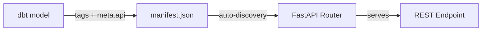

# Endpoints

API endpoints are auto-generated from dbt model metadata. Each dbt model tagged with `production` and an `api:*` tag becomes a REST endpoint. No Python code is needed to add or modify endpoints -- changes to dbt models are automatically reflected in the API after the next manifest refresh. This page explains **how routing works**: how a model's tags map to a URL path, how categories are derived, and how the granularity and window segments behave.

## Base URL

All endpoints are served under a versioned base path:

```
https://api.analytics.gnosis.io/v1
```

## URL Convention

Endpoint paths follow a structured contract:

```
/v1/{category}/{resource}/{granularity}[/{window}]
```

| Segment | Source | Required | Example |
|---------|--------|----------|---------|
| `v1` | API version prefix (fixed) | Yes | `v1` |
| `category` | First non-system dbt tag | Yes | `consensus`, `execution`, `bridges` |
| `resource` | Value from `api:{name}` tag | Yes | `blob_commitments`, `validators`, `transactions` |
| `granularity` | Value from `granularity:{period}` tag | No | `daily`, `latest`, `all_time` |
| `window` | Value from `window:{period}` tag | No | `7d`, `30d`, `60d` |

The trailing `window` segment appears **only** when the model has a `window:{period}` tag **and** its value differs from the granularity. It distinguishes rolling metric windows (7-day, 30-day, 60-day variants) that share the same resource and granularity.

### Path Examples

| dbt Tags | Generated Path |
|----------|----------------|
| `production`, `consensus`, `api:blob_commitments`, `granularity:daily` | `/v1/consensus/blob_commitments/daily` |
| `production`, `consensus`, `api:blob_commitments`, `granularity:latest` | `/v1/consensus/blob_commitments/latest` |
| `production`, `execution`, `api:transactions` | `/v1/execution/transactions` |
| `production`, `execution`, `api:circles_v2_kpi_mints`, `granularity:last_7d`, `window:7d` | `/v1/execution/circles_v2_kpi_mints/last_7d/7d` |
| `production`, `mta`, `api:gpay_attribution`, `granularity:rolling_180d`, `window:30d` | `/v1/mta/gpay_attribution/rolling_180d/30d` |

## How Endpoints Are Generated

The API reads the dbt `manifest.json` file and discovers all models that meet two conditions:

1. The model has the `production` tag
2. The model has an `api:{resource_name}` tag

For each qualifying model, the API builds a route from the model's tags and registers it on the FastAPI router. A model that sets `meta.api.exclude_from_api: true` is skipped entirely, even when both tags are present. The manifest is refreshed on a configurable interval (default: every 5 minutes), so newly deployed dbt models become API endpoints without restarting the service.



!!! info "Manifest auto-refresh"
    The API polls the remote manifest URL periodically and rebuilds routes when it detects changes. Internal users with tier3 access can also trigger an immediate refresh via `POST /v1/system/manifest/refresh`.

## Categories

The category is the **first** tag on the dbt model that is:

1. **Not a system tag** -- `production`, `view`, `table`, `incremental`, `staging`, `intermediate`, `daily`, `weekly`, `monthly`, `hourly`, `latest`, `in_ranges`, `last_30d`, `last_7d`, `all_time`
2. **Not a tier tag** -- `tier0` through `tier3`
3. **Colon-free** -- any tag containing `:` (such as `api:*`, `granularity:*`, `window:*`) is skipped

The matched tag is **lowercased** and used as both the URL prefix and the grouping header in the Swagger UI. If no tag qualifies, the category falls back to `general`.

Categories are **dynamic** -- new categories appear automatically when dbt models use new tag values. The live manifest currently exposes **469 endpoints across 11 categories**:

| Category | Endpoints | Description |
|----------|-----------|-------------|
| `execution` | 306 | Execution layer data: transactions, blocks, gas usage, tokens, Gnosis Pay, Circles |
| `consensus` | 40 | Consensus layer data: validators, attestations, blobs, staking |
| `celo` | 33 | Celo network metrics |
| `revenue` | 28 | Revenue and user-cohort metrics |
| `quarterly_data` | 24 | Quarterly reporting datasets |
| `bridges` | 12 | Cross-chain bridge transfers and volume |
| `p2p` | 9 | Peer-to-peer network: client diversity, forks, topology |
| `esg` | 9 | Energy, sustainability, and governance metrics |
| `mta` | 6 | Multi-touch attribution for Gnosis Pay and the Gnosis app |
| `mmm` | 1 | Marketing mix modeling |
| `crawlers_data` | 1 | Data collected by external crawlers (e.g., GNO supply) |

## Supported Granularities

Granularity defines the time aggregation level of the data. It appears as the URL segment after the resource (followed by the window segment, when one exists) and is set via the `granularity:{period}` dbt tag. Multiple granularities can exist for the same resource -- each is backed by a separate dbt model.

| Granularity | URL Suffix | Description | Typical Use Case |
|-------------|-----------|-------------|------------------|
| `hourly` | `/hourly` | One row per hour | High-resolution time series |
| `daily` | `/daily` | One row per calendar day | Time-series dashboards |
| `weekly` | `/weekly` | One row per week | Weekly reports |
| `monthly` | `/monthly` | One row per month | Monthly summaries |
| `latest` | `/latest` | Most recent value(s) only | Live status displays |
| `last_7d` | `/last_7d` | Rolling 7-day window | Recent trend analysis |
| `last_30d` | `/last_30d` | Rolling 30-day window | Monthly rolling metrics |
| `in_ranges` | `/in_ranges` | Data bucketed into ranges | Distribution analysis (e.g., validator index ranges) |
| `all_time` | `/all_time` | Complete historical dataset | Full historical research |

The granularity value is free-form: any `granularity:{value}` tag becomes the URL segment, so additional values such as `snapshot` and `rolling_180d` also appear in the catalog. Unknown values are simply sorted after the well-known ones in the Swagger UI (see below).

!!! note "Granularity is purely a URL convention"
    Granularity tags **only** affect the URL path segment. They do not imply automatic date filtering, aggregation behavior, or data windowing. The actual data shape is determined by the underlying dbt model's SQL. If you want date filtering, declare it explicitly in [`meta.api.parameters`](filtering.md#full-metaapi-reference).

### Granularity Ordering in Swagger UI

Endpoints in the Swagger UI are sorted deterministically within each resource group:

1. Endpoints without a granularity suffix appear first
2. Then: `latest`, `daily`, `weekly`, `monthly`, `last_7d`, `last_30d`, `in_ranges`, `all_time`
3. Unknown granularity values appear last, sorted alphabetically

## Multiple Granularities for One Resource

A single resource often has multiple granularity endpoints, each backed by a separate dbt model with the same `api:` tag but different `granularity:` and tier tags:

```
GET /v1/consensus/blob_commitments/latest    (tier0 -- public)
GET /v1/consensus/blob_commitments/daily     (tier1 -- partner)
GET /v1/consensus/blob_commitments/last_30d  (tier1 -- partner)
GET /v1/consensus/blob_commitments/all_time  (tier2 -- premium)
```

A common pattern is to expose `/latest` at tier0 (free, no key needed) so anyone can check current values, while historical data at `/daily` or `/all_time` requires partner or premium access.

## HTTP Methods

Each endpoint supports one or more HTTP methods as declared in the dbt model's `meta.api.methods` field:

| Method | Default | When to Use |
|--------|---------|-------------|
| `GET` | Yes (included by default) | Simple queries with query string parameters |
| `POST` | No (must be explicitly declared) | Complex filters, large list values, structured JSON bodies |

When both GET and POST are enabled for an endpoint, the POST variant appears as a separate entry in the Swagger UI with a `(POST)` suffix in its summary.

=== "GET"

    ```bash
    curl "https://api.analytics.gnosis.io/v1/execution/token_balances/daily?symbol=GNO&limit=50" \
      -H "X-API-Key: YOUR_API_KEY"
    ```

=== "POST"

    ```bash
    curl -X POST "https://api.analytics.gnosis.io/v1/execution/token_balances/daily" \
      -H "Content-Type: application/json" \
      -H "X-API-Key: YOUR_API_KEY" \
      -d '{"symbol": "GNO", "limit": 50}'
    ```

See [Filtering & Pagination](filtering.md) for full details on request formats.

## Legacy vs Metadata-Driven Endpoints

Endpoints fall into two categories based on whether the dbt model includes a `meta.api` configuration block:

| Behavior | Legacy (no `meta.api`) | Metadata-Driven (`meta.api` present) |
|----------|------------------------|--------------------------------------|
| HTTP Methods | GET only | Declared in `meta.api.methods` |
| Query Filters | None -- any query param returns 400 | Only declared parameters accepted |
| Pagination | Disabled | Enabled via `meta.api.pagination` |
| Sort | None (database default order) | Explicit `ORDER BY` from `meta.api.sort` |
| User sorting | None | `sort_by`/`sort_direction` when `sortable_fields` is declared |
| Unfiltered requests | Always allowed (full result returned) | Controlled by `allow_unfiltered` |
| Response shape | Bare JSON array | `list` (bare array) or `envelope` (`{items, pagination}`) via `meta.api.pagination.response` |
| Response | Complete table contents | Filtered, paginated, and sorted |

!!! tip "Prefer metadata-driven endpoints"
    Legacy endpoints return the entire result set with no filtering, pagination, or sorting. All new dbt models should include a `meta.api` block to enable fine-grained query control. See the [developer guide](../developer/meta-api-contract.md) for authoring instructions.

## Tag Reference

dbt tags control every aspect of how a model becomes an API endpoint:

| Tag Type | Format | Purpose | Required |
|----------|--------|---------|----------|
| Production | `production` (literal) | Marks model for API exposure | Yes |
| Resource | `api:{resource_name}` | Resource segment in URL path (the `api:` prefix is stripped; the value is used as-is) | Yes |
| Category | First non-system, non-tier, colon-free tag (e.g., `consensus`, `execution`) | URL prefix + Swagger UI section | No (fallback: `general`) |
| Access Tier | `tier0`, `tier1`, `tier2`, `tier3` | Access control level | No (default: `tier0`) |
| Granularity | `granularity:{value}` | Time-grain segment in URL | No |
| Window | `window:{period}` | Trailing window segment (only added when it differs from the granularity) | No |
| Ignored | `view`, `table`, `incremental`, `staging`, `intermediate`, `daily`, `weekly`, `monthly`, `hourly`, `latest`, `in_ranges`, `last_30d`, `last_7d`, `all_time` | Silently filtered out from URL and grouping | N/A |

### Example dbt Model Configuration

```sql
{{
    config(
        materialized='view',
        tags=[
            'production',       -- Required: marks for API exposure
            'consensus',        -- Category: URL prefix + Swagger group
            'tier1',            -- Access: requires partner key or above
            'api:blob_commitments',    -- Resource: URL segment
            'granularity:daily'        -- Granularity: URL suffix
        ],
        meta={
            "api": {
                "methods": ["GET", "POST"],
                "allow_unfiltered": false,
                "parameters": [
                    {"name": "start_date", "column": "date", "operator": ">=", "type": "date"},
                    {"name": "end_date", "column": "date", "operator": "<=", "type": "date"}
                ],
                "pagination": {"enabled": true, "default_limit": 100, "max_limit": 5000},
                "sort": [{"column": "date", "direction": "DESC"}]
            }
        }
    )
}}

SELECT date, total_blob_commitments AS value
FROM {{ ref('int_consensus_blocks_daily') }}
```

**Result:**

- **Endpoint:** `GET /v1/consensus/blob_commitments/daily` and `POST /v1/consensus/blob_commitments/daily`
- **Swagger Section:** Consensus
- **Access:** tier1 (partner and above)
- **Filters:** `start_date`, `end_date`
- **Pagination:** default 100 rows, max 5000
- **Sort:** `date DESC`

## System Endpoints

In addition to auto-generated data endpoints, the API provides built-in system routes:

| Endpoint | Method | Tier | Description |
|----------|--------|------|-------------|
| `/` | GET | Public | Health check -- returns service status |
| `/docs` | GET | Public | Swagger UI interactive documentation |
| `/redoc` | GET | Public | ReDoc documentation |
| `/openapi.json` | GET | Public | Raw OpenAPI specification |
| `/v1/system/manifest/refresh` | POST | tier3 | Force an immediate manifest refresh |

## Endpoint Summary

The summary table below is generated from the dbt manifest. For a searchable catalog of every endpoint, use the [Metrics Explorer](explorer.md); for a per-category reference with columns and filters, see the [Endpoint Catalog](catalog/index.md).

<!-- BEGIN AUTO-GENERATED: api-endpoints -->
| Category | Endpoints | Resources | Catalog |
|----------|:---------:|:---------:|---------|
| Bridges | 12 | 10 | [catalog/bridges.md](catalog/bridges.md) |
| Celo | 33 | 24 | [catalog/celo.md](catalog/celo.md) |
| Consensus | 35 | 27 | [catalog/consensus.md](catalog/consensus.md) |
| Crawlers Data | 1 | 1 | [catalog/crawlers_data.md](catalog/crawlers_data.md) |
| ESG | 9 | 9 | [catalog/esg.md](catalog/esg.md) |
| Execution | 292 | 234 | [catalog/execution.md](catalog/execution.md) |
| MMM | 1 | 1 | [catalog/mmm.md](catalog/mmm.md) |
| MTA | 6 | 2 | [catalog/mta.md](catalog/mta.md) |
| P2P | 9 | 7 | [catalog/p2p.md](catalog/p2p.md) |
| Quarterly Data | 24 | 24 | [catalog/quarterly_data.md](catalog/quarterly_data.md) |

422 endpoints total. Browse them interactively in the [Metrics Explorer](explorer.md) or per category in the [Endpoint Catalog](catalog/index.md).
<!-- END AUTO-GENERATED: api-endpoints -->

## Next Steps

- [Filtering & Pagination](filtering.md) -- Learn how to query endpoints with filters, pagination, and sort.
- [Authentication](authentication.md) -- Understand the tier system and API key usage.
- [Swagger UI](swagger.md) -- Explore endpoints interactively in the browser.
