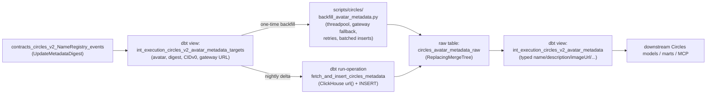

# Circles Avatar IPFS Metadata

Circles v2 publishes avatar profiles (display name, description, preview image, etc.) **off-chain on IPFS**. The on-chain `NameRegistry` contract only emits a 32-byte `metadataDigest` per `UpdateMetadataDigest` event. This workflow turns those digests into resolved CIDv0 IPFS pointers, fetches the JSON payloads through public IPFS gateways, persists them in ClickHouse, and exposes them as a typed dbt model that joins back to `int_execution_circles_v2_avatars`.

The implementation lives in [`dbt-cerebro`](https://github.com/gnosischain/dbt-cerebro). This page is the canonical reference for how it works, what tables it writes, what the data looks like in practice, and how to operate it.

## Purpose

- Resolve every Circles v2 avatar's display profile from IPFS into ClickHouse so analytics queries do not need to make live gateway calls.
- Keep the resolved data current as new `UpdateMetadataDigest` events land daily.
- Provide a typed view (`int_execution_circles_v2_avatar_metadata`) that downstream Circles models, dashboards, and the MCP can join against by avatar address.

## Architecture



Two write paths land in the same raw table; downstream dbt models do not care which produced the row. Both paths use a `LEFT ANTI JOIN` against `circles_avatar_metadata_raw` so re-runs only fetch what is missing.

The split exists for **scale and reliability**:

- **Python backfill** (one-time): the historical sink is ~40k unique digests. Doing 40k synchronous HTTP calls inside a single ClickHouse `url()` query would be fragile and provide no retry semantics. The Python script handles concurrency, gateway fallback, exponential backoff, and batched inserts.
- **dbt run-operation** (nightly): steady-state volume is ~hundreds of new digests per day, which fits comfortably inside a per-row `url()` call sequence inside a single dbt invocation. No external infrastructure required.

## Components

| Component | Type | Path in `dbt-cerebro` |
|---|---|---|
| `circles_metadata_digest_hex`, `circles_metadata_digest_to_cid_v0`, `circles_metadata_gateway_url` | Jinja macros (CID helpers) | `macros/circles/circles_utils.sql` |
| `create_circles_avatar_metadata_table` | DDL run-operation | `macros/circles/create_circles_avatar_metadata_table.sql` |
| `fetch_and_insert_circles_metadata` | Nightly run-operation | `macros/circles/fetch_and_insert_circles_metadata.sql` |
| `int_execution_circles_v2_avatar_metadata_targets` | dbt view | `models/execution/Circles/intermediate/` |
| `int_execution_circles_v2_avatar_metadata` | dbt view (typed) | `models/execution/Circles/intermediate/` |
| `circles_avatar_metadata_raw` | ClickHouse table (registered as `source('auxiliary', ...)`) | created by the DDL macro |
| `backfill_avatar_metadata.py` | One-time Python script | `scripts/circles/backfill_avatar_metadata.py` |

The orchestration is wired into `scripts/run_dbt_observability.sh` (the daily cron entry point) between source freshness and the main `tag:production` batch run.

## CID derivation

Circles publishes a 32-byte sha2-256 digest in the on-chain event. The corresponding IPFS CIDv0 is the base58-encoding of the multihash, which prepends the multihash prefix `1220` (sha2-256 / 32 bytes) to the digest:

```
CIDv0 = base58( unhex( '1220' || lower(hex_digest_without_0x) ) )
```

Verified sample (used as the unit test for the helper macro):

| field | value |
|---|---|
| on-chain digest | `0x1cc1ce9522237635ede2fe9aaa2fb9ba68c16ef04d83f60443917b4236848bf5` |
| derived CIDv0 | `QmQGuXdbNDNRUP798muCnKgKQm3qU2c61EWpm1FzsWLyHn` |
| gateway URL | `https://ipfs.io/ipfs/QmQGuXdbNDNRUP798muCnKgKQm3qU2c61EWpm1FzsWLyHn` |

The helper macro lets you derive the CID from any digest column directly in SQL:

```sql
SELECT
    decoded_params['avatar']         AS avatar,
    decoded_params['metadataDigest'] AS metadata_digest,
    base58Encode(unhex(concat('1220',
        lower(replaceRegexpOne(decoded_params['metadataDigest'], '^0x', ''))
    )))                              AS ipfs_cid_v0
FROM dbt.contracts_circles_v2_NameRegistry_events
WHERE event_name = 'UpdateMetadataDigest'
LIMIT 5
```

The default IPFS gateway is set in `dbt_project.yml` via the `circles_ipfs_gateway` var (default: `https://ipfs.io/ipfs/`). Override per-run with `--vars '{"circles_ipfs_gateway": "https://my-gateway.example/ipfs/"}'`. Changing gateways does not invalidate already-fetched rows because the CID itself is deterministic from the on-chain digest.

## Source of truth

All inputs come from the decoded NameRegistry events:

- **Source model**: `dbt.contracts_circles_v2_NameRegistry_events`
- **Contract address**: `0xA27566fD89162cC3D40Cb59c87AAaA49B85F3474`
- **Event filter**: `event_name = 'UpdateMetadataDigest'`
- **Decoded parameter keys**: `avatar`, `metadataDigest`

Two event names exist on this contract:

| event | row count (current) | used by this workflow |
|---|---|---|
| `UpdateMetadataDigest` | ~50.6k | yes — the queue source |
| `RegisterShortName` | ~353 | no |

The targets view dedupes to one row per `(avatar, metadata_digest)` and additionally flags the **latest** digest per avatar via `is_current_avatar_metadata`, so the parsed view can pick the current profile.

## Schemas

### `circles_avatar_metadata_raw` (ClickHouse table)

ReplacingMergeTree, `ORDER BY (metadata_digest, avatar)`, version column = `fetched_at`. Registered in dbt as `source('auxiliary', 'circles_avatar_metadata_raw')` (see `models/execution/auxiliary_sources.yml`).

| column | type | description |
|---|---|---|
| `avatar` | `LowCardinality(String)` | Lowercase Circles avatar address. |
| `metadata_digest` | `String` | 0x-prefixed hex of the 32-byte sha2-256 digest from the event. |
| `ipfs_cid_v0` | `String` | Derived CIDv0 (`base58('1220' + digest)`). |
| `gateway_url` | `String` | Full gateway URL used at fetch time. |
| `http_status` | `UInt16` | HTTP status code returned by the gateway. `0` indicates a transport-level error (timeout / DNS / connection). |
| `content_type` | `String` | `Content-Type` header from the gateway response. |
| `body` | `String` | Raw response body. JSON in the success case. |
| `error` | `String` | Error message on failure, empty on success. |
| `fetched_at` | `DateTime` | When the row was inserted. Doubles as the ReplacingMergeTree version. |

### `int_execution_circles_v2_avatar_metadata` (dbt view)

One row per avatar in `int_execution_circles_v2_avatars`. Fields prefixed with `metadata_` come from the JSON body of the most recently fetched payload for the avatar's current digest.

| column | type | source |
|---|---|---|
| `avatar` | `String` | `int_execution_circles_v2_avatars.avatar` |
| `avatar_type` | `String` | `int_execution_circles_v2_avatars.avatar_type` (Human / Group / Org) |
| `onchain_name` | `Nullable(String)` | On-chain `name` set at registration (Group/Org only) |
| `metadata_digest` | `Nullable(String)` | Latest digest for this avatar |
| `ipfs_cid_v0` | `Nullable(String)` | CIDv0 of the latest digest |
| `gateway_url` | `Nullable(String)` | Gateway URL used at fetch time |
| `metadata_name` | `String` | `JSONExtractString(body, 'name')` |
| `metadata_symbol` | `String` | `JSONExtractString(body, 'symbol')` |
| `metadata_description` | `String` | `JSONExtractString(body, 'description')` |
| `metadata_image_url` | `String` | `JSONExtractString(body, 'imageUrl')` |
| `metadata_preview_image_url` | `String` | `JSONExtractString(body, 'previewImageUrl')` |
| `metadata_body` | `Nullable(String)` | Full raw JSON body for advanced extraction |
| `metadata_fetched_at` | `Nullable(DateTime)` | When the current payload was fetched |

### `int_execution_circles_v2_avatar_metadata_targets` (dbt view)

The deterministic queue. One row per `(avatar, metadata_digest)` ever announced.

| column | type | description |
|---|---|---|
| `avatar` | `String` | Lowercase avatar address |
| `metadata_digest` | `String` | 0x-prefixed digest |
| `metadata_digest_hex` | `String` | Lowercase hex without `0x` |
| `ipfs_cid_v0` | `String` | Derived CIDv0 |
| `gateway_url` | `String` | Full gateway URL using the configured `circles_ipfs_gateway` var |
| `block_timestamp`, `transaction_hash`, `log_index` | event traceability columns |
| `is_current_avatar_metadata` | `Bool` | True if this is the most recent digest for the avatar |

## Field coverage (observed in production)

Real percentages from a full backfill (39,434 successful payloads, 30,815 distinct avatars). Use this to decide which fields are worth surfacing in dashboards and queries.

| field | populated | notes |
|---|---|---|
| `name` | 99.9% | almost always present |
| `previewImageUrl` | 53% | often blank string; null-check before use |
| `description` | 20% | |
| `imageUrl` | 1.5% | rarely set; prefer `previewImageUrl` for thumbnails |
| `symbol` | <1% | group/org tokens only |
| `image`, `attributes`, `avatar` | 0% | not part of the Circles metadata schema; intentionally not extracted |

Last full-backfill coverage:

- **40,734** total rows in `circles_avatar_metadata_raw`
- **39,434** successful (96.8%)
- **1,300** failures (1,200 × HTTP 504, 96 × read timeout, 4 × HTTP 410)
- **30,815** distinct avatars resolved
- **36,117** distinct digests resolved (some avatars updated their profile multiple times)

## Daily refresh (automatic)

The daily cron orchestrator (`scripts/run_dbt_observability.sh` in `dbt-cerebro`) runs two steps between `dbt source freshness` and the main `tag:production` batch:

```bash
# 1. Refresh the queue view so today's new digests are visible
dbt run --select int_execution_circles_v2_avatar_metadata_targets

# 2. Fetch up to 500 unresolved digests via ClickHouse url() + INSERT
dbt run-operation fetch_and_insert_circles_metadata --args '{"batch_size": 500}'
```

The macro:

1. `LEFT ANTI JOIN`s the targets view against `circles_avatar_metadata_raw` to find unresolved pairs.
2. For each row in the batch, runs an `INSERT INTO circles_avatar_metadata_raw … SELECT … FROM url(gateway_url, 'Raw', 'body String')`.
3. Records **successful** fetches only — a failed `url()` call surfaces as a run-operation error and the offending row is automatically retried on the next nightly invocation (because the LEFT ANTI JOIN keeps it in the queue).

When the main `tag:production` batch run executes immediately after, the dependency graph rebuilds `int_execution_circles_v2_avatar_metadata` so the parsed view reflects the day's new payloads in the same nightly cycle.

## One-time backfill (manual)

The first time you deploy the workflow (or when you want to forcibly refresh everything from scratch), run the Python script. ~40k digests typically complete in ~90 minutes at default concurrency.

```bash
# 1. Create the raw landing table (idempotent)
dbt run-operation create_circles_avatar_metadata_table

# 2. Materialize the queue view
dbt run --select int_execution_circles_v2_avatar_metadata_targets

# 3. Optional dry-run to preview the queue
python scripts/circles/backfill_avatar_metadata.py --limit 100 --dry-run

# 4. Run the full backfill
python scripts/circles/backfill_avatar_metadata.py

# 5. Materialize the parsed view
dbt run --select int_execution_circles_v2_avatar_metadata
```

Useful flags on `backfill_avatar_metadata.py`:

| flag | default | purpose |
|---|---|---|
| `--concurrency` | `30` | Worker threads for HTTP fetches |
| `--batch-size` | `5000` | Rows per ClickHouse `INSERT` flush |
| `--max-retries` | `3` | Retries per gateway on transient errors |
| `--request-timeout` | `20` | Per-request HTTP timeout in seconds |
| `--limit` | (none) | Cap targets fetched (debug only) |
| `--dry-run` | off | Query targets but do not fetch or insert |

The script uses **stdlib only** (`urllib.request` + `concurrent.futures.ThreadPoolExecutor`) plus the existing `clickhouse-connect` and `python-dotenv` requirements — no extra dependencies. It falls through `ipfs.io` → `cloudflare-ipfs.com` → `dweb.link` and retries `429`, `5xx`, and transport errors with exponential backoff.

## Retrying transient failures

After a backfill run, inspect the failure breakdown:

```sql
SELECT http_status, error, count() AS n
FROM dbt.circles_avatar_metadata_raw
WHERE http_status != 200 OR body = ''
GROUP BY http_status, error
ORDER BY n DESC
```

Failure-mode reference:

| status | meaning | recoverable on retry? |
|---|---|---|
| `504` | Gateway timeout while routing to peers | Yes — usually succeeds on a second attempt |
| `0` (`Timeout: ...`) | Local read timeout / transport error | Yes |
| `429` | Gateway rate-limited the script | Yes — backoff already applied |
| `404` | Content genuinely not pinned anywhere reachable | No |
| `410` | Gateway has blacklisted the CID | No on that gateway, sometimes on others |

To re-fetch only the transient failures **without** re-fetching the ~39k successful rows, delete the failed rows so the `LEFT ANTI JOIN` picks them back up, then re-run the backfill:

```sql
ALTER TABLE dbt.circles_avatar_metadata_raw
DELETE WHERE http_status != 200 OR body = ''
```

`ALTER TABLE … DELETE` is asynchronous in ClickHouse — wait for the mutation to finish before re-running:

```sql
SELECT * FROM system.mutations
WHERE table = 'circles_avatar_metadata_raw' AND is_done = 0
```

Then:

```bash
python scripts/circles/backfill_avatar_metadata.py
```

If you ever need a complete reset (e.g. after switching the default gateway and wanting `gateway_url` rewritten everywhere):

```sql
TRUNCATE TABLE dbt.circles_avatar_metadata_raw
```

```bash
dbt run --select int_execution_circles_v2_avatar_metadata_targets
python scripts/circles/backfill_avatar_metadata.py
dbt run --select int_execution_circles_v2_avatar_metadata
```

## Example queries

### Look up a single avatar's profile

```sql
SELECT
    avatar,
    avatar_type,
    metadata_name,
    metadata_description,
    metadata_preview_image_url,
    metadata_fetched_at
FROM dbt.int_execution_circles_v2_avatar_metadata
WHERE avatar = lower('0xd40133ea712e7012a95fdd3c008ab58f7918b446')
```

### Coverage of resolved metadata by avatar type

```sql
SELECT
    avatar_type,
    count()                                       AS avatars,
    countIf(metadata_name != '')                  AS with_name,
    countIf(metadata_preview_image_url != '')     AS with_preview,
    countIf(metadata_description != '')           AS with_description
FROM dbt.int_execution_circles_v2_avatar_metadata
GROUP BY avatar_type
ORDER BY avatars DESC
```

### How many digests are still unresolved?

```sql
SELECT count() AS unresolved
FROM dbt.int_execution_circles_v2_avatar_metadata_targets t
LEFT ANTI JOIN dbt.circles_avatar_metadata_raw r
  ON t.avatar = r.avatar
 AND t.metadata_digest = r.metadata_digest
```

### Top recently-updated profiles

```sql
SELECT
    avatar,
    metadata_name,
    metadata_fetched_at
FROM dbt.int_execution_circles_v2_avatar_metadata
WHERE metadata_name != ''
ORDER BY metadata_fetched_at DESC
LIMIT 25
```

### Inspect raw payloads for a known digest

```sql
SELECT
    avatar,
    http_status,
    content_type,
    fetched_at,
    body
FROM dbt.circles_avatar_metadata_raw
WHERE metadata_digest = '0x1cc1ce9522237635ede2fe9aaa2fb9ba68c16ef04d83f60443917b4236848bf5'
ORDER BY fetched_at DESC
LIMIT 1
```

## Operational notes

- **Idempotency.** Both the backfill script and the nightly macro are idempotent. The raw table is `ReplacingMergeTree(fetched_at)` so re-fetching the same `(avatar, metadata_digest)` simply updates `fetched_at`.
- **Failure isolation.** Failures in either fetch path do not block the rest of the dbt cron. The orchestrator's `run_step ... || true` pattern records the failure in the run summary but lets the main `tag:production` batch proceed.
- **Schema evolution.** If Circles adds new fields to the metadata JSON, they appear in `metadata_body` immediately. To expose them as typed columns, edit `int_execution_circles_v2_avatar_metadata.sql` and add a new `JSONExtractString` line plus a column entry in `schema.yml`.
- **Gateway rate limits.** Public IPFS gateways throttle aggressively. The default backfill concurrency of 30 is the highest the script has been tested at without sustained 429s. Lower it if you see those.

## See Also

- [Circles Protocol Overview](../../protocols/circles/index.md) — what the on-chain contracts do and how avatars work
- [Circles Data Models](../../protocols/circles/data-models.md) — other Circles dbt models (transfers, balances, trust, group collateral)
- [Contract ABI Decoding](../transformation/abi-decoding.md) — how `contracts_circles_v2_NameRegistry_events` is produced
- [Network Crawlers Index](index.md) — other off-chain enrichment crawlers (Nebula, IP geolocation)
- [`dbt-cerebro` repository](https://github.com/gnosischain/dbt-cerebro) — implementation source code
