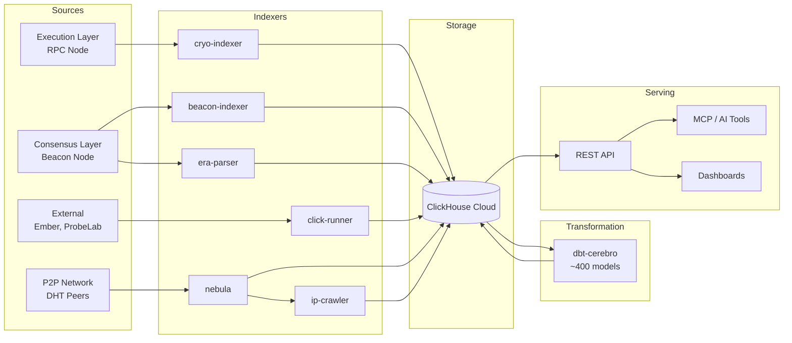

# Data Pipeline

The Gnosis Analytics data pipeline is a modular system that continuously ingests, enriches, and transforms blockchain data from Gnosis Chain into analytics-ready datasets. It spans the full lifecycle from raw on-chain events to queryable API endpoints.

## Pipeline Architecture

## Sections

| Section | Description |
|---------|-------------|
| [Pipeline Overview](overview.md) | End-to-end explanation of data flow, storage layout, and transformation strategy |
| [Data Ingestion](ingestion/index.md) | Indexers that extract data from blockchain nodes and external sources |
| [Network Crawlers](crawlers/index.md) | P2P network topology crawling and IP geolocation enrichment |
| [Data Transformation](transformation/index.md) | dbt models that transform raw data into analytics-ready datasets |
