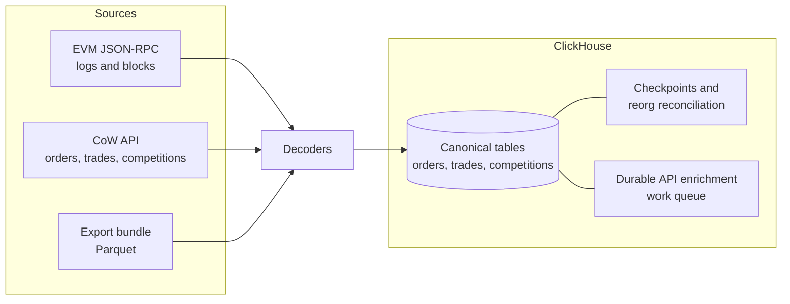

# CoW Protocol Indexer (cow-indexer)

[cow-indexer](https://github.com/gnosischain/cow-indexer) is a standalone, multi-chain indexer for CoW Protocol. It reads canonical contract events directly from EVM JSON-RPC, enriches discovered orders and settlements through the public CoW API, and optionally imports authoritative off-chain history bundles. It does not depend on dbt or any existing ingestion pipeline.

## Overview

The indexer covers every chain CoW Protocol is deployed on -- mainnet, Gnosis, Arbitrum One, Base, BNB, Polygon, Avalanche, Linea, Ink, and Plasma, plus the Sepolia testnet -- each with its own API base URL, deployment file, and finality window configured in `config/chains.yaml`. Chains without an available RPC can be disabled individually.

Three properties define the data model:

- Every identity includes `environment` and `chain_id`, so multiple chains coexist in one schema.
- Addresses and hashes are stored lowercase, and raw RPC, API, and export payloads are retained alongside decoded rows.
- Token amounts use ClickHouse `UInt256`, avoiding precision loss on settlement values.

Archive state and traces are not required from the RPC provider, but it must serve historical `eth_getLogs` calls back to each configured deployment block.

## Architecture

The indexer owns its ClickHouse schema through numbered migrations covering indexing state, raw sources, orders, trades, solver competitions, metadata, and the committed `*_canonical` views. The target database is set via `CLICKHOUSE_DATABASE` (repository default `cow_indexer`; the Cerebro deployment uses `cow_db`).

## Coverage model

The mandatory RPC and API path provides complete indexed history for the configured on-chain contracts, and the maximum order-book history that is publicly discoverable from order UIDs, owners, transactions, and competitions. It cannot discover an off-chain order that never executes when neither its UID nor its owner is otherwise known.

The optional Parquet export interface closes that gap when an authorized CoW order-book database export is available.

!!! note
    "Complete off-chain history" may only be claimed when a validated export manifest declares the required historical boundary. Without a bundle, off-chain coverage is discoverable-only by design.

## Running modes

Each mode is a subcommand of the same binary. They share the ClickHouse schema and the durable checkpoints, so they interleave safely.

| Mode | Command | Purpose |
|------|---------|---------|
| Preflight | `preflight --chain <all\|key>` | Read-only readiness check: RPC head, historical `eth_getLogs` at the deployment block, and CoW API reachability per chain |
| Migrate | `migrate` | Apply idempotent `migrations/*.sql`; run before any ingestion |
| Backfill | `backfill --chain <sel> [--from-block N] [--to-block M]` | One-shot forward scan from the checkpoint (or a bound) up to the safe head |
| Repair | `repair --chain <key> --from-block N --to-block M` | Rescan a bounded range and reconcile reorgs and gaps without moving the forward checkpoint backward |
| Continuous | `continuous --chain <all\|key>` | Long-running service: forward scan, finality-window rescan, competitions, active orders, enrichment, and token prices per chain |
| Inspect | `status`, `coverage --chain <sel>`, `validate --chain <sel>` | Report per-chain checkpoints, historical coverage, and reconciliation checks |
| Export import | `inspect-export`, `import-export`, `validate-export` | Optional authoritative off-chain Parquet bundle import |
| Orderbook backfill | `backfill-orderbook <probe\|seed-orders\|seed-owners\|drain\|status>` | Replay historical off-chain orders through the public API into `orders` (`source='backfill'`) |

The typical lifecycle is `preflight` -> `migrate` -> `continuous`; the continuous service backfills each chain from its pinned deployment block up to the tip and then tracks the head. Every chain runs independently -- a failing chain retries in isolation and does not stop the others.

!!! warning
    A fresh chain with no checkpoint starts at the earliest pinned `from_block` in its `deployments/*.json`. Pin those blocks (not `0`) to avoid scanning from genesis.

## Log scanning and reorg handling

The scanner starts with 5,000-block `eth_getLogs` requests. Successful ranges grow to 50,000 blocks; provider range or response-limit errors halve the request down to a 50-block minimum. Limit errors are recognized by JSON-RPC code and message (`-32005`, "too many logs", "block range") even when the provider returns them with a non-200 HTTP status, so they trigger adaptive halving (logged as `rpc_range_reduced`) rather than aborting the scan. Every RPC call has a hard request timeout, so a hung provider raises a retryable error instead of parking the scan.

Writes are committed in a fixed order per range: raw logs, block headers, decoded events, then the checkpoint.

Reorg handling is non-destructive:

- Continuous ingestion stores canonical block hashes throughout the finality window and rescans that window on every cycle.
- A replacement block hash makes logs from the abandoned block non-canonical at query time; the reorg-aware `*_canonical` views drop orphaned-hash rows without mutating data.
- The `*_canonical` views are additionally bounded to the committed checkpoint, so they never expose partially-processed rows.
- Checkpoints never move backward: `repair` rescans a bounded range while leaving the durable forward checkpoint in place.

## API enrichment

Event discovery creates deterministic work identities for order UIDs, owners, settlement transaction hashes, app-data hashes, and token addresses. Order lookups are batched into the documented maximum of 128 UIDs per call; account orders and trades paginate in 1,000-row pages.

The client uses `curl_cffi` browser TLS impersonation because CoW's edge distinguishes -- and blocks -- ordinary Python TLS clients by their TLS/JA3 fingerprint. This is required even with an API key, which is sent as `X-API-Key` and raises the allowance to roughly 30 RPS. A single adaptive rate limiter is shared across all chains (they hit the same host and key); it applies bounded exponential backoff on retryable statuses and backs the global rate off toward `COW_API_MAX_INTERVAL_SECONDS` on `429`/`403`, recovering as requests succeed.

The work queue is an append-only, restart-safe ClickHouse table. Terminal revisions (`done`, `dead`, `unavailable_from_public_api`) dominate the ReplacingMergeTree merge, so replayed chain ranges do not revive completed work while those rows exist. To keep the queue bounded, a scheduled maintenance task purges terminal work items older than a grace window (`COW_PURGE_GRACE_HOURS`, default 24 hours). This is finite-window deduplication: a later rediscovery after the purge re-creates a fresh pending item and re-enriches it, which is safe because handler writes are idempotent. Items that exhaust `COW_MAX_ATTEMPTS` land in `dead_letters` for inspection.

!!! warning
    Run only one enrichment worker replica per `(environment, chain_id)`. ClickHouse does not provide a transactional competing-consumer lease.

## Historical order-book backfill

Live API capture only starts at deployment time, but the chain holds years of traded order UIDs and trader addresses. `backfill-orderbook` replays that off-chain history through the public CoW API into `orders` (`source='backfill'`) using the existing work queue, without touching the live ingestion path.

The design is two-pass:

1. **Seed orders / drain** -- distinct traded UIDs missing from `orders` are batched into 128-UID work items and fetched via `POST /orders/by_uids`, recovering every executed order.
2. **Seed owners / drain** -- one work item per distinct trader, paged via `GET /account/{owner}/orders`, recovering expired and cancelled orders that never executed. Owners who never traded stay invisible.

The drain uses its own rate limiter and concurrency budget, fully separate from the live enrichment loop, so a throttled backfill never slows live ingestion and `drain` is safe to run beside `continuous`. Progress lives in the work items themselves: terminal states survive restarts and re-seeding is a no-op while items remain within the purge grace window.

!!! info "Feasibility floor"
    The public API serves full order JSON back to roughly 2022-07 (the order-book migration epoch); 2021-era UIDs return 404 and are counted as missing data, never as failures. The `probe` subcommand makes this gate repeatable. The 2021 epoch -- and authoritative fields such as cancellation timestamps -- remain reachable only via the export bundle path.

!!! note "Timestamp caveat"
    Backfilled `status:{status}` order events carry observation-time timestamps, not historical ones. Pre-capture cancelled-unfilled orders have no cancel time and are treated as open until `valid_to` by downstream reconstruction.

## Observability

The continuous service serves three endpoints on `COW_METRICS_PORT` (default 9090):

| Endpoint | Purpose |
|----------|---------|
| `/health` | Process liveness |
| `/ready` | ClickHouse connectivity |
| `/metrics` | Prometheus metrics |

Exported metric families (labeled by chain):

| Metric | Meaning |
|--------|---------|
| `cow_chain_lag_blocks{chain}` | Safe head minus the committed scan position |
| `cow_rows_written_total{chain,table}` | Rows written per table |
| `cow_rpc_requests_total{chain,method,status}` | RPC request counts |
| `cow_api_requests_total{chain,route,status}` | CoW API request counts, labeled by templated route |
| `cow_request_seconds{source,chain}` | RPC/API latency histogram |

There is deliberately no exact pending-work gauge: computing one requires a full-table `FINAL` over the append-only work queue, which is the memory risk the design removes.

!!! note
    During a backfill, `cow_chain_lag_blocks` is legitimately large until a chain catches up. Alert on "no rows written in an hour" and pod health rather than on lag thresholds; treat lag thresholds as steady-state signals to enable only after the initial backfill completes.

## Configuration

All configuration is environment-based. Key variables:

| Variable | Default | Description |
|----------|---------|-------------|
| `CLICKHOUSE_HOST` / `CLICKHOUSE_PORT` | -- / `8443` | ClickHouse Cloud endpoint (secure native-HTTP) |
| `CLICKHOUSE_DATABASE` | `cow_indexer` | Target database (must already exist) |
| `COW_RPC_URL_<CHAIN>` | -- | Per-chain JSON-RPC endpoint (e.g. `COW_RPC_URL_GNOSIS`) |
| `COW_CHAIN` | `gnosis` | Chain selection for the Docker Compose service (`all` for every enabled chain) |
| `COW_API_KEY` | -- | CoW API key, sent as `X-API-Key`; without it the public edge throttles under load |
| `COW_API_INTERVAL_SECONDS` | `0.1` with key, `0.6` without | Global enrichment pacing shared across all chains |
| `COW_API_MAX_INTERVAL_SECONDS` | `5.0` | Adaptive backoff ceiling on `429`/`403` |
| `COW_ENRICH_CONCURRENCY` | `6` | Bounded concurrent enrichment work items |
| `COW_MAX_ATTEMPTS` | `6` | Attempts before a work item is dead-lettered |
| `COW_PURGE_ENABLED` / `COW_PURGE_GRACE_HOURS` | `true` / `24` | Scheduled retention of finished work items |
| `COW_BACKFILL_INTERVAL_SECONDS` | `0.5` | Order-book backfill pacing (separate limiter) |
| `COW_BACKFILL_CONCURRENCY` | `2` | Order-book backfill concurrency |
| `COW_METRICS_PORT` | `9090` | Health and metrics port |

See the [repository README](https://github.com/gnosischain/cow-indexer) for the full variable reference, export-bundle tooling, and failure-recovery runbook.

## Downstream consumers

The indexed database backs the [CoW Explorer](../../mcp/mini-apps/cow-explorer.md) MCP mini-app, a read-only data explorer over the canonical order, trade, and competition tables. Because the indexer is independent of dbt, its tables are also available as an upstream source for dbt models in the transformation layer.
