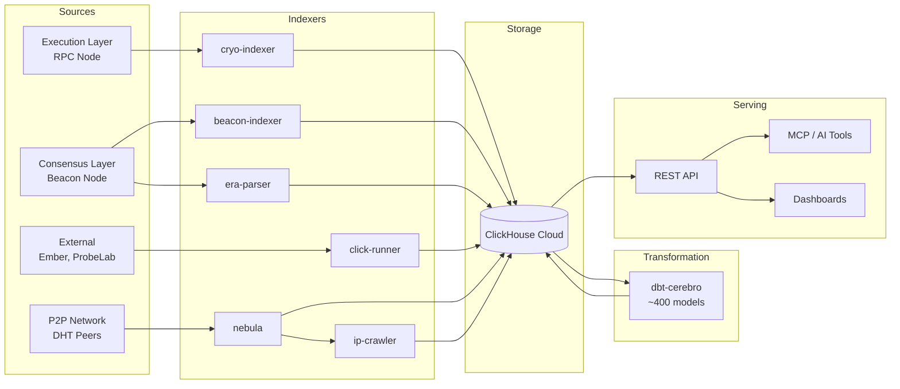

# Data Ingestion

The data ingestion layer is responsible for extracting raw blockchain data from various sources and loading it into ClickHouse. Each indexer is purpose-built for a specific data source and runs as an independent containerized service.

This section covers all ingestion components: the execution-layer and consensus-layer indexers, the era file parser for historical backfills, the click-runner for external data sources, and the network crawlers that capture P2P topology.

## Pipeline Architecture

## Indexer Overview

| Indexer | Source | Target Database | Language | Key Capability |
|---------|--------|----------------|----------|----------------|
| [cryo-indexer](cryo-indexer.md) | Execution layer RPC | `execution` | Python + Cryo (Rust) | Blocks, transactions, logs, traces, state diffs |
| [beacon-indexer](beacon-indexer.md) | Beacon node REST API | `consensus` | Python | Validators, attestations, sync committees |
| [era-parser](era-parser.md) | Era archive files | `consensus` | Python | Historical beacon chain bulk loading |
| [click-runner](click-runner.md) | CSV/Parquet/SQL | Various | Python | External data ingestion (Ember, ProbeLab) |

## Supporting Components

| Component | Purpose |
|-----------|---------|
| [cryo-base](cryo-base.md) | Docker base image with pre-compiled Cryo binary and custom patches |

## Design Principles

All indexers in this layer follow common design principles:

**Atomic processing** -- Data is loaded in complete chunks. A range of blocks is either fully committed or not committed at all. Partial writes are avoided.

**State tracking** -- Each indexer maintains a state table in ClickHouse that records which ranges have been processed, enabling resumability and failure recovery.

**Incremental operation** -- Indexers support both historical backfill (bulk loading of past data) and continuous mode (following the chain tip in real time).

**Containerized deployment** -- Every indexer ships as a Docker image with Docker Compose configurations for straightforward deployment and orchestration.

**Idempotency** -- Reprocessing a range that has already been loaded produces the same result, using `ReplacingMergeTree` engines and deduplication strategies in ClickHouse.
