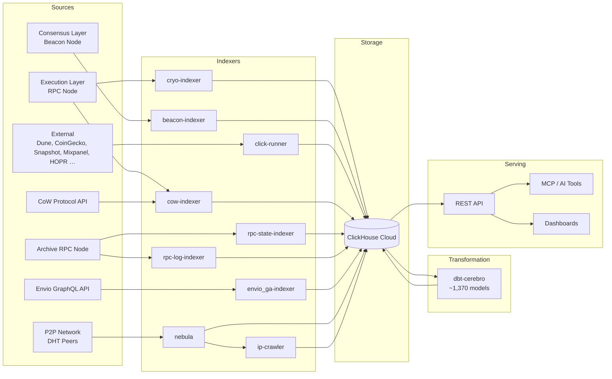

# Data Ingestion

The data ingestion layer is responsible for extracting raw blockchain data from various sources and loading it into ClickHouse. Each indexer is purpose-built for a specific data source and runs as an independent containerized service.

This section covers all ingestion components: the execution-layer and consensus-layer indexers, the click-runner for external data sources, the CoW Protocol indexer, the RPC state indexer for verified historical contract state, the RPC log indexer for governance events, the Envio GA mirror, and the network crawlers that capture P2P topology.

Every ingestor page ends with an **Operating and recovering** section — how it runs, the health signal and its healthy value, how to detect a gap, how to repair it, and what happens to dbt afterwards. The cross-cutting procedures are under [Operations](../../operations/index.md).

## Pipeline Architecture

```mermaid
graph LR
    subgraph Sources
        EL[Execution Layer<br/>RPC Node]
        CL[Consensus Layer<br/>Beacon Node]
        P2P[P2P Network<br/>DHT Peers]
        EXT[External<br/>Dune, CoinGecko, Snapshot, Mixpanel, HOPR …]
        COWAPI[CoW Protocol API]
        ARC[Archive RPC Node]
        GQL[Envio GraphQL API]
    end

    subgraph Indexers
        CRYO[cryo-indexer]
        BEACON[beacon-indexer]
        CR[click-runner]
        COWIDX[cow-indexer]
        RPCSI[rpc-state-indexer]
        RPCL[rpc-log-indexer]
        ENV[envio_ga-indexer]
        NEB[nebula]
        IPC[ip-crawler]
    end

    subgraph Storage
        CH[(ClickHouse Cloud)]
    end

    subgraph Transformation
        DBT[dbt-cerebro<br/>~1,370 models]
    end

    subgraph Serving
        API[REST API]
        MCP[MCP / AI Tools]
        DASH[Dashboards]
    end

    EL --> CRYO
    CL --> BEACON
    EXT --> CR
    EL --> COWIDX
    COWAPI --> COWIDX
    ARC --> RPCSI
    ARC --> RPCL
    GQL --> ENV
    P2P --> NEB
    NEB --> IPC

    CRYO --> CH
    BEACON --> CH
    CR --> CH
    COWIDX --> CH
    RPCSI --> CH
    RPCL --> CH
    ENV --> CH
    NEB --> CH
    IPC --> CH

    CH --> DBT
    DBT --> CH

    CH --> API
    API --> MCP
    API --> DASH
```

## Indexer Overview

| Indexer | Source | Target Database | Language | Key Capability |
|---------|--------|----------------|----------|----------------|
| [cryo-indexer](cryo-indexer.md) | Execution layer RPC | `execution`, `execution_live`, `celo_execution` | Python + Cryo (Rust) | Blocks, transactions, logs, traces, contracts, native transfers |
| [beacon-indexer](beacon-indexer.md) | Beacon node REST API | `consensus` | Python | Validators, attestations, sync committees |
| [click-runner](click-runner.md) | CSV/Parquet/SQL/APIs | `crawlers_data`, `governance_db`, `mixpanel_ga`, `hopr_db` | Python | External data ingestion (Dune, CoinGecko, DefiLlama, CoW fees, Mixpanel, Snapshot, Discourse, HOPR, Ember, Circles blacklist) |
| [cow-indexer](cow-indexer.md) | EVM RPC + CoW API | `cow_db` | Python | Multi-chain CoW Protocol events, settlements, order-book history |
| [rpc-state-indexer](rpc-state-indexer.md) | Archive EVM RPC | `rpc_state_indexer` | Python | Verified day-end contract state as an independent cross-check |
| [rpc-log-indexer](rpc-log-indexer.md) | Archive EVM RPC (`eth_getLogs`) | `rpc_log_indexer` | Python | Config-driven event decoding with reorg-safe canonical views (Snapshot DelegateRegistry) |
| [envio_ga-indexer](envio-ga-indexer.md) | Hasura / Envio GraphQL API | `envio_ga` | Python | Mirror of 28 Circles, Metri and Gnosis Pay entities with delete detection |

## Supporting Components

| Component | Purpose |
|-----------|---------|
| [cryo-base](cryo-base.md) | Docker base image with pre-compiled Cryo binary and custom patches |

## Design Principles

All indexers in this layer follow common design principles:

**Chunked processing with bookkeeping** -- Data is loaded in ranges, and a range's completion is recorded in a state table. That record is the unit of truth: a range with no state row is a gap even when its data tables hold rows, which is why every ingestor page carries a coverage query rather than a row count.

**State tracking** -- Each indexer maintains a state table in ClickHouse that records which ranges have been processed, enabling resumability and failure recovery.

**Incremental operation** -- Indexers support both historical backfill (bulk loading of past data) and continuous mode (following the chain tip in real time).

**Containerized deployment** -- Every indexer ships as a Docker image with Docker Compose configurations for straightforward deployment and orchestration.

**Single writer** -- Each database or chain has exactly one writer at a time. Several targets (the cryo `execution*` tables, `cow_db`, the beacon raw tables across payload variants) do **not** dedupe re-inserted rows, so idempotency is enforced by checkpoints, leases and `Recreate` deployment strategies rather than by the table engine. Repairs delete before they re-insert.
