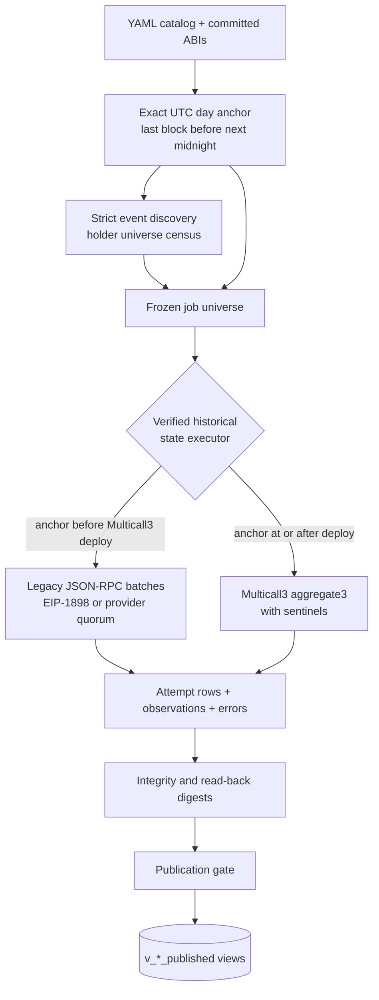

# RPC State Indexer (rpc-state-indexer)

[rpc-state-indexer](https://github.com/gnosischain/rpc-state-indexer) is a standalone historical EVM state indexer. It discovers addresses from contract events, reads contract state at exact UTC day-end anchor blocks through archive JSON-RPC, and exposes only verified, complete attempts through ClickHouse views in the `rpc_indexer` database.

This page is an overview. The in-repo documentation carries the depth:

| Document | Contents |
|----------|----------|
| [Architecture and correctness](https://github.com/gnosischain/rpc-state-indexer/blob/main/docs/architecture.md) | Trust boundary, anchor resolution, discovery, execution routing, publication protocol |
| [Configuration guide](https://github.com/gnosischain/rpc-state-indexer/blob/main/docs/configuration.md) | Chain, token, pool, universe, and job catalog contracts |
| [Pre-Multicall history](https://github.com/gnosischain/rpc-state-indexer/blob/main/docs/pre-multicall-history.md) | Verified execution before the Multicall3 deployment block |
| [Operations runbook](https://github.com/gnosischain/rpc-state-indexer/blob/main/docs/runbook.md) | Full operator procedure, recovery, diagnostics, health endpoints |

## Overview

For each snapshot date, the indexer resolves the exact UTC day-end anchor block -- the highest block whose timestamp is before the next midnight -- and reads contract state pinned to that block:

- ERC-20 `balanceOf` and `totalSupply`;
- Aave/Spark aToken scaled balances, scaled supply, normalized income, and exact half-up ray reconstruction;
- pool reserves observed as `token.balanceOf(pool)`.

All persisted values are raw integers; decimals are metadata and are never applied. An attempt reaches the published views only after completeness, integrity, and read-back digest checks pass.

## Independence contract

The runtime path is deliberately independent:

```text
archive JSON-RPC -> verified historical calls -> rpc_indexer ClickHouse database
```

The indexer does not import, invoke, or query dbt -- there is no dbt client, dbt source, or warehouse-query address selector anywhere in the runtime. Its address frame is built only from its own strict log scan or from committed explicit CSVs.

!!! info
    This separation is the point. If a downstream model infers a balance from logs, the useful comparison is *inferred value from the analytics pipeline* versus *direct value from archive RPC*. Feeding the inferred value into the direct path would couple their failures. dbt (or any other analytics system) may consume the published views downstream, but it is never an input to this service.

## Data flow



On Gnosis, Multicall3 was deployed at block `21,022,491`. That block is an execution-routing boundary, not the start of indexable history: anchors below it are executed as direct historical `eth_call` batches, anchors at or after it through Multicall3 `aggregate3`. A token can therefore be indexed from its own deployment block (WXDAI from `11,173,937`) as long as the provider retains archive state at the requested block. See [Pre-Multicall history](https://github.com/gnosischain/rpc-state-indexer/blob/main/docs/pre-multicall-history.md).

## Verification model

Every observation must be pinned and verified before it can publish:

- **Block pinning** -- pre-Multicall calls use the canonical block hash via EIP-1898 when the provider supports it. When it does not, the indexer requires matching result digests from two independently operated provider groups and checks the anchor hash immediately before and after each provider's calls.
- **Batch sentinels** -- Multicall3 batches include block number, timestamp, and parent-hash sentinels at both the beginning and end of every batch.
- **Publication gating** -- an attempt publishes only with zero terminal errors, verified target bytecode, complete observations, the configured integrity invariant satisfied, and read-back digests from ClickHouse equal to the in-memory result. A publication is then eligible only while its config hash matches the currently registered configuration and its anchor equals the canonical anchor for the date; conflicting signatures are excluded from `v_publications_current` and surfaced in `v_publication_conflicts`.
- **Zero versus absence** -- value tables are dense over the frozen universe: an observed zero is stored as `0`, while a failed or malformed call lands in `census_errors` and blocks publication. Absence and zero remain distinct.

The full failure semantics are in [Architecture and correctness](https://github.com/gnosischain/rpc-state-indexer/blob/main/docs/architecture.md).

## Configuration model

YAML defines *what* to index; environment variables define *how* the process runs. A token job is the product:

```text
token selector x named address universe x cadence x integrity mode
```

The implemented universe kinds are `full_holders` (every address found by the indexer's own event scan), `explicit_list` (a committed CSV), `union`, and `intersect`. There is no live warehouse-query or dbt-derived universe selector. Field contracts and complete token, aToken, and pool examples are in the [Configuration guide](https://github.com/gnosischain/rpc-state-indexer/blob/main/docs/configuration.md).

!!! note
    The committed Gnosis catalog is intentionally a starter: three tokens (WXDAI, WETH, aGnoWXDAI), one pool, and four jobs. Expanding it to the full production token, aToken, and pool inventory is catalog work still to do.

## Published ClickHouse contract

Downstream consumers must read the publication-gated views, never the raw attempt or observation tables:

| View | Contents |
|------|----------|
| `rpc_indexer.v_token_balances_published` | Per-holder token balances at day-end anchors, with `value_kind`, anchor block/hash, and attempt ID |
| `rpc_indexer.v_token_scalars_published` | Token-level scalars such as `totalSupply` |
| `rpc_indexer.v_pool_token_balances_published` | Pool reserve balances per configured asset |
| `rpc_indexer.v_publications_current` | The currently eligible publication per `(chain, job, target, date)` |
| `rpc_indexer.v_coverage_calendar` | Published coverage by date |

The views expose an attempt only when its publication matches the current config hash and canonical day anchor. All values are raw `UInt256`; decimals must be joined from metadata for display.

## Operator lifecycle

The standard sequence, detailed in the [Operations runbook](https://github.com/gnosischain/rpc-state-indexer/blob/main/docs/runbook.md):

1. `migrate` -- apply the immutable ClickHouse migrations.
2. `probe --persist` -- verify each RPC endpoint's chain ID, batching, finality tag, Multicall3 runtime code hash, EIP-1898 behavior, and archive depth at the earliest enabled token deployment.
3. `bench` -- throughput check at a pinned date before committing to a large run.
4. `discover` / `census` -- run event discovery and a first verified state census for one date (`census` performs required discovery itself).
5. `backfill --month-end` -- walk historical anchors (month-end by default), then `densify` to fill daily gaps where needed.
6. `daemon` -- the continuous previous-day scheduler with health and metrics endpoints; already published `(chain, job, target, date)` keys are skipped.

## Current limitations

The repository is explicit about what is deliberately not there yet:

- the full production catalog (the checked-in catalog is the executable starter);
- native xDAI state indexing;
- a `repair` CLI (a failed unpublished key can simply be rerun under a new attempt ID; the repair-request table exists but has no command handler);
- cross-chain aggregation or bridge identity;
- downstream reconciliation models and alerts;
- dbt- or warehouse-derived address universes;
- transaction, trace, raw block, or intra-day transfer attribution indexing.

These limits do not weaken the central contract: every value that reaches a published view comes solely from pinned, verified RPC observations, with any reconstruction identified explicitly by `value_kind` and performed in exact integer arithmetic.
