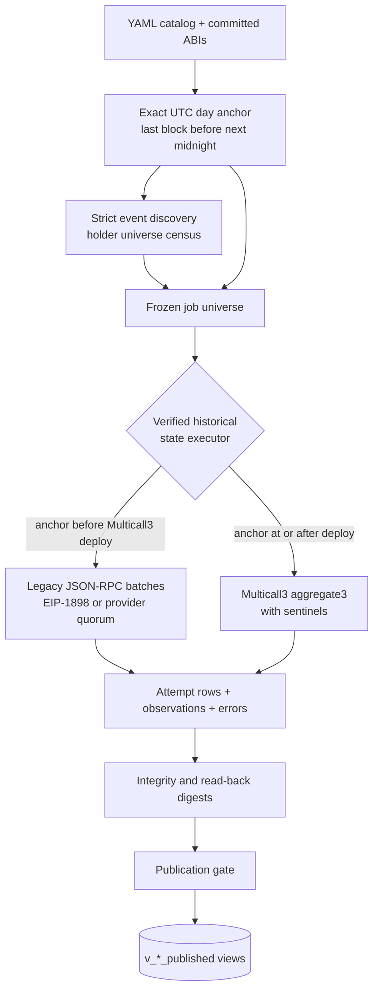

# RPC State Indexer (rpc-state-indexer)

[rpc-state-indexer](https://github.com/gnosischain/rpc-state-indexer) is a standalone historical EVM state indexer. It discovers addresses from contract events, reads contract state at exact UTC day-end anchor blocks through archive JSON-RPC, and exposes only verified, complete attempts through ClickHouse views in the `rpc_state_indexer` database.

This page is an overview. The in-repo documentation carries the depth:

| Document | Contents |
|----------|----------|
| [Architecture and correctness](https://github.com/gnosischain/rpc-state-indexer/blob/main/docs/architecture.md) | Trust boundary, anchor resolution, discovery, execution routing, publication protocol |
| [Configuration guide](https://github.com/gnosischain/rpc-state-indexer/blob/main/docs/configuration.md) | Chain, token, pool, universe, and job catalog contracts |
| [Pre-Multicall history](https://github.com/gnosischain/rpc-state-indexer/blob/main/docs/pre-multicall-history.md) | Verified execution before the Multicall3 deployment block |
| [Operations runbook](https://github.com/gnosischain/rpc-state-indexer/blob/main/docs/runbook.md) | Full operator procedure, recovery, diagnostics, health endpoints |

## Overview

For each snapshot date, the indexer resolves the exact UTC day-end anchor block -- the highest block whose timestamp is before the next midnight -- and reads contract state pinned to that block:

- ERC-20 `balanceOf` and `totalSupply`;
- Aave/Spark aToken scaled balances, scaled supply, normalized income, and exact half-up ray reconstruction;
- pool reserves observed as `token.balanceOf(pool)`.

All persisted values are raw integers; decimals are metadata and are never applied. An attempt reaches the published views only after completeness, integrity, and read-back digest checks pass.

## Independence contract

The runtime path is deliberately independent:

```text
archive JSON-RPC -> verified historical calls -> rpc_state_indexer ClickHouse database
```

The indexer does not import, invoke, or query dbt -- there is no dbt client, dbt source, or warehouse-query address selector anywhere in the runtime. Its address frame is built only from its own strict log scan or from committed explicit CSVs.

!!! info
    This separation is the point. If a downstream model infers a balance from logs, the useful comparison is *inferred value from the analytics pipeline* versus *direct value from archive RPC*. Feeding the inferred value into the direct path would couple their failures. dbt (or any other analytics system) may consume the published views downstream, but it is never an input to this service.

## Data flow


```mermaid
graph TD
    CAT[YAML catalog + committed ABIs]
    ANCH[Exact UTC day anchor<br/>last block before next midnight]
    DISC[Strict event discovery<br/>holder universe census]
    UNIV[Frozen job universe]
    EXEC{Verified historical<br/>state executor}
    LEG[Legacy JSON-RPC batches<br/>EIP-1898 or provider quorum]
    MC[Multicall3 aggregate3<br/>with sentinels]
    ATT[Attempt rows + observations + errors]
    DIG[Integrity and read-back digests]
    GATE[Publication gate]
    VIEWS[(v_*_published views)]

    CAT --> ANCH
    ANCH --> DISC
    DISC --> UNIV
    ANCH --> UNIV
    UNIV --> EXEC
    EXEC -->|anchor before Multicall3 deploy| LEG
    EXEC -->|anchor at or after deploy| MC
    LEG --> ATT
    MC --> ATT
    ATT --> DIG
    DIG --> GATE
    GATE --> VIEWS
```

On Gnosis, Multicall3 was deployed at block `21,022,491`. That block is an execution-routing boundary, not the start of indexable history: anchors below it are executed as direct historical `eth_call` batches, anchors at or after it through Multicall3 `aggregate3`. A token can therefore be indexed from its own deployment block (WXDAI from `11,173,937`) as long as the provider retains archive state at the requested block. See [Pre-Multicall history](https://github.com/gnosischain/rpc-state-indexer/blob/main/docs/pre-multicall-history.md).

## Verification model

Every observation must be pinned and verified before it can publish:

- **Block pinning** -- pre-Multicall calls use the canonical block hash via EIP-1898 when the provider supports it. When it does not, the indexer requires matching result digests from two independently operated provider groups and checks the anchor hash immediately before and after each provider's calls.
- **Batch sentinels** -- Multicall3 batches include block number, timestamp, and parent-hash sentinels at both the beginning and end of every batch.
- **Publication gating** -- an attempt publishes only with zero terminal errors, verified target bytecode, complete observations, the configured integrity invariant satisfied, and read-back digests from ClickHouse equal to the in-memory result. A publication is then eligible only while its config hash matches the currently registered configuration and its anchor equals the canonical anchor for the date; conflicting signatures are excluded from `v_publications_current` and surfaced in `v_publication_conflicts`.
- **Zero versus absence** -- value tables are dense over the frozen universe: an observed zero is stored as `0`, while a failed or malformed call lands in `census_errors` and blocks publication. Absence and zero remain distinct.

The full failure semantics are in [Architecture and correctness](https://github.com/gnosischain/rpc-state-indexer/blob/main/docs/architecture.md).

## Configuration model

YAML defines *what* to index; environment variables define *how* the process runs. A token job is the product:

```text
token selector x named address universe x cadence x integrity mode
```

The implemented universe kinds are `full_holders` (every address found by the indexer's own event scan), `explicit_list` (a committed CSV), `union`, and `intersect`. There is no live warehouse-query or dbt-derived universe selector. Field contracts and complete token, aToken, and pool examples are in the [Configuration guide](https://github.com/gnosischain/rpc-state-indexer/blob/main/docs/configuration.md).

!!! note
    The committed Gnosis catalog is intentionally a starter: three tokens (WXDAI, WETH, aGnoWXDAI), one pool, and four jobs. Expanding it to the full production token, aToken, and pool inventory is catalog work still to do.

## Published ClickHouse contract

The publication-gated views are the general read surface:

| View | Contents |
|------|----------|
| `rpc_state_indexer.v_token_balances_published` | Per-holder token balances at day-end anchors, with `value_kind`, anchor block/hash, and attempt ID |
| `rpc_state_indexer.v_token_scalars_published` | Token-level scalars such as `totalSupply` |
| `rpc_state_indexer.v_pool_token_balances_published` | Pool reserve balances per configured asset |
| `rpc_state_indexer.v_publications_current` | The currently eligible publication per `(chain, job, target, date)` |
| `rpc_state_indexer.v_coverage_calendar` | Published coverage by date — **always scope by job and window** |

The views expose an attempt only when its publication matches the target's **current** config hash and the canonical day anchor. All values are raw `UInt256`; decimals must be joined from metadata for display.

!!! warning "dbt does not read the `v_*_published` views"
    Since 2026-09-09 the dbt staging models select the published attempt themselves from the base tables (`census_publications` joined to the observation tables), with no config-hash gate. The gate is correct for a consumer that wants only the current configuration's view of the world, but one indexer deploy changed the hash and silently cut `api_gno_supply_daily` to two dates. Never point dbt staging back at the views.

## Operating and recovering

### How it runs

Two stacks, one database. Gnosis (chain 100): a continuous daemon (7 jobs, hourly poll, censusing the previous day once its anchor is final), a discovery CronJob at **00:30 UTC** and a compute CronJob at **02:30 UTC**. Ethereum (chain 1): the daemon only — **no discovery or compute cron there**. The daily publications land overnight, roughly 00:19–03:11 UTC, before the 06:00 dbt cron.

**All history work runs as Terraform-gated Jobs, never by hand.** Setting the stack's `run_backfill` variable creates the census Job *and* holds the daemon at zero replicas. That is how the single-writer rule is enforced — you never stop anything manually.

State is entirely in ClickHouse: `census_publications` (what is done — the skip gate), `census_attempts` (what was tried), `discovery_ranges` (`eth_getLogs` coverage), `holder_universe`, `day_anchors`, and `writer_heartbeats` — a **120-second lease with no override flag**.

### Health

The daemon's readiness endpoint is the fast check. A **503 on `/ready`** means startup has not completed, or *this* process's heartbeat loop died — **not** that another writer holds the lock. A pod that loses the lease exits 1 and crash-loops instead. A few restarts right after start are normal: it exits 1 when it loses the writer race or when the day's anchor is not final yet.

Reading the lease needs `FINAL` and an explicit order — a clean exit rewrites the row with `heartbeat_at = 1970-01-01`, so `max(heartbeat_at)` **hides clean writers**:

```sql
SELECT chain_id, process_id, started_at, heartbeat_at, details_json
FROM rpc_state_indexer.writer_heartbeats FINAL
ORDER BY started_at DESC LIMIT 10;
```

After an unclean death, wait out the 120 s stale window. There is deliberately no force flag.

Did yesterday land? Every job should carry yesterday:

```sql
SELECT chain_id, job_name, max(snapshot_date) AS latest_day
FROM rpc_state_indexer.census_publications
WHERE published_at >= now() - INTERVAL 3 DAY
GROUP BY chain_id, job_name ORDER BY chain_id, job_name;
```

### Detecting a gap

```sql
-- ALWAYS scope by job and window. Unfiltered this returns ~30M 'missing' rows,
-- almost all of it history nobody ever backfilled.
SELECT job_name, target_address, snapshot_date, coverage_status
FROM rpc_state_indexer.v_coverage_calendar
WHERE chain_id = 100 AND job_name = 'daily_curated_balances'
  AND snapshot_date >= today() - 30 AND coverage_status = 'missing'
ORDER BY snapshot_date;
```

A large `missing` count is **not** an incident by itself. What matters is missing days inside a window that should be covered.

Per-day backlog is attempted minus published — never a flat "= N targets/day" yardstick, because targets grow as tokens are deployed:

```sql
SELECT snapshot_date, uniqExact(target_address) AS attempted
FROM rpc_state_indexer.v_census_attempts_current
WHERE chain_id = 100 AND job_name = 'daily_curated_balances'
  AND snapshot_date BETWEEN ⟨from⟩ AND ⟨to⟩ GROUP BY snapshot_date ORDER BY snapshot_date;

SELECT snapshot_date, uniqExact(target_address) AS published
FROM rpc_state_indexer.census_publications
WHERE chain_id = 100 AND job_name = 'daily_curated_balances'
  AND snapshot_date BETWEEN ⟨from⟩ AND ⟨to⟩ GROUP BY snapshot_date ORDER BY snapshot_date;
```

!!! warning "Discovery failures are not in `census_errors`"
    The single most misleading thing about this service. A backfill that fails on every date after some point with an *empty* `census_errors` is almost always a wedged `eth_getLogs` range:
    ```sql
    SELECT token_address, topic0, range_start_block, range_end_block_exclusive,
           error_class, error_message, finished_at
    FROM rpc_state_indexer.discovery_ranges FINAL
    WHERE chain_id = 100 AND status = 'failed'
      AND finished_at >= now() - INTERVAL 2 DAY     -- scope by recency: a successful re-scan writes
    ORDER BY token_address, range_start_block;      -- a NEW scan_id, so old failed rows live forever
    ```
    Likewise, a census refusing with `holder_sum_equals_total_supply` is a **discovery** gap presenting as a census refusal. Re-censusing alone will refuse again on exactly the same days.

### Repairing — universe first, then the days

**1. Fix the universe.** `discover` is gap-aware by construction and takes its own lock class, so it runs beside the daemon, inside the daemon's pod:

```bash
rpc-state-indexer discover --through ⟨YYYY-MM-DD⟩ --job daily_curated_balances
```

A failing range exits non-zero and does **not** advance coverage past it — fail-closed by design. For a full re-walk, trigger the discovery cron, but it re-walks the whole ladder and holds the discovery lease for hours, so prefer the scoped form. Chain 1 has no discovery cron; the pod-scoped command is the only route there.

**2. Refill the days.** Apply the stack with `run_backfill` set, `backfill_daily` set (daily *is* densify), `backfill_job` naming the job, and `backfill_from` / `backfill_to` bounding the range. The Job runs with a backoff limit of 20 because one transient RPC failure fails the whole Job; the retry pod resumes and skips published targets.

!!! warning "The range must cover only the missing days"
    Cost is per day — curated balances take ~230 s/day on arm64 and ~13 min on default nodes, because the census is bound to one Python thread. A wide pass over holes re-walks published days for nothing.

**3. Restore the daemon** — a plain apply, which also destroys the Job. Do it before ~00:00 UTC so the daemon can census the new "yesterday" before the 06:00 dbt cron.

!!! warning "The parking is keyed on `run_backfill` at apply time"
    Deleting the Job by hand removes it but leaves the daemon at zero replicas in the last applied state — only an apply *without* `run_backfill` brings the daemon back. And every Job name carries a timestamp, so **any** apply in this stack while a Job runs replaces and kills it; a targeted apply is the only safe exception.

### Corrupt or wrong publication

Delete the `census_publications` row for that (chain, job, target, day) and re-census. That is sufficient and minimal — the observation rows key on `attempt_id` and become unreachable on their own once a new attempt publishes. Leave `census_attempts` alone; it is the diagnostic evidence.

Never delete a *conflicting* publication as an automatic repair: conflicting signatures are already excluded from the consumer views, and deleting one hides the conflict instead of resolving it.

### Missed day

If the daemon was down across a day, that day needs a **one-day all-jobs recovery** Job — `backfill_job` empty, ~25 min, and note it also runs curated balances.

An "empty" Job whose every target-day is already published **exits non-zero** and burns its backoff limit with the data complete. Check coverage before concluding anything from an exit code. Discovery and compute re-runs are safe: discovery takes its own lock class, compute is RPC-free and takes no writer lock at all.

### Restart

Kill-safe: everything is in the warehouse and published keys are skipped. After an unclean death the new pod crash-loops until the 120 s lease goes stale — expected, not a fault. A rolling update deadlocks (the new pod cannot take the lease while the old one holds it), which is why the strategy is `Recreate`.

### Then dbt

After a re-census there is nothing to flip — dbt selects the published attempt itself from the base tables. Current month: a plain run. Past months: drop-partition + append, passing **both** `start_month` and `end_month`, then OPTIMIZE through the macro so it is synchronous. Full detail in [dbt reprocess](../../operations/runbooks/dbt-reprocess.md).

!!! note "Expected noise"
    - A few daemon restarts right after start.
    - A large `v_coverage_calendar` missing count.
    - An all-published Job exiting non-zero.
    - `no persisted CL state for attempt …` on ~0.5–1% of `daily_cl_liquidity` targets — a read-after-write consistency miss; retries succeed.

!!! info "Internal runbook"
    [runbooks/22-rpc-state-indexer.md](https://github.com/gnosisdevops/infrastructure-gnosis-analytics/blob/main/runbooks/22-rpc-state-indexer.md) — private repository; carries the cluster-specific commands, the stack variables and the apply sequence for this page.
