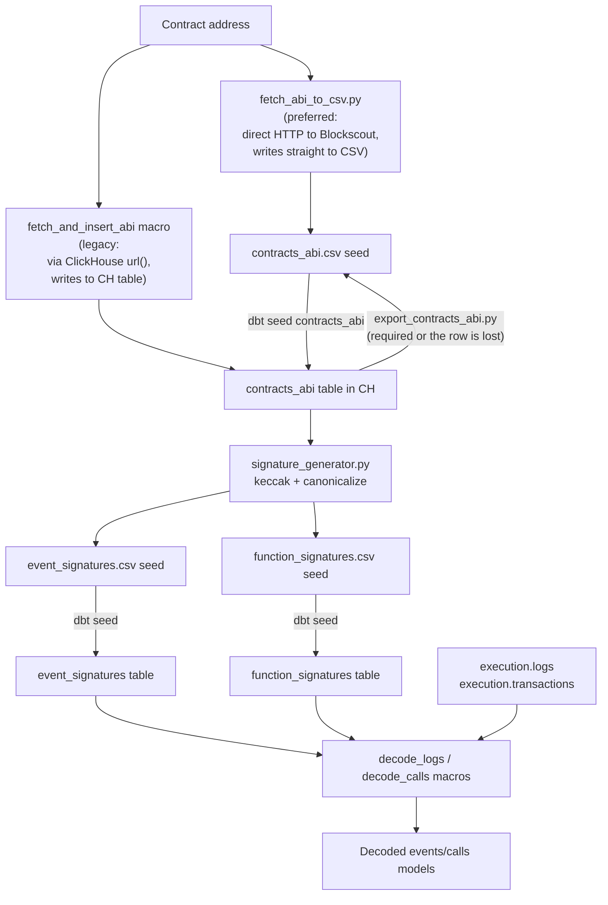
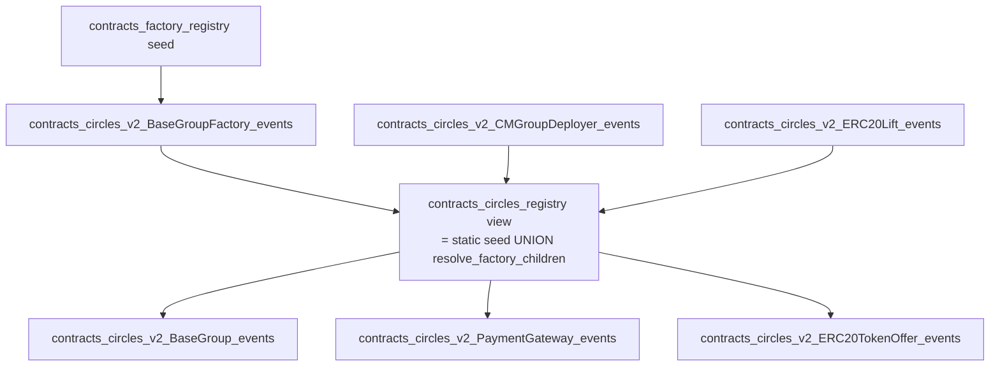

# Contract ABI Decoding

dbt-cerebro includes a system for decoding raw blockchain transaction data into human-readable function calls and events. This enables analysis of specific smart contract interactions without requiring custom parsing for each contract.

## Overview

On the blockchain, transaction input data and event logs are encoded as raw hex bytes. To understand what function was called or what event was emitted, you need the contract's ABI (Application Binary Interface), which describes the structure of each function and event.

The decoding system works in two phases:

1. **Preparation** -- Fetch the contract ABI, generate function/event signatures, and load them as dbt seeds
2. **Runtime** -- Use dbt macros (`decode_calls`, `decode_logs`) to match raw hex data against signatures and extract typed parameters

## Decoding Workflow

Two paths are supported to get an ABI into the seed layer. Both end in the same state (CSV is the source of truth, ClickHouse and `event_signatures.csv` are in sync); pick whichever suits your environment.



!!! warning "Silent-data-loss footgun in the legacy path"
    `dbt run-operation fetch_and_insert_abi` writes directly to the ClickHouse `contracts_abi` table without touching the CSV. The next time anyone runs `dbt seed --select contracts_abi`, dbt replaces the table with the CSV's contents — silently wiping any row the macro inserted. You **must** immediately run `scripts/abi/export_contracts_abi.py` to dump the CH state back to the CSV, or the new row is lost.

    `fetch_abi_to_csv.py` is immune to this because the CSV is the only place it writes.

## Step-by-Step Guide

### Step 1: Fetch Contract ABI

#### Preferred: CSV-first one-shot (`fetch_abi_to_csv.py`)

`scripts/signatures/fetch_abi_to_csv.py` fetches the ABI directly from Blockscout over HTTP (no ClickHouse round-trip), writes it straight into `seeds/contracts_abi.csv`, and — with `--regen` — chains through `dbt seed contracts_abi` → `signature_generator.py` → `dbt seed event_signatures function_signatures` in a single command:

```bash
docker exec -it dbt /bin/bash

# One-shot: fetch Blockscout ABI, append to CSV, regenerate sigs, reseed.
# Leaves the warehouse fully in sync.
python scripts/signatures/fetch_abi_to_csv.py \
  0xe91d153e0b41518a2ce8dd3d7944fa863463a97d --regen
```

Flags:

| Flag | Purpose |
|---|---|
| `--regen` | Chain `dbt seed contracts_abi` → `signature_generator.py` → `dbt seed event_signatures function_signatures` after the CSV write. |
| `--force` | Overwrite the existing row for `(contract_address, implementation_address)` instead of skipping. Use when a contract is reverified with a new name or a corrected ABI. |
| `--name <NAME>` | Override the `contract_name` field when Blockscout returns something ugly or ambiguous. |
| `--from-ch` | **Egress-less fallback**: read the ABI from the ClickHouse `contracts_abi` table via `dbt show` instead of hitting Blockscout. Requires that `dbt run-operation fetch_and_insert_abi` has already run for the same address. Useful in containers with no outbound HTTP or when Blockscout rate-limits. |

The script uses a browser-like `User-Agent` header because Blockscout's public API `403`s the default `Python-urllib/3.x` UA.

**Typical invocations:**

```bash
# Adding a fresh contract
python scripts/signatures/fetch_abi_to_csv.py 0xADDRESS --regen

# Refresh an existing row (e.g. contract reverified with a new name)
python scripts/signatures/fetch_abi_to_csv.py 0xADDRESS --force --regen

# Egress-less fallback — route through the warehouse
dbt run-operation fetch_and_insert_abi --args '{"address": "0xADDRESS"}'
python scripts/signatures/fetch_abi_to_csv.py 0xADDRESS --from-ch --regen
```

#### Legacy: dbt macro + export script

The older `fetch_and_insert_abi` macro writes the ABI directly to the ClickHouse `contracts_abi` table (via the ClickHouse `url()` table function). It still works and is documented here for anyone who prefers it or is running a workflow that depends on it:

```bash
docker exec -it dbt /bin/bash

# Fetch ABI into ClickHouse
dbt run-operation fetch_and_insert_abi \
  --args '{"address": "0xe91d153e0b41518a2ce8dd3d7944fa863463a97d"}'

# Repeat for additional contracts
dbt run-operation fetch_and_insert_abi \
  --args '{"address": "0xAnotherContractAddress"}'
```

!!! warning "You MUST run `export_contracts_abi.py` next — see Step 2"
    The macro writes only to the CH table. The next `dbt seed --select contracts_abi` replaces that table with whatever is in `seeds/contracts_abi.csv`, silently wiping the new row. Running `export_contracts_abi.py` is **not optional** — if you skip it, the new row is gone the next time anyone seeds.

### Step 2: Generate Signatures (and export ABIs if you used the legacy path)

!!! info "Skip straight to `signature_generator.py` if you used `fetch_abi_to_csv.py`"
    The `--regen` flag on `fetch_abi_to_csv.py` already runs `signature_generator.py` for you. This step is only needed if you used the legacy `fetch_and_insert_abi` macro, OR if you added a row to `seeds/contracts_abi.csv` by hand.

```bash
# LEGACY PATH ONLY: export current ABIs from ClickHouse back to CSV.
# Critical for the dbt macro path; NOT needed when using fetch_abi_to_csv.py.
python scripts/abi/export_contracts_abi.py

# Regenerate signature files from contracts_abi.csv
python scripts/signatures/signature_generator.py
```

The signature generator parses each ABI and produces:

- **`seeds/event_signatures.csv`** — Maps 32-byte event topic hashes to event names and parameter types
- **`seeds/function_signatures.csv`** — Maps 4-byte function selectors to function names and parameter types

### Step 3: Load Seeds into ClickHouse

```bash
# Load all seed files
dbt seed

# Or load specific seeds
dbt seed --select contracts_abi
dbt seed --select event_signatures
dbt seed --select function_signatures
```

### Step 4: Create Decoding Models

Create dbt models that use the `decode_calls` or `decode_logs` macros to decode raw data for a specific contract.

#### Decoding Event Logs

```sql
-- models/contracts/your_protocol/your_contract_events.sql
{{
    config(
        materialized='incremental',
        incremental_strategy='delete+insert',
        engine='ReplacingMergeTree()',
        order_by='(block_timestamp, log_index)',
        partition_by='toStartOfMonth(block_timestamp)',
        pre_hook=["SET allow_experimental_json_type = 1"]
    )
}}

{{
    decode_logs(
        source_table=source('execution', 'logs'),
        contract_address='0xYourContractAddress',
        output_json_type=true,
        incremental_column='block_timestamp'
    )
}}
```

#### Decoding Function Calls

```sql
-- models/contracts/your_protocol/your_contract_calls.sql
{{
    config(
        materialized='incremental',
        incremental_strategy='delete+insert',
        engine='ReplacingMergeTree()',
        order_by='(block_timestamp, transaction_hash)',
        partition_by='toStartOfMonth(block_timestamp)',
        pre_hook=["SET allow_experimental_json_type = 1"]
    )
}}

{{
    decode_calls(
        source_table=source('execution', 'transactions'),
        contract_address='0xYourContractAddress',
        output_json_type=true,
        incremental_column='block_timestamp'
    )
}}
```

### Step 5: Run the Models

```bash
# Run specific contract models
dbt run --select your_contract_events your_contract_calls

# Or run all contract models
dbt run --select contracts
```

## Decoding Patterns

dbt-cerebro supports four decoding patterns, in order of complexity. Choosing the right one depends on **how many contracts** you need to decode and **whether they share an ABI**:

| Pattern | When to use | Example |
|---|---|---|
| **Single static address** | One immutable contract, no proxy | Circles V1 Hub |
| **Multiple static addresses** | Small fixed set sharing one ABI | A handful of aTokens |
| **Whitelist seed** (`contract_address_ref`) | Many contracts of the same type that all share one ABI per pool | UniswapV3 / Swapr V3 pools |
| **Proxy / factory registry** (`contract_address_ref` with `abi_source_address`) | Proxy contracts (ABI lives at a different implementation address) **and** factory-discovered children | Circles V2 Groups, PaymentGateways, ERC20 wrappers |

The same two macros (`decode_logs`, `decode_calls`) handle all four patterns. Which path runs is decided by which arguments you pass.

### Pattern 1 + 2 — Static address(es)

Pass a single hex string or an array. The macro normalizes them and builds a `WHERE address IN (…)` filter.

```sql
{{ decode_logs(
    source_table     = source('execution', 'logs'),
    contract_address = '0x29b9a7fbb8995b2423a71cc17cf9810798f6c543',
    output_json_type = true,
    incremental_column = 'block_timestamp',
    start_blocktime  = '2020-10-01'
) }}
```

For multiple addresses:

```sql
{{ decode_logs(
    source_table     = source('execution', 'logs'),
    contract_address = ['0xfa…', '0x4d…', '0x83…'],
    ...
) }}
```

### Pattern 3 — Whitelist seed (`contracts_whitelist`)

When you have many contracts of the same type — for example, every Swapr V3 / UniswapV3 pool tracked for a list of whitelisted tokens — list them in a flat seed and reference it via `contract_address_ref`. Each pool has its own contract address but shares the same ABI shape, so they all hit the same `event_signatures` rows once an ABI for one pool has been generated.

`seeds/contracts_whitelist.csv`:

```csv
address,contract_type
0xe29f8626abf208db55c5d6f0c49e5089bdb2baa8,UniswapV3Pool
0x7440d14fac56ea9e6d0c9621dd807b9d96933666,UniswapV3Pool
0x01343cf42c7f1f71b230126dda3b7b2c108e9f2e,SwaprPool
…
```

The model file:

```sql
{{ decode_logs(
    source_table         = source('execution','logs'),
    contract_address_ref = ref('contracts_whitelist'),
    contract_type_filter = 'UniswapV3Pool',
    output_json_type     = true,
    incremental_column   = 'block_timestamp',
    start_blocktime      = '2022-04-22'
) }}
```

The macro emits a JOIN like this and uses `cw.address` directly as the `abi_join_address`:

```sql
ANY LEFT JOIN dbt.contracts_whitelist cw
    ON lower(replaceAll(l.address, '0x', '')) = lower(replaceAll(cw.address, '0x', ''))
   AND cw.contract_type = 'UniswapV3Pool'
```

Every pool resolves to its own `event_signatures` rows via its own contract address — no proxy logic involved.

### Pattern 4 — Proxy / factory registry

Many protocols deploy **proxy contracts**: the bytecode at address `A` is a thin proxy that delegates to an implementation at address `B`. The on-chain events are emitted from `A`, but the ABI is published under `B`. To decode events on `A`, you need to look up signatures by `B`'s address, not `A`'s.

This is what the `abi_source_address` column on a registry seed enables. The decoder uses

```sql
coalesce(nullIf(cw.abi_source_address, ''), cw.address)
```

as the `abi_join_address`. So:

- If `abi_source_address` is set on a row → ABI lookup uses **that** address (the implementation)
- If it's empty/null → ABI lookup falls back to the contract's own address (no proxy)

A single registry can hold both proxies and non-proxies in one table.

`seeds/contracts_circles_registry_static.csv`:

```csv
address,contract_type,abi_source_address,is_dynamic,start_blocktime,discovery_source
0x29b9a7fbb8995b2423a71cc17cf9810798f6c543,HubV1,0x29b9a7fbb8995b2423a71cc17cf9810798f6c543,0,2020-10-01,static
0xc12c1e50abb450d6205ea2c3fa861b3b834d13e8,HubV2,0xc12c1e50abb450d6205ea2c3fa861b3b834d13e8,0,2024-10-01,static
0xfeca40eb02fb1f4f5f795fc7a03c1a27819b1ded,CMGroupDeployer,0xfeca40eb02fb1f4f5f795fc7a03c1a27819b1ded,0,2025-02-01,static
…
```

A child decode model that targets all rows where `contract_type = 'BaseGroupRuntime'`:

```sql
{{ decode_logs(
    source_table         = source('execution', 'logs'),
    contract_address_ref = ref('contracts_circles_registry'),
    contract_type_filter = 'BaseGroupRuntime',
    output_json_type     = true,
    incremental_column   = 'block_timestamp',
    start_blocktime      = '2025-04-01'
) }}
```

### Compile-time seed introspection (`has_abi_source_col`)

Both `decode_logs` and `decode_calls` work transparently with **either** a flat whitelist seed (no `abi_source_address` column) **or** a rich registry (with the column). They detect which case they're in at compile time, via dbt's adapter API:

```jinja


  
  
  
    
  

```

When the flag is `true`, the macro emits the proxy-aware `coalesce(nullIf(cw.abi_source_address, ''), cw.address)` expression. When `false`, it emits a bare `cw.address` reference. A model authored against `contracts_whitelist` (no proxies) and a model authored against `contracts_circles_registry` (with proxies) both work with no caller-side branching.

If you ever see a `Code: 47. DB::Exception: Identifier 'cw.abi_source_address' cannot be resolved` error, it means your registry seed is missing the column it claims to have, or the macro was compiled before the introspection was added. Pull the latest decoding macros from `dbt-cerebro/macros/decoding/`.

## Factory Discovery

Some protocols deploy contracts dynamically via factory contracts. Circles V2 is a heavy user — every Group, every PaymentGateway, every ERC20 wrapper is created on demand. Listing all of them in a static seed isn't viable because new ones land every day.

The factory pattern works like this:

### 1. Declare factories in a seed

`seeds/contracts_factory_registry.csv`:

```csv
factory_address,factory_events_model,creation_event_name,child_address_param,child_contract_type,child_abi_source_address,protocol,start_blocktime
0xd0b5bd9962197beac4cba24244ec3587f19bd06d,contracts_circles_v2_BaseGroupFactory_events,BaseGroupCreated,group,BaseGroupRuntime,0x6fa6b486b2206ec91f9bf36ef139ebd8e4477fac,circles_v2,2025-04-01
0xfeca40eb02fb1f4f5f795fc7a03c1a27819b1ded,contracts_circles_v2_CMGroupDeployer_events,CMGroupCreated,proxy,BaseGroupRuntime,0x6fa6b486b2206ec91f9bf36ef139ebd8e4477fac,circles_v2,2025-02-01
0x5f99a795dd2743c36d63511f0d4bc667e6d3cdb5,contracts_circles_v2_ERC20Lift_events,ERC20WrapperDeployed,erc20Wrapper,ERC20Wrapper,,circles_v2,2024-10-01
```

Each row says: "the factory at `factory_address` emits `creation_event_name` events from which the child contract address can be extracted from the `child_address_param` decoded parameter; that child should be tagged with `child_contract_type` and decoded using the ABI from `child_abi_source_address`."

### 2. Decode the factory itself first

Before children can be discovered, the factory's own events have to be decoded. This is a normal decode-logs model targeting the factory address — for example `models/contracts/Circles/contracts_circles_v2_BaseGroupFactory_events.sql`:

```sql
{{ decode_logs(
    source_table     = source('execution', 'logs'),
    contract_address = '0xd0b5bd9962197beac4cba24244ec3587f19bd06d',
    output_json_type = true,
    incremental_column = 'block_timestamp',
    start_blocktime  = '2025-04-01'
) }}
```

This produces a table of every `BaseGroupCreated` event with its `decoded_params['group']` payload.

### 3. The `resolve_factory_children` macro

`macros/contracts/resolve_factory_children.sql` reads `contracts_factory_registry` at compile time and generates a `UNION ALL` query. For each factory row it emits:

```sql
SELECT
  lower(decoded_params['{{ child_address_param }}']) AS address,
  '{{ child_contract_type }}'                         AS contract_type,
  lower('{{ child_abi_source_address }}')             AS abi_source_address,
  toUInt8(1)                                          AS is_dynamic,
  '{{ start_blocktime }}'                             AS start_blocktime,
  '{{ creation_event_name }}'                         AS discovery_source
FROM {{ ref(factory_events_model) }}
WHERE event_name = '{{ creation_event_name }}'
GROUP BY 1
```

It accepts a `protocol=` filter so you can scope the discovery to one protocol family (e.g. `circles_v2`).

### 4. Per-protocol registry view

The protocol's registry view UNIONs the static seed with the dynamic discoveries. From `models/contracts/Circles/contracts_circles_registry.sql`:

```sql
{{ config(materialized='view', tags=['production', 'contracts', 'circles_v2', 'registry']) }}

-- depends_on: {{ ref('contracts_factory_registry') }}
-- depends_on: {{ ref('contracts_circles_v2_BaseGroupFactory_events') }}
-- depends_on: {{ ref('contracts_circles_v2_CMGroupDeployer_events') }}
-- depends_on: {{ ref('contracts_circles_v2_ERC20Lift_events') }}
-- … one per factory_events_model …

WITH static_registry AS (
    SELECT
        lower(address)            AS address,
        contract_type,
        lower(abi_source_address) AS abi_source_address,
        toUInt8(is_dynamic)       AS is_dynamic,
        start_blocktime,
        discovery_source
    FROM {{ ref('contracts_circles_registry_static') }}
)

SELECT * FROM static_registry
UNION ALL
{{ resolve_factory_children(protocol='circles_v2') }}
```

The `-- depends_on:` comments are **load-bearing**. Because `resolve_factory_children` loops at compile time over the seed's contents, dbt cannot statically infer which factory event models the view depends on. Adding explicit `-- depends_on: {{ ref(...) }}` comments tells dbt to materialize those models first. Forgetting them causes "model not found" errors when dbt compiles the registry view in isolation.

### 5. Child decode models

Now the child decode models point at the registry view, scoped by `contract_type_filter`:

```sql
{{ decode_logs(
    source_table         = source('execution', 'logs'),
    contract_address_ref = ref('contracts_circles_registry'),
    contract_type_filter = 'BaseGroupRuntime',
    output_json_type     = true,
    incremental_column   = 'block_timestamp',
    start_blocktime      = '2025-04-01'
) }}
```

Every `BaseGroupRuntime` row in the registry — both the statically declared ones and the factory-discovered ones — is decoded by this single model. New groups appear automatically on the next nightly run.

### Build order for factory-driven decoding



The `-- depends_on:` comments in the registry view enforce this order automatically.

## How the Macros Work

### `decode_logs` Macro

1. Filters the source `logs` table for the specified contract address(es) — either via `contract_address` (static) or via a subquery against `contract_address_ref` (whitelist/registry)
2. Deduplicates source rows via `ROW_NUMBER OVER (PARTITION BY block_number, transaction_index, log_index ORDER BY insert_version DESC)` (replaces the older `FROM source FINAL` pattern, which was forcing whole-table merges on every incremental run)
3. JOINs to the whitelist/registry seed (when used) to compute an `abi_join_address` per row — the contract's own address for flat whitelists, or `coalesce(nullIf(cw.abi_source_address, ''), cw.address)` for proxy registries
4. Extracts `topic0` (the event signature hash) from each log entry
5. Joins against the `event_signatures` seed table on `(abi_join_address, topic0)` to find matching event definitions
6. Parses the remaining topics and `data` field according to the ABI parameter types
7. Outputs decoded event name and typed parameters as a `Map(String, String)` (when `output_json_type=true`) or a JSON string

### `decode_calls` Macro

Same shape as `decode_logs` but reads `execution.transactions` instead of `execution.logs`, uses the first 4 bytes of `input` as the function selector, and joins to `function_signatures` instead of `event_signatures`. Uses `to_address` as the default `selector_column` (vs `address` for logs).

### Boolean type handling

Both `decode_logs` and `decode_calls` emit boolean values as `'0'` (false) or `'1'` (true) — decimal strings matching the `uint*` convention. This applies to:

- **Static `bool` params:** `decoded_params['flag']` → `'0'` or `'1'`
- **`bool[]` array params:** `decoded_params['flags']` → `'["1","0","1"]'` (JSON array of decimal strings)

Consuming pattern in downstream models:

```sql
-- For static bool:
toUInt8OrNull(decoded_params['useATokens'])  -- returns 0 or 1

-- For bool[] element extraction (via ARRAY JOIN):
toUInt8OrNull(JSONExtractString(decoded_params['memberOf'], idx))  -- returns 0 or 1
```

!!! warning "Do not compare to `'true'`/`'false'`"
    An older version of `decode_calls` emitted `'true'`/`'false'` for static bools; `decode_logs` emitted `NULL` for static bools and 64-char hex strings for `bool[]` elements. Both macros were unified in April 2025. If you encounter legacy code like `decoded_params['flag'] = 'true'`, change it to `= '1'`.

## Seed Files

| Seed | What it stores | Who writes it | Consumed by |
|---|---|---|---|
| `contracts_abi` | Raw ABI JSON per contract address (and per implementation address for proxies). One row per contract or proxy/impl pair. | **Preferred:** `scripts/signatures/fetch_abi_to_csv.py 0xADDRESS [--regen]` — fetches from Blockscout and writes directly to the CSV. **Legacy:** `dbt run-operation fetch_and_insert_abi` (writes directly to CH) + `scripts/abi/export_contracts_abi.py` (dumps CH back to CSV); **skipping the export step is a silent-data-loss footgun** because the next `dbt seed contracts_abi` wipes the new row. | `signature_generator.py` (only) |
| `event_signatures` | Pre-computed `(contract_address, topic0_hash, event_name, params, indexed/non_indexed split)` rows. One row per event per ABI. | `scripts/signatures/signature_generator.py` (parses contracts_abi.csv, computes keccak hashes, canonicalizes types) | `decode_logs` macro (JOIN target) |
| `function_signatures` | Same idea but for function selectors. One row per function per ABI. | Same script | `decode_calls` macro (JOIN target) |
| `contracts_whitelist` | Flat list of `(address, contract_type)`. No proxy support. | Manual edits to the CSV | `decode_logs` / `decode_calls` via `contract_address_ref` |
| `contracts_circles_registry_static` | Curated `(address, contract_type, abi_source_address, is_dynamic=0, start_blocktime, discovery_source='static')` for the Circles V2 protocol. The `abi_source_address` column lets it support proxies. | Manual edits to the CSV | `contracts_circles_registry` view (which UNIONs it with factory discoveries) |
| `contracts_factory_registry` | Per-factory metadata: which factory address, which event signals child creation, which decoded param holds the child address, what `contract_type` to assign, what `abi_source_address` to use for the children, and which protocol family it belongs to. | Manual edits to the CSV | `resolve_factory_children` macro |

## Safe Workflow Summary

Two equivalent paths. Pick one.

### Preferred: CSV-first one-shot

One command per contract. The `--regen` flag chains every follow-up so the warehouse is fully in sync when the script returns.

```bash
# 1. Fetch from Blockscout, append to CSV, seed, regenerate sigs, re-seed.
python scripts/signatures/fetch_abi_to_csv.py 0xADDRESS --regen

# 2. Create the decode model file under models/contracts/<Protocol>/, e.g.
#    contracts_<protocol>_<contract>_events.sql with a decode_logs(...) call.
#    Add a matching schema.yml entry.

# 3. Run the new model
dbt run --select contracts_<protocol>_<contract>_events
```

### Legacy: dbt macro + export script

Four manual steps in a precise order. Skipping step 2 is the silent-data-loss footgun described above.

```bash
# 1. Fetch ABI from Blockscout into the ClickHouse contracts_abi table
dbt run-operation fetch_and_insert_abi --args '{"address": "0x..."}'

# 2. Export CH contracts_abi back to the CSV seed (REQUIRED — prevents
#    data loss when dbt seed replaces the table with CSV contents)
python scripts/abi/export_contracts_abi.py

# 3. Generate signature CSVs from contracts_abi.csv
python scripts/signatures/signature_generator.py

# 4. Load all three seeds
dbt seed --select contracts_abi event_signatures function_signatures

# 5. Create the decode model file under models/contracts/<Protocol>/, e.g.
#    contracts_<protocol>_<contract>_events.sql with a decode_logs(...) call.
#    Add a matching schema.yml entry.

# 6. Run the new model
dbt run --select contracts_<protocol>_<contract>_events
```

### Adding a new factory

When the contract you want to decode is a factory whose children should also be decoded automatically, the workflow is the same as above for the factory's own ABI, plus a few extra steps to wire up child discovery:

```bash
# 1. Fetch BOTH the factory ABI AND the child implementation ABI.
#    Using the CSV-first shortcut: one --regen at the end is enough
#    because both writes land in the same CSV before the regen runs.
python scripts/signatures/fetch_abi_to_csv.py 0xFactoryAddress
python scripts/signatures/fetch_abi_to_csv.py 0xChildImplementationAddress --regen

# Or with the legacy two-step path:
#   dbt run-operation fetch_and_insert_abi --args '{"address": "0xFactoryAddress"}'
#   dbt run-operation fetch_and_insert_abi --args '{"address": "0xChildImplementationAddress"}'
#   python scripts/abi/export_contracts_abi.py
#   python scripts/signatures/signature_generator.py
#   dbt seed --select contracts_abi event_signatures function_signatures

# 5. Create the factory's own events model so its creation events get decoded:
#    models/contracts/<Protocol>/contracts_<protocol>_<Factory>_events.sql
#    using decode_logs(contract_address='0xFactoryAddress', ...)

# 6. Append a row to seeds/contracts_factory_registry.csv:
#    factory_address,factory_events_model,creation_event_name,child_address_param,
#    child_contract_type,child_abi_source_address,protocol,start_blocktime
#
#    - child_address_param is the parameter name in the creation event
#      that holds the new child's address (e.g. 'group' for BaseGroupCreated)
#    - child_abi_source_address is the implementation address whose ABI was
#      fetched in the step above

# 7. Reload the seed:
dbt seed --select contracts_factory_registry

# 8. Add a `-- depends_on: {{ ref('contracts_<protocol>_<Factory>_events') }}`
#    line to the per-protocol registry view
#    (e.g. contracts_circles_registry.sql) so dbt builds the factory model
#    BEFORE the registry view. This is required because resolve_factory_children
#    uses dynamic ref() calls that dbt cannot infer statically.

# 9. Create the per-child-type decode model:
#    models/contracts/<Protocol>/contracts_<protocol>_<ChildType>_events.sql
#    using decode_logs(
#      contract_address_ref = ref('contracts_<protocol>_registry'),
#      contract_type_filter = '<ChildType>'
#    )

# 10. Run the chain:
dbt run --select contracts_<protocol>_<Factory>_events \
                 contracts_<protocol>_registry \
                 contracts_<protocol>_<ChildType>_events
```

After this is wired up, every nightly run automatically picks up new children created by the factory — no further manual work needed.

## Troubleshooting

**Empty decoded tables** — Verify that the contract address matches exactly (case-sensitive hex), signatures were generated and seeded, and raw data exists for the target time period.

**Missing ABI after seed** — You ran `dbt seed` without first exporting. Re-fetch the ABI and follow the safe workflow above.

**Signature generation fails** — Check that ABIs exist in ClickHouse (`SELECT COUNT(*) FROM contracts_abi`) and that the JSON is valid (`SELECT contract_address FROM contracts_abi WHERE NOT isValidJSON(abi_json)`).

**`Code: 47. DB::Exception: Identifier 'cw.abi_source_address' cannot be resolved`** — The decoder is trying to reference `abi_source_address` on a seed that doesn't have that column. Either upgrade the seed to include `abi_source_address` (recommended for proxy registries), or rely on the macro's compile-time introspection to fall back to `cw.address` automatically. If the introspection isn't kicking in, your `decode_logs.sql` / `decode_calls.sql` may be older than the fix that introduced the `has_abi_source_col` flag — pull the latest macros from `dbt-cerebro/macros/decoding/`.

**Decoded events have empty `decoded_params`** — The contract address has no matching row in `event_signatures` for the topic0. Check that (a) you ran `signature_generator.py` after fetching the ABI, (b) the ABI in `contracts_abi.csv` has the event you expect, and (c) the address you're joining on matches the one in `event_signatures` — for proxies, the ABI is keyed on the implementation address, not the proxy address.

**A factory-discovered child doesn't show up in the registry view** — Check the factory events model has actually run and contains rows with `event_name = '<creation_event_name>'`. Then confirm that `decoded_params` contains the `child_address_param` key referenced in `contracts_factory_registry.csv`. The macro does `decoded_params['<child_address_param>']` — a typo in the seed will silently produce empty addresses.

**`model not found` when building `contracts_<protocol>_registry`** — Add the missing factory events model to the `-- depends_on:` comments at the top of the registry view. dbt cannot infer dynamic `ref(...)` calls inside `resolve_factory_children`'s loop, so the registry view's dependencies must be declared explicitly via comments.

### Indexed-flag mismatch (decoded param is NULL but raw data exists)

If `decoded_params['field']` is NULL for all rows but the raw log `data` is non-empty, the `indexed` flag in `contracts_abi.csv` might not match reality. This causes `decode_logs` to read the parameter from the wrong location (topic slot vs data slot).

**Verification query:**

```sql
SELECT
    lower(replaceAll(topic0, '0x', '')) AS topic0_hex,
    count()                             AS log_count,
    countIf(topic1 IS NULL)             AS null_topic1,
    countIf(topic1 IS NOT NULL)         AS has_topic1
FROM execution.logs
WHERE lower(replaceAll(topic0, '0x', '')) = '<topic0_hash>'
  AND block_timestamp >= toDateTime('2024-01-01')
  AND block_timestamp < toDateTime('2024-02-01')
GROUP BY topic0_hex
```

If the ABI says N indexed params but `null_topicN / log_count ≈ 100%`, the ABI is wrong. Cross-check against the deployed contract's Solidity source (GitHub release tag or Blockscout verified source). The `keccak256(canonical_type_signature)` does **not** depend on `indexed` — the topic0 hash is the same regardless. Only the decoder's behavior changes.

**Fix:** Edit `seeds/contracts_abi.csv`, flip the `"indexed"` flag in the JSON for the affected param, re-seed, regenerate signatures, re-seed event_signatures, and full-refresh the downstream models. Use `scripts/signatures/flip_indexed_flags.py` as a reference for safe CSV-with-JSON editing.

**Known instances:** See [Safe ABI drift table](../../protocols/safe/index.md#abi-indexed-flag-drift-across-versions) and [Gnosis Pay RolesMod fix](../../protocols/gnosis-pay/index.md#zodiac-roles-v2-module).

### ClickHouse alias-shadowing in CTE WHERE clauses

ClickHouse `SELECT` aliases shadow source columns in `WHERE` clauses. If you write:

```sql
SELECT 'SetAllowance' AS event_name
FROM decoded
WHERE event_name = 'SetAllowance'
```

the `WHERE` evaluates the alias literal (`'SetAllowance' = 'SetAllowance'` → always TRUE), and every row passes through. This is particularly dangerous in UNION-ALL CTE patterns where each branch assigns a different literal event_name — the last branch's literal wins via `ReplacingMergeTree` merge.

**Fix:** Wrap the `FROM` in a pre-filter subquery so the WHERE runs in a scope where nothing shadows `event_name`:

```sql
FROM (SELECT * FROM decoded WHERE event_name = 'SetAllowance') d
```

**Reproduction:**

```sql
WITH src AS (SELECT arrayJoin(['A','B','C','D']) AS event_name)
SELECT 'Literal' AS event_name, count() FROM src WHERE event_name = 'A'
-- Returns count=0 (not 1!) because WHERE evaluates 'Literal'='A' → FALSE
```

---

## EVM ABI Encoding — The Byte Layout

Understanding the raw byte layout is essential for decoding any log or call manually.

### Type Categories

**Static types** are encoded inline in their 32-byte head slot:

| Solidity Type | Encoding |
|--------------|----------|
| `address` | Zero-padded to 32 bytes on the left; actual 20-byte address in the last 40 hex chars |
| `uint256` / `int256` | Big-endian 32-byte integer |
| `uint8`–`uint128` | Same as `uint256` (padded to 32 bytes) |
| `bytes32` | Stored as-is (right-padded if < 32 bytes) |
| `bool` | 1 byte value padded to 32 bytes (`0x00..01` or `0x00..00`) |

**Dynamic types** have a head slot storing a byte-offset pointing to the tail:

| Solidity Type | Head |
|--------------|------|
| `string` | byte offset (32 bytes) |
| `bytes` | byte offset (32 bytes) |
| `uint256[]` | byte offset (32 bytes) |
| `address[]` | byte offset (32 bytes) |

### Head/Tail Layout

For N parameters, the ABI encoding is:

```
[word 0: head slot for param 0]   ← 32 bytes
[word 1: head slot for param 1]   ← 32 bytes
...
[word N-1: head slot for param N-1]
[tail data for dynamic params...]  ← variable length
```

Static params store their value directly in the head slot. Dynamic params store a byte offset (relative to the start of the encoding) pointing to their data in the tail section.

**Example:** `transfer(address to, uint256 amount)` — both static, so calldata is:

```
[4 bytes: selector a9059cbb]
[32 bytes: to address, zero-padded]
[32 bytes: amount, big-endian uint256]
```

### Function Selectors

- `keccak256` of canonical signature `"functionName(type1,type2,...)"` (no spaces, canonical types)
- Take first 4 bytes = first 8 hex chars
- Example: `transfer(address,uint256)` → `a9059cbb`
- In `execution.transactions`: `input` has no `0x` prefix, so selector = `substring(input, 1, 8)`

### Event Topics

- `topic0` = full 32-byte keccak256 of `"EventName(type1,type2,...)"` — the event signature hash
- **Indexed** parameters (max 3) go into `topic1`, `topic2`, `topic3` — each padded to 32 bytes
- **Non-indexed** parameters ABI-encoded together in the `data` field
- In `execution.logs`: topics and data stored **without `0x` prefix**

### Worked Example: Decoding a Transfer

`Transfer(address indexed from, address indexed to, uint256 value)`:

```
topic0 = ddf252ad1be2c89b69c2b068fc378daa952ba7f163c4a11628f55a4df523b3ef
topic1 = 000000000000000000000000AAAA...AAAA   (from address, 32 bytes)
topic2 = 000000000000000000000000BBBB...BBBB   (to address)
data   = 00000000000000000000000000000000000000000000152D02C7E14AF6800000
         (1000 tokens × 1e18)
```

Decoding:

- `from` = `right(topic1, 40)` = `aaaa...aaaa`
- `to` = `right(topic2, 40)` = `bbbb...bbbb`
- `value` = `reinterpretAsUInt256(reverse(unhex(substring(data, 1, 64))))` = `1000000000000000000000`

---

## How the Macros Work Internally

### `decode_logs` — Step by Step

1. **Address normalization** — Input address(es) lowercased and `0x` stripped defensively:
    ```sql
    lower(replaceAll(address_column, '0x', ''))
    ```
    Supports: single address string, array of addresses, or `contract_address_ref` (JOIN to `contracts_whitelist` filtered by `contract_type_filter`).

2. **Event signature lookup** — JOIN `event_signatures` table:
    ```sql
    JOIN event_signatures es
    ON lower(replaceAll(l.topic0, '0x', '')) = es.signature
    ```
    Retrieves: `event_name`, `names` (array of param names), `types` (array of Solidity types), `indexed_flags` (array of bools).

3. **Log deduplication** — `execution.logs` can have multiple insert versions for the same log entry (due to reorgs or re-indexing). Keep the latest:
    ```sql
    ROW_NUMBER() OVER (
        PARTITION BY block_number, transaction_index, log_index
        ORDER BY insert_version DESC
    ) = 1
    ```

4. **Incremental filter** — For incremental dbt runs, filters new data only:
    ```sql
    WHERE block_timestamp > (SELECT max(block_timestamp) - INTERVAL 1 HOUR FROM this)
    ```

5. **Data word extraction** — Split `data` field into 32-byte chunks:
    ```sql
    splitByLength(unhex(data), 32)
    ```
    Assumes no `0x` prefix — confirmed true for `execution.logs`.

6. **Indexed parameter decoding** (from `topic1`/`topic2`/`topic3`):
    - `address` type: `'0x' || lower(right(topic_n, 40))` — last 20 bytes
    - `uint*` / `int*`: `toString(reinterpretAsUInt256(reverse(unhex(topic_n))))`
    - `bytes32`: `'0x' || lower(topic_n)` — full 32 bytes

7. **Non-indexed parameter decoding** (from data words array):
    - **Static** (`address`, `uint*`, `int*`, `bytes32`): read `word[i]` directly, same conversions as above
    - **Dynamic** (`string`, `bytes`): `word[i]` = byte offset → convert to word index → read length word → read data bytes → convert hex to UTF-8 (for `string`) or add `0x` prefix (for `bytes`)
    - **Arrays** (`address[]`, `uint256[]`): `word[i]` = offset → word at offset = element count → read N elements

8. **String finalization**:
    ```sql
    replaceRegexpAll(reinterpretAsString(unhex(hex_data)), '\0', '')
    ```
    Removes null padding bytes from UTF-8 strings.

9. **Map assembly** — Interleave indexed and non-indexed decoded values back into their original ABI position order using the `indexed_flags` array to route each param to the right slot.

10. **Output** — Depending on `output_json_type` flag:
    - `true` → native ClickHouse `Map(String, String)` (enables `decoded_params['key']` syntax)
    - `false` → JSON string via `toJSONString(map(...))`
    - Final columns: `block_number`, `block_timestamp`, `transaction_hash`, `transaction_index`, `log_index`, `contract_address`, `event_name`, `decoded_params`

### `decode_calls` — Step by Step

1. **Transaction filtering** — Filter to transactions where `to_address` matches the contract (normalized, lowercase, no `0x`).

2. **Selector extraction** — `input` column has **no `0x` prefix**:
    ```sql
    lower(substring(input, 1, 8))
    ```
    = first 4 bytes = function selector.

3. **Function signature lookup**:
    ```sql
    JOIN function_signatures fs
    ON selector = lower(substring(input, 1, 8))
    ```
    Retrieves: `function_name`, `names`, `types`.

4. **Deduplication**:
    ```sql
    PARTITION BY block_number, transaction_index ORDER BY insert_version DESC
    ```

5. **Arg extraction** — Everything after the 4-byte selector:
    ```sql
    substring(input, 9)
    ```
    = ABI-encoded arguments (no `0x` prefix).

6. **Arg decoding** — Same head/tail logic as non-indexed log params (steps 5–8 from `decode_logs`).

7. **Output** — `block_number`, `block_timestamp`, `transaction_hash`, `nonce`, `gas_price`, `value`, `function_name`, `decoded_input` `Map(String, String)`

---

## On-the-Fly Decoding (Without dbt Models)

This section enables agents to decode any contract's events or calls using only raw SQL, without waiting for a dbt model to be built.

### Column Format Reference

!!! warning "No `0x` prefix in execution tables"
    The following columns are stored **without** the `0x` prefix (lowercase hex):

    - `execution.logs`: `address`, `topic0`, `topic1`, `topic2`, `topic3`, `data`
    - `execution.transactions`: `input`, `to`, `from`, `hash`

    But `event_signatures.contract_address` and `function_signatures.contract_address` are stored **with `0x`**.

### Signature Lookup

```sql
-- Find event name and parameter layout from a topic0 value
SELECT
    signature,          -- 64-char hex, no 0x
    event_name,
    names,              -- Array(String) of param names
    types,              -- Array(String) of Solidity types
    indexed_flags       -- Array(UInt8): 1 = indexed (in topics), 0 = non-indexed (in data)
FROM event_signatures
WHERE signature = 'ddf252ad1be2c89b69c2b068fc378daa952ba7f163c4a11628f55a4df523b3ef'
-- Optionally filter to a specific contract:
-- AND lower(contract_address) = lower('0xContractAddress')   ← contract_address HAS 0x
```

```sql
-- Find function name and parameter layout from a transaction input
SELECT
    signature,          -- 8-char hex selector, no 0x
    function_name,
    names,
    types
FROM function_signatures
WHERE signature = lower(substring(input, 1, 8))
-- AND lower(contract_address) = lower('0xContractAddress')   ← contract_address HAS 0x
-- Run against: FROM execution.transactions WHERE hash = '...'
```

### ClickHouse Hex Utility Cheat Sheet

| Operation | Expression |
|-----------|-----------|
| topic/data 32-byte word → uint256 | `reinterpretAsUInt256(reverse(unhex(word_hex_64chars)))` |
| topic → address (last 20 bytes) | `'0x' \|\| lower(right(topic1, 40))` |
| data word N (0-indexed, no 0x) | `substring(data, N*64+1, 64)` |
| data word N → uint256 | `reinterpretAsUInt256(reverse(unhex(substring(data, N*64+1, 64))))` |
| data word N → address | `'0x' \|\| lower(right(substring(data, N*64+1, 64), 40))` |
| hex bytes → UTF-8 string (strip nulls) | `replaceRegexpAll(reinterpretAsString(unhex(hex_str)), '\\0', '')` |
| dynamic type byte-offset → word index | `toUInt64(reinterpretAsUInt256(reverse(unhex(word_hex)))) / 32` |
| split data into 32-byte word array | `splitByLength(unhex(data), 32)` |
| int256 from two's complement | `reinterpretAsInt256(reverse(unhex(word_hex)))` |

### Full Example: Inline Transfer Decode

```sql
-- ERC-20 Transfer(address indexed from, address indexed to, uint256 value)
-- topic0 (no 0x): ddf252ad1be2c89b69c2b068fc378daa952ba7f163c4a11628f55a4df523b3ef
-- topic1 = from (indexed address, padded to 32 bytes)
-- topic2 = to   (indexed address, padded to 32 bytes)
-- data   = value (single uint256, 32 bytes)
-- All columns stored without 0x prefix in execution.logs

SELECT
    block_timestamp,
    transaction_hash,
    log_index,
    '0x' || lower(address)                                                   AS token_contract,
    '0x' || lower(right(topic1, 40))                                         AS from_address,
    '0x' || lower(right(topic2, 40))                                         AS to_address,
    toString(reinterpretAsUInt256(reverse(unhex(substring(data, 1, 64)))))    AS value_raw
    -- Divide by 10^decimals to get human amount (18 for most ERC-20s)
FROM execution.logs
WHERE topic0 = 'ddf252ad1be2c89b69c2b068fc378daa952ba7f163c4a11628f55a4df523b3ef'
AND address = 'e91d153e0b41518a2ce8dd3d7944fa863463a97d'   -- wxDAI on Gnosis Chain, no 0x
AND block_timestamp >= '2024-01-01'
ORDER BY block_timestamp DESC
LIMIT 100
```

### Full Example: Inline Non-Indexed Param Decode (Aave ReserveDataUpdated)

```sql
-- ReserveDataUpdated(address indexed reserve, uint256 liquidityRate,
--   uint256 stableBorrowRate, uint256 variableBorrowRate,
--   uint256 liquidityIndex, uint256 variableBorrowIndex)
-- topic0: 804c9b842b2748a22bb64b345453a3de7ca54a6ca45ce00d415894979e22897a (Aave V2)
-- topic1: reserve (indexed address)
-- data: 5 uint256 values (non-indexed), each 32 bytes

SELECT
    block_timestamp,
    '0x' || lower(right(topic1, 40))                                          AS reserve,
    reinterpretAsUInt256(reverse(unhex(substring(data, 1,   64)))) / 1e27     AS liquidity_rate_apr,
    reinterpretAsUInt256(reverse(unhex(substring(data, 65,  64)))) / 1e27     AS stable_borrow_rate_apr,
    reinterpretAsUInt256(reverse(unhex(substring(data, 129, 64)))) / 1e27     AS variable_borrow_rate_apr,
    reinterpretAsUInt256(reverse(unhex(substring(data, 193, 64)))) / 1e27     AS liquidity_index,
    reinterpretAsUInt256(reverse(unhex(substring(data, 257, 64)))) / 1e27     AS variable_borrow_index
FROM execution.logs
WHERE topic0 = '804c9b842b2748a22bb64b345453a3de7ca54a6ca45ce00d415894979e22897a'
AND address = '5e15d5e33d318dced84bfe3f4eace07909be6d9c'   -- Agave LendingPool, no 0x
AND block_timestamp >= '2024-01-01'
ORDER BY block_timestamp DESC
```
