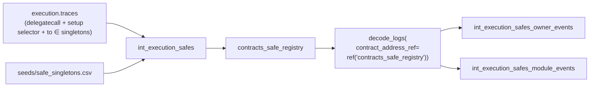
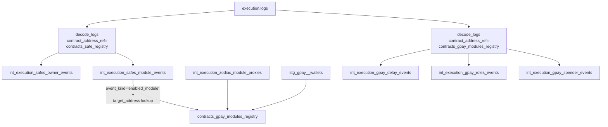

# Safe & Module Registry Pattern

A registry is a table (seed or model) that `decode_logs` / `decode_calls` consume via the `contract_address_ref` argument to answer two questions for every row in `execution.logs`:

1. **"Should this log be decoded at all?"** — does the log's emitter address appear in the registry?
2. **"Which ABI do I use to decode it?"** — pluck the `abi_source_address` column from the registry row and look up event signatures there.

This page explains the pattern, when to use it, and the two production registries we maintain: `contracts_safe_registry` (for Safe wallet events) and `contracts_gpay_modules_registry` (for Gnosis Pay module events). It assumes you've already read [Contract ABI Decoding](abi-decoding.md) — that page covers the `decode_logs` macro basics; this page goes deeper on the *registry* half specifically.

## When a registry is better than a flat whitelist

[`seeds/contracts_whitelist.csv`](abi-decoding.md) is the simplest discovery source: a flat list of `(address, contract_type)` rows. Good for a fixed set of same-shape contracts where each deployment has its own ABI — UniswapV3 pools, Balancer vaults, Aave aTokens. Every pool is its own contract, every pool's ABI sits at its own address in `seeds/event_signatures.csv`.

That breaks as soon as proxies enter the picture. A Safe is a minimal proxy whose bytecode is a `delegatecall` stub pointing to a mastercopy. Events are emitted *from* the proxy address, but the ABI lives *at* the mastercopy. You cannot register every Safe proxy with its own ABI — there are millions of them and the ABI is identical. The registry pattern solves this by decoupling the emitter from the ABI source:

| Column | What it means | Example (Safe) |
|---|---|---|
| `address` | The contract that emits the events we want to decode | `0x9c58bacc331c9aa871afd802db6379a98e80cedb` (a specific Safe proxy) |
| `contract_type` | A tag for filtering one registry across many models | `'SafeProxy'` |
| `abi_source_address` | Where `event_signatures.csv` has the matching ABI rows | `0x3e5c63644e683549055b9be8653de26e0b4cd36e` (Safe v1.3.0 L2 mastercopy) |
| `is_dynamic` | `1` if discovered from chain data, `0` if static seed | `1` |
| `start_blocktime` | Earliest block this address can emit events | Safe's creation time |
| `discovery_source` | Provenance tag for debugging | `'traces:safe_setup_delegatecall'` |

`decode_logs` detects the `abi_source_address` column at compile time via the dbt adapter API. When present, the JOIN to `event_signatures` uses `abi_source_address`; when absent (flat whitelist), it falls back to the `address` column itself. The same macro call shape works for both.

## Registry as a model, not a seed

Circles V2 uses a static seed (`contracts_circles_registry_static.csv`) because the Hub and NameRegistry addresses are known ahead of time. The Safe case is different: every Safe is a proxy discovered from chain data. You cannot seed millions of rows by hand, so the registry itself is a dbt model that reads from an upstream intermediate.



The registry model is a pure projection of `int_execution_safes`:

```sql
-- models/execution/safe/intermediate/contracts_safe_registry.sql
SELECT
    safe_address                      AS address,
    'SafeProxy'                       AS contract_type,
    creation_singleton                AS abi_source_address,
    toUInt8(1)                        AS is_dynamic,
    block_timestamp                   AS start_blocktime,
    'traces:safe_setup_delegatecall'  AS discovery_source
FROM {{ ref('int_execution_safes') }}
```

Every row has its `abi_source_address` set to the specific singleton the proxy was set up against — v1.3.0, v1.4.1, the Circles fork, etc. — so `decode_logs` picks up the correct event signature set for each Safe's version.

## DAG ordering and the compile-time introspection trap

`decode_logs` inspects the registry at **compile time** with `adapter.get_columns_in_relation(contract_address_ref)`. This call is wrapped in `` so dbt parse doesn't require the relation to exist — but `dbt run` does. The practical consequence:

> You must never run a model that calls `decode_logs(contract_address_ref=ref('...'))` in isolation before the referenced registry has been built at least once.

dbt's DAG normally handles this automatically — `ref('contracts_safe_registry')` creates a dependency, so a `dbt run --select int_execution_safes_owner_events+ -resource-type model` builds the registry first. The footgun is selective runs:

- ❌ `dbt run --select int_execution_safes_owner_events` on a fresh warehouse — fails because the registry doesn't exist yet
- ✅ `dbt run --select int_execution_safes+ contracts_safe_registry+` — DAG ordering guarantees the registry is built first
- ✅ `dbt run --select int_execution_safes contracts_safe_registry int_execution_safes_owner_events` — explicit, safe

This is why [the Safe backfill runbook](../../protocols/safe/index.md#backfill) always chains all three models together per monthly batch rather than running them one at a time.

## Two registries on one Safe universe

A single Safe proxy can appear in **two** different registries:

1. `contracts_safe_registry` — for decoding events emitted by the Safe itself (SafeSetup, AddedOwner, EnabledModule, ...). The `abi_source_address` is the Safe singleton.
2. `contracts_gpay_modules_registry` — for decoding events emitted by a Zodiac module proxy that is enabled on a GP Safe. The `abi_source_address` is the Zodiac Delay / Roles / Spender mastercopy.

These are different rows, in different tables, with different `abi_source_address` values. The Safe proxy address appears in the first registry; the *module* proxies attached to that Safe appear in the second registry. A single decode_logs call targeting `contracts_safe_registry` will only decode Safe-side events, and a second call targeting `contracts_gpay_modules_registry` will decode module-side events. Both share `execution.logs` as the source but filter on different emitter address sets.

This is what "two-layer decoding" looks like in practice:



Notice how `contracts_gpay_modules_registry` is *itself* populated from the output of the first decode_logs call: we decode the Safe's `EnabledModule` events, then cross-reference those module proxy addresses against the global Zodiac `ModuleProxyFactory` discovery, then filter to the three GP mastercopies. This cross-reference filter is what makes the registry high-quality: every row has evidence from both a Safe (which enabled it) and the factory (which deployed it against a known mastercopy).

## Cheat sheet — which registry for which situation

| Situation | Registry | `abi_source_address` points to |
|---|---|---|
| One contract, known address, no proxy | N/A — pass `contract_address='0x...'` to `decode_logs` | — |
| Many contracts, each with its own ABI | `seeds/contracts_whitelist.csv` (flat) | — (uses `address` directly) |
| Many proxies sharing a small set of mastercopies | Registry model with `abi_source_address` | Mastercopy / singleton |
| Factory-discovered children | `seeds/contracts_factory_registry.csv` + `resolve_factory_children` macro | Child's implementation address |
| Chain-discovered proxies (e.g. Safes) | dbt model, materialized as `table`, with `allow_nullable_key` | Derived per-row from the discovery source |

## Gotchas

- **Every column in the registry order key must be non-nullable, OR the table must set `allow_nullable_key: 1`.** The Safe registry inherits `Nullable(String)` from `execution.traces.action_from`, which broke the first build of `contracts_safe_registry` until we added the setting.
- **`address` and `abi_source_address` are compared after `lower(replaceAll(..., '0x', ''))` on the logs side.** Make sure the registry stores them in a form that survives that normalization. Lowercase with `0x` prefix is the house convention; the macro strips the `0x` at join time.
- **`decoded_params['key']` lookups depend on the ABI argument name verbatim.** The signature generator canonicalizes *types* (`uint` → `uint256`) but not argument names. If a contract is deployed with a renamed parameter compared to the canonical Zodiac source (e.g. `roleKeys` vs `roles`), the key lookup returns NULL. Always confirm the key names against a sample decoded row before shipping a downstream reshape model.
- **`contract_type` is a bare string match.** No regex, no case-insensitive. If you tag a row `'safeProxy'` and filter on `'SafeProxy'`, you get zero rows. Always lowercase or always PascalCase — pick one and enforce it.

## Related pages

- [Contract ABI Decoding](abi-decoding.md) — the foundation: how `decode_logs` / `decode_calls` work end-to-end, including the simpler static-address and flat-whitelist cases.
- [Safe Protocol](../../protocols/safe/index.md) — production user of this pattern.
- [Gnosis Pay Protocol](../../protocols/gnosis-pay/index.md) — the two-layer decoding case in full.
- [Privacy & Pseudonyms](privacy-pseudonyms.md) — the other half of the cross-domain story.
