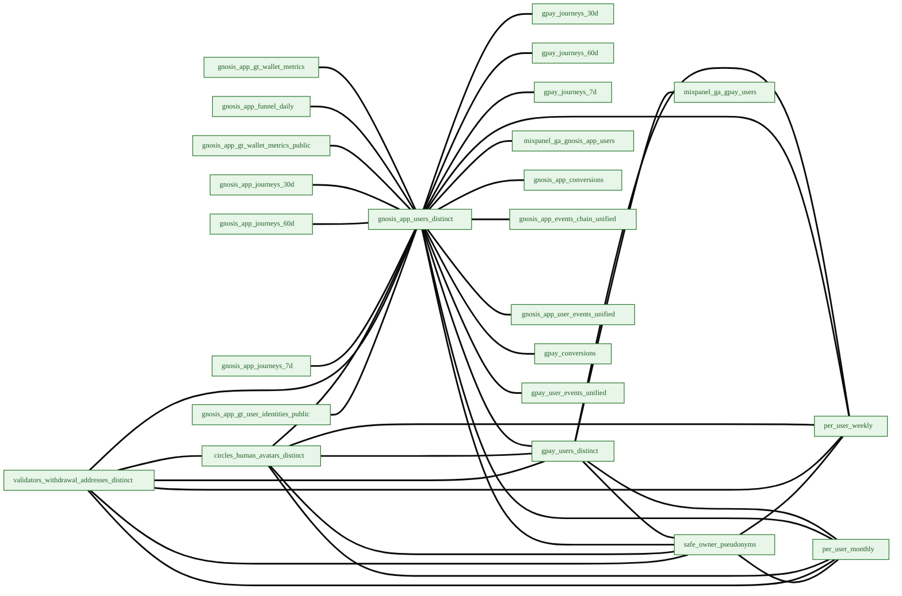

# Semantic Graph

Auto-generated by `scripts/semantic/generate_graph_diagram.py` (in dbt-cerebro) from `target/semantic_registry.json`. Do not edit the diagrams by hand — re-run the generator after `build_registry.py`. The interactive explorer below reads the companion `graph_data.json` sidecar, which docs CI refreshes from the published registry on every build; the static Mermaid diagrams are regenerated manually and reflect the registry as of the last full-page regeneration.

## Coverage at a glance

<!-- BEGIN AUTO-GENERATED: semantic-graph-coverage -->
- **Approved metrics**: 1383 / 1645 total
- **Cross-sector relationships**: 714 total across 13 axes
- **User-pseudonym graph nodes**: 24
- **Time-spine bridges**: 376 relationships joining sector marts to `dim_time_spine_*`
<!-- END AUTO-GENERATED: semantic-graph-coverage -->

## Unified semantic network

Every model that participates in at least one cross-sector relationship, grouped into module subgraphs. Edge style encodes the join axis:

- **===** (thick green) — `user_pseudonym` (cross-sector user overlap)
- **-.→** (dashed) — time-spine bridge (`day` / `week` / `month`)
- **— axis —** (gray) — other entity-specific joins (`circles_avatar`, `safe`, `address`, `validator`, ...)


Nodes show the metric count and dominant quality tier so the diagram doubles as a coverage map. Spine nodes are stadium-shaped; user-keyed marts are tinted green.

<div class="semantic-graph-explorer">
  <div class="sg-toolbar">
    <div class="sg-legend">
      <span class="sg-legend-item"><span class="sg-swatch sg-swatch--pseudo"></span>user_pseudonym</span>
      <span class="sg-legend-item"><span class="sg-swatch sg-swatch--spine"></span>time-spine</span>
      <span class="sg-legend-item"><span class="sg-swatch sg-swatch--other"></span>other axis</span>
    </div>
    <div class="sg-filters" id="semantic-graph-filters"></div>
    <button type="button" class="sg-reset" id="semantic-graph-reset">Reset view</button>
  </div>
  <div id="sg-canvas" data-src="/data-pipeline/transformation/semantic-layer/graph_data.json"></div>
  <p class="sg-hint" markdown="0">Drag to pan, scroll to zoom, click a node to focus its neighbourhood; click empty space to clear. Toggle sector chips to filter. If the interactive graph does not load, the static diagram below is available as a fallback.</p>
</div>

<details><summary>Static diagram (no-JavaScript fallback — regenerated manually; the interactive graph and coverage numbers above are refreshed by CI)</summary>

```mermaid
%%{init: {'theme':'base','flowchart':{'htmlLabels':true,'curve':'basis','nodeSpacing':40,'rankSpacing':80,'padding':10,'subGraphTitleMargin':{'top':6,'bottom':6}},'themeVariables':{'fontSize':'15px','fontFamily':'-apple-system,Segoe UI,Roboto,sans-serif'}}}%%
flowchart TB
    subgraph sg_ESG["ESG"]
        direction LR
        api_esg_carbon_emissions_daily["esg_carbon_emissions_daily<br/><small>5 metrics / approved</small>"]
        api_esg_carbon_timeseries_bands["esg_carbon_timeseries_bands<br/><small>8 metrics / approved</small>"]
        api_esg_cif_network_vs_countries_daily["esg_cif_network_vs_countries_daily<br/><small>1 metric / approved</small>"]
        api_esg_energy_monthly["esg_energy_monthly<br/><small>1 metric / approved</small>"]
        api_esg_estimated_nodes_daily["esg_estimated_nodes_daily<br/><small>4 metrics / approved</small>"]
        fct_esg_carbon_footprint_uncertainty["esg_carbon_footprint_uncertainty<br/><small>68 metrics / approved</small>"]
    end
    subgraph sg_bridges["bridges"]
        direction LR
        api_bridges_cum_netflow_weekly_by_bridge["bridges_cum_netflow_weekly_by_bridge<br/><small>1 metric / approved</small>"]
        api_bridges_sankey_gnosis_in_by_token_7d["bridges_sankey_gnosis_in_by_token_7d<br/><small>1 metric / approved</small>"]
        api_bridges_sankey_gnosis_in_ranges["bridges_sankey_gnosis_in_ranges<br/><small>1 metric / approved</small>"]
        api_bridges_sankey_gnosis_out_by_token_7d["bridges_sankey_gnosis_out_by_token_7d<br/><small>1 metric / approved</small>"]
        api_bridges_sankey_gnosis_out_ranges["bridges_sankey_gnosis_out_ranges<br/><small>1 metric / approved</small>"]
        api_bridges_token_netflow_daily_by_bridge["bridges_token_netflow_daily_by_bridge<br/><small>1 metric / approved</small>"]
        fct_bridges_kpis_snapshot["kpis_snapshot<br/><small>16 metrics / approved</small>"]
        fct_bridges_netflow_weekly_by_bridge["netflow_weekly_by_bridge<br/><small>2 metrics / approved</small>"]
        fct_bridges_sankey_edges_token_daily["sankey_edges_token_daily<br/><small>1 metric / approved</small>"]
        fct_bridges_token_netflow_daily_by_bridge["token_netflow_daily_by_bridge<br/><small>1 metric / approved</small>"]
    end
    subgraph sg_consensus["consensus"]
        direction LR
        api_consensus_attestations_daily["consensus_attestations_daily<br/><small>2 metrics / approved</small>"]
        api_consensus_attestations_performance_daily["consensus_attestations_performance_daily<br/><small>4 metrics / approved</small>"]
        api_consensus_blob_commitments_daily["consensus_blob_commitments_daily<br/><small>1 metric / approved</small>"]
        api_consensus_blocks_daily["consensus_blocks_daily<br/><small>1 metric / approved</small>"]
        api_consensus_credentials_daily["consensus_credentials_daily<br/><small>2 metrics / approved</small>"]
        api_consensus_deposits_withdrawls_cnt_daily["consensus_deposits_withdrawls_cnt_daily<br/><small>1 metric / approved</small>"]
        api_consensus_deposits_withdrawls_volume_daily["consensus_deposits_withdrawls_volume_daily<br/><small>1 metric / approved</small>"]
        api_consensus_entry_queue_daily["consensus_entry_queue_daily<br/><small>9 metrics / approved</small>"]
        api_consensus_graffiti_label_daily["consensus_graffiti_label_daily<br/><small>1 metric / approved</small>"]
        api_consensus_staked_daily["consensus_staked_daily<br/><small>1 metric / approved</small>"]
        api_consensus_validators_active_daily["consensus_validators_active_daily<br/><small>1 metric / approved</small>"]
        api_consensus_validators_apy_dist_daily["consensus_validators_apy_dist_daily<br/><small>8 metrics / approved</small>"]
        api_consensus_validators_apy_dist_last_30_days["consensus_validators_apy_dist_last_30_days<br/><small>7 metrics / approved</small>"]
        api_consensus_validators_balance_dist_last_30_days["consensus_validators_balance_dist_last_30_days<br/><small>7 metrics / approved</small>"]
        api_consensus_validators_balances_daily["consensus_validators_balances_daily<br/><small>1 metric / approved</small>"]
        api_consensus_validators_balances_dist_daily["consensus_validators_balances_dist_daily<br/><small>7 metrics / approved</small>"]
        api_consensus_validators_explorer_balance_dist["consensus_validators_explorer_balance_dist<br/><small>2 metrics / approved</small>"]
        api_consensus_validators_performance_daily["consensus_validators_performance_daily<br/><small>6 metrics / approved</small>"]
        api_consensus_validators_status_daily["consensus_validators_status_daily<br/><small>1 metric / approved</small>"]
        api_consensus_validators_status_latest["consensus_validators_status_latest<br/><small>2 metrics / approved</small>"]
        api_consensus_withdrawal_credentials_freq_daily["consensus_withdrawal_credentials_freq_daily<br/><small>1 metric / approved</small>"]
        api_consensus_zero_blob_commitments_daily["consensus_zero_blob_commitments_daily<br/><small>1 metric / approved</small>"]
        fct_consensus_attestations_performance_daily["attestations_performance_daily<br/><small>2 metrics / approved</small>"]
        fct_consensus_consolidations_daily["consolidations_daily<br/><small>1 metric / approved</small>"]
        fct_consensus_graffiti_cloud["graffiti_cloud<br/><small>1 metric / approved</small>"]
        fct_consensus_validators_apy_mean_daily["validators_apy_mean_daily<br/><small>2 metrics / approved</small>"]
        fct_consensus_validators_dists_last_30_days["validators_dists_last_30_days<br/><small>14 metrics / approved</small>"]
        fct_consensus_validators_explorer_daily["validators_explorer_daily<br/><small>4 metrics / approved</small>"]
        fct_consensus_validators_explorer_members_table["validators_explorer_members_table<br/><small>3 metrics / approved</small>"]
        fct_consensus_validators_income_total_daily["validators_income_total_daily<br/><small>5 metrics / approved</small>"]
        fct_consensus_validators_status_latest["validators_status_latest<br/><small>2 metrics / approved</small>"]
        fct_consensus_validators_withdrawal_addresses_distinct["validators_withdrawal_addresses_distinct<br/><small>2 metrics / approved</small>"]
        fct_consensus_withdrawal_credentials_freq_daily["withdrawal_credentials_freq_daily<br/><small>1 metric / approved</small>"]
    end
    subgraph sg_crawlers_data["crawlers_data"]
        direction LR
        api_crawlers_data_gno_supply_daily["crawlers_data_gno_supply_daily<br/><small>1 metric / approved</small>"]
    end
    subgraph sg_execution["execution"]
        direction LR
        api_execution_account_safes_latest["account_safes_latest<br/><small>1 metric / candidate</small>"]
        api_execution_circles_v2_active_minters_daily["circles_v2_active_minters_daily<br/><small>1 metric / approved</small>"]
        api_execution_circles_v2_active_trusts_cnt_latest["circles_v2_active_trusts_cnt_latest<br/><small>2 metrics / approved</small>"]
        api_execution_circles_v2_active_trusts_daily["circles_v2_active_trusts_daily<br/><small>3 metrics / approved</small>"]
        api_execution_circles_v2_backing_events_daily["circles_v2_backing_events_daily<br/><small>3 metrics / approved</small>"]
        api_execution_circles_v2_crc20_prices_daily["circles_v2_crc20_prices_daily<br/><small>7 metrics / approved</small>"]
        api_execution_circles_v2_economically_active_avatars_weekly["circles_v2_economically_active_avatars_weekly<br/><small>2 metrics / approved</small>"]
        api_execution_circles_v2_groups_overview_daily["circles_v2_groups_overview_daily<br/><small>4 metrics / approved</small>"]
        api_execution_circles_v2_hub_events_daily["circles_v2_hub_events_daily<br/><small>3 metrics / approved</small>"]
        api_execution_circles_v2_invite_funnel_cohort_monthly["circles_v2_invite_funnel_cohort_monthly<br/><small>12 metrics / approved</small>"]
        api_execution_circles_v2_kpi_active_minters_latest["circles_v2_kpi_active_minters_latest<br/><small>2 metrics / approved</small>"]
        api_execution_circles_v2_kpi_avg_members_per_group_latest["circles_v2_kpi_avg_members_per_group_latest<br/><small>3 metrics / approved</small>"]
        api_execution_circles_v2_kpi_avg_trusts_per_avatar_latest["circles_v2_kpi_avg_trusts_per_avatar_latest<br/><small>1 metric / approved</small>"]
        api_execution_circles_v2_kpi_depositors_in_backers_pct_latest["circles_v2_kpi_depositors_in_backers_pct_latest<br/><small>4 metrics / approved</small>"]
        api_execution_circles_v2_kpi_group_token_supply_latest["circles_v2_kpi_group_token_supply_latest<br/><small>2 metrics / approved</small>"]
        api_execution_circles_v2_kpi_group_wrapped_pct_latest["circles_v2_kpi_group_wrapped_pct_latest<br/><small>2 metrics / approved</small>"]
        api_execution_circles_v2_kpi_mints_7d["circles_v2_kpi_mints_7d<br/><small>3 metrics / approved</small>"]
        api_execution_circles_v2_kpi_new_backers_7d["circles_v2_kpi_new_backers_7d<br/><small>2 metrics / approved</small>"]
        api_execution_circles_v2_kpi_new_groups_7d["circles_v2_kpi_new_groups_7d<br/><small>2 metrics / approved</small>"]
        api_execution_circles_v2_kpi_new_trusts_7d["circles_v2_kpi_new_trusts_7d<br/><small>3 metrics / approved</small>"]
        api_execution_circles_v2_kpi_total_backers_latest["circles_v2_kpi_total_backers_latest<br/><small>2 metrics / approved</small>"]
        api_execution_circles_v2_kpi_total_depositors_latest["circles_v2_kpi_total_depositors_latest<br/><small>3 metrics / approved</small>"]
        api_execution_circles_v2_kpi_total_supply_latest["circles_v2_kpi_total_supply_latest<br/><small>2 metrics / approved</small>"]
        api_execution_circles_v2_minter_cohort_daily["circles_v2_minter_cohort_daily<br/><small>2 metrics / approved</small>"]
        api_execution_circles_v2_mints_daily["circles_v2_mints_daily<br/><small>3 metrics / approved</small>"]
        api_execution_circles_v2_p2p_velocity_daily["circles_v2_p2p_velocity_daily<br/><small>4 metrics / approved</small>"]
        api_execution_circles_v2_transfers_daily["circles_v2_transfers_daily<br/><small>5 metrics / approved</small>"]
        api_execution_circles_v2_trust_relations_current["circles_v2_trust_relations_current<br/><small>1 metric / approved</small>"]
        api_execution_circles_v2_trusts_daily["circles_v2_trusts_daily<br/><small>5 metrics / approved</small>"]
        api_execution_circles_v2_wrapper_share_daily["circles_v2_wrapper_share_daily<br/><small>3 metrics / approved</small>"]
        api_execution_cow_batch_metrics_ts["cow_batch_metrics_ts<br/><small>1 metric / approved</small>"]
        api_execution_cow_batch_routing_ts["cow_batch_routing_ts<br/><small>1 metric / approved</small>"]
        api_execution_cow_fees_ts["cow_fees_ts<br/><small>1 metric / approved</small>"]
        api_execution_cow_kpi_active_solvers["cow_kpi_active_solvers<br/><small>2 metrics / approved</small>"]
        api_execution_cow_kpi_fees_7d["cow_kpi_fees_7d<br/><small>2 metrics / approved</small>"]
        api_execution_cow_kpi_solver_value_7d["cow_kpi_solver_value_7d<br/><small>2 metrics / approved</small>"]
        api_execution_cow_kpi_traders_7d["cow_kpi_traders_7d<br/><small>2 metrics / approved</small>"]
        api_execution_cow_kpi_trades_7d["cow_kpi_trades_7d<br/><small>2 metrics / approved</small>"]
        api_execution_cow_kpi_volume_7d["cow_kpi_volume_7d<br/><small>2 metrics / approved</small>"]
        api_execution_cow_solver_value_ts["cow_solver_value_ts<br/><small>1 metric / approved</small>"]
        api_execution_cow_solvers_volume_ts["cow_solvers_volume_ts<br/><small>1 metric / approved</small>"]
        api_execution_cow_top_pairs_weekly["cow_top_pairs_weekly<br/><small>1 metric / approved</small>"]
        api_execution_cow_trades_ts["cow_trades_ts<br/><small>1 metric / approved</small>"]
        api_execution_cow_volume_ts["cow_volume_ts<br/><small>1 metric / approved</small>"]
        api_execution_gnosis_app_activity_by_action_daily["gnosis_app_activity_by_action_daily<br/><small>3 metrics / approved</small>"]
        api_execution_gnosis_app_circles_ecosystem_weekly_active_users["gnosis_app_circles_ecosystem_weekly_active_users<br/><small>1 metric / approved</small>"]
        api_execution_gnosis_app_gpay_topups_by_token_daily["gnosis_app_gpay_topups_by_token_daily<br/><small>5 metrics / approved</small>"]
        api_execution_gnosis_app_gpay_volume_daily["gnosis_app_gpay_volume_daily<br/><small>6 metrics / approved</small>"]
        api_execution_gnosis_app_gpay_wallets_daily["gnosis_app_gpay_wallets_daily<br/><small>2 metrics / approved</small>"]
        api_execution_gnosis_app_gt_wallet_metrics["gnosis_app_gt_wallet_metrics"]
        api_execution_gnosis_app_marketplace_buys_cumulative_daily["gnosis_app_marketplace_buys_cumulative_daily<br/><small>4 metrics / approved</small>"]
        api_execution_gnosis_app_marketplace_buys_daily["gnosis_app_marketplace_buys_daily<br/><small>3 metrics / approved</small>"]
        api_execution_gnosis_app_marketplace_offers_latest["gnosis_app_marketplace_offers_latest<br/><small>2 metrics / approved</small>"]
        api_execution_gnosis_app_swaps_daily["gnosis_app_swaps_daily<br/><small>8 metrics / approved</small>"]
        api_execution_gnosis_app_weekly_active_users["gnosis_app_weekly_active_users<br/><small>2 metrics / approved</small>"]
        api_execution_gpay_active_users_weekly["gpay_active_users_weekly<br/><small>1 metric / approved</small>"]
        api_execution_gpay_activity_by_action_daily["gpay_activity_by_action_daily<br/><small>3 metrics / approved</small>"]
        api_execution_gpay_activity_by_action_monthly["gpay_activity_by_action_monthly<br/><small>3 metrics / approved</small>"]
        api_execution_gpay_activity_by_action_weekly["gpay_activity_by_action_weekly<br/><small>3 metrics / approved</small>"]
        api_execution_gpay_balance_cohorts_holders_daily["gpay_balance_cohorts_holders_daily<br/><small>1 metric / approved</small>"]
        api_execution_gpay_balance_cohorts_value_daily["gpay_balance_cohorts_value_daily<br/><small>2 metrics / approved</small>"]
        api_execution_gpay_balances_by_token_daily["gpay_balances_by_token_daily<br/><small>1 metric / approved</small>"]
        api_execution_gpay_balances_native_daily["gpay_balances_native_daily<br/><small>1 metric / approved</small>"]
        api_execution_gpay_balances_usd_daily["gpay_balances_usd_daily<br/><small>1 metric / approved</small>"]
        api_execution_gpay_cashback_cohort_retention_users_monthly["gpay_cashback_cohort_retention_users_monthly<br/><small>1 metric / approved</small>"]
        api_execution_gpay_cashback_cumulative["gpay_cashback_cumulative<br/><small>1 metric / approved</small>"]
        api_execution_gpay_cashback_dist_weekly["gpay_cashback_dist_weekly<br/><small>8 metrics / approved</small>"]
        api_execution_gpay_cashback_impact_monthly["gpay_cashback_impact_monthly<br/><small>10 metrics / approved</small>"]
        api_execution_gpay_cashback_recipients_weekly["gpay_cashback_recipients_weekly<br/><small>1 metric / approved</small>"]
        api_execution_gpay_cashback_weekly["gpay_cashback_weekly<br/><small>1 metric / approved</small>"]
        api_execution_gpay_churn_monthly["gpay_churn_monthly<br/><small>7 metrics / approved</small>"]
        api_execution_gpay_churn_rates_monthly["gpay_churn_rates_monthly<br/><small>2 metrics / approved</small>"]
        api_execution_gpay_funded_addresses_daily["gpay_funded_addresses_daily<br/><small>1 metric / approved</small>"]
        api_execution_gpay_funded_addresses_monthly["gpay_funded_addresses_monthly<br/><small>1 metric / approved</small>"]
        api_execution_gpay_funded_addresses_weekly["gpay_funded_addresses_weekly<br/><small>1 metric / approved</small>"]
        api_execution_gpay_gno_balance_daily["gpay_gno_balance_daily<br/><small>1 metric / approved</small>"]
        api_execution_gpay_kpi_monthly["gpay_kpi_monthly<br/><small>17 metrics / approved</small>"]
        api_execution_gpay_owner_balances_by_token_daily["gpay_owner_balances_by_token_daily<br/><small>1 metric / approved</small>"]
        api_execution_gpay_payments_by_token_daily["gpay_payments_by_token_daily<br/><small>1 metric / approved</small>"]
        api_execution_gpay_payments_by_token_monthly["gpay_payments_by_token_monthly<br/><small>1 metric / approved</small>"]
        api_execution_gpay_payments_by_token_weekly["gpay_payments_by_token_weekly<br/><small>1 metric / approved</small>"]
        api_execution_gpay_retention_by_action_users_monthly["gpay_retention_by_action_users_monthly<br/><small>1 metric / approved</small>"]
        api_execution_gpay_retention_monthly["gpay_retention_monthly<br/><small>1 metric / approved</small>"]
        api_execution_gpay_retention_volume_monthly["gpay_retention_volume_monthly<br/><small>1 metric / approved</small>"]
        api_execution_gpay_user_activity["gpay_user_activity<br/><small>2 metrics / approved</small>"]
        api_execution_gpay_user_balances_daily["gpay_user_balances_daily<br/><small>2 metrics / approved</small>"]
        api_execution_gpay_user_cashback_daily["gpay_user_cashback_daily<br/><small>1 metric / approved</small>"]
        api_execution_gpay_user_lifetime_metrics["gpay_user_lifetime_metrics<br/><small>12 metrics / approved</small>"]
        api_execution_gpay_user_payments_daily["gpay_user_payments_daily<br/><small>1 metric / approved</small>"]
        api_execution_gpay_volume_payments_by_token_daily["gpay_volume_payments_by_token_daily<br/><small>1 metric / approved</small>"]
        api_execution_gpay_volume_payments_by_token_monthly["gpay_volume_payments_by_token_monthly<br/><small>1 metric / approved</small>"]
        api_execution_gpay_volume_payments_by_token_weekly["gpay_volume_payments_by_token_weekly<br/><small>1 metric / approved</small>"]
        api_execution_lending_balance_cohorts_holders_daily["lending_balance_cohorts_holders_daily<br/><small>2 metrics / approved</small>"]
        api_execution_lending_balance_cohorts_value_daily["lending_balance_cohorts_value_daily<br/><small>3 metrics / approved</small>"]
        api_execution_lending_daily["lending_daily<br/><small>1 metric / approved</small>"]
        api_execution_lending_top_lenders_latest["lending_top_lenders_latest<br/><small>5 metrics / approved</small>"]
        api_execution_pools_fee_apr_7d_daily["pools_fee_apr_7d_daily<br/><small>1 metric / approved</small>"]
        api_execution_pools_fees_usd_daily["pools_fees_usd_daily<br/><small>1 metric / approved</small>"]
        api_execution_pools_net_apr_daily["pools_net_apr_daily<br/><small>3 metrics / approved</small>"]
        api_execution_pools_swap_count_daily["pools_swap_count_daily<br/><small>1 metric / approved</small>"]
        api_execution_pools_tvl_daily["pools_tvl_daily<br/><small>1 metric / approved</small>"]
        api_execution_pools_volume_daily["pools_volume_daily<br/><small>1 metric / approved</small>"]
        api_execution_rwa_backedfi_prices_daily["rwa_backedfi_prices_daily<br/><small>1 metric / approved</small>"]
        api_execution_safe_details_latest["safe_details_latest<br/><small>2 metrics / approved</small>"]
        api_execution_tokens_active_senders_daily["tokens_active_senders_daily<br/><small>1 metric / approved</small>"]
        api_execution_tokens_balance_cohorts_holders_daily["tokens_balance_cohorts_holders_daily<br/><small>1 metric / approved</small>"]
        api_execution_tokens_balance_cohorts_value_daily["tokens_balance_cohorts_value_daily<br/><small>2 metrics / approved</small>"]
        api_execution_tokens_holders_daily["tokens_holders_daily<br/><small>1 metric / approved</small>"]
        api_execution_tokens_supply_daily["tokens_supply_daily<br/><small>1 metric / approved</small>"]
        api_execution_tokens_volume_daily["tokens_volume_daily<br/><small>2 metrics / approved</small>"]
        api_execution_transactions_active_accounts_by_project_monthly_top5["transactions_active_accounts_by_project_monthly_top5<br/><small>1 metric / approved</small>"]
        api_execution_transactions_active_accounts_by_sector_daily["transactions_active_accounts_by_sector_daily<br/><small>1 metric / approved</small>"]
        api_execution_transactions_active_accounts_by_sector_weekly["transactions_active_accounts_by_sector_weekly<br/><small>1 metric / approved</small>"]
        api_execution_transactions_active_accounts_daily["transactions_active_accounts_daily<br/><small>1 metric / approved</small>"]
        api_execution_transactions_by_project_monthly_top5["transactions_by_project_monthly_top5<br/><small>1 metric / approved</small>"]
        api_execution_transactions_by_sector_daily["transactions_by_sector_daily<br/><small>1 metric / approved</small>"]
        api_execution_transactions_by_sector_weekly["transactions_by_sector_weekly<br/><small>1 metric / approved</small>"]
        api_execution_transactions_cnt_daily["transactions_cnt_daily<br/><small>1 metric / approved</small>"]
        api_execution_transactions_fees_native_by_project_monthly_top5["transactions_fees_native_by_project_monthly_top5<br/><small>1 metric / approved</small>"]
        api_execution_transactions_fees_native_by_sector_daily["transactions_fees_native_by_sector_daily<br/><small>1 metric / approved</small>"]
        api_execution_transactions_fees_native_by_sector_weekly["transactions_fees_native_by_sector_weekly<br/><small>1 metric / approved</small>"]
        api_execution_transactions_gas_share_by_project_daily["transactions_gas_share_by_project_daily<br/><small>1 metric / approved</small>"]
        api_execution_transactions_gas_used_daily["transactions_gas_used_daily<br/><small>3 metrics / approved</small>"]
        api_execution_transactions_gas_used_weekly["transactions_gas_used_weekly<br/><small>1 metric / approved</small>"]
        api_execution_transactions_value_daily["transactions_value_daily<br/><small>3 metrics / approved</small>"]
        api_execution_yields_user_lending_balances_daily["yields_user_lending_balances_daily<br/><small>2 metrics / approved</small>"]
        api_execution_yields_user_lending_positions["yields_user_lending_positions<br/><small>2 metrics / approved</small>"]
        fct_execution_circles_human_avatars_distinct["circles_human_avatars_distinct<br/><small>2 metrics / approved</small>"]
        fct_execution_cow_daily["cow_daily<br/><small>9 metrics / approved</small>"]
        fct_execution_cow_solvers_daily["cow_solvers_daily<br/><small>5 metrics / approved</small>"]
        fct_execution_cow_trades["cow_trades<br/><small>3 metrics / approved</small>"]
        fct_execution_gnosis_app_activity_by_action_monthly["gnosis_app_activity_by_action_monthly<br/><small>3 metrics / approved</small>"]
        fct_execution_gnosis_app_activity_by_action_weekly["gnosis_app_activity_by_action_weekly<br/><small>3 metrics / approved</small>"]
        fct_execution_gnosis_app_churn_monthly["gnosis_app_churn_monthly<br/><small>7 metrics / approved</small>"]
        fct_execution_gnosis_app_funnel_daily["gnosis_app_funnel_daily<br/><small>2 metrics / approved</small>"]
        fct_execution_gnosis_app_gpay_topups_cohort_monthly["gnosis_app_gpay_topups_cohort_monthly<br/><small>6 metrics / approved</small>"]
        fct_execution_gnosis_app_gpay_topups_monthly["gnosis_app_gpay_topups_monthly<br/><small>4 metrics / approved</small>"]
        fct_execution_gnosis_app_gpay_topups_weekly["gnosis_app_gpay_topups_weekly<br/><small>4 metrics / approved</small>"]
        fct_execution_gnosis_app_gt_cashback_nft["gnosis_app_gt_cashback_nft<br/><small>2 metrics / approved</small>"]
        fct_execution_gnosis_app_gt_user_identities_public["gnosis_app_gt_user_identities_public<br/><small>8 metrics / approved</small>"]
        fct_execution_gnosis_app_gt_wallet_metrics_public["gnosis_app_gt_wallet_metrics_public"]
        fct_execution_gnosis_app_journeys_30d["gnosis_app_journeys_30d"]
        fct_execution_gnosis_app_journeys_60d["gnosis_app_journeys_60d"]
        fct_execution_gnosis_app_journeys_7d["gnosis_app_journeys_7d"]
        fct_execution_gnosis_app_retention_by_action_monthly["gnosis_app_retention_by_action_monthly<br/><small>4 metrics / approved</small>"]
        fct_execution_gnosis_app_retention_monthly["gnosis_app_retention_monthly<br/><small>6 metrics / approved</small>"]
        fct_execution_gnosis_app_swaps_by_pair_daily["gnosis_app_swaps_by_pair_daily<br/><small>4 metrics / approved</small>"]
        fct_execution_gnosis_app_swaps_by_solver_daily["gnosis_app_swaps_by_solver_daily<br/><small>3 metrics / approved</small>"]
        fct_execution_gnosis_app_swaps_monthly["gnosis_app_swaps_monthly<br/><small>6 metrics / approved</small>"]
        fct_execution_gnosis_app_swaps_weekly["gnosis_app_swaps_weekly<br/><small>6 metrics / approved</small>"]
        fct_execution_gnosis_app_token_offer_claims_by_offer_daily["gnosis_app_token_offer_claims_by_offer_daily<br/><small>6 metrics / approved</small>"]
        fct_execution_gnosis_app_token_offer_claims_cohort_monthly["gnosis_app_token_offer_claims_cohort_monthly<br/><small>6 metrics / approved</small>"]
        fct_execution_gnosis_app_token_offer_claims_daily["gnosis_app_token_offer_claims_daily<br/><small>6 metrics / approved</small>"]
        fct_execution_gnosis_app_token_offer_claims_monthly["gnosis_app_token_offer_claims_monthly<br/><small>6 metrics / approved</small>"]
        fct_execution_gnosis_app_token_offer_claims_weekly["gnosis_app_token_offer_claims_weekly<br/><small>6 metrics / approved</small>"]
        fct_execution_gnosis_app_users_daily["gnosis_app_users_daily<br/><small>5 metrics / approved</small>"]
        fct_execution_gnosis_app_users_distinct["gnosis_app_users_distinct<br/><small>2 metrics / approved</small>"]
        fct_execution_gnosis_app_users_monthly["gnosis_app_users_monthly<br/><small>5 metrics / approved</small>"]
        fct_execution_gnosis_app_users_weekly["gnosis_app_users_weekly<br/><small>5 metrics / approved</small>"]
        fct_execution_gnosis_app_weekly_active_users_circles_ecosystem["gnosis_app_weekly_active_users_circles_ecosystem<br/><small>1 metric / approved</small>"]
        fct_execution_gnosis_app_weekly_economically_active_users["gnosis_app_weekly_economically_active_users<br/><small>1 metric / approved</small>"]
        fct_execution_gpay_actions_by_token_daily["gpay_actions_by_token_daily<br/><small>6 metrics / approved</small>"]
        fct_execution_gpay_actions_by_token_monthly["gpay_actions_by_token_monthly<br/><small>6 metrics / approved</small>"]
        fct_execution_gpay_actions_by_token_weekly["gpay_actions_by_token_weekly<br/><small>6 metrics / approved</small>"]
        fct_execution_gpay_activity_daily["gpay_activity_daily<br/><small>5 metrics / approved</small>"]
        fct_execution_gpay_activity_monthly["gpay_activity_monthly<br/><small>5 metrics / approved</small>"]
        fct_execution_gpay_activity_weekly["gpay_activity_weekly<br/><small>5 metrics / approved</small>"]
        fct_execution_gpay_balance_cohorts_daily["gpay_balance_cohorts_daily<br/><small>3 metrics / approved</small>"]
        fct_execution_gpay_cashback_cohort_retention_monthly["gpay_cashback_cohort_retention_monthly<br/><small>5 metrics / approved</small>"]
        fct_execution_gpay_cashback_impact_monthly["gpay_cashback_impact_monthly<br/><small>10 metrics / approved</small>"]
        fct_execution_gpay_cashback_recipients_weekly["gpay_cashback_recipients_weekly<br/><small>1 metric / approved</small>"]
        fct_execution_gpay_churn_monthly["gpay_churn_monthly<br/><small>7 metrics / approved</small>"]
        fct_execution_gpay_journeys_30d["gpay_journeys_30d"]
        fct_execution_gpay_journeys_60d["gpay_journeys_60d"]
        fct_execution_gpay_journeys_7d["gpay_journeys_7d"]
        fct_execution_gpay_kpi_monthly["gpay_kpi_monthly<br/><small>17 metrics / approved</small>"]
        fct_execution_gpay_retention_by_action_monthly["gpay_retention_by_action_monthly<br/><small>5 metrics / approved</small>"]
        fct_execution_gpay_retention_monthly["gpay_retention_monthly<br/><small>5 metrics / approved</small>"]
        fct_execution_gpay_users_distinct["gpay_users_distinct<br/><small>2 metrics / approved</small>"]
        fct_execution_lending_weekly["lending_weekly<br/><small>4 metrics / approved</small>"]
        fct_execution_mmm_spine_weekly["mmm_spine_weekly<br/><small>25 metrics / approved</small>"]
        fct_execution_network_retention_monthly["network_retention_monthly<br/><small>6 metrics / approved</small>"]
        fct_execution_pools_daily["pools_daily<br/><small>7 metrics / approved</small>"]
        fct_execution_pools_il_daily["pools_il_daily<br/><small>1 metric / approved</small>"]
        fct_execution_rwa_backedfi_prices_daily["rwa_backedfi_prices_daily<br/><small>1 metric / approved</small>"]
        fct_execution_safe_owner_pseudonyms["safe_owner_pseudonyms<br/><small>3 metrics / approved</small>"]
        fct_execution_state_full_size_daily["state_full_size_daily<br/><small>1 metric / approved</small>"]
        fct_execution_trades_by_aggregator_daily["trades_by_aggregator_daily<br/><small>1 metric / approved</small>"]
        fct_execution_trades_by_protocol_daily["trades_by_protocol_daily<br/><small>1 metric / approved</small>"]
        fct_execution_trades_by_token_daily["trades_by_token_daily<br/><small>5 metrics / approved</small>"]
        fct_ubo_supply_claims_resolved_daily["ubo_supply_claims_resolved_daily<br/><small>2 metrics / approved</small>"]
        fct_yields_savings_xdai_apy_daily["yields_savings_xdai_apy_daily<br/><small>1 metric / approved</small>"]
        fct_yields_sdai_apy_daily["yields_sdai_apy_daily<br/><small>1 metric / approved</small>"]
    end
    subgraph sg_mixpanel_ga["mixpanel_ga"]
        direction LR
        api_mixpanel_ga_client_conversions_weekly["mixpanel_ga_client_conversions_weekly<br/><small>2 metrics / approved</small>"]
        api_mixpanel_ga_events_daily["mixpanel_ga_events_daily<br/><small>3 metrics / approved</small>"]
        api_mixpanel_ga_funnel_daily["mixpanel_ga_funnel_daily<br/><small>10 metrics / approved</small>"]
        api_mixpanel_ga_geo_daily["mixpanel_ga_geo_daily<br/><small>2 metrics / approved</small>"]
        api_mixpanel_ga_modals_daily["mixpanel_ga_modals_daily<br/><small>3 metrics / approved</small>"]
        api_mixpanel_ga_overview_daily["mixpanel_ga_overview_daily<br/><small>6 metrics / approved</small>"]
        api_mixpanel_ga_pages_daily["mixpanel_ga_pages_daily<br/><small>2 metrics / approved</small>"]
        api_mixpanel_ga_tech_daily["mixpanel_ga_tech_daily<br/><small>2 metrics / approved</small>"]
        api_mixpanel_ga_traffic_daily["mixpanel_ga_traffic_daily<br/><small>2 metrics / approved</small>"]
        api_mixpanel_ga_usage_patterns_daily["mixpanel_ga_usage_patterns_daily<br/><small>2 metrics / approved</small>"]
        fct_mixpanel_ga_gnosis_app_users["mixpanel_ga_gnosis_app_users<br/><small>2 metrics / approved</small>"]
        fct_mixpanel_ga_gpay_users["mixpanel_ga_gpay_users<br/><small>2 metrics / approved</small>"]
    end
    subgraph sg_p2p["p2p"]
        direction LR
        api_p2p_clients_latest["p2p_clients_latest<br/><small>4 metrics / approved</small>"]
        api_p2p_discv4_clients_daily["p2p_discv4_clients_daily<br/><small>1 metric / approved</small>"]
        api_p2p_discv5_clients_daily["p2p_discv5_clients_daily<br/><small>1 metric / approved</small>"]
        api_p2p_discv5_current_fork_daily["p2p_discv5_current_fork_daily<br/><small>1 metric / approved</small>"]
        api_p2p_discv5_next_fork_daily["p2p_discv5_next_fork_daily<br/><small>1 metric / approved</small>"]
        api_p2p_topology_latest["p2p_topology_latest<br/><small>1 metric / approved</small>"]
        api_p2p_visits_latest["p2p_visits_latest<br/><small>8 metrics / approved</small>"]
        fct_p2p_discv5_forks_daily["p2p_discv5_forks_daily<br/><small>1 metric / approved</small>"]
    end
    subgraph sg_probelab["probelab"]
        direction LR
        api_probelab_clients_cloud_daily["probelab_clients_cloud_daily<br/><small>1 metric / approved</small>"]
        api_probelab_clients_country_daily["probelab_clients_country_daily<br/><small>1 metric / approved</small>"]
        api_probelab_clients_daily["probelab_clients_daily<br/><small>1 metric / approved</small>"]
        api_probelab_clients_quic_daily["probelab_clients_quic_daily<br/><small>1 metric / approved</small>"]
        api_probelab_clients_version_daily["probelab_clients_version_daily<br/><small>1 metric / approved</small>"]
    end
    subgraph sg_quarterly_data["quarterly_data"]
        direction LR
        api_quarterly_data_carbon_emissions["quarterly_data_carbon_emissions<br/><small>1 metric / approved</small>"]
        api_quarterly_data_circles_active_trusts["quarterly_data_circles_active_trusts<br/><small>1 metric / approved</small>"]
        api_quarterly_data_circles_humans["quarterly_data_circles_humans<br/><small>1 metric / approved</small>"]
        api_quarterly_data_circles_total_supply["quarterly_data_circles_total_supply<br/><small>1 metric / approved</small>"]
        api_quarterly_data_energy_consumption["quarterly_data_energy_consumption<br/><small>1 metric / approved</small>"]
        api_quarterly_data_gnosis_app_peak_swappers["quarterly_data_gnosis_app_peak_swappers<br/><small>1 metric / approved</small>"]
        api_quarterly_data_gnosis_app_swaps["quarterly_data_gnosis_app_swaps<br/><small>1 metric / approved</small>"]
        api_quarterly_data_gnosis_app_swaps_filled["quarterly_data_gnosis_app_swaps_filled<br/><small>1 metric / approved</small>"]
        api_quarterly_data_gpay_active_users["quarterly_data_gpay_active_users<br/><small>2 metrics / approved</small>"]
        api_quarterly_data_nodes_estimated["quarterly_data_nodes_estimated<br/><small>3 metrics / approved</small>"]
        api_quarterly_data_nodes_observed["quarterly_data_nodes_observed<br/><small>1 metric / approved</small>"]
        api_quarterly_data_stablecoin_holder_cohorts["quarterly_data_stablecoin_holder_cohorts<br/><small>9 metrics / approved</small>"]
        api_quarterly_data_stablecoin_holders["quarterly_data_stablecoin_holders<br/><small>4 metrics / approved</small>"]
        api_quarterly_data_stablecoin_supply["quarterly_data_stablecoin_supply<br/><small>4 metrics / approved</small>"]
        api_quarterly_data_stablecoin_transfers["quarterly_data_stablecoin_transfers<br/><small>1 metric / approved</small>"]
        api_quarterly_data_staked_gno["quarterly_data_staked_gno<br/><small>1 metric / approved</small>"]
        api_quarterly_data_transactions_count["quarterly_data_transactions_count<br/><small>1 metric / approved</small>"]
    end
    subgraph sg_revenue["revenue"]
        direction LR
        api_revenue_active_users_cohorts_monthly["revenue_active_users_cohorts_monthly<br/><small>2 metrics / candidate</small>"]
        api_revenue_active_users_cohorts_weekly["revenue_active_users_cohorts_weekly<br/><small>2 metrics / candidate</small>"]
        api_revenue_active_users_totals_monthly["revenue_active_users_totals_monthly<br/><small>2 metrics / approved</small>"]
        api_revenue_active_users_totals_weekly["revenue_active_users_totals_weekly<br/><small>2 metrics / approved</small>"]
        api_revenue_gpay_cohorts_monthly["revenue_gpay_cohorts_monthly<br/><small>2 metrics / candidate</small>"]
        api_revenue_gpay_cohorts_weekly["revenue_gpay_cohorts_weekly<br/><small>2 metrics / approved</small>"]
        api_revenue_holdings_cohorts_monthly["revenue_holdings_cohorts_monthly<br/><small>2 metrics / candidate</small>"]
        api_revenue_holdings_cohorts_weekly["revenue_holdings_cohorts_weekly<br/><small>2 metrics / approved</small>"]
        api_revenue_per_user_monthly["revenue_per_user_monthly<br/><small>2 metrics / approved</small>"]
        api_revenue_per_user_weekly["revenue_per_user_weekly<br/><small>2 metrics / approved</small>"]
        api_revenue_sdai_cohorts_monthly["revenue_sdai_cohorts_monthly<br/><small>2 metrics / candidate</small>"]
        api_revenue_sdai_cohorts_weekly["revenue_sdai_cohorts_weekly<br/><small>2 metrics / approved</small>"]
        fct_revenue_per_user_monthly["per_user_monthly<br/><small>3 metrics / approved</small>"]
        fct_revenue_per_user_weekly["per_user_weekly<br/><small>3 metrics / approved</small>"]
    end
    subgraph sg_shared["shared"]
        direction LR
        dim_time_spine_daily(["time_spine_daily"])
        dim_time_spine_monthly(["time_spine_monthly"])
        dim_time_spine_weekly(["time_spine_weekly"])
    end
    api_execution_gnosis_app_gt_wallet_metrics === fct_execution_gnosis_app_users_distinct
    fct_consensus_validators_withdrawal_addresses_distinct === fct_execution_circles_human_avatars_distinct
    fct_consensus_validators_withdrawal_addresses_distinct === fct_execution_gnosis_app_users_distinct
    fct_consensus_validators_withdrawal_addresses_distinct === fct_execution_gpay_users_distinct
    fct_consensus_validators_withdrawal_addresses_distinct === fct_execution_safe_owner_pseudonyms
    fct_consensus_validators_withdrawal_addresses_distinct === fct_revenue_per_user_monthly
    fct_consensus_validators_withdrawal_addresses_distinct === fct_revenue_per_user_weekly
    fct_execution_circles_human_avatars_distinct === fct_execution_gnosis_app_users_distinct
    fct_execution_circles_human_avatars_distinct === fct_execution_gpay_users_distinct
    fct_execution_circles_human_avatars_distinct === fct_execution_safe_owner_pseudonyms
    fct_execution_circles_human_avatars_distinct === fct_revenue_per_user_monthly
    fct_execution_circles_human_avatars_distinct === fct_revenue_per_user_weekly
    fct_execution_gnosis_app_funnel_daily === fct_execution_gnosis_app_users_distinct
    fct_execution_gnosis_app_gt_user_identities_public === fct_execution_gnosis_app_users_distinct
    fct_execution_gnosis_app_gt_wallet_metrics_public === fct_execution_gnosis_app_users_distinct
    fct_execution_gnosis_app_journeys_30d === fct_execution_gnosis_app_users_distinct
    fct_execution_gnosis_app_journeys_60d === fct_execution_gnosis_app_users_distinct
    fct_execution_gnosis_app_journeys_7d === fct_execution_gnosis_app_users_distinct
    fct_execution_gnosis_app_users_distinct === fct_execution_gpay_journeys_30d
    fct_execution_gnosis_app_users_distinct === fct_execution_gpay_journeys_60d
    fct_execution_gnosis_app_users_distinct === fct_execution_gpay_journeys_7d
    fct_execution_gnosis_app_users_distinct === fct_execution_gpay_users_distinct
    fct_execution_gnosis_app_users_distinct === fct_execution_safe_owner_pseudonyms
    fct_execution_gnosis_app_users_distinct === fct_mixpanel_ga_gnosis_app_users
    fct_execution_gnosis_app_users_distinct === fct_revenue_per_user_monthly
    fct_execution_gnosis_app_users_distinct === fct_revenue_per_user_weekly
    fct_execution_gpay_users_distinct === fct_execution_safe_owner_pseudonyms
    fct_execution_gpay_users_distinct === fct_mixpanel_ga_gpay_users
    fct_execution_gpay_users_distinct === fct_revenue_per_user_monthly
    fct_execution_gpay_users_distinct === fct_revenue_per_user_weekly
    fct_execution_safe_owner_pseudonyms === fct_revenue_per_user_monthly
    fct_execution_safe_owner_pseudonyms === fct_revenue_per_user_weekly
    api_bridges_cum_netflow_weekly_by_bridge -. day .-> dim_time_spine_daily
    api_bridges_sankey_gnosis_in_by_token_7d -. day .-> dim_time_spine_daily
    api_bridges_sankey_gnosis_in_ranges -. day .-> dim_time_spine_daily
    api_bridges_sankey_gnosis_out_by_token_7d -. day .-> dim_time_spine_daily
    api_bridges_sankey_gnosis_out_ranges -. day .-> dim_time_spine_daily
    api_bridges_token_netflow_daily_by_bridge -. day .-> dim_time_spine_daily
    api_consensus_attestations_daily -. day .-> dim_time_spine_daily
    api_consensus_attestations_performance_daily -. day .-> dim_time_spine_daily
    api_consensus_blob_commitments_daily -. day .-> dim_time_spine_daily
    api_consensus_blocks_daily -. day .-> dim_time_spine_daily
    api_consensus_credentials_daily -. day .-> dim_time_spine_daily
    api_consensus_deposits_withdrawls_cnt_daily -. day .-> dim_time_spine_daily
    api_consensus_deposits_withdrawls_volume_daily -. day .-> dim_time_spine_daily
    api_consensus_entry_queue_daily -. day .-> dim_time_spine_daily
    api_consensus_graffiti_label_daily -. day .-> dim_time_spine_daily
    api_consensus_staked_daily -. day .-> dim_time_spine_daily
    api_consensus_validators_active_daily -. day .-> dim_time_spine_daily
    api_consensus_validators_apy_dist_daily -. day .-> dim_time_spine_daily
    api_consensus_validators_apy_dist_last_30_days -. day .-> dim_time_spine_daily
    api_consensus_validators_balance_dist_last_30_days -. day .-> dim_time_spine_daily
    api_consensus_validators_balances_daily -. day .-> dim_time_spine_daily
    api_consensus_validators_balances_dist_daily -. day .-> dim_time_spine_daily
    api_consensus_validators_explorer_balance_dist -. day .-> dim_time_spine_daily
    api_consensus_validators_performance_daily -. day .-> dim_time_spine_daily
    api_consensus_validators_status_daily -. day .-> dim_time_spine_daily
    api_consensus_validators_status_latest -. day .-> dim_time_spine_daily
    api_consensus_withdrawal_credentials_freq_daily -. day .-> dim_time_spine_daily
    api_consensus_zero_blob_commitments_daily -. day .-> dim_time_spine_daily
    api_crawlers_data_gno_supply_daily -. day .-> dim_time_spine_daily
    api_esg_carbon_emissions_daily -. day .-> dim_time_spine_daily
    api_esg_carbon_timeseries_bands -. day .-> dim_time_spine_daily
    api_esg_cif_network_vs_countries_daily -. day .-> dim_time_spine_daily
    api_esg_energy_monthly -. day .-> dim_time_spine_daily
    api_esg_estimated_nodes_daily -. day .-> dim_time_spine_daily
    api_execution_circles_v2_active_minters_daily -. day .-> dim_time_spine_daily
    api_execution_circles_v2_active_trusts_cnt_latest -. day .-> dim_time_spine_daily
    api_execution_circles_v2_active_trusts_daily -. day .-> dim_time_spine_daily
    api_execution_circles_v2_backing_events_daily -. day .-> dim_time_spine_daily
    api_execution_circles_v2_crc20_prices_daily -. day .-> dim_time_spine_daily
    api_execution_circles_v2_groups_overview_daily -. day .-> dim_time_spine_daily
    api_execution_circles_v2_hub_events_daily -. day .-> dim_time_spine_daily
    api_execution_circles_v2_kpi_active_minters_latest -. day .-> dim_time_spine_daily
    api_execution_circles_v2_kpi_avg_members_per_group_latest -. day .-> dim_time_spine_daily
    api_execution_circles_v2_kpi_avg_trusts_per_avatar_latest -. day .-> dim_time_spine_daily
    api_execution_circles_v2_kpi_depositors_in_backers_pct_latest -. day .-> dim_time_spine_daily
    api_execution_circles_v2_kpi_group_token_supply_latest -. day .-> dim_time_spine_daily
    api_execution_circles_v2_kpi_group_wrapped_pct_latest -. day .-> dim_time_spine_daily
    api_execution_circles_v2_kpi_mints_7d -. day .-> dim_time_spine_daily
    api_execution_circles_v2_kpi_new_backers_7d -. day .-> dim_time_spine_daily
    api_execution_circles_v2_kpi_new_groups_7d -. day .-> dim_time_spine_daily
    api_execution_circles_v2_kpi_new_trusts_7d -. day .-> dim_time_spine_daily
    api_execution_circles_v2_kpi_total_backers_latest -. day .-> dim_time_spine_daily
    api_execution_circles_v2_kpi_total_depositors_latest -. day .-> dim_time_spine_daily
    api_execution_circles_v2_kpi_total_supply_latest -. day .-> dim_time_spine_daily
    api_execution_circles_v2_minter_cohort_daily -. day .-> dim_time_spine_daily
    api_execution_circles_v2_mints_daily -. day .-> dim_time_spine_daily
    api_execution_circles_v2_p2p_velocity_daily -. day .-> dim_time_spine_daily
    api_execution_circles_v2_transfers_daily -. day .-> dim_time_spine_daily
    api_execution_circles_v2_trust_relations_current -. day .-> dim_time_spine_daily
    api_execution_circles_v2_trusts_daily -. day .-> dim_time_spine_daily
    api_execution_circles_v2_wrapper_share_daily -. day .-> dim_time_spine_daily
    api_execution_cow_batch_metrics_ts -. day .-> dim_time_spine_daily
    api_execution_cow_batch_routing_ts -. day .-> dim_time_spine_daily
    api_execution_cow_fees_ts -. day .-> dim_time_spine_daily
    api_execution_cow_kpi_active_solvers -. day .-> dim_time_spine_daily
    api_execution_cow_kpi_fees_7d -. day .-> dim_time_spine_daily
    api_execution_cow_kpi_solver_value_7d -. day .-> dim_time_spine_daily
    api_execution_cow_kpi_traders_7d -. day .-> dim_time_spine_daily
    api_execution_cow_kpi_trades_7d -. day .-> dim_time_spine_daily
    api_execution_cow_kpi_volume_7d -. day .-> dim_time_spine_daily
    api_execution_cow_solver_value_ts -. day .-> dim_time_spine_daily
    api_execution_cow_solvers_volume_ts -. day .-> dim_time_spine_daily
    api_execution_cow_trades_ts -. day .-> dim_time_spine_daily
    api_execution_cow_volume_ts -. day .-> dim_time_spine_daily
    api_execution_gnosis_app_activity_by_action_daily -. day .-> dim_time_spine_daily
    api_execution_gnosis_app_gpay_topups_by_token_daily -. day .-> dim_time_spine_daily
    api_execution_gnosis_app_gpay_volume_daily -. day .-> dim_time_spine_daily
    api_execution_gnosis_app_gpay_wallets_daily -. day .-> dim_time_spine_daily
    api_execution_gnosis_app_marketplace_buys_cumulative_daily -. day .-> dim_time_spine_daily
    api_execution_gnosis_app_marketplace_buys_daily -. day .-> dim_time_spine_daily
    api_execution_gnosis_app_marketplace_offers_latest -. day .-> dim_time_spine_daily
    api_execution_gnosis_app_swaps_daily -. day .-> dim_time_spine_daily
    api_execution_gpay_active_users_weekly -. day .-> dim_time_spine_daily
    api_execution_gpay_activity_by_action_daily -. day .-> dim_time_spine_daily
    api_execution_gpay_balance_cohorts_holders_daily -. day .-> dim_time_spine_daily
    api_execution_gpay_balance_cohorts_value_daily -. day .-> dim_time_spine_daily
    api_execution_gpay_balances_by_token_daily -. day .-> dim_time_spine_daily
    api_execution_gpay_balances_native_daily -. day .-> dim_time_spine_daily
    api_execution_gpay_balances_usd_daily -. day .-> dim_time_spine_daily
    api_execution_gpay_cashback_cohort_retention_users_monthly -. day .-> dim_time_spine_daily
    api_execution_gpay_cashback_cumulative -. day .-> dim_time_spine_daily
    api_execution_gpay_cashback_dist_weekly -. day .-> dim_time_spine_daily
    api_execution_gpay_cashback_recipients_weekly -. day .-> dim_time_spine_daily
    api_execution_gpay_cashback_weekly -. day .-> dim_time_spine_daily
    api_execution_gpay_funded_addresses_daily -. day .-> dim_time_spine_daily
    api_execution_gpay_funded_addresses_monthly -. day .-> dim_time_spine_daily
    api_execution_gpay_funded_addresses_weekly -. day .-> dim_time_spine_daily
    api_execution_gpay_gno_balance_daily -. day .-> dim_time_spine_daily
    api_execution_gpay_owner_balances_by_token_daily -. day .-> dim_time_spine_daily
    api_execution_gpay_payments_by_token_daily -. day .-> dim_time_spine_daily
    api_execution_gpay_payments_by_token_monthly -. day .-> dim_time_spine_daily
    api_execution_gpay_payments_by_token_weekly -. day .-> dim_time_spine_daily
    api_execution_gpay_retention_by_action_users_monthly -. day .-> dim_time_spine_daily
    api_execution_gpay_retention_monthly -. day .-> dim_time_spine_daily
    api_execution_gpay_retention_volume_monthly -. day .-> dim_time_spine_daily
    api_execution_gpay_user_activity -. day .-> dim_time_spine_daily
    api_execution_gpay_user_balances_daily -. day .-> dim_time_spine_daily
    api_execution_gpay_user_cashback_daily -. day .-> dim_time_spine_daily
    api_execution_gpay_user_lifetime_metrics -. day .-> dim_time_spine_daily
    api_execution_gpay_user_payments_daily -. day .-> dim_time_spine_daily
    api_execution_gpay_volume_payments_by_token_daily -. day .-> dim_time_spine_daily
    api_execution_gpay_volume_payments_by_token_monthly -. day .-> dim_time_spine_daily
    api_execution_gpay_volume_payments_by_token_weekly -. day .-> dim_time_spine_daily
    api_execution_lending_balance_cohorts_holders_daily -. day .-> dim_time_spine_daily
    api_execution_lending_balance_cohorts_value_daily -. day .-> dim_time_spine_daily
    api_execution_lending_daily -. day .-> dim_time_spine_daily
    api_execution_lending_top_lenders_latest -. day .-> dim_time_spine_daily
    api_execution_pools_fee_apr_7d_daily -. day .-> dim_time_spine_daily
    api_execution_pools_fees_usd_daily -. day .-> dim_time_spine_daily
    api_execution_pools_net_apr_daily -. day .-> dim_time_spine_daily
    api_execution_pools_swap_count_daily -. day .-> dim_time_spine_daily
    api_execution_pools_tvl_daily -. day .-> dim_time_spine_daily
    api_execution_pools_volume_daily -. day .-> dim_time_spine_daily
    api_execution_rwa_backedfi_prices_daily -. day .-> dim_time_spine_daily
    api_execution_safe_details_latest -. day .-> dim_time_spine_daily
    api_execution_tokens_active_senders_daily -. day .-> dim_time_spine_daily
    api_execution_tokens_balance_cohorts_holders_daily -. day .-> dim_time_spine_daily
    api_execution_tokens_balance_cohorts_value_daily -. day .-> dim_time_spine_daily
    api_execution_tokens_holders_daily -. day .-> dim_time_spine_daily
    api_execution_tokens_supply_daily -. day .-> dim_time_spine_daily
    api_execution_tokens_volume_daily -. day .-> dim_time_spine_daily
    api_execution_transactions_active_accounts_by_project_monthly_top5 -. day .-> dim_time_spine_daily
    api_execution_transactions_active_accounts_by_sector_daily -. day .-> dim_time_spine_daily
    api_execution_transactions_active_accounts_by_sector_weekly -. day .-> dim_time_spine_daily
    api_execution_transactions_active_accounts_daily -. day .-> dim_time_spine_daily
    api_execution_transactions_by_project_monthly_top5 -. day .-> dim_time_spine_daily
    api_execution_transactions_by_sector_daily -. day .-> dim_time_spine_daily
    api_execution_transactions_by_sector_weekly -. day .-> dim_time_spine_daily
    api_execution_transactions_cnt_daily -. day .-> dim_time_spine_daily
    api_execution_transactions_fees_native_by_project_monthly_top5 -. day .-> dim_time_spine_daily
    api_execution_transactions_fees_native_by_sector_daily -. day .-> dim_time_spine_daily
    api_execution_transactions_fees_native_by_sector_weekly -. day .-> dim_time_spine_daily
    api_execution_transactions_gas_share_by_project_daily -. day .-> dim_time_spine_daily
    api_execution_transactions_gas_used_daily -. day .-> dim_time_spine_daily
    api_execution_transactions_gas_used_weekly -. day .-> dim_time_spine_daily
    api_execution_transactions_value_daily -. day .-> dim_time_spine_daily
    api_execution_yields_user_lending_balances_daily -. day .-> dim_time_spine_daily
    api_execution_yields_user_lending_positions -. day .-> dim_time_spine_daily
    api_mixpanel_ga_events_daily -. day .-> dim_time_spine_daily
    api_mixpanel_ga_funnel_daily -. day .-> dim_time_spine_daily
    api_mixpanel_ga_geo_daily -. day .-> dim_time_spine_daily
    api_mixpanel_ga_modals_daily -. day .-> dim_time_spine_daily
    api_mixpanel_ga_overview_daily -. day .-> dim_time_spine_daily
    api_mixpanel_ga_pages_daily -. day .-> dim_time_spine_daily
    api_mixpanel_ga_tech_daily -. day .-> dim_time_spine_daily
    api_mixpanel_ga_traffic_daily -. day .-> dim_time_spine_daily
    api_mixpanel_ga_usage_patterns_daily -. day .-> dim_time_spine_daily
    api_p2p_clients_latest -. day .-> dim_time_spine_daily
    api_p2p_discv4_clients_daily -. day .-> dim_time_spine_daily
    api_p2p_discv5_clients_daily -. day .-> dim_time_spine_daily
    api_p2p_discv5_current_fork_daily -. day .-> dim_time_spine_daily
    api_p2p_discv5_next_fork_daily -. day .-> dim_time_spine_daily
    api_p2p_topology_latest -. day .-> dim_time_spine_daily
    api_p2p_visits_latest -. day .-> dim_time_spine_daily
    api_probelab_clients_cloud_daily -. day .-> dim_time_spine_daily
    api_probelab_clients_country_daily -. day .-> dim_time_spine_daily
    api_probelab_clients_daily -. day .-> dim_time_spine_daily
    api_probelab_clients_quic_daily -. day .-> dim_time_spine_daily
    api_probelab_clients_version_daily -. day .-> dim_time_spine_daily
    api_quarterly_data_carbon_emissions -. day .-> dim_time_spine_daily
    api_quarterly_data_circles_active_trusts -. day .-> dim_time_spine_daily
    api_quarterly_data_circles_humans -. day .-> dim_time_spine_daily
    api_quarterly_data_circles_total_supply -. day .-> dim_time_spine_daily
    api_quarterly_data_energy_consumption -. day .-> dim_time_spine_daily
    api_quarterly_data_gnosis_app_peak_swappers -. day .-> dim_time_spine_daily
    api_quarterly_data_gnosis_app_swaps -. day .-> dim_time_spine_daily
    api_quarterly_data_gnosis_app_swaps_filled -. day .-> dim_time_spine_daily
    api_quarterly_data_gpay_active_users -. day .-> dim_time_spine_daily
    api_quarterly_data_nodes_estimated -. day .-> dim_time_spine_daily
    api_quarterly_data_nodes_observed -. day .-> dim_time_spine_daily
    api_quarterly_data_stablecoin_holder_cohorts -. day .-> dim_time_spine_daily
    api_quarterly_data_stablecoin_holders -. day .-> dim_time_spine_daily
    api_quarterly_data_stablecoin_supply -. day .-> dim_time_spine_daily
    api_quarterly_data_stablecoin_transfers -. day .-> dim_time_spine_daily
    api_quarterly_data_staked_gno -. day .-> dim_time_spine_daily
    api_quarterly_data_transactions_count -. day .-> dim_time_spine_daily
    dim_time_spine_daily -. day .-> fct_bridges_kpis_snapshot
    dim_time_spine_daily -. day .-> fct_bridges_sankey_edges_token_daily
    dim_time_spine_daily -. day .-> fct_bridges_token_netflow_daily_by_bridge
    dim_time_spine_daily -. day .-> fct_consensus_attestations_performance_daily
    dim_time_spine_daily -. day .-> fct_consensus_consolidations_daily
    dim_time_spine_daily -. day .-> fct_consensus_graffiti_cloud
    dim_time_spine_daily -. day .-> fct_consensus_validators_apy_mean_daily
    dim_time_spine_daily -. day .-> fct_consensus_validators_dists_last_30_days
    dim_time_spine_daily -. day .-> fct_consensus_validators_explorer_daily
    dim_time_spine_daily -. day .-> fct_consensus_validators_explorer_members_table
    dim_time_spine_daily -. day .-> fct_consensus_validators_income_total_daily
    dim_time_spine_daily -. day .-> fct_consensus_validators_status_latest
    dim_time_spine_daily -. day .-> fct_consensus_withdrawal_credentials_freq_daily
    dim_time_spine_daily -. day .-> fct_esg_carbon_footprint_uncertainty
    dim_time_spine_daily -. day .-> fct_execution_cow_daily
    dim_time_spine_daily -. day .-> fct_execution_cow_solvers_daily
    dim_time_spine_daily -. day .-> fct_execution_cow_trades
    dim_time_spine_daily -. day .-> fct_execution_gnosis_app_funnel_daily
    dim_time_spine_daily -. day .-> fct_execution_gnosis_app_gt_cashback_nft
    dim_time_spine_daily -. day .-> fct_execution_gnosis_app_swaps_by_pair_daily
    dim_time_spine_daily -. day .-> fct_execution_gnosis_app_swaps_by_solver_daily
    dim_time_spine_daily -. day .-> fct_execution_gnosis_app_token_offer_claims_by_offer_daily
    dim_time_spine_daily -. day .-> fct_execution_gnosis_app_token_offer_claims_daily
    dim_time_spine_daily -. day .-> fct_execution_gnosis_app_users_daily
    dim_time_spine_daily -. day .-> fct_execution_gpay_actions_by_token_daily
    dim_time_spine_daily -. day .-> fct_execution_gpay_activity_daily
    dim_time_spine_daily -. day .-> fct_execution_gpay_balance_cohorts_daily
    dim_time_spine_daily -. day .-> fct_execution_pools_daily
    dim_time_spine_daily -. day .-> fct_execution_pools_il_daily
    dim_time_spine_daily -. day .-> fct_execution_rwa_backedfi_prices_daily
    dim_time_spine_daily -. day .-> fct_execution_safe_owner_pseudonyms
    dim_time_spine_daily -. day .-> fct_execution_state_full_size_daily
    dim_time_spine_daily -. day .-> fct_execution_trades_by_aggregator_daily
    dim_time_spine_daily -. day .-> fct_execution_trades_by_protocol_daily
    dim_time_spine_daily -. day .-> fct_execution_trades_by_token_daily
    dim_time_spine_daily -. day .-> fct_p2p_discv5_forks_daily
    dim_time_spine_daily -. day .-> fct_ubo_supply_claims_resolved_daily
    dim_time_spine_daily -. day .-> fct_yields_savings_xdai_apy_daily
    dim_time_spine_daily -. day .-> fct_yields_sdai_apy_daily
    api_execution_circles_v2_invite_funnel_cohort_monthly -. month .-> dim_time_spine_monthly
    api_execution_gpay_activity_by_action_monthly -. month .-> dim_time_spine_monthly
    api_execution_gpay_cashback_impact_monthly -. month .-> dim_time_spine_monthly
    api_execution_gpay_churn_monthly -. month .-> dim_time_spine_monthly
    api_execution_gpay_churn_rates_monthly -. month .-> dim_time_spine_monthly
    api_execution_gpay_kpi_monthly -. month .-> dim_time_spine_monthly
    api_revenue_active_users_cohorts_monthly -. month .-> dim_time_spine_monthly
    api_revenue_active_users_totals_monthly -. month .-> dim_time_spine_monthly
    api_revenue_gpay_cohorts_monthly -. month .-> dim_time_spine_monthly
    api_revenue_holdings_cohorts_monthly -. month .-> dim_time_spine_monthly
    api_revenue_per_user_monthly -. month .-> dim_time_spine_monthly
    api_revenue_sdai_cohorts_monthly -. month .-> dim_time_spine_monthly
    dim_time_spine_monthly -. month .-> fct_execution_gnosis_app_activity_by_action_monthly
    dim_time_spine_monthly -. month .-> fct_execution_gnosis_app_churn_monthly
    dim_time_spine_monthly -. month .-> fct_execution_gnosis_app_gpay_topups_cohort_monthly
    dim_time_spine_monthly -. month .-> fct_execution_gnosis_app_gpay_topups_monthly
    dim_time_spine_monthly -. month .-> fct_execution_gnosis_app_retention_by_action_monthly
    dim_time_spine_monthly -. month .-> fct_execution_gnosis_app_retention_monthly
    dim_time_spine_monthly -. month .-> fct_execution_gnosis_app_swaps_monthly
    dim_time_spine_monthly -. month .-> fct_execution_gnosis_app_token_offer_claims_cohort_monthly
    dim_time_spine_monthly -. month .-> fct_execution_gnosis_app_token_offer_claims_monthly
    dim_time_spine_monthly -. month .-> fct_execution_gnosis_app_users_monthly
    dim_time_spine_monthly -. month .-> fct_execution_gpay_actions_by_token_monthly
    dim_time_spine_monthly -. month .-> fct_execution_gpay_activity_monthly
    dim_time_spine_monthly -. month .-> fct_execution_gpay_cashback_cohort_retention_monthly
    dim_time_spine_monthly -. month .-> fct_execution_gpay_cashback_impact_monthly
    dim_time_spine_monthly -. month .-> fct_execution_gpay_churn_monthly
    dim_time_spine_monthly -. month .-> fct_execution_gpay_kpi_monthly
    dim_time_spine_monthly -. month .-> fct_execution_gpay_retention_by_action_monthly
    dim_time_spine_monthly -. month .-> fct_execution_gpay_retention_monthly
    dim_time_spine_monthly -. month .-> fct_execution_network_retention_monthly
    dim_time_spine_monthly -. month .-> fct_revenue_per_user_monthly
    api_execution_circles_v2_economically_active_avatars_weekly -. week .-> dim_time_spine_weekly
    api_execution_cow_top_pairs_weekly -. week .-> dim_time_spine_weekly
    api_execution_gnosis_app_circles_ecosystem_weekly_active_users -. week .-> dim_time_spine_weekly
    api_execution_gnosis_app_weekly_active_users -. week .-> dim_time_spine_weekly
    api_execution_gpay_activity_by_action_weekly -. week .-> dim_time_spine_weekly
    api_mixpanel_ga_client_conversions_weekly -. week .-> dim_time_spine_weekly
    api_revenue_active_users_cohorts_weekly -. week .-> dim_time_spine_weekly
    api_revenue_active_users_totals_weekly -. week .-> dim_time_spine_weekly
    api_revenue_gpay_cohorts_weekly -. week .-> dim_time_spine_weekly
    api_revenue_holdings_cohorts_weekly -. week .-> dim_time_spine_weekly
    api_revenue_per_user_weekly -. week .-> dim_time_spine_weekly
    api_revenue_sdai_cohorts_weekly -. week .-> dim_time_spine_weekly
    dim_time_spine_weekly -. week .-> fct_bridges_netflow_weekly_by_bridge
    dim_time_spine_weekly -. week .-> fct_execution_gnosis_app_activity_by_action_weekly
    dim_time_spine_weekly -. week .-> fct_execution_gnosis_app_gpay_topups_weekly
    dim_time_spine_weekly -. week .-> fct_execution_gnosis_app_swaps_weekly
    dim_time_spine_weekly -. week .-> fct_execution_gnosis_app_token_offer_claims_weekly
    dim_time_spine_weekly -. week .-> fct_execution_gnosis_app_users_weekly
    dim_time_spine_weekly -. week .-> fct_execution_gnosis_app_weekly_active_users_circles_ecosystem
    dim_time_spine_weekly -. week .-> fct_execution_gnosis_app_weekly_economically_active_users
    dim_time_spine_weekly -. week .-> fct_execution_gpay_actions_by_token_weekly
    dim_time_spine_weekly -. week .-> fct_execution_gpay_activity_weekly
    dim_time_spine_weekly -. week .-> fct_execution_gpay_cashback_recipients_weekly
    dim_time_spine_weekly -. week .-> fct_execution_lending_weekly
    dim_time_spine_weekly -. week .-> fct_execution_mmm_spine_weekly
    dim_time_spine_weekly -. week .-> fct_revenue_per_user_weekly
    api_execution_account_safes_latest -- safe --- api_execution_safe_details_latest
    api_execution_transactions_by_sector_daily -- sector_day --- api_execution_transactions_fees_native_by_sector_daily
    api_consensus_validators_status_latest -- validator --- fct_consensus_validators_explorer_members_table
    api_consensus_validators_status_latest -- validator --- fct_consensus_validators_status_latest
    api_consensus_validators_status_latest -- validator_pubkey --- fct_consensus_validators_explorer_members_table
    api_consensus_validators_status_latest -- validator_pubkey --- fct_consensus_validators_status_latest
    classDef spine fill:#fff3e0,stroke:#e65100,stroke-width:2px,color:#bf360c;
    classDef pseudo fill:#e8f5e9,stroke:#2e7d32,stroke-width:1.5px,color:#1b5e20;
    classDef other  fill:#eceff1,stroke:#455a64,stroke-width:1px,color:#263238;
    class dim_time_spine_daily,dim_time_spine_monthly,dim_time_spine_weekly spine;
    class api_execution_gnosis_app_gt_wallet_metrics,fct_consensus_validators_withdrawal_addresses_distinct,fct_execution_circles_human_avatars_distinct,fct_execution_gnosis_app_funnel_daily,fct_execution_gnosis_app_gt_user_identities_public,fct_execution_gnosis_app_gt_wallet_metrics_public,fct_execution_gnosis_app_journeys_30d,fct_execution_gnosis_app_journeys_60d,fct_execution_gnosis_app_journeys_7d,fct_execution_gnosis_app_users_distinct,fct_execution_gpay_journeys_30d,fct_execution_gpay_journeys_60d,fct_execution_gpay_journeys_7d,fct_execution_gpay_users_distinct,fct_execution_safe_owner_pseudonyms,fct_mixpanel_ga_gnosis_app_users,fct_mixpanel_ga_gpay_users,fct_revenue_per_user_monthly,fct_revenue_per_user_weekly pseudo;
    class api_bridges_cum_netflow_weekly_by_bridge,api_bridges_sankey_gnosis_in_by_token_7d,api_bridges_sankey_gnosis_in_ranges,api_bridges_sankey_gnosis_out_by_token_7d,api_bridges_sankey_gnosis_out_ranges,api_bridges_token_netflow_daily_by_bridge,api_consensus_attestations_daily,api_consensus_attestations_performance_daily,api_consensus_blob_commitments_daily,api_consensus_blocks_daily,api_consensus_credentials_daily,api_consensus_deposits_withdrawls_cnt_daily,api_consensus_deposits_withdrawls_volume_daily,api_consensus_entry_queue_daily,api_consensus_graffiti_label_daily,api_consensus_staked_daily,api_consensus_validators_active_daily,api_consensus_validators_apy_dist_daily,api_consensus_validators_apy_dist_last_30_days,api_consensus_validators_balance_dist_last_30_days,api_consensus_validators_balances_daily,api_consensus_validators_balances_dist_daily,api_consensus_validators_explorer_balance_dist,api_consensus_validators_performance_daily,api_consensus_validators_status_daily,api_consensus_validators_status_latest,api_consensus_withdrawal_credentials_freq_daily,api_consensus_zero_blob_commitments_daily,api_crawlers_data_gno_supply_daily,api_esg_carbon_emissions_daily,api_esg_carbon_timeseries_bands,api_esg_cif_network_vs_countries_daily,api_esg_energy_monthly,api_esg_estimated_nodes_daily,api_execution_account_safes_latest,api_execution_circles_v2_active_minters_daily,api_execution_circles_v2_active_trusts_cnt_latest,api_execution_circles_v2_active_trusts_daily,api_execution_circles_v2_backing_events_daily,api_execution_circles_v2_crc20_prices_daily,api_execution_circles_v2_economically_active_avatars_weekly,api_execution_circles_v2_groups_overview_daily,api_execution_circles_v2_hub_events_daily,api_execution_circles_v2_invite_funnel_cohort_monthly,api_execution_circles_v2_kpi_active_minters_latest,api_execution_circles_v2_kpi_avg_members_per_group_latest,api_execution_circles_v2_kpi_avg_trusts_per_avatar_latest,api_execution_circles_v2_kpi_depositors_in_backers_pct_latest,api_execution_circles_v2_kpi_group_token_supply_latest,api_execution_circles_v2_kpi_group_wrapped_pct_latest,api_execution_circles_v2_kpi_mints_7d,api_execution_circles_v2_kpi_new_backers_7d,api_execution_circles_v2_kpi_new_groups_7d,api_execution_circles_v2_kpi_new_trusts_7d,api_execution_circles_v2_kpi_total_backers_latest,api_execution_circles_v2_kpi_total_depositors_latest,api_execution_circles_v2_kpi_total_supply_latest,api_execution_circles_v2_minter_cohort_daily,api_execution_circles_v2_mints_daily,api_execution_circles_v2_p2p_velocity_daily,api_execution_circles_v2_transfers_daily,api_execution_circles_v2_trust_relations_current,api_execution_circles_v2_trusts_daily,api_execution_circles_v2_wrapper_share_daily,api_execution_cow_batch_metrics_ts,api_execution_cow_batch_routing_ts,api_execution_cow_fees_ts,api_execution_cow_kpi_active_solvers,api_execution_cow_kpi_fees_7d,api_execution_cow_kpi_solver_value_7d,api_execution_cow_kpi_traders_7d,api_execution_cow_kpi_trades_7d,api_execution_cow_kpi_volume_7d,api_execution_cow_solver_value_ts,api_execution_cow_solvers_volume_ts,api_execution_cow_top_pairs_weekly,api_execution_cow_trades_ts,api_execution_cow_volume_ts,api_execution_gnosis_app_activity_by_action_daily,api_execution_gnosis_app_circles_ecosystem_weekly_active_users,api_execution_gnosis_app_gpay_topups_by_token_daily,api_execution_gnosis_app_gpay_volume_daily,api_execution_gnosis_app_gpay_wallets_daily,api_execution_gnosis_app_marketplace_buys_cumulative_daily,api_execution_gnosis_app_marketplace_buys_daily,api_execution_gnosis_app_marketplace_offers_latest,api_execution_gnosis_app_swaps_daily,api_execution_gnosis_app_weekly_active_users,api_execution_gpay_active_users_weekly,api_execution_gpay_activity_by_action_daily,api_execution_gpay_activity_by_action_monthly,api_execution_gpay_activity_by_action_weekly,api_execution_gpay_balance_cohorts_holders_daily,api_execution_gpay_balance_cohorts_value_daily,api_execution_gpay_balances_by_token_daily,api_execution_gpay_balances_native_daily,api_execution_gpay_balances_usd_daily,api_execution_gpay_cashback_cohort_retention_users_monthly,api_execution_gpay_cashback_cumulative,api_execution_gpay_cashback_dist_weekly,api_execution_gpay_cashback_impact_monthly,api_execution_gpay_cashback_recipients_weekly,api_execution_gpay_cashback_weekly,api_execution_gpay_churn_monthly,api_execution_gpay_churn_rates_monthly,api_execution_gpay_funded_addresses_daily,api_execution_gpay_funded_addresses_monthly,api_execution_gpay_funded_addresses_weekly,api_execution_gpay_gno_balance_daily,api_execution_gpay_kpi_monthly,api_execution_gpay_owner_balances_by_token_daily,api_execution_gpay_payments_by_token_daily,api_execution_gpay_payments_by_token_monthly,api_execution_gpay_payments_by_token_weekly,api_execution_gpay_retention_by_action_users_monthly,api_execution_gpay_retention_monthly,api_execution_gpay_retention_volume_monthly,api_execution_gpay_user_activity,api_execution_gpay_user_balances_daily,api_execution_gpay_user_cashback_daily,api_execution_gpay_user_lifetime_metrics,api_execution_gpay_user_payments_daily,api_execution_gpay_volume_payments_by_token_daily,api_execution_gpay_volume_payments_by_token_monthly,api_execution_gpay_volume_payments_by_token_weekly,api_execution_lending_balance_cohorts_holders_daily,api_execution_lending_balance_cohorts_value_daily,api_execution_lending_daily,api_execution_lending_top_lenders_latest,api_execution_pools_fee_apr_7d_daily,api_execution_pools_fees_usd_daily,api_execution_pools_net_apr_daily,api_execution_pools_swap_count_daily,api_execution_pools_tvl_daily,api_execution_pools_volume_daily,api_execution_rwa_backedfi_prices_daily,api_execution_safe_details_latest,api_execution_tokens_active_senders_daily,api_execution_tokens_balance_cohorts_holders_daily,api_execution_tokens_balance_cohorts_value_daily,api_execution_tokens_holders_daily,api_execution_tokens_supply_daily,api_execution_tokens_volume_daily,api_execution_transactions_active_accounts_by_project_monthly_top5,api_execution_transactions_active_accounts_by_sector_daily,api_execution_transactions_active_accounts_by_sector_weekly,api_execution_transactions_active_accounts_daily,api_execution_transactions_by_project_monthly_top5,api_execution_transactions_by_sector_daily,api_execution_transactions_by_sector_weekly,api_execution_transactions_cnt_daily,api_execution_transactions_fees_native_by_project_monthly_top5,api_execution_transactions_fees_native_by_sector_daily,api_execution_transactions_fees_native_by_sector_weekly,api_execution_transactions_gas_share_by_project_daily,api_execution_transactions_gas_used_daily,api_execution_transactions_gas_used_weekly,api_execution_transactions_value_daily,api_execution_yields_user_lending_balances_daily,api_execution_yields_user_lending_positions,api_mixpanel_ga_client_conversions_weekly,api_mixpanel_ga_events_daily,api_mixpanel_ga_funnel_daily,api_mixpanel_ga_geo_daily,api_mixpanel_ga_modals_daily,api_mixpanel_ga_overview_daily,api_mixpanel_ga_pages_daily,api_mixpanel_ga_tech_daily,api_mixpanel_ga_traffic_daily,api_mixpanel_ga_usage_patterns_daily,api_p2p_clients_latest,api_p2p_discv4_clients_daily,api_p2p_discv5_clients_daily,api_p2p_discv5_current_fork_daily,api_p2p_discv5_next_fork_daily,api_p2p_topology_latest,api_p2p_visits_latest,api_probelab_clients_cloud_daily,api_probelab_clients_country_daily,api_probelab_clients_daily,api_probelab_clients_quic_daily,api_probelab_clients_version_daily,api_quarterly_data_carbon_emissions,api_quarterly_data_circles_active_trusts,api_quarterly_data_circles_humans,api_quarterly_data_circles_total_supply,api_quarterly_data_energy_consumption,api_quarterly_data_gnosis_app_peak_swappers,api_quarterly_data_gnosis_app_swaps,api_quarterly_data_gnosis_app_swaps_filled,api_quarterly_data_gpay_active_users,api_quarterly_data_nodes_estimated,api_quarterly_data_nodes_observed,api_quarterly_data_stablecoin_holder_cohorts,api_quarterly_data_stablecoin_holders,api_quarterly_data_stablecoin_supply,api_quarterly_data_stablecoin_transfers,api_quarterly_data_staked_gno,api_quarterly_data_transactions_count,api_revenue_active_users_cohorts_monthly,api_revenue_active_users_cohorts_weekly,api_revenue_active_users_totals_monthly,api_revenue_active_users_totals_weekly,api_revenue_gpay_cohorts_monthly,api_revenue_gpay_cohorts_weekly,api_revenue_holdings_cohorts_monthly,api_revenue_holdings_cohorts_weekly,api_revenue_per_user_monthly,api_revenue_per_user_weekly,api_revenue_sdai_cohorts_monthly,api_revenue_sdai_cohorts_weekly,fct_bridges_kpis_snapshot,fct_bridges_netflow_weekly_by_bridge,fct_bridges_sankey_edges_token_daily,fct_bridges_token_netflow_daily_by_bridge,fct_consensus_attestations_performance_daily,fct_consensus_consolidations_daily,fct_consensus_graffiti_cloud,fct_consensus_validators_apy_mean_daily,fct_consensus_validators_dists_last_30_days,fct_consensus_validators_explorer_daily,fct_consensus_validators_explorer_members_table,fct_consensus_validators_income_total_daily,fct_consensus_validators_status_latest,fct_consensus_withdrawal_credentials_freq_daily,fct_esg_carbon_footprint_uncertainty,fct_execution_cow_daily,fct_execution_cow_solvers_daily,fct_execution_cow_trades,fct_execution_gnosis_app_activity_by_action_monthly,fct_execution_gnosis_app_activity_by_action_weekly,fct_execution_gnosis_app_churn_monthly,fct_execution_gnosis_app_gpay_topups_cohort_monthly,fct_execution_gnosis_app_gpay_topups_monthly,fct_execution_gnosis_app_gpay_topups_weekly,fct_execution_gnosis_app_gt_cashback_nft,fct_execution_gnosis_app_retention_by_action_monthly,fct_execution_gnosis_app_retention_monthly,fct_execution_gnosis_app_swaps_by_pair_daily,fct_execution_gnosis_app_swaps_by_solver_daily,fct_execution_gnosis_app_swaps_monthly,fct_execution_gnosis_app_swaps_weekly,fct_execution_gnosis_app_token_offer_claims_by_offer_daily,fct_execution_gnosis_app_token_offer_claims_cohort_monthly,fct_execution_gnosis_app_token_offer_claims_daily,fct_execution_gnosis_app_token_offer_claims_monthly,fct_execution_gnosis_app_token_offer_claims_weekly,fct_execution_gnosis_app_users_daily,fct_execution_gnosis_app_users_monthly,fct_execution_gnosis_app_users_weekly,fct_execution_gnosis_app_weekly_active_users_circles_ecosystem,fct_execution_gnosis_app_weekly_economically_active_users,fct_execution_gpay_actions_by_token_daily,fct_execution_gpay_actions_by_token_monthly,fct_execution_gpay_actions_by_token_weekly,fct_execution_gpay_activity_daily,fct_execution_gpay_activity_monthly,fct_execution_gpay_activity_weekly,fct_execution_gpay_balance_cohorts_daily,fct_execution_gpay_cashback_cohort_retention_monthly,fct_execution_gpay_cashback_impact_monthly,fct_execution_gpay_cashback_recipients_weekly,fct_execution_gpay_churn_monthly,fct_execution_gpay_kpi_monthly,fct_execution_gpay_retention_by_action_monthly,fct_execution_gpay_retention_monthly,fct_execution_lending_weekly,fct_execution_mmm_spine_weekly,fct_execution_network_retention_monthly,fct_execution_pools_daily,fct_execution_pools_il_daily,fct_execution_rwa_backedfi_prices_daily,fct_execution_state_full_size_daily,fct_execution_trades_by_aggregator_daily,fct_execution_trades_by_protocol_daily,fct_execution_trades_by_token_daily,fct_p2p_discv5_forks_daily,fct_ubo_supply_claims_resolved_daily,fct_yields_savings_xdai_apy_daily,fct_yields_sdai_apy_daily other;
    style sg_ESG fill:#fff8e1,stroke:#90a4ae,stroke-width:1px;
    style sg_bridges fill:#e3f2fd,stroke:#90a4ae,stroke-width:1px;
    style sg_consensus fill:#f3e5f5,stroke:#90a4ae,stroke-width:1px;
    style sg_crawlers_data fill:#fce4ec,stroke:#90a4ae,stroke-width:1px;
    style sg_execution fill:#e0f7fa,stroke:#90a4ae,stroke-width:1px;
    style sg_mixpanel_ga fill:#f1f8e9,stroke:#90a4ae,stroke-width:1px;
    style sg_p2p fill:#fff3e0,stroke:#90a4ae,stroke-width:1px;
    style sg_probelab fill:#ede7f6,stroke:#90a4ae,stroke-width:1px;
    style sg_quarterly_data fill:#efebe9,stroke:#90a4ae,stroke-width:1px;
    style sg_revenue fill:#fafafa,stroke:#90a4ae,stroke-width:1px;
    style sg_shared fill:#fff8e1,stroke:#90a4ae,stroke-width:1px;
```

</details>

> Filtered to production marts that either expose at least one metric, participate in the user-pseudonym graph, or are a time spine. Intermediate joins (`int_*` ↔ `int_*`) and production marts that exist solely as join endpoints are rendered in the **Auxiliary joins** section below.

## User-pseudonym subgraph (cross-sector user overlap)

Zoom on the headline cross-sector capability. Each node is a user-keyed mart that exposes `user_pseudonym` as a primary entity. Edges are equi-join relationships on the pseudonym.



## Time-spine star (cross-grain composition)

The three time spines (`dim_time_spine_daily/weekly/monthly`) are the cross-sector join axis for time-series metrics. The planner synthesises a `toMonday(date)` / `toStartOfMonth(date)` upcast when grains differ (cerebro-mcp PR 5).

```mermaid
%%{init: {'theme':'base','flowchart':{'htmlLabels':true,'curve':'basis','nodeSpacing':40,'rankSpacing':80,'padding':10,'subGraphTitleMargin':{'top':6,'bottom':6}},'themeVariables':{'fontSize':'15px','fontFamily':'-apple-system,Segoe UI,Roboto,sans-serif'}}}%%
flowchart LR
    dim_time_spine_daily(["time_spine_daily"])
    dim_time_spine_monthly(["time_spine_monthly"])
    dim_time_spine_weekly(["time_spine_weekly"])
    api_execution_transactions_by_sector_daily["transactions_by_sector_daily"]
    api_consensus_validators_active_daily["consensus_validators_active_daily"]
    api_probelab_clients_daily["probelab_clients_daily"]
    api_probelab_clients_cloud_daily["probelab_clients_cloud_daily"]
    api_probelab_clients_country_daily["probelab_clients_country_daily"]
    api_probelab_clients_quic_daily["probelab_clients_quic_daily"]
    api_probelab_clients_version_daily["probelab_clients_version_daily"]
    api_crawlers_data_gno_supply_daily["crawlers_data_gno_supply_daily"]
    fct_execution_gnosis_app_gt_cashback_nft["gnosis_app_gt_cashback_nft"]
    api_execution_circles_v2_active_minters_daily["circles_v2_active_minters_daily"]
    api_execution_circles_v2_active_trusts_cnt_latest["circles_v2_active_trusts_cnt_latest"]
    api_execution_circles_v2_active_trusts_daily["circles_v2_active_trusts_daily"]
    api_execution_circles_v2_backing_events_daily["circles_v2_backing_events_daily"]
    api_execution_circles_v2_crc20_prices_daily["circles_v2_crc20_prices_daily"]
    api_execution_circles_v2_groups_overview_daily["circles_v2_groups_overview_daily"]
    api_execution_circles_v2_hub_events_daily["circles_v2_hub_events_daily"]
    api_execution_circles_v2_kpi_active_minters_latest["circles_v2_kpi_active_minters_latest"]
    api_execution_circles_v2_kpi_avg_members_per_group_latest["circles_v2_kpi_avg_members_per_group_latest"]
    api_execution_circles_v2_kpi_avg_trusts_per_avatar_latest["circles_v2_kpi_avg_trusts_per_avatar_latest"]
    api_execution_circles_v2_kpi_depositors_in_backers_pct_latest["circles_v2_kpi_depositors_in_backers_pct_latest"]
    api_execution_circles_v2_kpi_group_token_supply_latest["circles_v2_kpi_group_token_supply_latest"]
    api_execution_circles_v2_kpi_group_wrapped_pct_latest["circles_v2_kpi_group_wrapped_pct_latest"]
    api_execution_circles_v2_kpi_mints_7d["circles_v2_kpi_mints_7d"]
    api_execution_circles_v2_kpi_new_backers_7d["circles_v2_kpi_new_backers_7d"]
    api_execution_circles_v2_kpi_new_groups_7d["circles_v2_kpi_new_groups_7d"]
    api_execution_circles_v2_kpi_new_trusts_7d["circles_v2_kpi_new_trusts_7d"]
    api_execution_circles_v2_kpi_total_backers_latest["circles_v2_kpi_total_backers_latest"]
    api_execution_circles_v2_kpi_total_depositors_latest["circles_v2_kpi_total_depositors_latest"]
    api_execution_circles_v2_kpi_total_supply_latest["circles_v2_kpi_total_supply_latest"]
    api_execution_circles_v2_minter_cohort_daily["circles_v2_minter_cohort_daily"]
    api_execution_circles_v2_mints_daily["circles_v2_mints_daily"]
    api_execution_circles_v2_p2p_velocity_daily["circles_v2_p2p_velocity_daily"]
    api_execution_circles_v2_transfers_daily["circles_v2_transfers_daily"]
    api_execution_circles_v2_trust_relations_current["circles_v2_trust_relations_current"]
    api_execution_circles_v2_trusts_daily["circles_v2_trusts_daily"]
    api_execution_circles_v2_wrapper_share_daily["circles_v2_wrapper_share_daily"]
    api_execution_gnosis_app_activity_by_action_daily["gnosis_app_activity_by_action_daily"]
    api_execution_gnosis_app_gpay_topups_by_token_daily["gnosis_app_gpay_topups_by_token_daily"]
    api_execution_gnosis_app_gpay_volume_daily["gnosis_app_gpay_volume_daily"]
    api_execution_gnosis_app_gpay_wallets_daily["gnosis_app_gpay_wallets_daily"]
    api_execution_gnosis_app_marketplace_buys_cumulative_daily["gnosis_app_marketplace_buys_cumulative_daily"]
    api_execution_gnosis_app_marketplace_buys_daily["gnosis_app_marketplace_buys_daily"]
    api_execution_gnosis_app_marketplace_offers_latest["gnosis_app_marketplace_offers_latest"]
    api_execution_gnosis_app_swaps_daily["gnosis_app_swaps_daily"]
    api_execution_gpay_active_users_weekly["gpay_active_users_weekly"]
    api_execution_gpay_activity_by_action_daily["gpay_activity_by_action_daily"]
    api_execution_gpay_cashback_cohort_retention_users_monthly["gpay_cashback_cohort_retention_users_monthly"]
    api_execution_gpay_cashback_dist_weekly["gpay_cashback_dist_weekly"]
    api_execution_gpay_cashback_recipients_weekly["gpay_cashback_recipients_weekly"]
    api_execution_gpay_cashback_weekly["gpay_cashback_weekly"]
    api_execution_gpay_funded_addresses_daily["gpay_funded_addresses_daily"]
    api_execution_gpay_funded_addresses_monthly["gpay_funded_addresses_monthly"]
    api_execution_gpay_funded_addresses_weekly["gpay_funded_addresses_weekly"]
    api_execution_gpay_payments_by_token_daily["gpay_payments_by_token_daily"]
    api_execution_gpay_payments_by_token_monthly["gpay_payments_by_token_monthly"]
    api_execution_gpay_payments_by_token_weekly["gpay_payments_by_token_weekly"]
    api_execution_gpay_retention_by_action_users_monthly["gpay_retention_by_action_users_monthly"]
    api_execution_gpay_retention_monthly["gpay_retention_monthly"]
    api_execution_gpay_retention_volume_monthly["gpay_retention_volume_monthly"]
    api_execution_gpay_volume_payments_by_token_daily["gpay_volume_payments_by_token_daily"]
    api_execution_gpay_volume_payments_by_token_monthly["gpay_volume_payments_by_token_monthly"]
    api_execution_gpay_volume_payments_by_token_weekly["gpay_volume_payments_by_token_weekly"]
    api_execution_lending_daily["lending_daily"]
    api_execution_transactions_fees_native_by_sector_daily["transactions_fees_native_by_sector_daily"]
    api_mixpanel_ga_events_daily["mixpanel_ga_events_daily"]
    api_mixpanel_ga_funnel_daily["mixpanel_ga_funnel_daily"]
    api_mixpanel_ga_geo_daily["mixpanel_ga_geo_daily"]
    api_mixpanel_ga_modals_daily["mixpanel_ga_modals_daily"]
    api_mixpanel_ga_overview_daily["mixpanel_ga_overview_daily"]
    api_mixpanel_ga_pages_daily["mixpanel_ga_pages_daily"]
    api_mixpanel_ga_tech_daily["mixpanel_ga_tech_daily"]
    api_mixpanel_ga_traffic_daily["mixpanel_ga_traffic_daily"]
    api_mixpanel_ga_usage_patterns_daily["mixpanel_ga_usage_patterns_daily"]
    fct_execution_cow_daily["cow_daily"]
    fct_execution_gnosis_app_funnel_daily["gnosis_app_funnel_daily"]
    fct_execution_gnosis_app_swaps_by_pair_daily["gnosis_app_swaps_by_pair_daily"]
    fct_execution_gnosis_app_swaps_by_solver_daily["gnosis_app_swaps_by_solver_daily"]
    fct_execution_gnosis_app_token_offer_claims_by_offer_daily["gnosis_app_token_offer_claims_by_offer_daily"]
    fct_execution_gnosis_app_token_offer_claims_daily["gnosis_app_token_offer_claims_daily"]
    fct_execution_gnosis_app_users_daily["gnosis_app_users_daily"]
    fct_execution_gpay_actions_by_token_daily["gpay_actions_by_token_daily"]
    fct_execution_gpay_activity_daily["gpay_activity_daily"]
    fct_execution_safe_owner_pseudonyms["safe_owner_pseudonyms"]
    fct_yields_sdai_apy_daily["yields_sdai_apy_daily"]
    int_GBCDeposit_deposists_daily["GBCDeposit_deposists_daily"]
    int_execution_bridges_address_flows_daily["bridges_address_flows_daily"]
    int_execution_gpay_wallet_owners["gpay_wallet_owners"]
    int_execution_safes_current_owners["safes_current_owners"]
    int_execution_transfers_whitelisted_daily["transfers_whitelisted_daily"]
    api_bridges_cum_netflow_weekly_by_bridge["bridges_cum_netflow_weekly_by_bridge"]
    api_bridges_sankey_gnosis_in_by_token_7d["bridges_sankey_gnosis_in_by_token_7d"]
    api_bridges_sankey_gnosis_in_ranges["bridges_sankey_gnosis_in_ranges"]
    api_bridges_sankey_gnosis_out_by_token_7d["bridges_sankey_gnosis_out_by_token_7d"]
    api_bridges_sankey_gnosis_out_ranges["bridges_sankey_gnosis_out_ranges"]
    api_bridges_token_netflow_daily_by_bridge["bridges_token_netflow_daily_by_bridge"]
    api_consensus_attestations_daily["consensus_attestations_daily"]
    api_consensus_attestations_performance_daily["consensus_attestations_performance_daily"]
    api_consensus_blob_commitments_daily["consensus_blob_commitments_daily"]
    api_consensus_blocks_daily["consensus_blocks_daily"]
    api_consensus_credentials_daily["consensus_credentials_daily"]
    api_consensus_deposits_withdrawls_cnt_daily["consensus_deposits_withdrawls_cnt_daily"]
    api_consensus_deposits_withdrawls_volume_daily["consensus_deposits_withdrawls_volume_daily"]
    api_consensus_entry_queue_daily["consensus_entry_queue_daily"]
    api_consensus_graffiti_label_daily["consensus_graffiti_label_daily"]
    api_consensus_staked_daily["consensus_staked_daily"]
    api_consensus_validators_apy_dist_daily["consensus_validators_apy_dist_daily"]
    api_consensus_validators_apy_dist_last_30_days["consensus_validators_apy_dist_last_30_days"]
    api_consensus_validators_balance_dist_last_30_days["consensus_validators_balance_dist_last_30_days"]
    api_consensus_validators_balances_daily["consensus_validators_balances_daily"]
    api_consensus_validators_balances_dist_daily["consensus_validators_balances_dist_daily"]
    api_consensus_validators_explorer_balance_dist["consensus_validators_explorer_balance_dist"]
    api_consensus_validators_performance_daily["consensus_validators_performance_daily"]
    api_consensus_validators_status_daily["consensus_validators_status_daily"]
    api_consensus_validators_status_latest["consensus_validators_status_latest"]
    api_consensus_withdrawal_credentials_freq_daily["consensus_withdrawal_credentials_freq_daily"]
    api_consensus_zero_blob_commitments_daily["consensus_zero_blob_commitments_daily"]
    api_execution_gpay_balance_cohorts_holders_daily["gpay_balance_cohorts_holders_daily"]
    api_execution_gpay_balance_cohorts_value_daily["gpay_balance_cohorts_value_daily"]
    api_execution_gpay_balances_by_token_daily["gpay_balances_by_token_daily"]
    api_execution_gpay_balances_native_daily["gpay_balances_native_daily"]
    api_execution_gpay_balances_usd_daily["gpay_balances_usd_daily"]
    api_execution_gpay_cashback_cumulative["gpay_cashback_cumulative"]
    api_execution_gpay_gno_balance_daily["gpay_gno_balance_daily"]
    api_execution_gpay_owner_balances_by_token_daily["gpay_owner_balances_by_token_daily"]
    api_execution_gpay_user_activity["gpay_user_activity"]
    api_execution_gpay_user_balances_daily["gpay_user_balances_daily"]
    api_execution_gpay_user_cashback_daily["gpay_user_cashback_daily"]
    api_execution_gpay_user_lifetime_metrics["gpay_user_lifetime_metrics"]
    api_execution_gpay_user_payments_daily["gpay_user_payments_daily"]
    api_execution_lending_balance_cohorts_holders_daily["lending_balance_cohorts_holders_daily"]
    api_execution_lending_balance_cohorts_value_daily["lending_balance_cohorts_value_daily"]
    api_execution_lending_top_lenders_latest["lending_top_lenders_latest"]
    api_execution_pools_fee_apr_7d_daily["pools_fee_apr_7d_daily"]
    api_execution_pools_fees_usd_daily["pools_fees_usd_daily"]
    api_execution_pools_net_apr_daily["pools_net_apr_daily"]
    api_execution_pools_swap_count_daily["pools_swap_count_daily"]
    api_execution_pools_tvl_daily["pools_tvl_daily"]
    api_execution_pools_volume_daily["pools_volume_daily"]
    api_execution_yields_user_lending_balances_daily["yields_user_lending_balances_daily"]
    api_execution_yields_user_lending_positions["yields_user_lending_positions"]
    api_p2p_clients_latest["p2p_clients_latest"]
    api_p2p_discv4_clients_daily["p2p_discv4_clients_daily"]
    api_p2p_discv5_clients_daily["p2p_discv5_clients_daily"]
    api_p2p_discv5_current_fork_daily["p2p_discv5_current_fork_daily"]
    api_p2p_discv5_next_fork_daily["p2p_discv5_next_fork_daily"]
    api_p2p_topology_latest["p2p_topology_latest"]
    api_p2p_visits_latest["p2p_visits_latest"]
    fct_bridges_kpis_snapshot["kpis_snapshot"]
    fct_bridges_sankey_edges_token_daily["sankey_edges_token_daily"]
    fct_bridges_token_netflow_daily_by_bridge["token_netflow_daily_by_bridge"]
    fct_consensus_attestations_performance_daily["attestations_performance_daily"]
    fct_consensus_consolidations_daily["consolidations_daily"]
    fct_consensus_graffiti_cloud["graffiti_cloud"]
    fct_consensus_validators_apy_mean_daily["validators_apy_mean_daily"]
    fct_consensus_validators_dists_last_30_days["validators_dists_last_30_days"]
    fct_consensus_validators_explorer_daily["validators_explorer_daily"]
    fct_consensus_validators_explorer_members_table["validators_explorer_members_table"]
    fct_consensus_validators_income_total_daily["validators_income_total_daily"]
    fct_consensus_validators_status_latest["validators_status_latest"]
    fct_consensus_withdrawal_credentials_freq_daily["withdrawal_credentials_freq_daily"]
    fct_execution_gpay_balance_cohorts_daily["gpay_balance_cohorts_daily"]
    fct_execution_pools_daily["pools_daily"]
    fct_execution_pools_il_daily["pools_il_daily"]
    fct_execution_trades_by_aggregator_daily["trades_by_aggregator_daily"]
    fct_execution_trades_by_protocol_daily["trades_by_protocol_daily"]
    fct_execution_trades_by_token_daily["trades_by_token_daily"]
    fct_p2p_discv5_forks_daily["p2p_discv5_forks_daily"]
    fct_yields_savings_xdai_apy_daily["yields_savings_xdai_apy_daily"]
    int_bridges_flows_daily["bridges_flows_daily"]
    int_consensus_attestations_daily["consensus_attestations_daily"]
    int_consensus_blob_commitments_daily["consensus_blob_commitments_daily"]
    int_consensus_blocks_daily["consensus_blocks_daily"]
    int_consensus_credentials_daily["consensus_credentials_daily"]
    int_consensus_deposits_withdrawals_daily["consensus_deposits_withdrawals_daily"]
    int_consensus_entry_queue_daily["consensus_entry_queue_daily"]
    int_consensus_graffiti_daily["consensus_graffiti_daily"]
    int_consensus_validators_apy_dist_income_daily["consensus_validators_apy_dist_income_daily"]
    int_consensus_validators_balances_daily["consensus_validators_balances_daily"]
    int_consensus_validators_consolidations_daily["consensus_validators_consolidations_daily"]
    int_consensus_validators_deposits_daily["consensus_validators_deposits_daily"]
    int_consensus_validators_dists_daily["consensus_validators_dists_daily"]
    int_consensus_validators_explorer_apy_dist_daily["consensus_validators_explorer_apy_dist_daily"]
    int_consensus_validators_income_daily["consensus_validators_income_daily"]
    int_consensus_validators_per_index_apy_daily["consensus_validators_per_index_apy_daily"]
    int_consensus_validators_proposer_rewards_daily["consensus_validators_proposer_rewards_daily"]
    int_consensus_validators_snapshots_daily["consensus_validators_snapshots_daily"]
    int_consensus_validators_status_daily["consensus_validators_status_daily"]
    int_consensus_validators_withdrawals_daily["consensus_validators_withdrawals_daily"]
    int_consensus_withdrawal_credentials_daily["consensus_withdrawal_credentials_daily"]
    int_execution_gpay_activity["gpay_activity"]
    int_execution_gpay_activity_daily["gpay_activity_daily"]
    int_execution_gpay_balances_daily["gpay_balances_daily"]
    int_execution_lending_aave_balance_cohorts_daily["lending_aave_balance_cohorts_daily"]
    int_execution_lending_aave_daily["lending_aave_daily"]
    int_execution_lending_aave_user_balances_daily["lending_aave_user_balances_daily"]
    int_execution_lending_aave_utilization_daily["lending_aave_utilization_daily"]
    int_execution_pools_balancer_v2_daily["pools_balancer_v2_daily"]
    int_execution_pools_balancer_v3_daily["pools_balancer_v3_daily"]
    int_execution_pools_balances_daily["pools_balances_daily"]
    int_execution_pools_dex_trades["pools_dex_trades"]
    int_execution_pools_fees_daily["pools_fees_daily"]
    int_execution_pools_lps_daily["pools_lps_daily"]
    int_execution_pools_metrics_daily["pools_metrics_daily"]
    int_execution_pools_swapr_v3_daily["pools_swapr_v3_daily"]
    int_execution_pools_uniswap_v3_daily["pools_uniswap_v3_daily"]
    int_execution_trades_by_tx["trades_by_tx"]
    int_p2p_discv4_topology_latest["p2p_discv4_topology_latest"]
    int_p2p_discv4_visits_daily["p2p_discv4_visits_daily"]
    int_p2p_discv5_topology_latest["p2p_discv5_topology_latest"]
    int_p2p_discv5_visits_daily["p2p_discv5_visits_daily"]
    int_revenue_fees_unified_daily["revenue_fees_unified_daily"]
    int_revenue_gnosis_app_fees_daily["revenue_gnosis_app_fees_daily"]
    int_revenue_gpay_fees_daily["revenue_gpay_fees_daily"]
    int_revenue_holdings_fees_daily["revenue_holdings_fees_daily"]
    int_revenue_sdai_fees_daily["revenue_sdai_fees_daily"]
    int_yields_savings_xdai_rate_daily["yields_savings_xdai_rate_daily"]
    int_yields_sdai_rate_daily["yields_sdai_rate_daily"]
    api_esg_carbon_emissions_daily["esg_carbon_emissions_daily"]
    api_esg_carbon_timeseries_bands["esg_carbon_timeseries_bands"]
    api_esg_cif_network_vs_countries_daily["esg_cif_network_vs_countries_daily"]
    api_esg_energy_monthly["esg_energy_monthly"]
    api_esg_estimated_nodes_daily["esg_estimated_nodes_daily"]
    api_execution_cow_batch_metrics_ts["cow_batch_metrics_ts"]
    api_execution_cow_batch_routing_ts["cow_batch_routing_ts"]
    api_execution_cow_fees_ts["cow_fees_ts"]
    api_execution_cow_kpi_active_solvers["cow_kpi_active_solvers"]
    api_execution_cow_kpi_fees_7d["cow_kpi_fees_7d"]
    api_execution_cow_kpi_solver_value_7d["cow_kpi_solver_value_7d"]
    api_execution_cow_kpi_traders_7d["cow_kpi_traders_7d"]
    api_execution_cow_kpi_trades_7d["cow_kpi_trades_7d"]
    api_execution_cow_kpi_volume_7d["cow_kpi_volume_7d"]
    api_execution_cow_solver_value_ts["cow_solver_value_ts"]
    api_execution_cow_solvers_volume_ts["cow_solvers_volume_ts"]
    api_execution_cow_trades_ts["cow_trades_ts"]
    api_execution_cow_volume_ts["cow_volume_ts"]
    api_execution_rwa_backedfi_prices_daily["rwa_backedfi_prices_daily"]
    api_execution_safe_details_latest["safe_details_latest"]
    api_execution_tokens_active_senders_daily["tokens_active_senders_daily"]
    api_execution_tokens_balance_cohorts_holders_daily["tokens_balance_cohorts_holders_daily"]
    api_execution_tokens_balance_cohorts_value_daily["tokens_balance_cohorts_value_daily"]
    api_execution_tokens_holders_daily["tokens_holders_daily"]
    api_execution_tokens_supply_daily["tokens_supply_daily"]
    api_execution_tokens_volume_daily["tokens_volume_daily"]
    api_execution_transactions_active_accounts_by_project_monthly_top5["transactions_active_accounts_by_project_monthly_top5"]
    api_execution_transactions_active_accounts_by_sector_daily["transactions_active_accounts_by_sector_daily"]
    api_execution_transactions_active_accounts_by_sector_weekly["transactions_active_accounts_by_sector_weekly"]
    api_execution_transactions_active_accounts_daily["transactions_active_accounts_daily"]
    api_execution_transactions_by_project_monthly_top5["transactions_by_project_monthly_top5"]
    api_execution_transactions_by_sector_weekly["transactions_by_sector_weekly"]
    api_execution_transactions_cnt_daily["transactions_cnt_daily"]
    api_execution_transactions_fees_native_by_project_monthly_top5["transactions_fees_native_by_project_monthly_top5"]
    api_execution_transactions_fees_native_by_sector_weekly["transactions_fees_native_by_sector_weekly"]
    api_execution_transactions_gas_share_by_project_daily["transactions_gas_share_by_project_daily"]
    api_execution_transactions_gas_used_daily["transactions_gas_used_daily"]
    api_execution_transactions_gas_used_weekly["transactions_gas_used_weekly"]
    api_execution_transactions_value_daily["transactions_value_daily"]
    api_quarterly_data_carbon_emissions["quarterly_data_carbon_emissions"]
    api_quarterly_data_circles_active_trusts["quarterly_data_circles_active_trusts"]
    api_quarterly_data_circles_humans["quarterly_data_circles_humans"]
    api_quarterly_data_circles_total_supply["quarterly_data_circles_total_supply"]
    api_quarterly_data_energy_consumption["quarterly_data_energy_consumption"]
    api_quarterly_data_gnosis_app_peak_swappers["quarterly_data_gnosis_app_peak_swappers"]
    api_quarterly_data_gnosis_app_swap_volume["quarterly_data_gnosis_app_swap_volume"]
    api_quarterly_data_gnosis_app_swaps["quarterly_data_gnosis_app_swaps"]
    api_quarterly_data_gnosis_app_swaps_filled["quarterly_data_gnosis_app_swaps_filled"]
    api_quarterly_data_gpay_active_users["quarterly_data_gpay_active_users"]
    api_quarterly_data_gpay_cashback["quarterly_data_gpay_cashback"]
    api_quarterly_data_gpay_payments["quarterly_data_gpay_payments"]
    api_quarterly_data_gpay_volume["quarterly_data_gpay_volume"]
    api_quarterly_data_nodes_estimated["quarterly_data_nodes_estimated"]
    api_quarterly_data_nodes_observed["quarterly_data_nodes_observed"]
    api_quarterly_data_stablecoin_holder_cohorts["quarterly_data_stablecoin_holder_cohorts"]
    api_quarterly_data_stablecoin_holders["quarterly_data_stablecoin_holders"]
    api_quarterly_data_stablecoin_supply["quarterly_data_stablecoin_supply"]
    api_quarterly_data_stablecoin_transfers["quarterly_data_stablecoin_transfers"]
    api_quarterly_data_staked_gno["quarterly_data_staked_gno"]
    api_quarterly_data_transactions_count["quarterly_data_transactions_count"]
    api_quarterly_data_validators_active["quarterly_data_validators_active"]
    fct_esg_carbon_footprint_uncertainty["esg_carbon_footprint_uncertainty"]
    fct_execution_cow_solvers_daily["cow_solvers_daily"]
    fct_execution_cow_trades["cow_trades"]
    fct_execution_rwa_backedfi_prices_daily["rwa_backedfi_prices_daily"]
    fct_execution_state_full_size_daily["state_full_size_daily"]
    fct_ubo_supply_claims_resolved_daily["ubo_supply_claims_resolved_daily"]
    int_dao_treasury_holdings_daily["dao_treasury_holdings_daily"]
    int_esg_carbon_intensity_ensemble["esg_carbon_intensity_ensemble"]
    int_esg_dynamic_power_consumption["esg_dynamic_power_consumption"]
    int_esg_node_client_distribution["esg_node_client_distribution"]
    int_esg_node_geographic_distribution["esg_node_geographic_distribution"]
    int_esg_node_population_chao1["esg_node_population_chao1"]
    int_execution_cow_batches["cow_batches"]
    int_execution_prices_native_daily["prices_native_daily"]
    int_execution_prices_oracle_daily["prices_oracle_daily"]
    int_execution_safes["safes"]
    int_execution_state_size_full_diff_daily["state_size_full_diff_daily"]
    int_execution_token_prices_daily["token_prices_daily"]
    int_execution_tokens_balance_cohorts_daily["tokens_balance_cohorts_daily"]
    int_execution_tokens_balances_by_sector_daily["tokens_balances_by_sector_daily"]
    int_execution_tokens_supply_holders_daily["tokens_supply_holders_daily"]
    int_execution_tokens_transfers_daily["tokens_transfers_daily"]
    int_execution_transactions_cumulative_daily["transactions_cumulative_daily"]
    int_execution_transactions_info_daily["transactions_info_daily"]
    int_execution_zodiac_modifier_submodules_latest["zodiac_modifier_submodules_latest"]
    int_quarterly_esg_carbon_footprint_with_fallback["quarterly_esg_carbon_footprint_with_fallback"]
    int_quarterly_esg_carbon_intensity_with_fallback["quarterly_esg_carbon_intensity_with_fallback"]
    int_ubo_claims_aave_daily["ubo_claims_aave_daily"]
    int_ubo_claims_balancer_v2_daily["ubo_claims_balancer_v2_daily"]
    int_ubo_claims_curve_daily["ubo_claims_curve_daily"]
    int_ubo_claims_sdai_daily["ubo_claims_sdai_daily"]
    int_ubo_claims_swapr_v3_daily["ubo_claims_swapr_v3_daily"]
    int_ubo_claims_uniswap_v3_daily["ubo_claims_uniswap_v3_daily"]
    int_ubo_second_level_daily["ubo_second_level_daily"]
    api_revenue_active_users_totals_weekly["revenue_active_users_totals_weekly"]
    api_revenue_active_users_cohorts_weekly["revenue_active_users_cohorts_weekly"]
    api_revenue_holdings_cohorts_weekly["revenue_holdings_cohorts_weekly"]
    api_revenue_sdai_cohorts_weekly["revenue_sdai_cohorts_weekly"]
    api_revenue_gpay_cohorts_weekly["revenue_gpay_cohorts_weekly"]
    fct_bridges_netflow_weekly_by_bridge["netflow_weekly_by_bridge"]
    api_execution_circles_v2_economically_active_avatars_weekly["circles_v2_economically_active_avatars_weekly"]
    api_execution_cow_top_pairs_weekly["cow_top_pairs_weekly"]
    api_execution_gnosis_app_circles_ecosystem_weekly_active_users["gnosis_app_circles_ecosystem_weekly_active_users"]
    api_execution_gpay_activity_by_action_weekly["gpay_activity_by_action_weekly"]
    api_revenue_per_user_weekly["revenue_per_user_weekly"]
    fct_execution_gnosis_app_activity_by_action_weekly["gnosis_app_activity_by_action_weekly"]
    fct_execution_gnosis_app_gpay_topups_weekly["gnosis_app_gpay_topups_weekly"]
    fct_execution_gnosis_app_swaps_weekly["gnosis_app_swaps_weekly"]
    fct_execution_gnosis_app_token_offer_claims_weekly["gnosis_app_token_offer_claims_weekly"]
    fct_execution_gnosis_app_users_weekly["gnosis_app_users_weekly"]
    fct_execution_gnosis_app_weekly_active_users_circles_ecosystem["gnosis_app_weekly_active_users_circles_ecosystem"]
    fct_execution_gnosis_app_weekly_economically_active_users["gnosis_app_weekly_economically_active_users"]
    fct_execution_gpay_actions_by_token_weekly["gpay_actions_by_token_weekly"]
    fct_execution_gpay_activity_weekly["gpay_activity_weekly"]
    fct_execution_lending_weekly["lending_weekly"]
    fct_revenue_per_user_weekly["per_user_weekly"]
    fct_execution_gpay_cashback_recipients_weekly["gpay_cashback_recipients_weekly"]
    int_revenue_fees_weekly_per_user["revenue_fees_weekly_per_user"]
    api_mixpanel_ga_client_conversions_weekly["mixpanel_ga_client_conversions_weekly"]
    fct_execution_mmm_spine_weekly["mmm_spine_weekly"]
    int_execution_mmm_controls_weekly["mmm_controls_weekly"]
    int_execution_mmm_kpis_weekly["mmm_kpis_weekly"]
    int_execution_mmm_media_weekly["mmm_media_weekly"]
    api_execution_gnosis_app_weekly_active_users["gnosis_app_weekly_active_users"]
    api_revenue_active_users_totals_monthly["revenue_active_users_totals_monthly"]
    api_revenue_active_users_cohorts_monthly["revenue_active_users_cohorts_monthly"]
    api_revenue_holdings_cohorts_monthly["revenue_holdings_cohorts_monthly"]
    api_revenue_sdai_cohorts_monthly["revenue_sdai_cohorts_monthly"]
    api_revenue_gpay_cohorts_monthly["revenue_gpay_cohorts_monthly"]
    api_execution_circles_v2_invite_funnel_cohort_monthly["circles_v2_invite_funnel_cohort_monthly"]
    api_execution_gpay_activity_by_action_monthly["gpay_activity_by_action_monthly"]
    api_execution_gpay_cashback_impact_monthly["gpay_cashback_impact_monthly"]
    api_execution_gpay_churn_monthly["gpay_churn_monthly"]
    api_execution_gpay_churn_rates_monthly["gpay_churn_rates_monthly"]
    api_execution_gpay_kpi_monthly["gpay_kpi_monthly"]
    api_revenue_per_user_monthly["revenue_per_user_monthly"]
    fct_execution_gnosis_app_activity_by_action_monthly["gnosis_app_activity_by_action_monthly"]
    fct_execution_gnosis_app_churn_monthly["gnosis_app_churn_monthly"]
    fct_execution_gnosis_app_gpay_topups_cohort_monthly["gnosis_app_gpay_topups_cohort_monthly"]
    fct_execution_gnosis_app_gpay_topups_monthly["gnosis_app_gpay_topups_monthly"]
    fct_execution_gnosis_app_retention_by_action_monthly["gnosis_app_retention_by_action_monthly"]
    fct_execution_gnosis_app_retention_monthly["gnosis_app_retention_monthly"]
    fct_execution_gnosis_app_swaps_monthly["gnosis_app_swaps_monthly"]
    fct_execution_gnosis_app_token_offer_claims_cohort_monthly["gnosis_app_token_offer_claims_cohort_monthly"]
    fct_execution_gnosis_app_token_offer_claims_monthly["gnosis_app_token_offer_claims_monthly"]
    fct_execution_gnosis_app_users_monthly["gnosis_app_users_monthly"]
    fct_execution_gpay_actions_by_token_monthly["gpay_actions_by_token_monthly"]
    fct_execution_gpay_activity_monthly["gpay_activity_monthly"]
    fct_revenue_per_user_monthly["per_user_monthly"]
    fct_execution_gpay_cashback_cohort_retention_monthly["gpay_cashback_cohort_retention_monthly"]
    fct_execution_gpay_cashback_impact_monthly["gpay_cashback_impact_monthly"]
    fct_execution_gpay_churn_monthly["gpay_churn_monthly"]
    fct_execution_gpay_kpi_monthly["gpay_kpi_monthly"]
    fct_execution_gpay_retention_by_action_monthly["gpay_retention_by_action_monthly"]
    fct_execution_gpay_retention_monthly["gpay_retention_monthly"]
    int_revenue_fees_monthly_per_user["revenue_fees_monthly_per_user"]
    fct_execution_network_retention_monthly["network_retention_monthly"]
    int_execution_transactions_by_project_alltime_state["transactions_by_project_alltime_state"]
    dim_time_spine_daily -.-> api_bridges_cum_netflow_weekly_by_bridge
    dim_time_spine_daily -.-> api_bridges_sankey_gnosis_in_by_token_7d
    dim_time_spine_daily -.-> api_bridges_sankey_gnosis_in_ranges
    dim_time_spine_daily -.-> api_bridges_sankey_gnosis_out_by_token_7d
    dim_time_spine_daily -.-> api_bridges_sankey_gnosis_out_ranges
    dim_time_spine_daily -.-> api_bridges_token_netflow_daily_by_bridge
    dim_time_spine_daily -.-> api_consensus_attestations_daily
    dim_time_spine_daily -.-> api_consensus_attestations_performance_daily
    dim_time_spine_daily -.-> api_consensus_blob_commitments_daily
    dim_time_spine_daily -.-> api_consensus_blocks_daily
    dim_time_spine_daily -.-> api_consensus_credentials_daily
    dim_time_spine_daily -.-> api_consensus_deposits_withdrawls_cnt_daily
    dim_time_spine_daily -.-> api_consensus_deposits_withdrawls_volume_daily
    dim_time_spine_daily -.-> api_consensus_entry_queue_daily
    dim_time_spine_daily -.-> api_consensus_graffiti_label_daily
    dim_time_spine_daily -.-> api_consensus_staked_daily
    dim_time_spine_daily -.-> api_consensus_validators_active_daily
    dim_time_spine_daily -.-> api_consensus_validators_apy_dist_daily
    dim_time_spine_daily -.-> api_consensus_validators_apy_dist_last_30_days
    dim_time_spine_daily -.-> api_consensus_validators_balance_dist_last_30_days
    dim_time_spine_daily -.-> api_consensus_validators_balances_daily
    dim_time_spine_daily -.-> api_consensus_validators_balances_dist_daily
    dim_time_spine_daily -.-> api_consensus_validators_explorer_balance_dist
    dim_time_spine_daily -.-> api_consensus_validators_performance_daily
    dim_time_spine_daily -.-> api_consensus_validators_status_daily
    dim_time_spine_daily -.-> api_consensus_validators_status_latest
    dim_time_spine_daily -.-> api_consensus_withdrawal_credentials_freq_daily
    dim_time_spine_daily -.-> api_consensus_zero_blob_commitments_daily
    dim_time_spine_daily -.-> api_crawlers_data_gno_supply_daily
    dim_time_spine_daily -.-> api_esg_carbon_emissions_daily
    dim_time_spine_daily -.-> api_esg_carbon_timeseries_bands
    dim_time_spine_daily -.-> api_esg_cif_network_vs_countries_daily
    dim_time_spine_daily -.-> api_esg_energy_monthly
    dim_time_spine_daily -.-> api_esg_estimated_nodes_daily
    dim_time_spine_daily -.-> api_execution_circles_v2_active_minters_daily
    dim_time_spine_daily -.-> api_execution_circles_v2_active_trusts_cnt_latest
    dim_time_spine_daily -.-> api_execution_circles_v2_active_trusts_daily
    dim_time_spine_daily -.-> api_execution_circles_v2_backing_events_daily
    dim_time_spine_daily -.-> api_execution_circles_v2_crc20_prices_daily
    dim_time_spine_daily -.-> api_execution_circles_v2_groups_overview_daily
    dim_time_spine_daily -.-> api_execution_circles_v2_hub_events_daily
    dim_time_spine_daily -.-> api_execution_circles_v2_kpi_active_minters_latest
    dim_time_spine_daily -.-> api_execution_circles_v2_kpi_avg_members_per_group_latest
    dim_time_spine_daily -.-> api_execution_circles_v2_kpi_avg_trusts_per_avatar_latest
    dim_time_spine_daily -.-> api_execution_circles_v2_kpi_depositors_in_backers_pct_latest
    dim_time_spine_daily -.-> api_execution_circles_v2_kpi_group_token_supply_latest
    dim_time_spine_daily -.-> api_execution_circles_v2_kpi_group_wrapped_pct_latest
    dim_time_spine_daily -.-> api_execution_circles_v2_kpi_mints_7d
    dim_time_spine_daily -.-> api_execution_circles_v2_kpi_new_backers_7d
    dim_time_spine_daily -.-> api_execution_circles_v2_kpi_new_groups_7d
    dim_time_spine_daily -.-> api_execution_circles_v2_kpi_new_trusts_7d
    dim_time_spine_daily -.-> api_execution_circles_v2_kpi_total_backers_latest
    dim_time_spine_daily -.-> api_execution_circles_v2_kpi_total_depositors_latest
    dim_time_spine_daily -.-> api_execution_circles_v2_kpi_total_supply_latest
    dim_time_spine_daily -.-> api_execution_circles_v2_minter_cohort_daily
    dim_time_spine_daily -.-> api_execution_circles_v2_mints_daily
    dim_time_spine_daily -.-> api_execution_circles_v2_p2p_velocity_daily
    dim_time_spine_daily -.-> api_execution_circles_v2_transfers_daily
    dim_time_spine_daily -.-> api_execution_circles_v2_trust_relations_current
    dim_time_spine_daily -.-> api_execution_circles_v2_trusts_daily
    dim_time_spine_daily -.-> api_execution_circles_v2_wrapper_share_daily
    dim_time_spine_daily -.-> api_execution_cow_batch_metrics_ts
    dim_time_spine_daily -.-> api_execution_cow_batch_routing_ts
    dim_time_spine_daily -.-> api_execution_cow_fees_ts
    dim_time_spine_daily -.-> api_execution_cow_kpi_active_solvers
    dim_time_spine_daily -.-> api_execution_cow_kpi_fees_7d
    dim_time_spine_daily -.-> api_execution_cow_kpi_solver_value_7d
    dim_time_spine_daily -.-> api_execution_cow_kpi_traders_7d
    dim_time_spine_daily -.-> api_execution_cow_kpi_trades_7d
    dim_time_spine_daily -.-> api_execution_cow_kpi_volume_7d
    dim_time_spine_daily -.-> api_execution_cow_solver_value_ts
    dim_time_spine_daily -.-> api_execution_cow_solvers_volume_ts
    dim_time_spine_daily -.-> api_execution_cow_trades_ts
    dim_time_spine_daily -.-> api_execution_cow_volume_ts
    dim_time_spine_daily -.-> api_execution_gnosis_app_activity_by_action_daily
    dim_time_spine_daily -.-> api_execution_gnosis_app_gpay_topups_by_token_daily
    dim_time_spine_daily -.-> api_execution_gnosis_app_gpay_volume_daily
    dim_time_spine_daily -.-> api_execution_gnosis_app_gpay_wallets_daily
    dim_time_spine_daily -.-> api_execution_gnosis_app_marketplace_buys_cumulative_daily
    dim_time_spine_daily -.-> api_execution_gnosis_app_marketplace_buys_daily
    dim_time_spine_daily -.-> api_execution_gnosis_app_marketplace_offers_latest
    dim_time_spine_daily -.-> api_execution_gnosis_app_swaps_daily
    dim_time_spine_daily -.-> api_execution_gpay_active_users_weekly
    dim_time_spine_daily -.-> api_execution_gpay_activity_by_action_daily
    dim_time_spine_daily -.-> api_execution_gpay_balance_cohorts_holders_daily
    dim_time_spine_daily -.-> api_execution_gpay_balance_cohorts_value_daily
    dim_time_spine_daily -.-> api_execution_gpay_balances_by_token_daily
    dim_time_spine_daily -.-> api_execution_gpay_balances_native_daily
    dim_time_spine_daily -.-> api_execution_gpay_balances_usd_daily
    dim_time_spine_daily -.-> api_execution_gpay_cashback_cohort_retention_users_monthly
    dim_time_spine_daily -.-> api_execution_gpay_cashback_cumulative
    dim_time_spine_daily -.-> api_execution_gpay_cashback_dist_weekly
    dim_time_spine_daily -.-> api_execution_gpay_cashback_recipients_weekly
    dim_time_spine_daily -.-> api_execution_gpay_cashback_weekly
    dim_time_spine_daily -.-> api_execution_gpay_funded_addresses_daily
    dim_time_spine_daily -.-> api_execution_gpay_funded_addresses_monthly
    dim_time_spine_daily -.-> api_execution_gpay_funded_addresses_weekly
    dim_time_spine_daily -.-> api_execution_gpay_gno_balance_daily
    dim_time_spine_daily -.-> api_execution_gpay_owner_balances_by_token_daily
    dim_time_spine_daily -.-> api_execution_gpay_payments_by_token_daily
    dim_time_spine_daily -.-> api_execution_gpay_payments_by_token_monthly
    dim_time_spine_daily -.-> api_execution_gpay_payments_by_token_weekly
    dim_time_spine_daily -.-> api_execution_gpay_retention_by_action_users_monthly
    dim_time_spine_daily -.-> api_execution_gpay_retention_monthly
    dim_time_spine_daily -.-> api_execution_gpay_retention_volume_monthly
    dim_time_spine_daily -.-> api_execution_gpay_user_activity
    dim_time_spine_daily -.-> api_execution_gpay_user_balances_daily
    dim_time_spine_daily -.-> api_execution_gpay_user_cashback_daily
    dim_time_spine_daily -.-> api_execution_gpay_user_lifetime_metrics
    dim_time_spine_daily -.-> api_execution_gpay_user_payments_daily
    dim_time_spine_daily -.-> api_execution_gpay_volume_payments_by_token_daily
    dim_time_spine_daily -.-> api_execution_gpay_volume_payments_by_token_monthly
    dim_time_spine_daily -.-> api_execution_gpay_volume_payments_by_token_weekly
    dim_time_spine_daily -.-> api_execution_lending_balance_cohorts_holders_daily
    dim_time_spine_daily -.-> api_execution_lending_balance_cohorts_value_daily
    dim_time_spine_daily -.-> api_execution_lending_daily
    dim_time_spine_daily -.-> api_execution_lending_top_lenders_latest
    dim_time_spine_daily -.-> api_execution_pools_fee_apr_7d_daily
    dim_time_spine_daily -.-> api_execution_pools_fees_usd_daily
    dim_time_spine_daily -.-> api_execution_pools_net_apr_daily
    dim_time_spine_daily -.-> api_execution_pools_swap_count_daily
    dim_time_spine_daily -.-> api_execution_pools_tvl_daily
    dim_time_spine_daily -.-> api_execution_pools_volume_daily
    dim_time_spine_daily -.-> api_execution_rwa_backedfi_prices_daily
    dim_time_spine_daily -.-> api_execution_safe_details_latest
    dim_time_spine_daily -.-> api_execution_tokens_active_senders_daily
    dim_time_spine_daily -.-> api_execution_tokens_balance_cohorts_holders_daily
    dim_time_spine_daily -.-> api_execution_tokens_balance_cohorts_value_daily
    dim_time_spine_daily -.-> api_execution_tokens_holders_daily
    dim_time_spine_daily -.-> api_execution_tokens_supply_daily
    dim_time_spine_daily -.-> api_execution_tokens_volume_daily
    dim_time_spine_daily -.-> api_execution_transactions_active_accounts_by_project_monthly_top5
    dim_time_spine_daily -.-> api_execution_transactions_active_accounts_by_sector_daily
    dim_time_spine_daily -.-> api_execution_transactions_active_accounts_by_sector_weekly
    dim_time_spine_daily -.-> api_execution_transactions_active_accounts_daily
    dim_time_spine_daily -.-> api_execution_transactions_by_project_monthly_top5
    dim_time_spine_daily -.-> api_execution_transactions_by_sector_daily
    dim_time_spine_daily -.-> api_execution_transactions_by_sector_weekly
    dim_time_spine_daily -.-> api_execution_transactions_cnt_daily
    dim_time_spine_daily -.-> api_execution_transactions_fees_native_by_project_monthly_top5
    dim_time_spine_daily -.-> api_execution_transactions_fees_native_by_sector_daily
    dim_time_spine_daily -.-> api_execution_transactions_fees_native_by_sector_weekly
    dim_time_spine_daily -.-> api_execution_transactions_gas_share_by_project_daily
    dim_time_spine_daily -.-> api_execution_transactions_gas_used_daily
    dim_time_spine_daily -.-> api_execution_transactions_gas_used_weekly
    dim_time_spine_daily -.-> api_execution_transactions_value_daily
    dim_time_spine_daily -.-> api_execution_yields_user_lending_balances_daily
    dim_time_spine_daily -.-> api_execution_yields_user_lending_positions
    dim_time_spine_daily -.-> api_mixpanel_ga_events_daily
    dim_time_spine_daily -.-> api_mixpanel_ga_funnel_daily
    dim_time_spine_daily -.-> api_mixpanel_ga_geo_daily
    dim_time_spine_daily -.-> api_mixpanel_ga_modals_daily
    dim_time_spine_daily -.-> api_mixpanel_ga_overview_daily
    dim_time_spine_daily -.-> api_mixpanel_ga_pages_daily
    dim_time_spine_daily -.-> api_mixpanel_ga_tech_daily
    dim_time_spine_daily -.-> api_mixpanel_ga_traffic_daily
    dim_time_spine_daily -.-> api_mixpanel_ga_usage_patterns_daily
    dim_time_spine_daily -.-> api_p2p_clients_latest
    dim_time_spine_daily -.-> api_p2p_discv4_clients_daily
    dim_time_spine_daily -.-> api_p2p_discv5_clients_daily
    dim_time_spine_daily -.-> api_p2p_discv5_current_fork_daily
    dim_time_spine_daily -.-> api_p2p_discv5_next_fork_daily
    dim_time_spine_daily -.-> api_p2p_topology_latest
    dim_time_spine_daily -.-> api_p2p_visits_latest
    dim_time_spine_daily -.-> api_probelab_clients_cloud_daily
    dim_time_spine_daily -.-> api_probelab_clients_country_daily
    dim_time_spine_daily -.-> api_probelab_clients_daily
    dim_time_spine_daily -.-> api_probelab_clients_quic_daily
    dim_time_spine_daily -.-> api_probelab_clients_version_daily
    dim_time_spine_daily -.-> api_quarterly_data_carbon_emissions
    dim_time_spine_daily -.-> api_quarterly_data_circles_active_trusts
    dim_time_spine_daily -.-> api_quarterly_data_circles_humans
    dim_time_spine_daily -.-> api_quarterly_data_circles_total_supply
    dim_time_spine_daily -.-> api_quarterly_data_energy_consumption
    dim_time_spine_daily -.-> api_quarterly_data_gnosis_app_peak_swappers
    dim_time_spine_daily -.-> api_quarterly_data_gnosis_app_swap_volume
    dim_time_spine_daily -.-> api_quarterly_data_gnosis_app_swaps
    dim_time_spine_daily -.-> api_quarterly_data_gnosis_app_swaps_filled
    dim_time_spine_daily -.-> api_quarterly_data_gpay_active_users
    dim_time_spine_daily -.-> api_quarterly_data_gpay_cashback
    dim_time_spine_daily -.-> api_quarterly_data_gpay_payments
    dim_time_spine_daily -.-> api_quarterly_data_gpay_volume
    dim_time_spine_daily -.-> api_quarterly_data_nodes_estimated
    dim_time_spine_daily -.-> api_quarterly_data_nodes_observed
    dim_time_spine_daily -.-> api_quarterly_data_stablecoin_holder_cohorts
    dim_time_spine_daily -.-> api_quarterly_data_stablecoin_holders
    dim_time_spine_daily -.-> api_quarterly_data_stablecoin_supply
    dim_time_spine_daily -.-> api_quarterly_data_stablecoin_transfers
    dim_time_spine_daily -.-> api_quarterly_data_staked_gno
    dim_time_spine_daily -.-> api_quarterly_data_transactions_count
    dim_time_spine_daily -.-> api_quarterly_data_validators_active
    dim_time_spine_daily -.-> fct_bridges_kpis_snapshot
    dim_time_spine_daily -.-> fct_bridges_sankey_edges_token_daily
    dim_time_spine_daily -.-> fct_bridges_token_netflow_daily_by_bridge
    dim_time_spine_daily -.-> fct_consensus_attestations_performance_daily
    dim_time_spine_daily -.-> fct_consensus_consolidations_daily
    dim_time_spine_daily -.-> fct_consensus_graffiti_cloud
    dim_time_spine_daily -.-> fct_consensus_validators_apy_mean_daily
    dim_time_spine_daily -.-> fct_consensus_validators_dists_last_30_days
    dim_time_spine_daily -.-> fct_consensus_validators_explorer_daily
    dim_time_spine_daily -.-> fct_consensus_validators_explorer_members_table
    dim_time_spine_daily -.-> fct_consensus_validators_income_total_daily
    dim_time_spine_daily -.-> fct_consensus_validators_status_latest
    dim_time_spine_daily -.-> fct_consensus_withdrawal_credentials_freq_daily
    dim_time_spine_daily -.-> fct_esg_carbon_footprint_uncertainty
    dim_time_spine_daily -.-> fct_execution_cow_daily
    dim_time_spine_daily -.-> fct_execution_cow_solvers_daily
    dim_time_spine_daily -.-> fct_execution_cow_trades
    dim_time_spine_daily -.-> fct_execution_gnosis_app_funnel_daily
    dim_time_spine_daily -.-> fct_execution_gnosis_app_gt_cashback_nft
    dim_time_spine_daily -.-> fct_execution_gnosis_app_swaps_by_pair_daily
    dim_time_spine_daily -.-> fct_execution_gnosis_app_swaps_by_solver_daily
    dim_time_spine_daily -.-> fct_execution_gnosis_app_token_offer_claims_by_offer_daily
    dim_time_spine_daily -.-> fct_execution_gnosis_app_token_offer_claims_daily
    dim_time_spine_daily -.-> fct_execution_gnosis_app_users_daily
    dim_time_spine_daily -.-> fct_execution_gpay_actions_by_token_daily
    dim_time_spine_daily -.-> fct_execution_gpay_activity_daily
    dim_time_spine_daily -.-> fct_execution_gpay_balance_cohorts_daily
    dim_time_spine_daily -.-> fct_execution_pools_daily
    dim_time_spine_daily -.-> fct_execution_pools_il_daily
    dim_time_spine_daily -.-> fct_execution_rwa_backedfi_prices_daily
    dim_time_spine_daily -.-> fct_execution_safe_owner_pseudonyms
    dim_time_spine_daily -.-> fct_execution_state_full_size_daily
    dim_time_spine_daily -.-> fct_execution_trades_by_aggregator_daily
    dim_time_spine_daily -.-> fct_execution_trades_by_protocol_daily
    dim_time_spine_daily -.-> fct_execution_trades_by_token_daily
    dim_time_spine_daily -.-> fct_p2p_discv5_forks_daily
    dim_time_spine_daily -.-> fct_ubo_supply_claims_resolved_daily
    dim_time_spine_daily -.-> fct_yields_savings_xdai_apy_daily
    dim_time_spine_daily -.-> fct_yields_sdai_apy_daily
    dim_time_spine_daily -.-> int_GBCDeposit_deposists_daily
    dim_time_spine_daily -.-> int_bridges_flows_daily
    dim_time_spine_daily -.-> int_consensus_attestations_daily
    dim_time_spine_daily -.-> int_consensus_blob_commitments_daily
    dim_time_spine_daily -.-> int_consensus_blocks_daily
    dim_time_spine_daily -.-> int_consensus_credentials_daily
    dim_time_spine_daily -.-> int_consensus_deposits_withdrawals_daily
    dim_time_spine_daily -.-> int_consensus_entry_queue_daily
    dim_time_spine_daily -.-> int_consensus_graffiti_daily
    dim_time_spine_daily -.-> int_consensus_validators_apy_dist_income_daily
    dim_time_spine_daily -.-> int_consensus_validators_balances_daily
    dim_time_spine_daily -.-> int_consensus_validators_consolidations_daily
    dim_time_spine_daily -.-> int_consensus_validators_deposits_daily
    dim_time_spine_daily -.-> int_consensus_validators_dists_daily
    dim_time_spine_daily -.-> int_consensus_validators_explorer_apy_dist_daily
    dim_time_spine_daily -.-> int_consensus_validators_income_daily
    dim_time_spine_daily -.-> int_consensus_validators_per_index_apy_daily
    dim_time_spine_daily -.-> int_consensus_validators_proposer_rewards_daily
    dim_time_spine_daily -.-> int_consensus_validators_snapshots_daily
    dim_time_spine_daily -.-> int_consensus_validators_status_daily
    dim_time_spine_daily -.-> int_consensus_validators_withdrawals_daily
    dim_time_spine_daily -.-> int_consensus_withdrawal_credentials_daily
    dim_time_spine_daily -.-> int_dao_treasury_holdings_daily
    dim_time_spine_daily -.-> int_esg_carbon_intensity_ensemble
    dim_time_spine_daily -.-> int_esg_dynamic_power_consumption
    dim_time_spine_daily -.-> int_esg_node_client_distribution
    dim_time_spine_daily -.-> int_esg_node_geographic_distribution
    dim_time_spine_daily -.-> int_esg_node_population_chao1
    dim_time_spine_daily -.-> int_execution_bridges_address_flows_daily
    dim_time_spine_daily -.-> int_execution_cow_batches
    dim_time_spine_daily -.-> int_execution_gpay_activity
    dim_time_spine_daily -.-> int_execution_gpay_activity_daily
    dim_time_spine_daily -.-> int_execution_gpay_balances_daily
    dim_time_spine_daily -.-> int_execution_gpay_wallet_owners
    dim_time_spine_daily -.-> int_execution_lending_aave_balance_cohorts_daily
    dim_time_spine_daily -.-> int_execution_lending_aave_daily
    dim_time_spine_daily -.-> int_execution_lending_aave_user_balances_daily
    dim_time_spine_daily -.-> int_execution_lending_aave_utilization_daily
    dim_time_spine_daily -.-> int_execution_pools_balancer_v2_daily
    dim_time_spine_daily -.-> int_execution_pools_balancer_v3_daily
    dim_time_spine_daily -.-> int_execution_pools_balances_daily
    dim_time_spine_daily -.-> int_execution_pools_dex_trades
    dim_time_spine_daily -.-> int_execution_pools_fees_daily
    dim_time_spine_daily -.-> int_execution_pools_lps_daily
    dim_time_spine_daily -.-> int_execution_pools_metrics_daily
    dim_time_spine_daily -.-> int_execution_pools_swapr_v3_daily
    dim_time_spine_daily -.-> int_execution_pools_uniswap_v3_daily
    dim_time_spine_daily -.-> int_execution_prices_native_daily
    dim_time_spine_daily -.-> int_execution_prices_oracle_daily
    dim_time_spine_daily -.-> int_execution_safes
    dim_time_spine_daily -.-> int_execution_safes_current_owners
    dim_time_spine_daily -.-> int_execution_state_size_full_diff_daily
    dim_time_spine_daily -.-> int_execution_token_prices_daily
    dim_time_spine_daily -.-> int_execution_tokens_balance_cohorts_daily
    dim_time_spine_daily -.-> int_execution_tokens_balances_by_sector_daily
    dim_time_spine_daily -.-> int_execution_tokens_supply_holders_daily
    dim_time_spine_daily -.-> int_execution_tokens_transfers_daily
    dim_time_spine_daily -.-> int_execution_trades_by_tx
    dim_time_spine_daily -.-> int_execution_transactions_cumulative_daily
    dim_time_spine_daily -.-> int_execution_transactions_info_daily
    dim_time_spine_daily -.-> int_execution_transfers_whitelisted_daily
    dim_time_spine_daily -.-> int_execution_zodiac_modifier_submodules_latest
    dim_time_spine_daily -.-> int_p2p_discv4_topology_latest
    dim_time_spine_daily -.-> int_p2p_discv4_visits_daily
    dim_time_spine_daily -.-> int_p2p_discv5_topology_latest
    dim_time_spine_daily -.-> int_p2p_discv5_visits_daily
    dim_time_spine_daily -.-> int_quarterly_esg_carbon_footprint_with_fallback
    dim_time_spine_daily -.-> int_quarterly_esg_carbon_intensity_with_fallback
    dim_time_spine_daily -.-> int_revenue_fees_unified_daily
    dim_time_spine_daily -.-> int_revenue_gnosis_app_fees_daily
    dim_time_spine_daily -.-> int_revenue_gpay_fees_daily
    dim_time_spine_daily -.-> int_revenue_holdings_fees_daily
    dim_time_spine_daily -.-> int_revenue_sdai_fees_daily
    dim_time_spine_daily -.-> int_ubo_claims_aave_daily
    dim_time_spine_daily -.-> int_ubo_claims_balancer_v2_daily
    dim_time_spine_daily -.-> int_ubo_claims_curve_daily
    dim_time_spine_daily -.-> int_ubo_claims_sdai_daily
    dim_time_spine_daily -.-> int_ubo_claims_swapr_v3_daily
    dim_time_spine_daily -.-> int_ubo_claims_uniswap_v3_daily
    dim_time_spine_daily -.-> int_ubo_second_level_daily
    dim_time_spine_daily -.-> int_yields_savings_xdai_rate_daily
    dim_time_spine_daily -.-> int_yields_sdai_rate_daily
    dim_time_spine_monthly -.-> api_execution_circles_v2_invite_funnel_cohort_monthly
    dim_time_spine_monthly -.-> api_execution_gpay_activity_by_action_monthly
    dim_time_spine_monthly -.-> api_execution_gpay_cashback_impact_monthly
    dim_time_spine_monthly -.-> api_execution_gpay_churn_monthly
    dim_time_spine_monthly -.-> api_execution_gpay_churn_rates_monthly
    dim_time_spine_monthly -.-> api_execution_gpay_kpi_monthly
    dim_time_spine_monthly -.-> api_revenue_active_users_cohorts_monthly
    dim_time_spine_monthly -.-> api_revenue_active_users_totals_monthly
    dim_time_spine_monthly -.-> api_revenue_gpay_cohorts_monthly
    dim_time_spine_monthly -.-> api_revenue_holdings_cohorts_monthly
    dim_time_spine_monthly -.-> api_revenue_per_user_monthly
    dim_time_spine_monthly -.-> api_revenue_sdai_cohorts_monthly
    dim_time_spine_monthly -.-> fct_execution_gnosis_app_activity_by_action_monthly
    dim_time_spine_monthly -.-> fct_execution_gnosis_app_churn_monthly
    dim_time_spine_monthly -.-> fct_execution_gnosis_app_gpay_topups_cohort_monthly
    dim_time_spine_monthly -.-> fct_execution_gnosis_app_gpay_topups_monthly
    dim_time_spine_monthly -.-> fct_execution_gnosis_app_retention_by_action_monthly
    dim_time_spine_monthly -.-> fct_execution_gnosis_app_retention_monthly
    dim_time_spine_monthly -.-> fct_execution_gnosis_app_swaps_monthly
    dim_time_spine_monthly -.-> fct_execution_gnosis_app_token_offer_claims_cohort_monthly
    dim_time_spine_monthly -.-> fct_execution_gnosis_app_token_offer_claims_monthly
    dim_time_spine_monthly -.-> fct_execution_gnosis_app_users_monthly
    dim_time_spine_monthly -.-> fct_execution_gpay_actions_by_token_monthly
    dim_time_spine_monthly -.-> fct_execution_gpay_activity_monthly
    dim_time_spine_monthly -.-> fct_execution_gpay_cashback_cohort_retention_monthly
    dim_time_spine_monthly -.-> fct_execution_gpay_cashback_impact_monthly
    dim_time_spine_monthly -.-> fct_execution_gpay_churn_monthly
    dim_time_spine_monthly -.-> fct_execution_gpay_kpi_monthly
    dim_time_spine_monthly -.-> fct_execution_gpay_retention_by_action_monthly
    dim_time_spine_monthly -.-> fct_execution_gpay_retention_monthly
    dim_time_spine_monthly -.-> fct_execution_network_retention_monthly
    dim_time_spine_monthly -.-> fct_revenue_per_user_monthly
    dim_time_spine_monthly -.-> int_execution_transactions_by_project_alltime_state
    dim_time_spine_monthly -.-> int_revenue_fees_monthly_per_user
    dim_time_spine_weekly -.-> api_execution_circles_v2_economically_active_avatars_weekly
    dim_time_spine_weekly -.-> api_execution_cow_top_pairs_weekly
    dim_time_spine_weekly -.-> api_execution_gnosis_app_circles_ecosystem_weekly_active_users
    dim_time_spine_weekly -.-> api_execution_gnosis_app_weekly_active_users
    dim_time_spine_weekly -.-> api_execution_gpay_activity_by_action_weekly
    dim_time_spine_weekly -.-> api_mixpanel_ga_client_conversions_weekly
    dim_time_spine_weekly -.-> api_revenue_active_users_cohorts_weekly
    dim_time_spine_weekly -.-> api_revenue_active_users_totals_weekly
    dim_time_spine_weekly -.-> api_revenue_gpay_cohorts_weekly
    dim_time_spine_weekly -.-> api_revenue_holdings_cohorts_weekly
    dim_time_spine_weekly -.-> api_revenue_per_user_weekly
    dim_time_spine_weekly -.-> api_revenue_sdai_cohorts_weekly
    dim_time_spine_weekly -.-> fct_bridges_netflow_weekly_by_bridge
    dim_time_spine_weekly -.-> fct_execution_gnosis_app_activity_by_action_weekly
    dim_time_spine_weekly -.-> fct_execution_gnosis_app_gpay_topups_weekly
    dim_time_spine_weekly -.-> fct_execution_gnosis_app_swaps_weekly
    dim_time_spine_weekly -.-> fct_execution_gnosis_app_token_offer_claims_weekly
    dim_time_spine_weekly -.-> fct_execution_gnosis_app_users_weekly
    dim_time_spine_weekly -.-> fct_execution_gnosis_app_weekly_active_users_circles_ecosystem
    dim_time_spine_weekly -.-> fct_execution_gnosis_app_weekly_economically_active_users
    dim_time_spine_weekly -.-> fct_execution_gpay_actions_by_token_weekly
    dim_time_spine_weekly -.-> fct_execution_gpay_activity_weekly
    dim_time_spine_weekly -.-> fct_execution_gpay_cashback_recipients_weekly
    dim_time_spine_weekly -.-> fct_execution_lending_weekly
    dim_time_spine_weekly -.-> fct_execution_mmm_spine_weekly
    dim_time_spine_weekly -.-> fct_revenue_per_user_weekly
    dim_time_spine_weekly -.-> int_execution_mmm_controls_weekly
    dim_time_spine_weekly -.-> int_execution_mmm_kpis_weekly
    dim_time_spine_weekly -.-> int_execution_mmm_media_weekly
    dim_time_spine_weekly -.-> int_revenue_fees_weekly_per_user
    classDef spine fill:#fff3e0,stroke:#e65100,stroke-width:2px,color:#bf360c;
    class dim_time_spine_daily,dim_time_spine_monthly,dim_time_spine_weekly spine;
```

## Auxiliary joins (intermediate models)

Lower-level joins between `int_*` / `stg_*` models — the Graph Explorer 'suggested next hops' and address-axis lookups. These don't appear in the production-marts network above to keep that view readable; the planner still uses them for entity-specific enrichment.

```mermaid
%%{init: {'theme':'base','flowchart':{'htmlLabels':true,'curve':'basis','nodeSpacing':40,'rankSpacing':80,'padding':10,'subGraphTitleMargin':{'top':6,'bottom':6}},'themeVariables':{'fontSize':'15px','fontFamily':'-apple-system,Segoe UI,Roboto,sans-serif'}}}%%
flowchart TB
    subgraph sg_ESG["ESG"]
        direction LR
        int_esg_carbon_intensity_ensemble["esg_carbon_intensity_ensemble<br/><small>15 metrics / approved</small>"]
        int_esg_dynamic_power_consumption["esg_dynamic_power_consumption<br/><small>16 metrics / approved</small>"]
        int_esg_node_client_distribution["esg_node_client_distribution<br/><small>6 metrics / approved</small>"]
        int_esg_node_geographic_distribution["esg_node_geographic_distribution<br/><small>6 metrics / approved</small>"]
        int_esg_node_population_chao1["esg_node_population_chao1<br/><small>19 metrics / approved</small>"]
    end
    subgraph sg_bridges["bridges"]
        direction LR
        int_bridges_flows_daily["bridges_flows_daily<br/><small>4 metrics / approved</small>"]
    end
    subgraph sg_celo["celo"]
        direction LR
        int_celo_gpay_activity["celo_gpay_activity"]
        int_celo_gpay_activity_daily["celo_gpay_activity_daily"]
        int_celo_gpay_balances_daily["celo_gpay_balances_daily"]
        int_celo_gpay_safe_current_owners["celo_gpay_safe_current_owners"]
        int_celo_gpay_wallet_events["celo_gpay_wallet_events"]
        int_celo_gpay_wallets["celo_gpay_wallets"]
    end
    subgraph sg_consensus["consensus"]
        direction LR
        api_consensus_validators_status_latest["consensus_validators_status_latest<br/><small>2 metrics / approved</small>"]
        int_consensus_attestations_daily["consensus_attestations_daily<br/><small>2 metrics / approved</small>"]
        int_consensus_blob_commitments_daily["consensus_blob_commitments_daily<br/><small>1 metric / approved</small>"]
        int_consensus_blocks_daily["consensus_blocks_daily<br/><small>2 metrics / approved</small>"]
        int_consensus_credentials_daily["consensus_credentials_daily<br/><small>1 metric / approved</small>"]
        int_consensus_deposits_withdrawals_daily["consensus_deposits_withdrawals_daily<br/><small>2 metrics / approved</small>"]
        int_consensus_entry_queue_daily["consensus_entry_queue_daily<br/><small>9 metrics / approved</small>"]
        int_consensus_graffiti_daily["consensus_graffiti_daily<br/><small>1 metric / approved</small>"]
        int_consensus_validators_apy_dist_income_daily["consensus_validators_apy_dist_income_daily<br/><small>9 metrics / approved</small>"]
        int_consensus_validators_balances_daily["consensus_validators_balances_daily<br/><small>2 metrics / approved</small>"]
        int_consensus_validators_consolidation_flags["consensus_validators_consolidation_flags<br/><small>2 metrics / approved</small>"]
        int_consensus_validators_consolidation_requests["consensus_validators_consolidation_requests"]
        int_consensus_validators_consolidations_daily["consensus_validators_consolidations_daily<br/><small>1 metric / approved</small>"]
        int_consensus_validators_deposits_daily["consensus_validators_deposits_daily<br/><small>1 metric / approved</small>"]
        int_consensus_validators_dists_daily["consensus_validators_dists_daily<br/><small>16 metrics / approved</small>"]
        int_consensus_validators_explorer_apy_dist_daily["consensus_validators_explorer_apy_dist_daily<br/><small>11 metrics / approved</small>"]
        int_consensus_validators_income_daily["consensus_validators_income_daily<br/><small>13 metrics / approved</small>"]
        int_consensus_validators_labels["consensus_validators_labels"]
        int_consensus_validators_per_index_apy_daily["consensus_validators_per_index_apy_daily<br/><small>1 metric / approved</small>"]
        int_consensus_validators_proposer_rewards_daily["consensus_validators_proposer_rewards_daily<br/><small>4 metrics / approved</small>"]
        int_consensus_validators_snapshots_daily["consensus_validators_snapshots_daily<br/><small>3 metrics / approved</small>"]
        int_consensus_validators_status_daily["consensus_validators_status_daily<br/><small>1 metric / approved</small>"]
        int_consensus_validators_withdrawal_addresses["consensus_validators_withdrawal_addresses"]
        int_consensus_validators_withdrawals_daily["consensus_validators_withdrawals_daily<br/><small>1 metric / approved</small>"]
        int_consensus_withdrawal_credentials_daily["consensus_withdrawal_credentials_daily<br/><small>1 metric / approved</small>"]
        stg_consensus__blocks["consensus__blocks"]
        stg_consensus__deposits["consensus__deposits"]
        stg_consensus__rewards["consensus__rewards"]
        stg_consensus__validators["consensus__validators"]
        stg_consensus__validators_all["consensus__validators_all"]
        stg_consensus__withdrawals["consensus__withdrawals"]
    end
    subgraph sg_contracts["contracts"]
        direction LR
        contracts_BalancerV2_pool_registry["contracts_BalancerV2_pool_registry"]
        contracts_Seer_MarketFactory_events["contracts_Seer_MarketFactory_events"]
        contracts_Seer_Wrapped1155Factory_events["contracts_Seer_Wrapped1155Factory_events"]
        contracts_Swapr_v3_AlgebraPool_calls["contracts_Swapr_v3_AlgebraPool_calls"]
        contracts_Swapr_v3_AlgebraPool_events["contracts_Swapr_v3_AlgebraPool_events"]
        contracts_UniswapV3_Pool_events["contracts_UniswapV3_Pool_events"]
        contracts_UniswapV3_Pool_events_live["contracts_UniswapV3_Pool_events_live"]
    end
    subgraph sg_crawlers_data["crawlers_data"]
        direction LR
        int_crawlers_data_labels["crawlers_data_labels"]
        int_crawlers_data_labels_dex["crawlers_data_labels_dex"]
        stg_crawlers_data__circles_blacklisted["crawlers_data__circles_blacklisted"]
        stg_crawlers_data__dune_labels["crawlers_data__dune_labels"]
    end
    subgraph sg_execution["execution"]
        direction LR
        api_execution_account_profile_latest["account_profile_latest"]
        api_execution_circles_v2_avatar_metadata["circles_v2_avatar_metadata"]
        api_execution_circles_v2_avatars_current["circles_v2_avatars_current"]
        api_execution_gnosis_app_token_offer_claim_funnel_daily["gnosis_app_token_offer_claim_funnel_daily"]
        api_execution_gnosis_app_token_offer_claims_by_offer_daily["gnosis_app_token_offer_claims_by_offer_daily"]
        api_execution_safe_details_latest["safe_details_latest<br/><small>2 metrics / approved</small>"]
        api_execution_yields_opportunities_latest["yields_opportunities_latest"]
        api_execution_yields_user_fee_collections_daily["yields_user_fee_collections_daily"]
        api_execution_yields_user_lp_positions["yields_user_lp_positions<br/><small>3 metrics / candidate</small>"]
        contracts_safe_registry["contracts_safe_registry"]
        fct_execution_circles_v2_crc20_prices_daily["circles_v2_crc20_prices_daily"]
        fct_execution_gnosis_app_token_offer_claims_by_offer_daily["gnosis_app_token_offer_claims_by_offer_daily<br/><small>6 metrics / approved</small>"]
        fct_execution_gnosis_app_users_distinct["gnosis_app_users_distinct<br/><small>2 metrics / approved</small>"]
        fct_execution_pools_daily["pools_daily<br/><small>7 metrics / approved</small>"]
        fct_execution_pools_il_daily["pools_il_daily<br/><small>1 metric / approved</small>"]
        fct_execution_pools_tvl_token_daily["pools_tvl_token_daily"]
        fct_execution_yields_opportunities_latest["yields_opportunities_latest<br/><small>8 metrics / approved</small>"]
        fct_execution_yields_user_fee_collections_daily["yields_user_fee_collections_daily"]
        fct_execution_yields_user_lending_positions_latest["yields_user_lending_positions_latest<br/><small>2 metrics / approved</small>"]
        int_GBCDeposit_deposists_daily["GBCDeposit_deposists_daily<br/><small>1 metric / approved</small>"]
        int_dao_treasury_holdings_daily["dao_treasury_holdings_daily<br/><small>2 metrics / approved</small>"]
        int_execution_account_balance_history_daily["account_balance_history_daily"]
        int_execution_account_token_movements_in_daily["account_token_movements_in_daily"]
        int_execution_account_token_movements_out_daily["account_token_movements_out_daily"]
        int_execution_address_roles_current["address_roles_current<br/><small>3 metrics / approved</small>"]
        int_execution_bridges_address_flows_daily["bridges_address_flows_daily<br/><small>2 metrics / candidate</small>"]
        int_execution_circles_v2_active_avatars_weekly["circles_v2_active_avatars_weekly"]
        int_execution_circles_v2_avatar_metadata["circles_v2_avatar_metadata"]
        int_execution_circles_v2_avatar_metadata_history["circles_v2_avatar_metadata_history"]
        int_execution_circles_v2_avatar_metadata_targets["circles_v2_avatar_metadata_targets"]
        int_execution_circles_v2_avatars["circles_v2_avatars<br/><small>1 metric / approved</small>"]
        int_execution_circles_v2_backing["circles_v2_backing<br/><small>1 metric / approved</small>"]
        int_execution_circles_v2_balance_diffs_daily["circles_v2_balance_diffs_daily"]
        int_execution_circles_v2_balances_daily["circles_v2_balances_daily"]
        int_execution_circles_v2_crc20_pools["circles_v2_crc20_pools"]
        int_execution_circles_v2_crc20_prices_raw["circles_v2_crc20_prices_raw"]
        int_execution_circles_v2_economically_active_avatars_weekly["circles_v2_economically_active_avatars_weekly"]
        int_execution_circles_v2_gcrc_cashback_recipients_weekly["circles_v2_gcrc_cashback_recipients_weekly"]
        int_execution_circles_v2_group_collateral_diffs["circles_v2_group_collateral_diffs"]
        int_execution_circles_v2_group_settings_updates["circles_v2_group_settings_updates"]
        int_execution_circles_v2_hub_transfers["circles_v2_hub_transfers"]
        int_execution_circles_v2_invite_funnel["circles_v2_invite_funnel"]
        int_execution_circles_v2_inviter_canonical["circles_v2_inviter_canonical"]
        int_execution_circles_v2_inviter_fees["circles_v2_inviter_fees"]
        int_execution_circles_v2_mint_activity_daily["circles_v2_mint_activity_daily"]
        int_execution_circles_v2_mint_events["circles_v2_mint_events"]
        int_execution_circles_v2_payments["circles_v2_payments"]
        int_execution_circles_v2_referrers["circles_v2_referrers"]
        int_execution_circles_v2_transfers["circles_v2_transfers"]
        int_execution_circles_v2_transfers_categorised["circles_v2_transfers_categorised"]
        int_execution_circles_v2_trust_pair_ranges["circles_v2_trust_pair_ranges"]
        int_execution_circles_v2_trust_updates["circles_v2_trust_updates"]
        int_execution_circles_v2_wrapper_supply_daily["circles_v2_wrapper_supply_daily"]
        int_execution_circles_v2_wrapper_tokens["circles_v2_wrapper_tokens"]
        int_execution_circles_v2_wrapper_transfers["circles_v2_wrapper_transfers"]
        int_execution_circles_v2_wrappers["circles_v2_wrappers"]
        int_execution_cow_batches["cow_batches<br/><small>5 metrics / approved</small>"]
        int_execution_cow_trades["cow_trades"]
        int_execution_gnosis_app_bundlers["gnosis_app_bundlers<br/><small>1 metric / candidate</small>"]
        int_execution_gnosis_app_conversions["gnosis_app_conversions"]
        int_execution_gnosis_app_events_chain_unified["gnosis_app_events_chain_unified"]
        int_execution_gnosis_app_first_conversion["gnosis_app_first_conversion"]
        int_execution_gnosis_app_gpay_wallets["gnosis_app_gpay_wallets"]
        int_execution_gnosis_app_marketplace_payments["gnosis_app_marketplace_payments"]
        int_execution_gnosis_app_swaps["gnosis_app_swaps"]
        int_execution_gnosis_app_token_offer_claim_funnel_daily["gnosis_app_token_offer_claim_funnel_daily"]
        int_execution_gnosis_app_token_offer_claims["gnosis_app_token_offer_claims"]
        int_execution_gnosis_app_token_offers["gnosis_app_token_offers"]
        int_execution_gnosis_app_user_activity_daily["gnosis_app_user_activity_daily"]
        int_execution_gnosis_app_user_events["gnosis_app_user_events"]
        int_execution_gnosis_app_user_events_unified["gnosis_app_user_events_unified"]
        int_execution_gnosis_app_user_purchase_freq_30d["gnosis_app_user_purchase_freq_30d"]
        int_execution_gnosis_app_users_current["gnosis_app_users_current"]
        int_execution_gnosis_app_weekly_earners["gnosis_app_weekly_earners"]
        int_execution_gnosis_app_weekly_signals["gnosis_app_weekly_signals"]
        int_execution_gnosis_app_weekly_signals_in_app["gnosis_app_weekly_signals_in_app"]
        int_execution_gpay_activity["gpay_activity<br/><small>2 metrics / approved</small>"]
        int_execution_gpay_activity_daily["gpay_activity_daily<br/><small>3 metrics / approved</small>"]
        int_execution_gpay_allowances_current["gpay_allowances_current"]
        int_execution_gpay_balances_daily["gpay_balances_daily<br/><small>2 metrics / approved</small>"]
        int_execution_gpay_balances_user_daily["gpay_balances_user_daily"]
        int_execution_gpay_conversions["gpay_conversions"]
        int_execution_gpay_delay_activity_daily["gpay_delay_activity_daily"]
        int_execution_gpay_roles_events["gpay_roles_events"]
        int_execution_gpay_safe_canonical["gpay_safe_canonical"]
        int_execution_gpay_safe_modules["gpay_safe_modules"]
        int_execution_gpay_spend_activity_daily["gpay_spend_activity_daily"]
        int_execution_gpay_spender_delegates_current["gpay_spender_delegates_current"]
        int_execution_gpay_user_events_unified["gpay_user_events_unified"]
        int_execution_gpay_wallet_owners["gpay_wallet_owners"]
        int_execution_gpay_wallets["gpay_wallets"]
        int_execution_lending_aave_balance_cohorts_daily["lending_aave_balance_cohorts_daily<br/><small>3 metrics / approved</small>"]
        int_execution_lending_aave_daily["lending_aave_daily<br/><small>10 metrics / approved</small>"]
        int_execution_lending_aave_diffs_daily["lending_aave_diffs_daily"]
        int_execution_lending_aave_user_balances_daily["lending_aave_user_balances_daily<br/><small>2 metrics / approved</small>"]
        int_execution_lending_aave_utilization_daily["lending_aave_utilization_daily<br/><small>1 metric / approved</small>"]
        int_execution_mmm_controls_weekly["mmm_controls_weekly<br/><small>1 metric / approved</small>"]
        int_execution_mmm_kpis_weekly["mmm_kpis_weekly<br/><small>1 metric / approved</small>"]
        int_execution_mmm_media_weekly["mmm_media_weekly<br/><small>1 metric / approved</small>"]
        int_execution_pools_balancer_v2_daily["pools_balancer_v2_daily<br/><small>2 metrics / approved</small>"]
        int_execution_pools_balancer_v3_daily["pools_balancer_v3_daily<br/><small>2 metrics / approved</small>"]
        int_execution_pools_balances_daily["pools_balances_daily<br/><small>1 metric / approved</small>"]
        int_execution_pools_dex_liquidity_events["pools_dex_liquidity_events"]
        int_execution_pools_dex_trades["pools_dex_trades<br/><small>3 metrics / approved</small>"]
        int_execution_pools_dex_trades_raw["pools_dex_trades_raw"]
        int_execution_pools_fees_daily["pools_fees_daily<br/><small>3 metrics / approved</small>"]
        int_execution_pools_il_swap_flows_daily["pools_il_swap_flows_daily<br/><small>4 metrics / candidate</small>"]
        int_execution_pools_lps_daily["pools_lps_daily<br/><small>4 metrics / approved</small>"]
        int_execution_pools_metrics_daily["pools_metrics_daily<br/><small>5 metrics / approved</small>"]
        int_execution_pools_swapr_v3_daily["pools_swapr_v3_daily<br/><small>2 metrics / approved</small>"]
        int_execution_pools_uniswap_v3_daily["pools_uniswap_v3_daily<br/><small>2 metrics / approved</small>"]
        int_execution_prices_native_daily["prices_native_daily<br/><small>1 metric / approved</small>"]
        int_execution_prices_oracle_daily["prices_oracle_daily<br/><small>1 metric / approved</small>"]
        int_execution_safes["safes<br/><small>2 metrics / approved</small>"]
        int_execution_safes_current_owners["safes_current_owners<br/><small>1 metric / approved</small>"]
        int_execution_safes_module_events["safes_module_events"]
        int_execution_safes_owner_events["safes_owner_events"]
        int_execution_state_size_full_diff_daily["state_size_full_diff_daily<br/><small>1 metric / approved</small>"]
        int_execution_token_prices_daily["token_prices_daily<br/><small>1 metric / approved</small>"]
        int_execution_tokens_address_diffs_daily["tokens_address_diffs_daily<br/><small>1 metric / candidate</small>"]
        int_execution_tokens_balance_cohorts_daily["tokens_balance_cohorts_daily<br/><small>3 metrics / approved</small>"]
        int_execution_tokens_balances_by_sector_daily["tokens_balances_by_sector_daily<br/><small>2 metrics / approved</small>"]
        int_execution_tokens_balances_daily["tokens_balances_daily<br/><small>3 metrics / candidate</small>"]
        int_execution_tokens_balances_native_daily["tokens_balances_native_daily<br/><small>1 metric / candidate</small>"]
        int_execution_tokens_supply_holders_daily["tokens_supply_holders_daily<br/><small>2 metrics / approved</small>"]
        int_execution_tokens_transfers_daily["tokens_transfers_daily<br/><small>5 metrics / approved</small>"]
        int_execution_trades_by_tx["trades_by_tx<br/><small>2 metrics / approved</small>"]
        int_execution_transactions_by_project_alltime_state["transactions_by_project_alltime_state<br/><small>2 metrics / approved</small>"]
        int_execution_transactions_by_project_daily["transactions_by_project_daily<br/><small>3 metrics / candidate</small>"]
        int_execution_transactions_by_project_hourly_recent["transactions_by_project_hourly_recent<br/><small>3 metrics / candidate</small>"]
        int_execution_transactions_cumulative_daily["transactions_cumulative_daily<br/><small>2 metrics / approved</small>"]
        int_execution_transactions_info_daily["transactions_info_daily<br/><small>10 metrics / approved</small>"]
        int_execution_transfers_whitelisted_daily["transfers_whitelisted_daily<br/><small>1 metric / candidate</small>"]
        int_execution_yields_balancer_lp_fees["yields_balancer_lp_fees"]
        int_execution_yields_user_activity["yields_user_activity"]
        int_execution_yields_user_lp_positions["yields_user_lp_positions"]
        int_execution_zodiac_modifier_submodules_latest["zodiac_modifier_submodules_latest<br/><small>3 metrics / approved</small>"]
        int_live__dex_trades_raw["live__dex_trades_raw"]
        int_ubo_claims_aave_daily["ubo_claims_aave_daily<br/><small>2 metrics / approved</small>"]
        int_ubo_claims_balancer_v2_daily["ubo_claims_balancer_v2_daily<br/><small>2 metrics / approved</small>"]
        int_ubo_claims_curve_daily["ubo_claims_curve_daily<br/><small>2 metrics / approved</small>"]
        int_ubo_claims_sdai_daily["ubo_claims_sdai_daily<br/><small>2 metrics / approved</small>"]
        int_ubo_claims_swapr_v3_daily["ubo_claims_swapr_v3_daily<br/><small>2 metrics / approved</small>"]
        int_ubo_claims_uniswap_v3_daily["ubo_claims_uniswap_v3_daily<br/><small>2 metrics / approved</small>"]
        int_ubo_second_level_daily["ubo_second_level_daily<br/><small>2 metrics / approved</small>"]
        int_yields_savings_xdai_rate_daily["yields_savings_xdai_rate_daily<br/><small>2 metrics / approved</small>"]
        int_yields_sdai_rate_daily["yields_sdai_rate_daily<br/><small>2 metrics / approved</small>"]
        stg_cow__trades["cow__trades"]
        stg_execution__storage_diffs["execution__storage_diffs"]
        stg_live__dex_trades_balancer_v2["live__dex_trades_balancer_v2"]
        stg_live__dex_trades_balancer_v3["live__dex_trades_balancer_v3"]
        stg_live__dex_trades_swapr_v3["live__dex_trades_swapr_v3"]
        stg_live__dex_trades_uniswap_v3["live__dex_trades_uniswap_v3"]
        stg_pools__balancer_v2_pool_registry["pools__balancer_v2_pool_registry"]
        stg_pools__balancer_v3_events["pools__balancer_v3_events"]
        stg_pools__balancer_v3_pool_tokens["pools__balancer_v3_pool_tokens"]
        stg_pools__dex_liquidity_balancer_v2["pools__dex_liquidity_balancer_v2"]
        stg_pools__dex_liquidity_balancer_v3["pools__dex_liquidity_balancer_v3"]
        stg_pools__dex_liquidity_swapr_v3["pools__dex_liquidity_swapr_v3"]
        stg_pools__dex_liquidity_uniswap_v3["pools__dex_liquidity_uniswap_v3"]
        stg_pools__dex_trades_balancer_v2["pools__dex_trades_balancer_v2"]
        stg_pools__dex_trades_balancer_v3["pools__dex_trades_balancer_v3"]
        stg_pools__dex_trades_swapr_v3["pools__dex_trades_swapr_v3"]
        stg_pools__dex_trades_uniswap_v3["pools__dex_trades_uniswap_v3"]
        stg_pools__swapr_v3_events["pools__swapr_v3_events"]
        stg_pools__uniswap_v3_events["pools__uniswap_v3_events"]
        stg_pools__v3_current_tick["pools__v3_current_tick"]
        stg_pools__v3_pool_registry["pools__v3_pool_registry"]
    end
    subgraph sg_p2p["p2p"]
        direction LR
        int_p2p_discv4_topology_latest["p2p_discv4_topology_latest<br/><small>1 metric / approved</small>"]
        int_p2p_discv4_visits_daily["p2p_discv4_visits_daily<br/><small>3 metrics / approved</small>"]
        int_p2p_discv5_topology_latest["p2p_discv5_topology_latest<br/><small>1 metric / approved</small>"]
        int_p2p_discv5_visits_daily["p2p_discv5_visits_daily<br/><small>2 metrics / approved</small>"]
    end
    subgraph sg_quarterly_data["quarterly_data"]
        direction LR
        int_quarterly_esg_carbon_footprint_with_fallback["quarterly_esg_carbon_footprint_with_fallback"]
        int_quarterly_esg_carbon_intensity_with_fallback["quarterly_esg_carbon_intensity_with_fallback"]
    end
    subgraph sg_revenue["revenue"]
        direction LR
        int_revenue_fees_monthly_per_user["revenue_fees_monthly_per_user<br/><small>1 metric / approved</small>"]
        int_revenue_fees_unified_daily["revenue_fees_unified_daily<br/><small>1 metric / approved</small>"]
        int_revenue_fees_weekly_per_user["revenue_fees_weekly_per_user<br/><small>2 metrics / approved</small>"]
        int_revenue_gnosis_app_fees_daily["revenue_gnosis_app_fees_daily<br/><small>2 metrics / approved</small>"]
        int_revenue_gpay_fees_daily["revenue_gpay_fees_daily<br/><small>3 metrics / approved</small>"]
        int_revenue_holdings_fees_daily["revenue_holdings_fees_daily<br/><small>2 metrics / approved</small>"]
        int_revenue_sdai_fees_daily["revenue_sdai_fees_daily<br/><small>2 metrics / approved</small>"]
    end
    subgraph sg_shared["shared"]
        direction LR
        dim_time_spine_daily(["time_spine_daily"])
        dim_time_spine_monthly(["time_spine_monthly"])
        dim_time_spine_weekly(["time_spine_weekly"])
    end
    fct_execution_gnosis_app_users_distinct === int_execution_gnosis_app_conversions
    fct_execution_gnosis_app_users_distinct === int_execution_gnosis_app_events_chain_unified
    fct_execution_gnosis_app_users_distinct === int_execution_gnosis_app_user_events_unified
    fct_execution_gnosis_app_users_distinct === int_execution_gpay_conversions
    fct_execution_gnosis_app_users_distinct === int_execution_gpay_user_events_unified
    dim_time_spine_daily -. day .-> int_GBCDeposit_deposists_daily
    dim_time_spine_daily -. day .-> int_bridges_flows_daily
    dim_time_spine_daily -. day .-> int_consensus_attestations_daily
    dim_time_spine_daily -. day .-> int_consensus_blob_commitments_daily
    dim_time_spine_daily -. day .-> int_consensus_blocks_daily
    dim_time_spine_daily -. day .-> int_consensus_credentials_daily
    dim_time_spine_daily -. day .-> int_consensus_deposits_withdrawals_daily
    dim_time_spine_daily -. day .-> int_consensus_entry_queue_daily
    dim_time_spine_daily -. day .-> int_consensus_graffiti_daily
    dim_time_spine_daily -. day .-> int_consensus_validators_apy_dist_income_daily
    dim_time_spine_daily -. day .-> int_consensus_validators_balances_daily
    dim_time_spine_daily -. day .-> int_consensus_validators_consolidations_daily
    dim_time_spine_daily -. day .-> int_consensus_validators_deposits_daily
    dim_time_spine_daily -. day .-> int_consensus_validators_dists_daily
    dim_time_spine_daily -. day .-> int_consensus_validators_explorer_apy_dist_daily
    dim_time_spine_daily -. day .-> int_consensus_validators_income_daily
    dim_time_spine_daily -. day .-> int_consensus_validators_per_index_apy_daily
    dim_time_spine_daily -. day .-> int_consensus_validators_proposer_rewards_daily
    dim_time_spine_daily -. day .-> int_consensus_validators_snapshots_daily
    dim_time_spine_daily -. day .-> int_consensus_validators_status_daily
    dim_time_spine_daily -. day .-> int_consensus_validators_withdrawals_daily
    dim_time_spine_daily -. day .-> int_consensus_withdrawal_credentials_daily
    dim_time_spine_daily -. day .-> int_dao_treasury_holdings_daily
    dim_time_spine_daily -. day .-> int_esg_carbon_intensity_ensemble
    dim_time_spine_daily -. day .-> int_esg_dynamic_power_consumption
    dim_time_spine_daily -. day .-> int_esg_node_client_distribution
    dim_time_spine_daily -. day .-> int_esg_node_geographic_distribution
    dim_time_spine_daily -. day .-> int_esg_node_population_chao1
    dim_time_spine_daily -. day .-> int_execution_bridges_address_flows_daily
    dim_time_spine_daily -. day .-> int_execution_cow_batches
    dim_time_spine_daily -. day .-> int_execution_gpay_activity
    dim_time_spine_daily -. day .-> int_execution_gpay_activity_daily
    dim_time_spine_daily -. day .-> int_execution_gpay_balances_daily
    dim_time_spine_daily -. day .-> int_execution_gpay_wallet_owners
    dim_time_spine_daily -. day .-> int_execution_lending_aave_balance_cohorts_daily
    dim_time_spine_daily -. day .-> int_execution_lending_aave_daily
    dim_time_spine_daily -. day .-> int_execution_lending_aave_user_balances_daily
    dim_time_spine_daily -. day .-> int_execution_lending_aave_utilization_daily
    dim_time_spine_daily -. day .-> int_execution_pools_balancer_v2_daily
    dim_time_spine_daily -. day .-> int_execution_pools_balancer_v3_daily
    dim_time_spine_daily -. day .-> int_execution_pools_balances_daily
    dim_time_spine_daily -. day .-> int_execution_pools_dex_trades
    dim_time_spine_daily -. day .-> int_execution_pools_fees_daily
    dim_time_spine_daily -. day .-> int_execution_pools_lps_daily
    dim_time_spine_daily -. day .-> int_execution_pools_metrics_daily
    dim_time_spine_daily -. day .-> int_execution_pools_swapr_v3_daily
    dim_time_spine_daily -. day .-> int_execution_pools_uniswap_v3_daily
    dim_time_spine_daily -. day .-> int_execution_prices_native_daily
    dim_time_spine_daily -. day .-> int_execution_prices_oracle_daily
    dim_time_spine_daily -. day .-> int_execution_safes
    dim_time_spine_daily -. day .-> int_execution_safes_current_owners
    dim_time_spine_daily -. day .-> int_execution_state_size_full_diff_daily
    dim_time_spine_daily -. day .-> int_execution_token_prices_daily
    dim_time_spine_daily -. day .-> int_execution_tokens_balance_cohorts_daily
    dim_time_spine_daily -. day .-> int_execution_tokens_balances_by_sector_daily
    dim_time_spine_daily -. day .-> int_execution_tokens_supply_holders_daily
    dim_time_spine_daily -. day .-> int_execution_tokens_transfers_daily
    dim_time_spine_daily -. day .-> int_execution_trades_by_tx
    dim_time_spine_daily -. day .-> int_execution_transactions_cumulative_daily
    dim_time_spine_daily -. day .-> int_execution_transactions_info_daily
    dim_time_spine_daily -. day .-> int_execution_transfers_whitelisted_daily
    dim_time_spine_daily -. day .-> int_execution_zodiac_modifier_submodules_latest
    dim_time_spine_daily -. day .-> int_p2p_discv4_topology_latest
    dim_time_spine_daily -. day .-> int_p2p_discv4_visits_daily
    dim_time_spine_daily -. day .-> int_p2p_discv5_topology_latest
    dim_time_spine_daily -. day .-> int_p2p_discv5_visits_daily
    dim_time_spine_daily -. day .-> int_quarterly_esg_carbon_footprint_with_fallback
    dim_time_spine_daily -. day .-> int_quarterly_esg_carbon_intensity_with_fallback
    dim_time_spine_daily -. day .-> int_revenue_fees_unified_daily
    dim_time_spine_daily -. day .-> int_revenue_gnosis_app_fees_daily
    dim_time_spine_daily -. day .-> int_revenue_gpay_fees_daily
    dim_time_spine_daily -. day .-> int_revenue_holdings_fees_daily
    dim_time_spine_daily -. day .-> int_revenue_sdai_fees_daily
    dim_time_spine_daily -. day .-> int_ubo_claims_aave_daily
    dim_time_spine_daily -. day .-> int_ubo_claims_balancer_v2_daily
    dim_time_spine_daily -. day .-> int_ubo_claims_curve_daily
    dim_time_spine_daily -. day .-> int_ubo_claims_sdai_daily
    dim_time_spine_daily -. day .-> int_ubo_claims_swapr_v3_daily
    dim_time_spine_daily -. day .-> int_ubo_claims_uniswap_v3_daily
    dim_time_spine_daily -. day .-> int_ubo_second_level_daily
    dim_time_spine_daily -. day .-> int_yields_savings_xdai_rate_daily
    dim_time_spine_daily -. day .-> int_yields_sdai_rate_daily
    dim_time_spine_monthly -. month .-> int_execution_transactions_by_project_alltime_state
    dim_time_spine_monthly -. month .-> int_revenue_fees_monthly_per_user
    dim_time_spine_weekly -. week .-> int_execution_mmm_controls_weekly
    dim_time_spine_weekly -. week .-> int_execution_mmm_kpis_weekly
    dim_time_spine_weekly -. week .-> int_execution_mmm_media_weekly
    dim_time_spine_weekly -. week .-> int_revenue_fees_weekly_per_user
    api_execution_account_profile_latest -- address --- contracts_Seer_MarketFactory_events
    api_execution_account_profile_latest -- address --- contracts_Seer_Wrapped1155Factory_events
    api_execution_account_profile_latest -- address --- int_celo_gpay_safe_current_owners
    api_execution_account_profile_latest -- address --- int_celo_gpay_wallets
    api_execution_account_profile_latest -- address --- int_consensus_validators_snapshots_daily
    api_execution_account_profile_latest -- address --- int_crawlers_data_labels_dex
    api_execution_account_profile_latest -- address --- int_execution_account_balance_history_daily
    api_execution_account_profile_latest -- address --- int_execution_account_token_movements_in_daily
    api_execution_account_profile_latest -- address --- int_execution_account_token_movements_out_daily
    api_execution_account_profile_latest -- address --- int_execution_circles_v2_balance_diffs_daily
    api_execution_account_profile_latest -- address --- int_execution_circles_v2_balances_daily
    api_execution_account_profile_latest -- address --- int_execution_circles_v2_gcrc_cashback_recipients_weekly
    api_execution_account_profile_latest -- address --- int_execution_circles_v2_group_collateral_diffs
    api_execution_account_profile_latest -- address --- int_execution_circles_v2_group_settings_updates
    api_execution_account_profile_latest -- address --- int_execution_circles_v2_hub_transfers
    api_execution_account_profile_latest -- address --- int_execution_circles_v2_mint_events
    api_execution_account_profile_latest -- address --- int_execution_circles_v2_payments
    api_execution_account_profile_latest -- address --- int_execution_circles_v2_transfers
    api_execution_account_profile_latest -- address --- int_execution_circles_v2_transfers_categorised
    api_execution_account_profile_latest -- address --- int_execution_circles_v2_wrapper_transfers
    api_execution_account_profile_latest -- address --- int_execution_gnosis_app_bundlers
    api_execution_account_profile_latest -- address --- int_execution_gnosis_app_first_conversion
    api_execution_account_profile_latest -- address --- int_execution_gnosis_app_gpay_wallets
    api_execution_account_profile_latest -- address --- int_execution_gnosis_app_marketplace_payments
    api_execution_account_profile_latest -- address --- int_execution_gnosis_app_swaps
    api_execution_account_profile_latest -- address --- int_execution_gnosis_app_token_offer_claims
    api_execution_account_profile_latest -- address --- int_execution_gnosis_app_user_activity_daily
    api_execution_account_profile_latest -- address --- int_execution_gnosis_app_user_events
    api_execution_account_profile_latest -- address --- int_execution_gnosis_app_user_purchase_freq_30d
    api_execution_account_profile_latest -- address --- int_execution_gnosis_app_users_current
    api_execution_account_profile_latest -- address --- int_execution_gnosis_app_weekly_earners
    api_execution_account_profile_latest -- address --- int_execution_gnosis_app_weekly_signals
    api_execution_account_profile_latest -- address --- int_execution_gnosis_app_weekly_signals_in_app
    api_execution_account_profile_latest -- address --- int_execution_gpay_activity
    api_execution_account_profile_latest -- address --- int_execution_gpay_activity_daily
    api_execution_account_profile_latest -- address --- int_execution_gpay_balances_daily
    api_execution_account_profile_latest -- address --- int_execution_gpay_balances_user_daily
    api_execution_account_profile_latest -- address --- int_execution_gpay_roles_events
    api_execution_account_profile_latest -- address --- int_execution_gpay_spender_delegates_current
    api_execution_account_profile_latest -- address --- int_execution_gpay_wallets
    api_execution_account_profile_latest -- address --- int_execution_lending_aave_diffs_daily
    api_execution_account_profile_latest -- address --- int_execution_lending_aave_user_balances_daily
    api_execution_account_profile_latest -- address --- int_execution_safes_module_events
    api_execution_account_profile_latest -- address --- int_execution_safes_owner_events
    api_execution_account_profile_latest -- address --- int_execution_tokens_address_diffs_daily
    api_execution_account_profile_latest -- address --- int_execution_tokens_balances_daily
    api_execution_account_profile_latest -- address --- int_execution_tokens_balances_native_daily
    api_execution_account_profile_latest -- address --- int_execution_transactions_by_project_daily
    api_execution_account_profile_latest -- address --- int_execution_transactions_by_project_hourly_recent
    api_execution_account_profile_latest -- address --- int_execution_yields_user_activity
    api_execution_account_profile_latest -- address --- int_ubo_claims_aave_daily
    api_execution_account_profile_latest -- address --- int_ubo_claims_balancer_v2_daily
    api_execution_account_profile_latest -- address --- int_ubo_claims_curve_daily
    api_execution_account_profile_latest -- address --- int_ubo_claims_sdai_daily
    api_execution_account_profile_latest -- address --- int_ubo_claims_swapr_v3_daily
    api_execution_account_profile_latest -- address --- int_ubo_claims_uniswap_v3_daily
    api_execution_account_profile_latest -- address --- int_ubo_second_level_daily
    api_execution_account_profile_latest -- address --- stg_consensus__blocks
    api_execution_account_profile_latest -- address --- stg_consensus__withdrawals
    api_execution_account_profile_latest -- address --- stg_crawlers_data__circles_blacklisted
    api_execution_account_profile_latest -- address --- stg_crawlers_data__dune_labels
    api_execution_account_profile_latest -- address --- stg_execution__storage_diffs
    api_execution_circles_v2_avatar_metadata -- address --- int_execution_safes_current_owners
    fct_execution_yields_user_lending_positions_latest -- address --- int_execution_pools_dex_liquidity_events
    int_consensus_validators_withdrawal_addresses -- address --- int_execution_safes_current_owners
    int_crawlers_data_labels -- address --- int_execution_address_roles_current
    int_crawlers_data_labels -- address --- int_execution_bridges_address_flows_daily
    int_crawlers_data_labels -- address --- int_execution_transfers_whitelisted_daily
    int_execution_address_roles_current -- address --- int_execution_safes_current_owners
    api_execution_circles_v2_avatars_current -- circles_avatar --- int_execution_circles_v2_active_avatars_weekly
    api_execution_circles_v2_avatars_current -- circles_avatar --- int_execution_circles_v2_avatar_metadata
    api_execution_circles_v2_avatars_current -- circles_avatar --- int_execution_circles_v2_avatar_metadata_history
    api_execution_circles_v2_avatars_current -- circles_avatar --- int_execution_circles_v2_avatar_metadata_targets
    api_execution_circles_v2_avatars_current -- circles_avatar --- int_execution_circles_v2_avatars
    api_execution_circles_v2_avatars_current -- circles_avatar --- int_execution_circles_v2_backing
    api_execution_circles_v2_avatars_current -- circles_avatar --- int_execution_circles_v2_crc20_pools
    api_execution_circles_v2_avatars_current -- circles_avatar --- int_execution_circles_v2_crc20_prices_raw
    api_execution_circles_v2_avatars_current -- circles_avatar --- int_execution_circles_v2_economically_active_avatars_weekly
    api_execution_circles_v2_avatars_current -- circles_avatar --- int_execution_circles_v2_invite_funnel
    api_execution_circles_v2_avatars_current -- circles_avatar --- int_execution_circles_v2_inviter_canonical
    api_execution_circles_v2_avatars_current -- circles_avatar --- int_execution_circles_v2_inviter_fees
    api_execution_circles_v2_avatars_current -- circles_avatar --- int_execution_circles_v2_mint_activity_daily
    api_execution_circles_v2_avatars_current -- circles_avatar --- int_execution_circles_v2_mint_events
    api_execution_circles_v2_avatars_current -- circles_avatar --- int_execution_circles_v2_referrers
    api_execution_circles_v2_avatars_current -- circles_avatar --- int_execution_circles_v2_trust_pair_ranges
    api_execution_circles_v2_avatars_current -- circles_avatar --- int_execution_circles_v2_trust_updates
    api_execution_circles_v2_avatars_current -- circles_avatar --- int_execution_circles_v2_wrapper_tokens
    api_execution_circles_v2_avatars_current -- circles_avatar --- int_execution_circles_v2_wrappers
    int_execution_circles_v2_wrapper_supply_daily -- circles_wrapper --- int_execution_circles_v2_wrappers
    int_execution_circles_v2_wrapper_tokens -- circles_wrapper --- int_execution_circles_v2_wrappers
    api_execution_yields_opportunities_latest -- pool --- stg_pools__v3_pool_registry
    api_execution_yields_user_fee_collections_daily -- pool --- stg_pools__v3_pool_registry
    api_execution_yields_user_lp_positions -- pool --- stg_pools__v3_pool_registry
    contracts_BalancerV2_pool_registry -- pool --- stg_pools__v3_pool_registry
    contracts_Swapr_v3_AlgebraPool_calls -- pool --- stg_pools__v3_pool_registry
    contracts_Swapr_v3_AlgebraPool_events -- pool --- stg_pools__v3_pool_registry
    contracts_UniswapV3_Pool_events -- pool --- stg_pools__v3_pool_registry
    contracts_UniswapV3_Pool_events_live -- pool --- stg_pools__v3_pool_registry
    fct_execution_circles_v2_crc20_prices_daily -- pool --- stg_pools__v3_pool_registry
    fct_execution_pools_daily -- pool --- stg_pools__v3_pool_registry
    fct_execution_pools_il_daily -- pool --- stg_pools__v3_pool_registry
    fct_execution_pools_tvl_token_daily -- pool --- stg_pools__v3_pool_registry
    fct_execution_yields_opportunities_latest -- pool --- stg_pools__v3_pool_registry
    fct_execution_yields_user_fee_collections_daily -- pool --- stg_pools__v3_pool_registry
    int_execution_circles_v2_crc20_pools -- pool --- stg_pools__v3_pool_registry
    int_execution_circles_v2_crc20_prices_raw -- pool --- stg_pools__v3_pool_registry
    int_execution_cow_trades -- pool --- stg_pools__v3_pool_registry
    int_execution_pools_balancer_v2_daily -- pool --- stg_pools__v3_pool_registry
    int_execution_pools_balancer_v3_daily -- pool --- stg_pools__v3_pool_registry
    int_execution_pools_balances_daily -- pool --- stg_pools__v3_pool_registry
    int_execution_pools_dex_trades -- pool --- stg_pools__v3_pool_registry
    int_execution_pools_dex_trades_raw -- pool --- stg_pools__v3_pool_registry
    int_execution_pools_fees_daily -- pool --- stg_pools__v3_pool_registry
    int_execution_pools_il_swap_flows_daily -- pool --- stg_pools__v3_pool_registry
    int_execution_pools_lps_daily -- pool --- stg_pools__v3_pool_registry
    int_execution_pools_metrics_daily -- pool --- stg_pools__v3_pool_registry
    int_execution_pools_swapr_v3_daily -- pool --- stg_pools__v3_pool_registry
    int_execution_pools_uniswap_v3_daily -- pool --- stg_pools__v3_pool_registry
    int_execution_yields_balancer_lp_fees -- pool --- stg_pools__v3_pool_registry
    int_execution_yields_user_lp_positions -- pool --- stg_pools__v3_pool_registry
    int_live__dex_trades_raw -- pool --- stg_pools__v3_pool_registry
    stg_cow__trades -- pool --- stg_pools__v3_pool_registry
    stg_live__dex_trades_balancer_v2 -- pool --- stg_pools__v3_pool_registry
    stg_live__dex_trades_balancer_v3 -- pool --- stg_pools__v3_pool_registry
    stg_live__dex_trades_swapr_v3 -- pool --- stg_pools__v3_pool_registry
    stg_live__dex_trades_uniswap_v3 -- pool --- stg_pools__v3_pool_registry
    stg_pools__balancer_v2_pool_registry -- pool --- stg_pools__v3_pool_registry
    stg_pools__balancer_v3_events -- pool --- stg_pools__v3_pool_registry
    stg_pools__balancer_v3_pool_tokens -- pool --- stg_pools__v3_pool_registry
    stg_pools__dex_liquidity_balancer_v2 -- pool --- stg_pools__v3_pool_registry
    stg_pools__dex_liquidity_balancer_v3 -- pool --- stg_pools__v3_pool_registry
    stg_pools__dex_liquidity_swapr_v3 -- pool --- stg_pools__v3_pool_registry
    stg_pools__dex_liquidity_uniswap_v3 -- pool --- stg_pools__v3_pool_registry
    stg_pools__dex_trades_balancer_v2 -- pool --- stg_pools__v3_pool_registry
    stg_pools__dex_trades_balancer_v3 -- pool --- stg_pools__v3_pool_registry
    stg_pools__dex_trades_swapr_v3 -- pool --- stg_pools__v3_pool_registry
    stg_pools__dex_trades_uniswap_v3 -- pool --- stg_pools__v3_pool_registry
    stg_pools__swapr_v3_events -- pool --- stg_pools__v3_pool_registry
    stg_pools__uniswap_v3_events -- pool --- stg_pools__v3_pool_registry
    stg_pools__v3_current_tick -- pool --- stg_pools__v3_pool_registry
    api_execution_safe_details_latest -- safe --- contracts_safe_registry
    api_execution_safe_details_latest -- safe --- int_celo_gpay_activity
    api_execution_safe_details_latest -- safe --- int_celo_gpay_activity_daily
    api_execution_safe_details_latest -- safe --- int_celo_gpay_balances_daily
    api_execution_safe_details_latest -- safe --- int_celo_gpay_safe_current_owners
    api_execution_safe_details_latest -- safe --- int_celo_gpay_wallet_events
    api_execution_safe_details_latest -- safe --- int_celo_gpay_wallets
    api_execution_safe_details_latest -- safe --- int_execution_gpay_allowances_current
    api_execution_safe_details_latest -- safe --- int_execution_gpay_conversions
    api_execution_safe_details_latest -- safe --- int_execution_gpay_delay_activity_daily
    api_execution_safe_details_latest -- safe --- int_execution_gpay_safe_canonical
    api_execution_safe_details_latest -- safe --- int_execution_gpay_safe_modules
    api_execution_safe_details_latest -- safe --- int_execution_gpay_spend_activity_daily
    api_execution_safe_details_latest -- safe --- int_execution_gpay_spender_delegates_current
    api_execution_safe_details_latest -- safe --- int_execution_safes
    api_execution_safe_details_latest -- safe --- int_execution_safes_module_events
    api_execution_safe_details_latest -- safe --- int_execution_safes_owner_events
    api_execution_safe_details_latest -- safe --- int_execution_zodiac_modifier_submodules_latest
    int_execution_gpay_wallet_owners -- safe --- int_execution_safes_current_owners
    api_execution_gnosis_app_token_offer_claim_funnel_daily -- token_offer --- int_execution_gnosis_app_token_offers
    api_execution_gnosis_app_token_offer_claims_by_offer_daily -- token_offer --- int_execution_gnosis_app_token_offers
    fct_execution_gnosis_app_token_offer_claims_by_offer_daily -- token_offer --- int_execution_gnosis_app_token_offers
    int_execution_gnosis_app_token_offer_claim_funnel_daily -- token_offer --- int_execution_gnosis_app_token_offers
    int_execution_gnosis_app_token_offer_claims -- token_offer --- int_execution_gnosis_app_token_offers
    api_consensus_validators_status_latest -- validator --- int_consensus_validators_consolidation_flags
    api_consensus_validators_status_latest -- validator --- int_consensus_validators_consolidations_daily
    api_consensus_validators_status_latest -- validator --- int_consensus_validators_deposits_daily
    api_consensus_validators_status_latest -- validator --- int_consensus_validators_income_daily
    api_consensus_validators_status_latest -- validator --- int_consensus_validators_per_index_apy_daily
    api_consensus_validators_status_latest -- validator --- int_consensus_validators_proposer_rewards_daily
    api_consensus_validators_status_latest -- validator --- int_consensus_validators_snapshots_daily
    api_consensus_validators_status_latest -- validator --- int_consensus_validators_withdrawals_daily
    api_consensus_validators_status_latest -- validator --- stg_consensus__blocks
    api_consensus_validators_status_latest -- validator --- stg_consensus__rewards
    api_consensus_validators_status_latest -- validator --- stg_consensus__validators
    api_consensus_validators_status_latest -- validator --- stg_consensus__validators_all
    api_consensus_validators_status_latest -- validator --- stg_consensus__withdrawals
    int_GBCDeposit_deposists_daily -- validator --- int_consensus_validators_labels
    api_consensus_validators_status_latest -- validator_pubkey --- int_consensus_validators_consolidation_requests
    api_consensus_validators_status_latest -- validator_pubkey --- int_consensus_validators_snapshots_daily
    api_consensus_validators_status_latest -- validator_pubkey --- stg_consensus__blocks
    api_consensus_validators_status_latest -- validator_pubkey --- stg_consensus__deposits
    api_consensus_validators_status_latest -- validator_pubkey --- stg_consensus__validators
    api_consensus_validators_status_latest -- validator_pubkey --- stg_consensus__validators_all
    classDef spine fill:#fff3e0,stroke:#e65100,stroke-width:2px,color:#bf360c;
    classDef pseudo fill:#e8f5e9,stroke:#2e7d32,stroke-width:1.5px,color:#1b5e20;
    classDef other  fill:#eceff1,stroke:#455a64,stroke-width:1px,color:#263238;
    class dim_time_spine_daily,dim_time_spine_monthly,dim_time_spine_weekly spine;
    class fct_execution_gnosis_app_users_distinct,int_execution_gnosis_app_conversions,int_execution_gnosis_app_events_chain_unified,int_execution_gnosis_app_user_events_unified,int_execution_gpay_conversions,int_execution_gpay_user_events_unified pseudo;
    class api_consensus_validators_status_latest,api_execution_account_profile_latest,api_execution_circles_v2_avatar_metadata,api_execution_circles_v2_avatars_current,api_execution_gnosis_app_token_offer_claim_funnel_daily,api_execution_gnosis_app_token_offer_claims_by_offer_daily,api_execution_safe_details_latest,api_execution_yields_opportunities_latest,api_execution_yields_user_fee_collections_daily,api_execution_yields_user_lp_positions,contracts_BalancerV2_pool_registry,contracts_Seer_MarketFactory_events,contracts_Seer_Wrapped1155Factory_events,contracts_Swapr_v3_AlgebraPool_calls,contracts_Swapr_v3_AlgebraPool_events,contracts_UniswapV3_Pool_events,contracts_UniswapV3_Pool_events_live,contracts_safe_registry,fct_execution_circles_v2_crc20_prices_daily,fct_execution_gnosis_app_token_offer_claims_by_offer_daily,fct_execution_pools_daily,fct_execution_pools_il_daily,fct_execution_pools_tvl_token_daily,fct_execution_yields_opportunities_latest,fct_execution_yields_user_fee_collections_daily,fct_execution_yields_user_lending_positions_latest,int_GBCDeposit_deposists_daily,int_bridges_flows_daily,int_celo_gpay_activity,int_celo_gpay_activity_daily,int_celo_gpay_balances_daily,int_celo_gpay_safe_current_owners,int_celo_gpay_wallet_events,int_celo_gpay_wallets,int_consensus_attestations_daily,int_consensus_blob_commitments_daily,int_consensus_blocks_daily,int_consensus_credentials_daily,int_consensus_deposits_withdrawals_daily,int_consensus_entry_queue_daily,int_consensus_graffiti_daily,int_consensus_validators_apy_dist_income_daily,int_consensus_validators_balances_daily,int_consensus_validators_consolidation_flags,int_consensus_validators_consolidation_requests,int_consensus_validators_consolidations_daily,int_consensus_validators_deposits_daily,int_consensus_validators_dists_daily,int_consensus_validators_explorer_apy_dist_daily,int_consensus_validators_income_daily,int_consensus_validators_labels,int_consensus_validators_per_index_apy_daily,int_consensus_validators_proposer_rewards_daily,int_consensus_validators_snapshots_daily,int_consensus_validators_status_daily,int_consensus_validators_withdrawal_addresses,int_consensus_validators_withdrawals_daily,int_consensus_withdrawal_credentials_daily,int_crawlers_data_labels,int_crawlers_data_labels_dex,int_dao_treasury_holdings_daily,int_esg_carbon_intensity_ensemble,int_esg_dynamic_power_consumption,int_esg_node_client_distribution,int_esg_node_geographic_distribution,int_esg_node_population_chao1,int_execution_account_balance_history_daily,int_execution_account_token_movements_in_daily,int_execution_account_token_movements_out_daily,int_execution_address_roles_current,int_execution_bridges_address_flows_daily,int_execution_circles_v2_active_avatars_weekly,int_execution_circles_v2_avatar_metadata,int_execution_circles_v2_avatar_metadata_history,int_execution_circles_v2_avatar_metadata_targets,int_execution_circles_v2_avatars,int_execution_circles_v2_backing,int_execution_circles_v2_balance_diffs_daily,int_execution_circles_v2_balances_daily,int_execution_circles_v2_crc20_pools,int_execution_circles_v2_crc20_prices_raw,int_execution_circles_v2_economically_active_avatars_weekly,int_execution_circles_v2_gcrc_cashback_recipients_weekly,int_execution_circles_v2_group_collateral_diffs,int_execution_circles_v2_group_settings_updates,int_execution_circles_v2_hub_transfers,int_execution_circles_v2_invite_funnel,int_execution_circles_v2_inviter_canonical,int_execution_circles_v2_inviter_fees,int_execution_circles_v2_mint_activity_daily,int_execution_circles_v2_mint_events,int_execution_circles_v2_payments,int_execution_circles_v2_referrers,int_execution_circles_v2_transfers,int_execution_circles_v2_transfers_categorised,int_execution_circles_v2_trust_pair_ranges,int_execution_circles_v2_trust_updates,int_execution_circles_v2_wrapper_supply_daily,int_execution_circles_v2_wrapper_tokens,int_execution_circles_v2_wrapper_transfers,int_execution_circles_v2_wrappers,int_execution_cow_batches,int_execution_cow_trades,int_execution_gnosis_app_bundlers,int_execution_gnosis_app_first_conversion,int_execution_gnosis_app_gpay_wallets,int_execution_gnosis_app_marketplace_payments,int_execution_gnosis_app_swaps,int_execution_gnosis_app_token_offer_claim_funnel_daily,int_execution_gnosis_app_token_offer_claims,int_execution_gnosis_app_token_offers,int_execution_gnosis_app_user_activity_daily,int_execution_gnosis_app_user_events,int_execution_gnosis_app_user_purchase_freq_30d,int_execution_gnosis_app_users_current,int_execution_gnosis_app_weekly_earners,int_execution_gnosis_app_weekly_signals,int_execution_gnosis_app_weekly_signals_in_app,int_execution_gpay_activity,int_execution_gpay_activity_daily,int_execution_gpay_allowances_current,int_execution_gpay_balances_daily,int_execution_gpay_balances_user_daily,int_execution_gpay_delay_activity_daily,int_execution_gpay_roles_events,int_execution_gpay_safe_canonical,int_execution_gpay_safe_modules,int_execution_gpay_spend_activity_daily,int_execution_gpay_spender_delegates_current,int_execution_gpay_wallet_owners,int_execution_gpay_wallets,int_execution_lending_aave_balance_cohorts_daily,int_execution_lending_aave_daily,int_execution_lending_aave_diffs_daily,int_execution_lending_aave_user_balances_daily,int_execution_lending_aave_utilization_daily,int_execution_mmm_controls_weekly,int_execution_mmm_kpis_weekly,int_execution_mmm_media_weekly,int_execution_pools_balancer_v2_daily,int_execution_pools_balancer_v3_daily,int_execution_pools_balances_daily,int_execution_pools_dex_liquidity_events,int_execution_pools_dex_trades,int_execution_pools_dex_trades_raw,int_execution_pools_fees_daily,int_execution_pools_il_swap_flows_daily,int_execution_pools_lps_daily,int_execution_pools_metrics_daily,int_execution_pools_swapr_v3_daily,int_execution_pools_uniswap_v3_daily,int_execution_prices_native_daily,int_execution_prices_oracle_daily,int_execution_safes,int_execution_safes_current_owners,int_execution_safes_module_events,int_execution_safes_owner_events,int_execution_state_size_full_diff_daily,int_execution_token_prices_daily,int_execution_tokens_address_diffs_daily,int_execution_tokens_balance_cohorts_daily,int_execution_tokens_balances_by_sector_daily,int_execution_tokens_balances_daily,int_execution_tokens_balances_native_daily,int_execution_tokens_supply_holders_daily,int_execution_tokens_transfers_daily,int_execution_trades_by_tx,int_execution_transactions_by_project_alltime_state,int_execution_transactions_by_project_daily,int_execution_transactions_by_project_hourly_recent,int_execution_transactions_cumulative_daily,int_execution_transactions_info_daily,int_execution_transfers_whitelisted_daily,int_execution_yields_balancer_lp_fees,int_execution_yields_user_activity,int_execution_yields_user_lp_positions,int_execution_zodiac_modifier_submodules_latest,int_live__dex_trades_raw,int_p2p_discv4_topology_latest,int_p2p_discv4_visits_daily,int_p2p_discv5_topology_latest,int_p2p_discv5_visits_daily,int_quarterly_esg_carbon_footprint_with_fallback,int_quarterly_esg_carbon_intensity_with_fallback,int_revenue_fees_monthly_per_user,int_revenue_fees_unified_daily,int_revenue_fees_weekly_per_user,int_revenue_gnosis_app_fees_daily,int_revenue_gpay_fees_daily,int_revenue_holdings_fees_daily,int_revenue_sdai_fees_daily,int_ubo_claims_aave_daily,int_ubo_claims_balancer_v2_daily,int_ubo_claims_curve_daily,int_ubo_claims_sdai_daily,int_ubo_claims_swapr_v3_daily,int_ubo_claims_uniswap_v3_daily,int_ubo_second_level_daily,int_yields_savings_xdai_rate_daily,int_yields_sdai_rate_daily,stg_consensus__blocks,stg_consensus__deposits,stg_consensus__rewards,stg_consensus__validators,stg_consensus__validators_all,stg_consensus__withdrawals,stg_cow__trades,stg_crawlers_data__circles_blacklisted,stg_crawlers_data__dune_labels,stg_execution__storage_diffs,stg_live__dex_trades_balancer_v2,stg_live__dex_trades_balancer_v3,stg_live__dex_trades_swapr_v3,stg_live__dex_trades_uniswap_v3,stg_pools__balancer_v2_pool_registry,stg_pools__balancer_v3_events,stg_pools__balancer_v3_pool_tokens,stg_pools__dex_liquidity_balancer_v2,stg_pools__dex_liquidity_balancer_v3,stg_pools__dex_liquidity_swapr_v3,stg_pools__dex_liquidity_uniswap_v3,stg_pools__dex_trades_balancer_v2,stg_pools__dex_trades_balancer_v3,stg_pools__dex_trades_swapr_v3,stg_pools__dex_trades_uniswap_v3,stg_pools__swapr_v3_events,stg_pools__uniswap_v3_events,stg_pools__v3_current_tick,stg_pools__v3_pool_registry other;
    style sg_ESG fill:#fff8e1,stroke:#90a4ae,stroke-width:1px;
    style sg_bridges fill:#e3f2fd,stroke:#90a4ae,stroke-width:1px;
    style sg_celo fill:#f3e5f5,stroke:#90a4ae,stroke-width:1px;
    style sg_consensus fill:#fce4ec,stroke:#90a4ae,stroke-width:1px;
    style sg_contracts fill:#e0f7fa,stroke:#90a4ae,stroke-width:1px;
    style sg_crawlers_data fill:#f1f8e9,stroke:#90a4ae,stroke-width:1px;
    style sg_execution fill:#fff3e0,stroke:#90a4ae,stroke-width:1px;
    style sg_p2p fill:#ede7f6,stroke:#90a4ae,stroke-width:1px;
    style sg_quarterly_data fill:#efebe9,stroke:#90a4ae,stroke-width:1px;
    style sg_revenue fill:#fafafa,stroke:#90a4ae,stroke-width:1px;
    style sg_shared fill:#fff8e1,stroke:#90a4ae,stroke-width:1px;
```

## All cross-sector join axes

Smaller cross-sector axes — usually 1-2 edges each — for entity-specific joins (Circles avatars, Safe addresses, validator indices, raw EVM addresses).

| Axis | Relationship | Models | Quality |
| --- | --- | --- | --- |
| `address` | `address_roles_pivot_to_dune_label` | `address_roles_current` → `crawlers_data_labels` | approved |
| `address` | `address_roles_pivot_to_safe` | `address_roles_current` → `safes_current_owners` | approved |
| `address` | `bridge_flow_endpoint_dune_label` | `bridges_address_flows_daily` → `crawlers_data_labels` | approved |
| `address` | `circles_avatar_is_safe_owner` | `circles_v2_avatar_metadata` → `safes_current_owners` | approved |
| `address` | `gen_address__api_consensus_validators_search__withdrawal_address__to__api_execution_account_profile_latest` | `consensus_validators_search` → `account_profile_latest` | candidate |
| `address` | `gen_address__api_consensus_validators_status_latest__withdrawal_address__to__api_execution_account_profile_latest` | `consensus_validators_status_latest` → `account_profile_latest` | candidate |
| `address` | `gen_address__api_execution_account_balance_history_daily__address__to__api_execution_account_profile_latest` | `account_balance_history_daily` → `account_profile_latest` | candidate |
| `address` | `gen_address__api_execution_account_linked_entities_latest__root_address__to__api_execution_account_profile_latest` | `account_linked_entities_latest` → `account_profile_latest` | candidate |
| `address` | `gen_address__api_execution_account_recent_transactions__address__to__api_execution_account_profile_latest` | `account_recent_transactions` → `account_profile_latest` | candidate |
| `address` | `gen_address__api_execution_account_safes_latest__owner_address__to__api_execution_account_profile_latest` | `account_safes_latest` → `account_profile_latest` | candidate |
| `address` | `gen_address__api_execution_account_token_balances_latest__address__to__api_execution_account_profile_latest` | `account_token_balances_latest` → `account_profile_latest` | candidate |
| `address` | `gen_address__api_execution_account_token_movements_daily__address__to__api_execution_account_profile_latest` | `account_token_movements_daily` → `account_profile_latest` | candidate |
| `address` | `gen_address__api_execution_account_transaction_summary_latest__address__to__api_execution_account_profile_latest` | `account_transaction_summary_latest` → `account_profile_latest` | candidate |
| `address` | `gen_address__api_execution_account_validators_latest__withdrawal_address__to__api_execution_account_profile_latest` | `account_validators_latest` → `account_profile_latest` | candidate |
| `address` | `gen_address__api_execution_address_resolver__address__to__api_execution_account_profile_latest` | `address_resolver` → `account_profile_latest` | candidate |
| `address` | `gen_address__api_execution_address_search__address__to__api_execution_account_profile_latest` | `address_search` → `account_profile_latest` | candidate |
| `address` | `gen_address__api_execution_gnosis_app_user_activity_daily__address__to__api_execution_account_profile_latest` | `gnosis_app_user_activity_daily` → `account_profile_latest` | candidate |
| `address` | `gen_address__api_execution_gnosis_app_user_profile_latest__address__to__api_execution_account_profile_latest` | `gnosis_app_user_profile_latest` → `account_profile_latest` | candidate |
| `address` | `gen_address__api_execution_gpay_user_activity__wallet_address__to__api_execution_account_profile_latest` | `gpay_user_activity` → `account_profile_latest` | candidate |
| `address` | `gen_address__api_execution_gpay_user_balances_daily__wallet_address__to__api_execution_account_profile_latest` | `gpay_user_balances_daily` → `account_profile_latest` | candidate |
| `address` | `gen_address__api_execution_gpay_user_balances_latest__wallet_address__to__api_execution_account_profile_latest` | `gpay_user_balances_latest` → `account_profile_latest` | candidate |
| `address` | `gen_address__api_execution_gpay_user_cashback_daily__wallet_address__to__api_execution_account_profile_latest` | `gpay_user_cashback_daily` → `account_profile_latest` | candidate |
| `address` | `gen_address__api_execution_gpay_user_lifetime_metrics__wallet_address__to__api_execution_account_profile_latest` | `gpay_user_lifetime_metrics` → `account_profile_latest` | candidate |
| `address` | `gen_address__api_execution_gpay_user_payments_daily__wallet_address__to__api_execution_account_profile_latest` | `gpay_user_payments_daily` → `account_profile_latest` | candidate |
| `address` | `gen_address__api_execution_gpay_user_top_wallets__wallet_address__to__api_execution_account_profile_latest` | `gpay_user_top_wallets` → `account_profile_latest` | candidate |
| `address` | `gen_address__api_execution_gpay_user_total_cashback__wallet_address__to__api_execution_account_profile_latest` | `gpay_user_total_cashback` → `account_profile_latest` | candidate |
| `address` | `gen_address__api_execution_gpay_user_total_payments__wallet_address__to__api_execution_account_profile_latest` | `gpay_user_total_payments` → `account_profile_latest` | candidate |
| `address` | `gen_address__api_execution_gpay_user_total_volume__wallet_address__to__api_execution_account_profile_latest` | `gpay_user_total_volume` → `account_profile_latest` | candidate |
| `address` | `gen_address__api_execution_safes_current_owners__owner_address__to__api_execution_account_profile_latest` | `safes_current_owners` → `account_profile_latest` | candidate |
| `address` | `gen_address__api_execution_tokens_balances_daily__address__to__api_execution_account_profile_latest` | `tokens_balances_daily` → `account_profile_latest` | candidate |
| `address` | `gen_address__api_execution_tokens_top_holders_latest__address__to__api_execution_account_profile_latest` | `tokens_top_holders_latest` → `account_profile_latest` | candidate |
| `address` | `gen_address__api_execution_yields_user_activity__wallet_address__to__api_execution_account_profile_latest` | `yields_user_activity` → `account_profile_latest` | candidate |
| `address` | `gen_address__api_execution_yields_user_kpis__wallet_address__to__api_execution_account_profile_latest` | `yields_user_kpis` → `account_profile_latest` | candidate |
| `address` | `gen_address__api_execution_yields_user_lending_balances_daily__user_address__to__api_execution_account_profile_latest` | `yields_user_lending_balances_daily` → `account_profile_latest` | candidate |
| `address` | `gen_address__api_execution_yields_user_lending_positions__user_address__to__api_execution_account_profile_latest` | `yields_user_lending_positions` → `account_profile_latest` | candidate |
| `address` | `gen_address__api_execution_yields_user_top_wallets__wallet_address__to__api_execution_account_profile_latest` | `yields_user_top_wallets` → `account_profile_latest` | candidate |
| `address` | `gen_address__contracts_Seer_MarketFactory_events__recipient__to__api_execution_account_profile_latest` | `contracts_Seer_MarketFactory_events` → `account_profile_latest` | candidate |
| `address` | `gen_address__contracts_Seer_MarketFactory_events__sender__to__api_execution_account_profile_latest` | `contracts_Seer_MarketFactory_events` → `account_profile_latest` | candidate |
| `address` | `gen_address__contracts_Seer_Wrapped1155Factory_events__from_address__to__api_execution_account_profile_latest` | `contracts_Seer_Wrapped1155Factory_events` → `account_profile_latest` | candidate |
| `address` | `gen_address__contracts_Seer_Wrapped1155Factory_events__to_address__to__api_execution_account_profile_latest` | `contracts_Seer_Wrapped1155Factory_events` → `account_profile_latest` | candidate |
| `address` | `gen_address__fct_consensus_validators_explorer_members_table__withdrawal_address__to__api_execution_account_profile_latest` | `validators_explorer_members_table` → `account_profile_latest` | candidate |
| `address` | `gen_address__fct_consensus_validators_status_latest__withdrawal_address__to__api_execution_account_profile_latest` | `validators_status_latest` → `account_profile_latest` | candidate |
| `address` | `gen_address__fct_execution_account_linked_entities_latest__entity_address__to__api_execution_account_profile_latest` | `account_linked_entities_latest` → `account_profile_latest` | candidate |
| `address` | `gen_address__fct_execution_account_linked_entities_latest__root_address__to__api_execution_account_profile_latest` | `account_linked_entities_latest` → `account_profile_latest` | candidate |
| `address` | `gen_address__fct_execution_account_profile_latest__address__to__api_execution_account_profile_latest` | `account_profile_latest` → `account_profile_latest` | candidate |
| `address` | `gen_address__fct_execution_account_safes_latest__owner_address__to__api_execution_account_profile_latest` | `account_safes_latest` → `account_profile_latest` | candidate |
| `address` | `gen_address__fct_execution_account_search_index__address__to__api_execution_account_profile_latest` | `account_search_index` → `account_profile_latest` | candidate |
| `address` | `gen_address__fct_execution_account_token_balances_latest__address__to__api_execution_account_profile_latest` | `account_token_balances_latest` → `account_profile_latest` | candidate |
| `address` | `gen_address__fct_execution_account_token_movements_daily__address__to__api_execution_account_profile_latest` | `account_token_movements_daily` → `account_profile_latest` | candidate |
| `address` | `gen_address__fct_execution_account_transaction_summary_latest__address__to__api_execution_account_profile_latest` | `account_transaction_summary_latest` → `account_profile_latest` | candidate |
| `address` | `gen_address__fct_execution_address_resolver__address__to__api_execution_account_profile_latest` | `address_resolver` → `account_profile_latest` | candidate |
| `address` | `gen_address__fct_execution_gnosis_app_user_profile_latest__address__to__api_execution_account_profile_latest` | `gnosis_app_user_profile_latest` → `account_profile_latest` | candidate |
| `address` | `gen_address__fct_execution_gpay_user_balances_latest__wallet_address__to__api_execution_account_profile_latest` | `gpay_user_balances_latest` → `account_profile_latest` | candidate |
| `address` | `gen_address__fct_execution_gpay_user_lifetime_metrics__wallet_address__to__api_execution_account_profile_latest` | `gpay_user_lifetime_metrics` → `account_profile_latest` | candidate |
| `address` | `gen_address__fct_execution_tokens_top_holders_latest__address__to__api_execution_account_profile_latest` | `tokens_top_holders_latest` → `account_profile_latest` | candidate |
| `address` | `gen_address__fct_execution_tokens_top_holders_ranked__address__to__api_execution_account_profile_latest` | `tokens_top_holders_ranked` → `account_profile_latest` | candidate |
| `address` | `gen_address__fct_execution_yields_user_lifetime_metrics__wallet_address__to__api_execution_account_profile_latest` | `yields_user_lifetime_metrics` → `account_profile_latest` | candidate |
| `address` | `gen_address__fct_ubo_address_classification__address__to__api_execution_account_profile_latest` | `ubo_address_classification` → `account_profile_latest` | candidate |
| `address` | `gen_address__fct_ubo_supply_claims_daily__ubo_address__to__api_execution_account_profile_latest` | `ubo_supply_claims_daily` → `account_profile_latest` | candidate |
| `address` | `gen_address__fct_ubo_supply_claims_resolved_daily__ubo_address__to__api_execution_account_profile_latest` | `ubo_supply_claims_resolved_daily` → `account_profile_latest` | candidate |
| `address` | `gen_address__int_celo_gpay_safe_current_owners__owner_address__to__api_execution_account_profile_latest` | `celo_gpay_safe_current_owners` → `account_profile_latest` | candidate |
| `address` | `gen_address__int_celo_gpay_wallets__owner_address__to__api_execution_account_profile_latest` | `celo_gpay_wallets` → `account_profile_latest` | candidate |
| `address` | `gen_address__int_consensus_validators_snapshots_daily__withdrawal_address__to__api_execution_account_profile_latest` | `consensus_validators_snapshots_daily` → `account_profile_latest` | candidate |
| `address` | `gen_address__int_crawlers_data_labels_dex__address__to__api_execution_account_profile_latest` | `crawlers_data_labels_dex` → `account_profile_latest` | candidate |
| `address` | `gen_address__int_execution_account_balance_history_daily__address__to__api_execution_account_profile_latest` | `account_balance_history_daily` → `account_profile_latest` | candidate |
| `address` | `gen_address__int_execution_account_token_movements_in_daily__address__to__api_execution_account_profile_latest` | `account_token_movements_in_daily` → `account_profile_latest` | candidate |
| `address` | `gen_address__int_execution_account_token_movements_out_daily__address__to__api_execution_account_profile_latest` | `account_token_movements_out_daily` → `account_profile_latest` | candidate |
| `address` | `gen_address__int_execution_circles_v2_balance_diffs_daily__account__to__api_execution_account_profile_latest` | `circles_v2_balance_diffs_daily` → `account_profile_latest` | candidate |
| `address` | `gen_address__int_execution_circles_v2_balances_daily__account__to__api_execution_account_profile_latest` | `circles_v2_balances_daily` → `account_profile_latest` | candidate |
| `address` | `gen_address__int_execution_circles_v2_gcrc_cashback_recipients_weekly__address__to__api_execution_account_profile_latest` | `circles_v2_gcrc_cashback_recipients_weekly` → `account_profile_latest` | candidate |
| `address` | `gen_address__int_execution_circles_v2_group_collateral_diffs__recipient__to__api_execution_account_profile_latest` | `circles_v2_group_collateral_diffs` → `account_profile_latest` | candidate |
| `address` | `gen_address__int_execution_circles_v2_group_settings_updates__owner__to__api_execution_account_profile_latest` | `circles_v2_group_settings_updates` → `account_profile_latest` | candidate |
| `address` | `gen_address__int_execution_circles_v2_group_settings_updates__treasury_address__to__api_execution_account_profile_latest` | `circles_v2_group_settings_updates` → `account_profile_latest` | candidate |
| `address` | `gen_address__int_execution_circles_v2_hub_transfers__from_address__to__api_execution_account_profile_latest` | `circles_v2_hub_transfers` → `account_profile_latest` | candidate |
| `address` | `gen_address__int_execution_circles_v2_hub_transfers__operator__to__api_execution_account_profile_latest` | `circles_v2_hub_transfers` → `account_profile_latest` | candidate |
| `address` | `gen_address__int_execution_circles_v2_hub_transfers__to_address__to__api_execution_account_profile_latest` | `circles_v2_hub_transfers` → `account_profile_latest` | candidate |
| `address` | `gen_address__int_execution_circles_v2_mint_events__operator__to__api_execution_account_profile_latest` | `circles_v2_mint_events` → `account_profile_latest` | candidate |
| `address` | `gen_address__int_execution_circles_v2_payments__payee__to__api_execution_account_profile_latest` | `circles_v2_payments` → `account_profile_latest` | candidate |
| `address` | `gen_address__int_execution_circles_v2_payments__payer__to__api_execution_account_profile_latest` | `circles_v2_payments` → `account_profile_latest` | candidate |
| `address` | `gen_address__int_execution_circles_v2_transfers__from_address__to__api_execution_account_profile_latest` | `circles_v2_transfers` → `account_profile_latest` | candidate |
| `address` | `gen_address__int_execution_circles_v2_transfers__operator__to__api_execution_account_profile_latest` | `circles_v2_transfers` → `account_profile_latest` | candidate |
| `address` | `gen_address__int_execution_circles_v2_transfers__to_address__to__api_execution_account_profile_latest` | `circles_v2_transfers` → `account_profile_latest` | candidate |
| `address` | `gen_address__int_execution_circles_v2_transfers_categorised__from_address__to__api_execution_account_profile_latest` | `circles_v2_transfers_categorised` → `account_profile_latest` | candidate |
| `address` | `gen_address__int_execution_circles_v2_transfers_categorised__to_address__to__api_execution_account_profile_latest` | `circles_v2_transfers_categorised` → `account_profile_latest` | candidate |
| `address` | `gen_address__int_execution_circles_v2_wrapper_transfers__from_address__to__api_execution_account_profile_latest` | `circles_v2_wrapper_transfers` → `account_profile_latest` | candidate |
| `address` | `gen_address__int_execution_circles_v2_wrapper_transfers__to_address__to__api_execution_account_profile_latest` | `circles_v2_wrapper_transfers` → `account_profile_latest` | candidate |
| `address` | `gen_address__int_execution_gnosis_app_bundlers__address__to__api_execution_account_profile_latest` | `gnosis_app_bundlers` → `account_profile_latest` | candidate |
| `address` | `gen_address__int_execution_gnosis_app_first_conversion__address__to__api_execution_account_profile_latest` | `gnosis_app_first_conversion` → `account_profile_latest` | candidate |
| `address` | `gen_address__int_execution_gnosis_app_gpay_wallets__first_ga_owner_address__to__api_execution_account_profile_latest` | `gnosis_app_gpay_wallets` → `account_profile_latest` | candidate |
| `address` | `gen_address__int_execution_gnosis_app_gpay_wallets__initial_owner_address__to__api_execution_account_profile_latest` | `gnosis_app_gpay_wallets` → `account_profile_latest` | candidate |
| `address` | `gen_address__int_execution_gnosis_app_marketplace_payments__payee__to__api_execution_account_profile_latest` | `gnosis_app_marketplace_payments` → `account_profile_latest` | candidate |
| `address` | `gen_address__int_execution_gnosis_app_marketplace_payments__payer__to__api_execution_account_profile_latest` | `gnosis_app_marketplace_payments` → `account_profile_latest` | candidate |
| `address` | `gen_address__int_execution_gnosis_app_marketplace_payments__relayer_address__to__api_execution_account_profile_latest` | `gnosis_app_marketplace_payments` → `account_profile_latest` | candidate |
| `address` | `gen_address__int_execution_gnosis_app_swaps__relayer_address__to__api_execution_account_profile_latest` | `gnosis_app_swaps` → `account_profile_latest` | candidate |
| `address` | `gen_address__int_execution_gnosis_app_token_offer_claims__relayer_address__to__api_execution_account_profile_latest` | `gnosis_app_token_offer_claims` → `account_profile_latest` | candidate |
| `address` | `gen_address__int_execution_gnosis_app_user_activity_daily__address__to__api_execution_account_profile_latest` | `gnosis_app_user_activity_daily` → `account_profile_latest` | candidate |
| `address` | `gen_address__int_execution_gnosis_app_user_events__address__to__api_execution_account_profile_latest` | `gnosis_app_user_events` → `account_profile_latest` | candidate |
| `address` | `gen_address__int_execution_gnosis_app_user_purchase_freq_30d__address__to__api_execution_account_profile_latest` | `gnosis_app_user_purchase_freq_30d` → `account_profile_latest` | candidate |
| `address` | `gen_address__int_execution_gnosis_app_users_current__address__to__api_execution_account_profile_latest` | `gnosis_app_users_current` → `account_profile_latest` | candidate |
| `address` | `gen_address__int_execution_gnosis_app_weekly_earners__address__to__api_execution_account_profile_latest` | `gnosis_app_weekly_earners` → `account_profile_latest` | candidate |
| `address` | `gen_address__int_execution_gnosis_app_weekly_signals__address__to__api_execution_account_profile_latest` | `gnosis_app_weekly_signals` → `account_profile_latest` | candidate |
| `address` | `gen_address__int_execution_gnosis_app_weekly_signals_in_app__address__to__api_execution_account_profile_latest` | `gnosis_app_weekly_signals_in_app` → `account_profile_latest` | candidate |
| `address` | `gen_address__int_execution_gpay_activity__wallet_address__to__api_execution_account_profile_latest` | `gpay_activity` → `account_profile_latest` | candidate |
| `address` | `gen_address__int_execution_gpay_activity_daily__wallet_address__to__api_execution_account_profile_latest` | `gpay_activity_daily` → `account_profile_latest` | candidate |
| `address` | `gen_address__int_execution_gpay_balances_daily__address__to__api_execution_account_profile_latest` | `gpay_balances_daily` → `account_profile_latest` | candidate |
| `address` | `gen_address__int_execution_gpay_balances_user_daily__address__to__api_execution_account_profile_latest` | `gpay_balances_user_daily` → `account_profile_latest` | candidate |
| `address` | `gen_address__int_execution_gpay_roles_events__member_address__to__api_execution_account_profile_latest` | `gpay_roles_events` → `account_profile_latest` | candidate |
| `address` | `gen_address__int_execution_gpay_spender_delegates_current__delegate_address__to__api_execution_account_profile_latest` | `gpay_spender_delegates_current` → `account_profile_latest` | candidate |
| `address` | `gen_address__int_execution_gpay_wallets__address__to__api_execution_account_profile_latest` | `gpay_wallets` → `account_profile_latest` | candidate |
| `address` | `gen_address__int_execution_lending_aave_diffs_daily__user_address__to__api_execution_account_profile_latest` | `lending_aave_diffs_daily` → `account_profile_latest` | candidate |
| `address` | `gen_address__int_execution_lending_aave_user_balances_daily__user_address__to__api_execution_account_profile_latest` | `lending_aave_user_balances_daily` → `account_profile_latest` | candidate |
| `address` | `gen_address__int_execution_safes_module_events__target_address__to__api_execution_account_profile_latest` | `safes_module_events` → `account_profile_latest` | candidate |
| `address` | `gen_address__int_execution_safes_owner_events__owner__to__api_execution_account_profile_latest` | `safes_owner_events` → `account_profile_latest` | candidate |
| `address` | `gen_address__int_execution_tokens_address_diffs_daily__address__to__api_execution_account_profile_latest` | `tokens_address_diffs_daily` → `account_profile_latest` | candidate |
| `address` | `gen_address__int_execution_tokens_balances_daily__address__to__api_execution_account_profile_latest` | `tokens_balances_daily` → `account_profile_latest` | candidate |
| `address` | `gen_address__int_execution_tokens_balances_native_daily__address__to__api_execution_account_profile_latest` | `tokens_balances_native_daily` → `account_profile_latest` | candidate |
| `address` | `gen_address__int_execution_transactions_by_project_daily__address__to__api_execution_account_profile_latest` | `transactions_by_project_daily` → `account_profile_latest` | candidate |
| `address` | `gen_address__int_execution_transactions_by_project_hourly_recent__address__to__api_execution_account_profile_latest` | `transactions_by_project_hourly_recent` → `account_profile_latest` | candidate |
| `address` | `gen_address__int_execution_yields_user_activity__wallet_address__to__api_execution_account_profile_latest` | `yields_user_activity` → `account_profile_latest` | candidate |
| `address` | `gen_address__int_ubo_claims_aave_daily__ubo_address__to__api_execution_account_profile_latest` | `ubo_claims_aave_daily` → `account_profile_latest` | candidate |
| `address` | `gen_address__int_ubo_claims_balancer_v2_daily__ubo_address__to__api_execution_account_profile_latest` | `ubo_claims_balancer_v2_daily` → `account_profile_latest` | candidate |
| `address` | `gen_address__int_ubo_claims_curve_daily__ubo_address__to__api_execution_account_profile_latest` | `ubo_claims_curve_daily` → `account_profile_latest` | candidate |
| `address` | `gen_address__int_ubo_claims_sdai_daily__ubo_address__to__api_execution_account_profile_latest` | `ubo_claims_sdai_daily` → `account_profile_latest` | candidate |
| `address` | `gen_address__int_ubo_claims_swapr_v3_daily__ubo_address__to__api_execution_account_profile_latest` | `ubo_claims_swapr_v3_daily` → `account_profile_latest` | candidate |
| `address` | `gen_address__int_ubo_claims_uniswap_v3_daily__ubo_address__to__api_execution_account_profile_latest` | `ubo_claims_uniswap_v3_daily` → `account_profile_latest` | candidate |
| `address` | `gen_address__int_ubo_second_level_daily__ubo_address__to__api_execution_account_profile_latest` | `ubo_second_level_daily` → `account_profile_latest` | candidate |
| `address` | `gen_address__stg_consensus__blocks__to_execution_address__to__api_execution_account_profile_latest` | `consensus__blocks` → `account_profile_latest` | candidate |
| `address` | `gen_address__stg_consensus__withdrawals__address__to__api_execution_account_profile_latest` | `consensus__withdrawals` → `account_profile_latest` | candidate |
| `address` | `gen_address__stg_crawlers_data__circles_blacklisted__address__to__api_execution_account_profile_latest` | `crawlers_data__circles_blacklisted` → `account_profile_latest` | candidate |
| `address` | `gen_address__stg_crawlers_data__dune_labels__address__to__api_execution_account_profile_latest` | `crawlers_data__dune_labels` → `account_profile_latest` | candidate |
| `address` | `gen_address__stg_execution__storage_diffs__address__to__api_execution_account_profile_latest` | `execution__storage_diffs` → `account_profile_latest` | candidate |
| `address` | `lp_provider_is_lending_user` | `pools_dex_liquidity_events` → `yields_user_lending_positions_latest` | approved |
| `address` | `transfer_endpoint_dune_label` | `transfers_whitelisted_daily` → `crawlers_data_labels` | approved |
| `address` | `validator_address_is_safe` | `consensus_validators_withdrawal_addresses` → `safes_current_owners` | approved |
| `circles_avatar` | `circles_avatar_balances_to_metadata` | `circles_v2_avatar_balances_latest` → `circles_v2_avatar_metadata` | approved |
| `circles_avatar` | `circles_trust_to_avatar_metadata` | `circles_v2_trust_relations_current` → `circles_v2_avatar_metadata` | approved |
| `circles_avatar` | `gen_circles_avatar__api_execution_circles_v2_avatar_balances_daily__avatar__to__api_execution_circles_v2_avatars_current` | `circles_v2_avatar_balances_daily` → `circles_v2_avatars_current` | candidate |
| `circles_avatar` | `gen_circles_avatar__api_execution_circles_v2_avatar_balances_latest__avatar__to__api_execution_circles_v2_avatars_current` | `circles_v2_avatar_balances_latest` → `circles_v2_avatars_current` | candidate |
| `circles_avatar` | `gen_circles_avatar__api_execution_circles_v2_avatar_metadata_history__avatar__to__api_execution_circles_v2_avatars_current` | `circles_v2_avatar_metadata_history` → `circles_v2_avatars_current` | candidate |
| `circles_avatar` | `gen_circles_avatar__api_execution_circles_v2_avatar_mint_activity_daily__avatar__to__api_execution_circles_v2_avatars_current` | `circles_v2_avatar_mint_activity_daily` → `circles_v2_avatars_current` | candidate |
| `circles_avatar` | `gen_circles_avatar__api_execution_circles_v2_avatar_personal_token_supply_latest__avatar__to__api_execution_circles_v2_avatars_current` | `circles_v2_avatar_personal_token_supply_latest` → `circles_v2_avatars_current` | candidate |
| `circles_avatar` | `gen_circles_avatar__api_execution_circles_v2_avatar_search__avatar__to__api_execution_circles_v2_avatars_current` | `circles_v2_avatar_search` → `circles_v2_avatars_current` | candidate |
| `circles_avatar` | `gen_circles_avatar__api_execution_circles_v2_avatar_token_distribution__avatar__to__api_execution_circles_v2_avatars_current` | `circles_v2_avatar_token_distribution` → `circles_v2_avatars_current` | candidate |
| `circles_avatar` | `gen_circles_avatar__api_execution_circles_v2_avatar_tokens_held_count__avatar__to__api_execution_circles_v2_avatars_current` | `circles_v2_avatar_tokens_held_count` → `circles_v2_avatars_current` | candidate |
| `circles_avatar` | `gen_circles_avatar__api_execution_circles_v2_avatar_trust_network__avatar__to__api_execution_circles_v2_avatars_current` | `circles_v2_avatar_trust_network` → `circles_v2_avatars_current` | candidate |
| `circles_avatar` | `gen_circles_avatar__api_execution_circles_v2_avatar_trust_relations__avatar__to__api_execution_circles_v2_avatars_current` | `circles_v2_avatar_trust_relations` → `circles_v2_avatars_current` | candidate |
| `circles_avatar` | `gen_circles_avatar__api_execution_circles_v2_avatar_trusts_daily__avatar__to__api_execution_circles_v2_avatars_current` | `circles_v2_avatar_trusts_daily` → `circles_v2_avatars_current` | candidate |
| `circles_avatar` | `gen_circles_avatar__api_execution_circles_v2_avatar_trusts_summary__avatar__to__api_execution_circles_v2_avatars_current` | `circles_v2_avatar_trusts_summary` → `circles_v2_avatars_current` | candidate |
| `circles_avatar` | `gen_circles_avatar__api_execution_circles_v2_crc20_prices_daily__avatar__to__api_execution_circles_v2_avatars_current` | `circles_v2_crc20_prices_daily` → `circles_v2_avatars_current` | candidate |
| `circles_avatar` | `gen_circles_avatar__api_execution_circles_v2_inviter_farm_quota__inviter__to__api_execution_circles_v2_avatars_current` | `circles_v2_inviter_farm_quota` → `circles_v2_avatars_current` | candidate |
| `circles_avatar` | `gen_circles_avatar__api_execution_circles_v2_inviters_ranking__inviter__to__api_execution_circles_v2_avatars_current` | `circles_v2_inviters_ranking` → `circles_v2_avatars_current` | candidate |
| `circles_avatar` | `gen_circles_avatar__fct_execution_circles_v2_avatar_balances_daily__avatar__to__api_execution_circles_v2_avatars_current` | `circles_v2_avatar_balances_daily` → `circles_v2_avatars_current` | candidate |
| `circles_avatar` | `gen_circles_avatar__fct_execution_circles_v2_avatar_personal_token_supply_latest__avatar__to__api_execution_circles_v2_avatars_current` | `circles_v2_avatar_personal_token_supply_latest` → `circles_v2_avatars_current` | candidate |
| `circles_avatar` | `gen_circles_avatar__fct_execution_circles_v2_avatar_token_distribution__avatar__to__api_execution_circles_v2_avatars_current` | `circles_v2_avatar_token_distribution` → `circles_v2_avatars_current` | candidate |
| `circles_avatar` | `gen_circles_avatar__fct_execution_circles_v2_avatar_tokens_held_count__avatar__to__api_execution_circles_v2_avatars_current` | `circles_v2_avatar_tokens_held_count` → `circles_v2_avatars_current` | candidate |
| `circles_avatar` | `gen_circles_avatar__fct_execution_circles_v2_avatar_trusts_daily__avatar__to__api_execution_circles_v2_avatars_current` | `circles_v2_avatar_trusts_daily` → `circles_v2_avatars_current` | candidate |
| `circles_avatar` | `gen_circles_avatar__fct_execution_circles_v2_avatar_trusts_summary__avatar__to__api_execution_circles_v2_avatars_current` | `circles_v2_avatar_trusts_summary` → `circles_v2_avatars_current` | candidate |
| `circles_avatar` | `gen_circles_avatar__fct_execution_circles_v2_crc20_prices_daily__avatar__to__api_execution_circles_v2_avatars_current` | `circles_v2_crc20_prices_daily` → `circles_v2_avatars_current` | candidate |
| `circles_avatar` | `gen_circles_avatar__fct_execution_circles_v2_inviter_farm_quota__inviter__to__api_execution_circles_v2_avatars_current` | `circles_v2_inviter_farm_quota` → `circles_v2_avatars_current` | candidate |
| `circles_avatar` | `gen_circles_avatar__fct_execution_circles_v2_inviters_ranking__invited_by__to__api_execution_circles_v2_avatars_current` | `circles_v2_inviters_ranking` → `circles_v2_avatars_current` | candidate |
| `circles_avatar` | `gen_circles_avatar__fct_execution_circles_v2_trust_relations_current__trustee__to__api_execution_circles_v2_avatars_current` | `circles_v2_trust_relations_current` → `circles_v2_avatars_current` | candidate |
| `circles_avatar` | `gen_circles_avatar__fct_execution_circles_v2_trust_relations_current__truster__to__api_execution_circles_v2_avatars_current` | `circles_v2_trust_relations_current` → `circles_v2_avatars_current` | candidate |
| `circles_avatar` | `gen_circles_avatar__int_execution_circles_v2_active_avatars_weekly__address__to__api_execution_circles_v2_avatars_current` | `circles_v2_active_avatars_weekly` → `circles_v2_avatars_current` | candidate |
| `circles_avatar` | `gen_circles_avatar__int_execution_circles_v2_avatar_metadata__avatar__to__api_execution_circles_v2_avatars_current` | `circles_v2_avatar_metadata` → `circles_v2_avatars_current` | candidate |
| `circles_avatar` | `gen_circles_avatar__int_execution_circles_v2_avatar_metadata_history__avatar__to__api_execution_circles_v2_avatars_current` | `circles_v2_avatar_metadata_history` → `circles_v2_avatars_current` | candidate |
| `circles_avatar` | `gen_circles_avatar__int_execution_circles_v2_avatar_metadata_targets__avatar__to__api_execution_circles_v2_avatars_current` | `circles_v2_avatar_metadata_targets` → `circles_v2_avatars_current` | candidate |
| `circles_avatar` | `gen_circles_avatar__int_execution_circles_v2_avatars__avatar__to__api_execution_circles_v2_avatars_current` | `circles_v2_avatars` → `circles_v2_avatars_current` | candidate |
| `circles_avatar` | `gen_circles_avatar__int_execution_circles_v2_avatars__invited_by__to__api_execution_circles_v2_avatars_current` | `circles_v2_avatars` → `circles_v2_avatars_current` | candidate |
| `circles_avatar` | `gen_circles_avatar__int_execution_circles_v2_backing__personal_circles_address__to__api_execution_circles_v2_avatars_current` | `circles_v2_backing` → `circles_v2_avatars_current` | candidate |
| `circles_avatar` | `gen_circles_avatar__int_execution_circles_v2_crc20_pools__avatar__to__api_execution_circles_v2_avatars_current` | `circles_v2_crc20_pools` → `circles_v2_avatars_current` | candidate |
| `circles_avatar` | `gen_circles_avatar__int_execution_circles_v2_crc20_prices_raw__avatar__to__api_execution_circles_v2_avatars_current` | `circles_v2_crc20_prices_raw` → `circles_v2_avatars_current` | candidate |
| `circles_avatar` | `gen_circles_avatar__int_execution_circles_v2_economically_active_avatars_weekly__avatar__to__api_execution_circles_v2_avatars_current` | `circles_v2_economically_active_avatars_weekly` → `circles_v2_avatars_current` | candidate |
| `circles_avatar` | `gen_circles_avatar__int_execution_circles_v2_invite_funnel__avatar__to__api_execution_circles_v2_avatars_current` | `circles_v2_invite_funnel` → `circles_v2_avatars_current` | candidate |
| `circles_avatar` | `gen_circles_avatar__int_execution_circles_v2_invite_funnel__inviter__to__api_execution_circles_v2_avatars_current` | `circles_v2_invite_funnel` → `circles_v2_avatars_current` | candidate |
| `circles_avatar` | `gen_circles_avatar__int_execution_circles_v2_inviter_canonical__avatar__to__api_execution_circles_v2_avatars_current` | `circles_v2_inviter_canonical` → `circles_v2_avatars_current` | candidate |
| `circles_avatar` | `gen_circles_avatar__int_execution_circles_v2_inviter_fees__inviter__to__api_execution_circles_v2_avatars_current` | `circles_v2_inviter_fees` → `circles_v2_avatars_current` | candidate |
| `circles_avatar` | `gen_circles_avatar__int_execution_circles_v2_mint_activity_daily__avatar__to__api_execution_circles_v2_avatars_current` | `circles_v2_mint_activity_daily` → `circles_v2_avatars_current` | candidate |
| `circles_avatar` | `gen_circles_avatar__int_execution_circles_v2_mint_events__to_address__to__api_execution_circles_v2_avatars_current` | `circles_v2_mint_events` → `circles_v2_avatars_current` | candidate |
| `circles_avatar` | `gen_circles_avatar__int_execution_circles_v2_referrers__inviter__to__api_execution_circles_v2_avatars_current` | `circles_v2_referrers` → `circles_v2_avatars_current` | candidate |
| `circles_avatar` | `gen_circles_avatar__int_execution_circles_v2_trust_pair_ranges__trustee__to__api_execution_circles_v2_avatars_current` | `circles_v2_trust_pair_ranges` → `circles_v2_avatars_current` | candidate |
| `circles_avatar` | `gen_circles_avatar__int_execution_circles_v2_trust_pair_ranges__truster__to__api_execution_circles_v2_avatars_current` | `circles_v2_trust_pair_ranges` → `circles_v2_avatars_current` | candidate |
| `circles_avatar` | `gen_circles_avatar__int_execution_circles_v2_trust_updates__trustee__to__api_execution_circles_v2_avatars_current` | `circles_v2_trust_updates` → `circles_v2_avatars_current` | candidate |
| `circles_avatar` | `gen_circles_avatar__int_execution_circles_v2_trust_updates__truster__to__api_execution_circles_v2_avatars_current` | `circles_v2_trust_updates` → `circles_v2_avatars_current` | candidate |
| `circles_avatar` | `gen_circles_avatar__int_execution_circles_v2_wrapper_tokens__avatar__to__api_execution_circles_v2_avatars_current` | `circles_v2_wrapper_tokens` → `circles_v2_avatars_current` | candidate |
| `circles_avatar` | `gen_circles_avatar__int_execution_circles_v2_wrappers__avatar__to__api_execution_circles_v2_avatars_current` | `circles_v2_wrappers` → `circles_v2_avatars_current` | candidate |
| `circles_wrapper` | `gen_circles_wrapper__int_execution_circles_v2_wrapper_supply_daily__wrapper_address__to__int_execution_circles_v2_wrappers` | `circles_v2_wrapper_supply_daily` → `circles_v2_wrappers` | candidate |
| `circles_wrapper` | `gen_circles_wrapper__int_execution_circles_v2_wrapper_tokens__wrapper_address__to__int_execution_circles_v2_wrappers` | `circles_v2_wrapper_tokens` → `circles_v2_wrappers` | candidate |
| `pool` | `gen_pool__api_execution_yields_opportunities_latest__address__to__stg_pools__v3_pool_registry` | `yields_opportunities_latest` → `pools__v3_pool_registry` | candidate |
| `pool` | `gen_pool__api_execution_yields_user_fee_collections_daily__pool_address__to__stg_pools__v3_pool_registry` | `yields_user_fee_collections_daily` → `pools__v3_pool_registry` | candidate |
| `pool` | `gen_pool__api_execution_yields_user_lp_positions__pool_address__to__stg_pools__v3_pool_registry` | `yields_user_lp_positions` → `pools__v3_pool_registry` | candidate |
| `pool` | `gen_pool__contracts_BalancerV2_pool_registry__address__to__stg_pools__v3_pool_registry` | `contracts_BalancerV2_pool_registry` → `pools__v3_pool_registry` | candidate |
| `pool` | `gen_pool__contracts_Swapr_v3_AlgebraPool_calls__pool_address__to__stg_pools__v3_pool_registry` | `contracts_Swapr_v3_AlgebraPool_calls` → `pools__v3_pool_registry` | candidate |
| `pool` | `gen_pool__contracts_Swapr_v3_AlgebraPool_events__contract_address__to__stg_pools__v3_pool_registry` | `contracts_Swapr_v3_AlgebraPool_events` → `pools__v3_pool_registry` | candidate |
| `pool` | `gen_pool__contracts_UniswapV3_Pool_events__contract_address__to__stg_pools__v3_pool_registry` | `contracts_UniswapV3_Pool_events` → `pools__v3_pool_registry` | candidate |
| `pool` | `gen_pool__contracts_UniswapV3_Pool_events_live__contract_address__to__stg_pools__v3_pool_registry` | `contracts_UniswapV3_Pool_events_live` → `pools__v3_pool_registry` | candidate |
| `pool` | `gen_pool__fct_execution_circles_v2_crc20_prices_daily__pool_address__to__stg_pools__v3_pool_registry` | `circles_v2_crc20_prices_daily` → `pools__v3_pool_registry` | candidate |
| `pool` | `gen_pool__fct_execution_pools_daily__pool_address__to__stg_pools__v3_pool_registry` | `pools_daily` → `pools__v3_pool_registry` | candidate |
| `pool` | `gen_pool__fct_execution_pools_il_daily__pool_address__to__stg_pools__v3_pool_registry` | `pools_il_daily` → `pools__v3_pool_registry` | candidate |
| `pool` | `gen_pool__fct_execution_pools_tvl_token_daily__pool_address__to__stg_pools__v3_pool_registry` | `pools_tvl_token_daily` → `pools__v3_pool_registry` | candidate |
| `pool` | `gen_pool__fct_execution_yields_opportunities_latest__address__to__stg_pools__v3_pool_registry` | `yields_opportunities_latest` → `pools__v3_pool_registry` | candidate |
| `pool` | `gen_pool__fct_execution_yields_user_fee_collections_daily__pool_address__to__stg_pools__v3_pool_registry` | `yields_user_fee_collections_daily` → `pools__v3_pool_registry` | candidate |
| `pool` | `gen_pool__int_execution_circles_v2_crc20_pools__pool_address__to__stg_pools__v3_pool_registry` | `circles_v2_crc20_pools` → `pools__v3_pool_registry` | candidate |
| `pool` | `gen_pool__int_execution_circles_v2_crc20_prices_raw__pool_address__to__stg_pools__v3_pool_registry` | `circles_v2_crc20_prices_raw` → `pools__v3_pool_registry` | candidate |
| `pool` | `gen_pool__int_execution_cow_trades__pool_address__to__stg_pools__v3_pool_registry` | `cow_trades` → `pools__v3_pool_registry` | candidate |
| `pool` | `gen_pool__int_execution_pools_balancer_v2_daily__pool_address__to__stg_pools__v3_pool_registry` | `pools_balancer_v2_daily` → `pools__v3_pool_registry` | candidate |
| `pool` | `gen_pool__int_execution_pools_balancer_v3_daily__pool_address__to__stg_pools__v3_pool_registry` | `pools_balancer_v3_daily` → `pools__v3_pool_registry` | candidate |
| `pool` | `gen_pool__int_execution_pools_balances_daily__pool_address__to__stg_pools__v3_pool_registry` | `pools_balances_daily` → `pools__v3_pool_registry` | candidate |
| `pool` | `gen_pool__int_execution_pools_dex_trades__pool_address__to__stg_pools__v3_pool_registry` | `pools_dex_trades` → `pools__v3_pool_registry` | candidate |
| `pool` | `gen_pool__int_execution_pools_dex_trades_raw__pool_address__to__stg_pools__v3_pool_registry` | `pools_dex_trades_raw` → `pools__v3_pool_registry` | candidate |
| `pool` | `gen_pool__int_execution_pools_fees_daily__pool_address__to__stg_pools__v3_pool_registry` | `pools_fees_daily` → `pools__v3_pool_registry` | candidate |
| `pool` | `gen_pool__int_execution_pools_il_swap_flows_daily__pool_address__to__stg_pools__v3_pool_registry` | `pools_il_swap_flows_daily` → `pools__v3_pool_registry` | candidate |
| `pool` | `gen_pool__int_execution_pools_lps_daily__pool_address__to__stg_pools__v3_pool_registry` | `pools_lps_daily` → `pools__v3_pool_registry` | candidate |
| `pool` | `gen_pool__int_execution_pools_metrics_daily__pool_address__to__stg_pools__v3_pool_registry` | `pools_metrics_daily` → `pools__v3_pool_registry` | candidate |
| `pool` | `gen_pool__int_execution_pools_swapr_v3_daily__pool_address__to__stg_pools__v3_pool_registry` | `pools_swapr_v3_daily` → `pools__v3_pool_registry` | candidate |
| `pool` | `gen_pool__int_execution_pools_uniswap_v3_daily__pool_address__to__stg_pools__v3_pool_registry` | `pools_uniswap_v3_daily` → `pools__v3_pool_registry` | candidate |
| `pool` | `gen_pool__int_execution_yields_balancer_lp_fees__pool_address__to__stg_pools__v3_pool_registry` | `yields_balancer_lp_fees` → `pools__v3_pool_registry` | candidate |
| `pool` | `gen_pool__int_execution_yields_user_lp_positions__pool_address__to__stg_pools__v3_pool_registry` | `yields_user_lp_positions` → `pools__v3_pool_registry` | candidate |
| `pool` | `gen_pool__int_live__dex_trades_raw__pool_address__to__stg_pools__v3_pool_registry` | `live__dex_trades_raw` → `pools__v3_pool_registry` | candidate |
| `pool` | `gen_pool__stg_cow__trades__pool_address__to__stg_pools__v3_pool_registry` | `cow__trades` → `pools__v3_pool_registry` | candidate |
| `pool` | `gen_pool__stg_live__dex_trades_balancer_v2__pool_address__to__stg_pools__v3_pool_registry` | `live__dex_trades_balancer_v2` → `pools__v3_pool_registry` | candidate |
| `pool` | `gen_pool__stg_live__dex_trades_balancer_v3__pool_address__to__stg_pools__v3_pool_registry` | `live__dex_trades_balancer_v3` → `pools__v3_pool_registry` | candidate |
| `pool` | `gen_pool__stg_live__dex_trades_swapr_v3__pool_address__to__stg_pools__v3_pool_registry` | `live__dex_trades_swapr_v3` → `pools__v3_pool_registry` | candidate |
| `pool` | `gen_pool__stg_live__dex_trades_uniswap_v3__pool_address__to__stg_pools__v3_pool_registry` | `live__dex_trades_uniswap_v3` → `pools__v3_pool_registry` | candidate |
| `pool` | `gen_pool__stg_pools__balancer_v2_pool_registry__pool_address__to__stg_pools__v3_pool_registry` | `pools__balancer_v2_pool_registry` → `pools__v3_pool_registry` | candidate |
| `pool` | `gen_pool__stg_pools__balancer_v3_events__pool_address__to__stg_pools__v3_pool_registry` | `pools__balancer_v3_events` → `pools__v3_pool_registry` | candidate |
| `pool` | `gen_pool__stg_pools__balancer_v3_pool_tokens__pool_address__to__stg_pools__v3_pool_registry` | `pools__balancer_v3_pool_tokens` → `pools__v3_pool_registry` | candidate |
| `pool` | `gen_pool__stg_pools__dex_liquidity_balancer_v2__pool_address__to__stg_pools__v3_pool_registry` | `pools__dex_liquidity_balancer_v2` → `pools__v3_pool_registry` | candidate |
| `pool` | `gen_pool__stg_pools__dex_liquidity_balancer_v3__pool_address__to__stg_pools__v3_pool_registry` | `pools__dex_liquidity_balancer_v3` → `pools__v3_pool_registry` | candidate |
| `pool` | `gen_pool__stg_pools__dex_liquidity_swapr_v3__pool_address__to__stg_pools__v3_pool_registry` | `pools__dex_liquidity_swapr_v3` → `pools__v3_pool_registry` | candidate |
| `pool` | `gen_pool__stg_pools__dex_liquidity_uniswap_v3__pool_address__to__stg_pools__v3_pool_registry` | `pools__dex_liquidity_uniswap_v3` → `pools__v3_pool_registry` | candidate |
| `pool` | `gen_pool__stg_pools__dex_trades_balancer_v2__pool_address__to__stg_pools__v3_pool_registry` | `pools__dex_trades_balancer_v2` → `pools__v3_pool_registry` | candidate |
| `pool` | `gen_pool__stg_pools__dex_trades_balancer_v3__pool_address__to__stg_pools__v3_pool_registry` | `pools__dex_trades_balancer_v3` → `pools__v3_pool_registry` | candidate |
| `pool` | `gen_pool__stg_pools__dex_trades_swapr_v3__pool_address__to__stg_pools__v3_pool_registry` | `pools__dex_trades_swapr_v3` → `pools__v3_pool_registry` | candidate |
| `pool` | `gen_pool__stg_pools__dex_trades_uniswap_v3__pool_address__to__stg_pools__v3_pool_registry` | `pools__dex_trades_uniswap_v3` → `pools__v3_pool_registry` | candidate |
| `pool` | `gen_pool__stg_pools__swapr_v3_events__pool_address__to__stg_pools__v3_pool_registry` | `pools__swapr_v3_events` → `pools__v3_pool_registry` | candidate |
| `pool` | `gen_pool__stg_pools__uniswap_v3_events__pool_address__to__stg_pools__v3_pool_registry` | `pools__uniswap_v3_events` → `pools__v3_pool_registry` | candidate |
| `pool` | `gen_pool__stg_pools__v3_current_tick__pool_address__to__stg_pools__v3_pool_registry` | `pools__v3_current_tick` → `pools__v3_pool_registry` | candidate |
| `safe` | `gen_safe__api_execution_account_safes_latest__safe_address__to__api_execution_safe_details_latest` | `account_safes_latest` → `safe_details_latest` | candidate |
| `safe` | `gen_safe__api_execution_safes_current_owners__safe_address__to__api_execution_safe_details_latest` | `safes_current_owners` → `safe_details_latest` | candidate |
| `safe` | `gen_safe__contracts_safe_registry__address__to__api_execution_safe_details_latest` | `contracts_safe_registry` → `safe_details_latest` | candidate |
| `safe` | `gen_safe__fct_celo_gpay_balances_safe_daily__safe_address__to__api_execution_safe_details_latest` | `celo_gpay_balances_safe_daily` → `safe_details_latest` | candidate |
| `safe` | `gen_safe__fct_execution_account_safes_latest__safe_address__to__api_execution_safe_details_latest` | `account_safes_latest` → `safe_details_latest` | candidate |
| `safe` | `gen_safe__int_celo_gpay_activity__safe_address__to__api_execution_safe_details_latest` | `celo_gpay_activity` → `safe_details_latest` | candidate |
| `safe` | `gen_safe__int_celo_gpay_activity_daily__safe_address__to__api_execution_safe_details_latest` | `celo_gpay_activity_daily` → `safe_details_latest` | candidate |
| `safe` | `gen_safe__int_celo_gpay_balances_daily__safe_address__to__api_execution_safe_details_latest` | `celo_gpay_balances_daily` → `safe_details_latest` | candidate |
| `safe` | `gen_safe__int_celo_gpay_safe_current_owners__safe_address__to__api_execution_safe_details_latest` | `celo_gpay_safe_current_owners` → `safe_details_latest` | candidate |
| `safe` | `gen_safe__int_celo_gpay_wallet_events__safe_address__to__api_execution_safe_details_latest` | `celo_gpay_wallet_events` → `safe_details_latest` | candidate |
| `safe` | `gen_safe__int_celo_gpay_wallets__safe_address__to__api_execution_safe_details_latest` | `celo_gpay_wallets` → `safe_details_latest` | candidate |
| `safe` | `gen_safe__int_execution_gpay_allowances_current__gp_safe__to__api_execution_safe_details_latest` | `gpay_allowances_current` → `safe_details_latest` | candidate |
| `safe` | `gen_safe__int_execution_gpay_conversions__gp_safe__to__api_execution_safe_details_latest` | `gpay_conversions` → `safe_details_latest` | candidate |
| `safe` | `gen_safe__int_execution_gpay_delay_activity_daily__gp_safe__to__api_execution_safe_details_latest` | `gpay_delay_activity_daily` → `safe_details_latest` | candidate |
| `safe` | `gen_safe__int_execution_gpay_safe_canonical__address__to__api_execution_safe_details_latest` | `gpay_safe_canonical` → `safe_details_latest` | candidate |
| `safe` | `gen_safe__int_execution_gpay_safe_canonical__canonical_address__to__api_execution_safe_details_latest` | `gpay_safe_canonical` → `safe_details_latest` | candidate |
| `safe` | `gen_safe__int_execution_gpay_safe_modules__gp_safe__to__api_execution_safe_details_latest` | `gpay_safe_modules` → `safe_details_latest` | candidate |
| `safe` | `gen_safe__int_execution_gpay_spend_activity_daily__gp_safe__to__api_execution_safe_details_latest` | `gpay_spend_activity_daily` → `safe_details_latest` | candidate |
| `safe` | `gen_safe__int_execution_gpay_spender_delegates_current__gp_safe__to__api_execution_safe_details_latest` | `gpay_spender_delegates_current` → `safe_details_latest` | candidate |
| `safe` | `gen_safe__int_execution_safes__safe_address__to__api_execution_safe_details_latest` | `safes` → `safe_details_latest` | approved |
| `safe` | `gen_safe__int_execution_safes_module_events__safe_address__to__api_execution_safe_details_latest` | `safes_module_events` → `safe_details_latest` | candidate |
| `safe` | `gen_safe__int_execution_safes_owner_events__safe_address__to__api_execution_safe_details_latest` | `safes_owner_events` → `safe_details_latest` | candidate |
| `safe` | `gen_safe__int_execution_zodiac_modifier_submodules_latest__avatar_address__to__api_execution_safe_details_latest` | `zodiac_modifier_submodules_latest` → `safe_details_latest` | approved |
| `safe` | `gpay_wallet_is_safe` | `gpay_wallet_owners` → `safes_current_owners` | approved |
| `sector_day` | `execution_transactions_sector_daily_alignment` | `transactions_by_sector_daily` → `transactions_fees_native_by_sector_daily` | approved |
| `token_offer` | `gen_token_offer__api_execution_gnosis_app_token_offer_claim_funnel_daily__offer_address__to__int_execution_gnosis_app_token_offers` | `gnosis_app_token_offer_claim_funnel_daily` → `gnosis_app_token_offers` | candidate |
| `token_offer` | `gen_token_offer__api_execution_gnosis_app_token_offer_claims_by_offer_daily__offer_address__to__int_execution_gnosis_app_token_offers` | `gnosis_app_token_offer_claims_by_offer_daily` → `gnosis_app_token_offers` | candidate |
| `token_offer` | `gen_token_offer__fct_execution_gnosis_app_token_offer_claims_by_offer_daily__offer_address__to__int_execution_gnosis_app_token_offers` | `gnosis_app_token_offer_claims_by_offer_daily` → `gnosis_app_token_offers` | candidate |
| `token_offer` | `gen_token_offer__int_execution_gnosis_app_token_offer_claim_funnel_daily__offer_address__to__int_execution_gnosis_app_token_offers` | `gnosis_app_token_offer_claim_funnel_daily` → `gnosis_app_token_offers` | candidate |
| `token_offer` | `gen_token_offer__int_execution_gnosis_app_token_offer_claims__offer_address__to__int_execution_gnosis_app_token_offers` | `gnosis_app_token_offer_claims` → `gnosis_app_token_offers` | candidate |
| `validator` | `deposit_to_validator_identity` | `GBCDeposit_deposists_daily` → `consensus_validators_labels` | approved |
| `validator` | `gen_validator__api_execution_account_validators_latest__validator_index__to__api_consensus_validators_status_latest` | `account_validators_latest` → `consensus_validators_status_latest` | candidate |
| `validator` | `gen_validator__fct_consensus_validators_explorer_members_table__validator_index__to__api_consensus_validators_status_latest` | `validators_explorer_members_table` → `consensus_validators_status_latest` | approved |
| `validator` | `gen_validator__fct_consensus_validators_status_latest__validator_index__to__api_consensus_validators_status_latest` | `validators_status_latest` → `consensus_validators_status_latest` | approved |
| `validator` | `gen_validator__fct_execution_account_search_index__validator_index__to__api_consensus_validators_status_latest` | `account_search_index` → `consensus_validators_status_latest` | candidate |
| `validator` | `gen_validator__int_consensus_validators_consolidation_flags__validator_index__to__api_consensus_validators_status_latest` | `consensus_validators_consolidation_flags` → `consensus_validators_status_latest` | approved |
| `validator` | `gen_validator__int_consensus_validators_consolidations_daily__validator_index__to__api_consensus_validators_status_latest` | `consensus_validators_consolidations_daily` → `consensus_validators_status_latest` | approved |
| `validator` | `gen_validator__int_consensus_validators_deposits_daily__validator_index__to__api_consensus_validators_status_latest` | `consensus_validators_deposits_daily` → `consensus_validators_status_latest` | approved |
| `validator` | `gen_validator__int_consensus_validators_income_daily__validator_index__to__api_consensus_validators_status_latest` | `consensus_validators_income_daily` → `consensus_validators_status_latest` | approved |
| `validator` | `gen_validator__int_consensus_validators_per_index_apy_daily__validator_index__to__api_consensus_validators_status_latest` | `consensus_validators_per_index_apy_daily` → `consensus_validators_status_latest` | approved |
| `validator` | `gen_validator__int_consensus_validators_proposer_rewards_daily__validator_index__to__api_consensus_validators_status_latest` | `consensus_validators_proposer_rewards_daily` → `consensus_validators_status_latest` | approved |
| `validator` | `gen_validator__int_consensus_validators_snapshots_daily__validator_index__to__api_consensus_validators_status_latest` | `consensus_validators_snapshots_daily` → `consensus_validators_status_latest` | approved |
| `validator` | `gen_validator__int_consensus_validators_withdrawals_daily__validator_index__to__api_consensus_validators_status_latest` | `consensus_validators_withdrawals_daily` → `consensus_validators_status_latest` | approved |
| `validator` | `gen_validator__stg_consensus__blocks__proposer_index__to__api_consensus_validators_status_latest` | `consensus__blocks` → `consensus_validators_status_latest` | candidate |
| `validator` | `gen_validator__stg_consensus__blocks__validator_index__to__api_consensus_validators_status_latest` | `consensus__blocks` → `consensus_validators_status_latest` | candidate |
| `validator` | `gen_validator__stg_consensus__rewards__proposer_index__to__api_consensus_validators_status_latest` | `consensus__rewards` → `consensus_validators_status_latest` | candidate |
| `validator` | `gen_validator__stg_consensus__validators__validator_index__to__api_consensus_validators_status_latest` | `consensus__validators` → `consensus_validators_status_latest` | candidate |
| `validator` | `gen_validator__stg_consensus__validators_all__validator_index__to__api_consensus_validators_status_latest` | `consensus__validators_all` → `consensus_validators_status_latest` | candidate |
| `validator` | `gen_validator__stg_consensus__withdrawals__validator_index__to__api_consensus_validators_status_latest` | `consensus__withdrawals` → `consensus_validators_status_latest` | candidate |
| `validator_pubkey` | `gen_validator_pubkey__fct_consensus_validators_explorer_members_table__pubkey__to__api_consensus_validators_status_latest` | `validators_explorer_members_table` → `consensus_validators_status_latest` | approved |
| `validator_pubkey` | `gen_validator_pubkey__fct_consensus_validators_status_latest__pubkey__to__api_consensus_validators_status_latest` | `validators_status_latest` → `consensus_validators_status_latest` | approved |
| `validator_pubkey` | `gen_validator_pubkey__int_consensus_validators_consolidation_requests__source_pubkey__to__api_consensus_validators_status_latest` | `consensus_validators_consolidation_requests` → `consensus_validators_status_latest` | candidate |
| `validator_pubkey` | `gen_validator_pubkey__int_consensus_validators_consolidation_requests__target_pubkey__to__api_consensus_validators_status_latest` | `consensus_validators_consolidation_requests` → `consensus_validators_status_latest` | candidate |
| `validator_pubkey` | `gen_validator_pubkey__int_consensus_validators_snapshots_daily__pubkey__to__api_consensus_validators_status_latest` | `consensus_validators_snapshots_daily` → `consensus_validators_status_latest` | approved |
| `validator_pubkey` | `gen_validator_pubkey__stg_consensus__blocks__pubkey__to__api_consensus_validators_status_latest` | `consensus__blocks` → `consensus_validators_status_latest` | candidate |
| `validator_pubkey` | `gen_validator_pubkey__stg_consensus__deposits__pubkey__to__api_consensus_validators_status_latest` | `consensus__deposits` → `consensus_validators_status_latest` | candidate |
| `validator_pubkey` | `gen_validator_pubkey__stg_consensus__validators__pubkey__to__api_consensus_validators_status_latest` | `consensus__validators` → `consensus_validators_status_latest` | candidate |
| `validator_pubkey` | `gen_validator_pubkey__stg_consensus__validators_all__pubkey__to__api_consensus_validators_status_latest` | `consensus__validators_all` → `consensus_validators_status_latest` | candidate |
