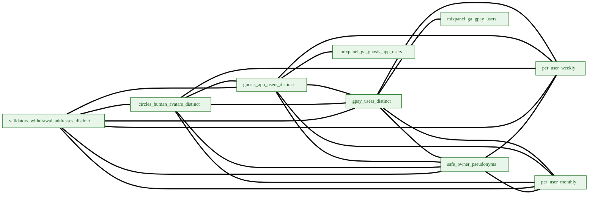
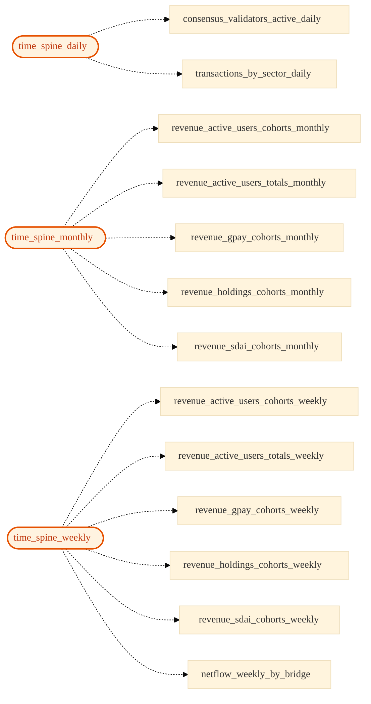

# Semantic Graph

Auto-generated by `scripts/semantic/generate_graph_diagram.py` from `target/semantic_registry.json`. Do not edit by hand — re-run the generator after `build_registry.py`. The interactive explorer below reads the companion `graph_data.json` sidecar (emitted alongside this page); the static Mermaid diagrams render the same data and are always current as a no-JavaScript fallback.

## Coverage at a glance

- **Approved metrics**: 76 / 1041 total
- **Cross-sector relationships**: 53 total across 9 axes
- **User-pseudonym graph nodes**: 9
- **Time-spine bridges**: 13 relationships joining sector marts to `dim_time_spine_*`

## Unified semantic network

Every model that participates in at least one cross-sector relationship, grouped into module subgraphs. Edge style encodes the join axis:

- **===** (thick green) — `user_pseudonym` (cross-sector user overlap)
- **-.→** (dashed) — time-spine bridge (`day` / `week` / `month`)
- **— axis —** (gray) — other entity-specific joins (`circles_avatar`, `safe`, `address`, `validator`, ...)

Nodes show the metric count and dominant quality tier so the diagram doubles as a coverage map. Spine nodes are stadium-shaped; user-keyed marts are tinted green.

  

    

      user_pseudonym
      time-spine
      other axis
    

    

    <button type="button" class="sg-reset" id="semantic-graph-reset">Reset view</button>
  

  

  
Drag to pan, scroll to zoom, click a node to focus its neighbourhood; click empty space to clear. Toggle sector chips to filter. If the interactive graph does not load, the static diagram below is always current.

Static diagram (no-JavaScript fallback)

```mermaid
%%{init: {'theme':'base','flowchart':{'htmlLabels':true,'curve':'basis','nodeSpacing':40,'rankSpacing':80,'padding':10,'subGraphTitleMargin':{'top':6,'bottom':6}},'themeVariables':{'fontSize':'15px','fontFamily':'-apple-system,Segoe UI,Roboto,sans-serif'}}}%%
flowchart TB
    subgraph sg_bridges["bridges"]
        direction LR
        fct_bridges_netflow_weekly_by_bridge["netflow_weekly_by_bridge<br/><small>2 metrics / approved</small>"]
    end
    subgraph sg_consensus["consensus"]
        direction LR
        api_consensus_validators_active_daily["consensus_validators_active_daily<br/><small>1 metric / approved</small>"]
        fct_consensus_validators_withdrawal_addresses_distinct["validators_withdrawal_addresses_distinct<br/><small>2 metrics / approved</small>"]
    end
    subgraph sg_execution["execution"]
        direction LR
        api_execution_transactions_by_sector_daily["transactions_by_sector_daily<br/><small>1 metric / approved</small>"]
        api_execution_transactions_fees_native_by_sector_daily["transactions_fees_native_by_sector_daily<br/><small>1 metric / approved</small>"]
        fct_execution_circles_human_avatars_distinct["circles_human_avatars_distinct<br/><small>2 metrics / approved</small>"]
        fct_execution_gnosis_app_users_distinct["gnosis_app_users_distinct<br/><small>2 metrics / approved</small>"]
        fct_execution_gpay_users_distinct["gpay_users_distinct<br/><small>2 metrics / approved</small>"]
        fct_execution_safe_owner_pseudonyms["safe_owner_pseudonyms<br/><small>3 metrics / approved</small>"]
    end
    subgraph sg_mixpanel_ga["mixpanel_ga"]
        direction LR
        fct_mixpanel_ga_gnosis_app_users["mixpanel_ga_gnosis_app_users<br/><small>2 metrics / approved</small>"]
        fct_mixpanel_ga_gpay_users["mixpanel_ga_gpay_users<br/><small>2 metrics / approved</small>"]
    end
    subgraph sg_revenue["revenue"]
        direction LR
        api_revenue_active_users_cohorts_monthly["revenue_active_users_cohorts_monthly<br/><small>2 metrics / candidate</small>"]
        api_revenue_active_users_cohorts_weekly["revenue_active_users_cohorts_weekly<br/><small>2 metrics / candidate</small>"]
        api_revenue_active_users_totals_monthly["revenue_active_users_totals_monthly<br/><small>2 metrics / approved</small>"]
        api_revenue_active_users_totals_weekly["revenue_active_users_totals_weekly<br/><small>2 metrics / approved</small>"]
        api_revenue_gpay_cohorts_monthly["revenue_gpay_cohorts_monthly<br/><small>2 metrics / candidate</small>"]
        api_revenue_gpay_cohorts_weekly["revenue_gpay_cohorts_weekly<br/><small>2 metrics / candidate</small>"]
        api_revenue_holdings_cohorts_monthly["revenue_holdings_cohorts_monthly<br/><small>2 metrics / candidate</small>"]
        api_revenue_holdings_cohorts_weekly["revenue_holdings_cohorts_weekly<br/><small>2 metrics / candidate</small>"]
        api_revenue_sdai_cohorts_monthly["revenue_sdai_cohorts_monthly<br/><small>2 metrics / candidate</small>"]
        api_revenue_sdai_cohorts_weekly["revenue_sdai_cohorts_weekly<br/><small>2 metrics / candidate</small>"]
        fct_revenue_per_user_monthly["per_user_monthly"]
        fct_revenue_per_user_weekly["per_user_weekly"]
    end
    subgraph sg_shared["shared"]
        direction LR
        dim_time_spine_daily(["time_spine_daily"])
        dim_time_spine_monthly(["time_spine_monthly"])
        dim_time_spine_weekly(["time_spine_weekly"])
    end
    fct_consensus_validators_withdrawal_addresses_distinct === fct_execution_circles_human_avatars_distinct
    fct_consensus_validators_withdrawal_addresses_distinct === fct_execution_gnosis_app_users_distinct
    fct_consensus_validators_withdrawal_addresses_distinct === fct_execution_gpay_users_distinct
    fct_consensus_validators_withdrawal_addresses_distinct === fct_execution_safe_owner_pseudonyms
    fct_consensus_validators_withdrawal_addresses_distinct === fct_revenue_per_user_monthly
    fct_consensus_validators_withdrawal_addresses_distinct === fct_revenue_per_user_weekly
    fct_execution_circles_human_avatars_distinct === fct_execution_gnosis_app_users_distinct
    fct_execution_circles_human_avatars_distinct === fct_execution_gpay_users_distinct
    fct_execution_circles_human_avatars_distinct === fct_execution_safe_owner_pseudonyms
    fct_execution_circles_human_avatars_distinct === fct_revenue_per_user_monthly
    fct_execution_circles_human_avatars_distinct === fct_revenue_per_user_weekly
    fct_execution_gnosis_app_users_distinct === fct_execution_gpay_users_distinct
    fct_execution_gnosis_app_users_distinct === fct_execution_safe_owner_pseudonyms
    fct_execution_gnosis_app_users_distinct === fct_mixpanel_ga_gnosis_app_users
    fct_execution_gnosis_app_users_distinct === fct_revenue_per_user_monthly
    fct_execution_gnosis_app_users_distinct === fct_revenue_per_user_weekly
    fct_execution_gpay_users_distinct === fct_execution_safe_owner_pseudonyms
    fct_execution_gpay_users_distinct === fct_mixpanel_ga_gpay_users
    fct_execution_gpay_users_distinct === fct_revenue_per_user_monthly
    fct_execution_gpay_users_distinct === fct_revenue_per_user_weekly
    fct_execution_safe_owner_pseudonyms === fct_revenue_per_user_monthly
    fct_execution_safe_owner_pseudonyms === fct_revenue_per_user_weekly
    api_consensus_validators_active_daily -. day .-> dim_time_spine_daily
    api_execution_transactions_by_sector_daily -. day .-> dim_time_spine_daily
    api_revenue_active_users_cohorts_monthly -. month .-> dim_time_spine_monthly
    api_revenue_active_users_totals_monthly -. month .-> dim_time_spine_monthly
    api_revenue_gpay_cohorts_monthly -. month .-> dim_time_spine_monthly
    api_revenue_holdings_cohorts_monthly -. month .-> dim_time_spine_monthly
    api_revenue_sdai_cohorts_monthly -. month .-> dim_time_spine_monthly
    api_revenue_active_users_cohorts_weekly -. week .-> dim_time_spine_weekly
    api_revenue_active_users_totals_weekly -. week .-> dim_time_spine_weekly
    api_revenue_gpay_cohorts_weekly -. week .-> dim_time_spine_weekly
    api_revenue_holdings_cohorts_weekly -. week .-> dim_time_spine_weekly
    api_revenue_sdai_cohorts_weekly -. week .-> dim_time_spine_weekly
    dim_time_spine_weekly -. week .-> fct_bridges_netflow_weekly_by_bridge
    api_execution_transactions_by_sector_daily -- sector_day --- api_execution_transactions_fees_native_by_sector_daily
    classDef spine fill:#fff3e0,stroke:#e65100,stroke-width:2px,color:#bf360c;
    classDef pseudo fill:#e8f5e9,stroke:#2e7d32,stroke-width:1.5px,color:#1b5e20;
    classDef other  fill:#eceff1,stroke:#455a64,stroke-width:1px,color:#263238;
    class dim_time_spine_daily,dim_time_spine_monthly,dim_time_spine_weekly spine;
    class fct_consensus_validators_withdrawal_addresses_distinct,fct_execution_circles_human_avatars_distinct,fct_execution_gnosis_app_users_distinct,fct_execution_gpay_users_distinct,fct_execution_safe_owner_pseudonyms,fct_mixpanel_ga_gnosis_app_users,fct_mixpanel_ga_gpay_users,fct_revenue_per_user_monthly,fct_revenue_per_user_weekly pseudo;
    class api_consensus_validators_active_daily,api_execution_transactions_by_sector_daily,api_execution_transactions_fees_native_by_sector_daily,api_revenue_active_users_cohorts_monthly,api_revenue_active_users_cohorts_weekly,api_revenue_active_users_totals_monthly,api_revenue_active_users_totals_weekly,api_revenue_gpay_cohorts_monthly,api_revenue_gpay_cohorts_weekly,api_revenue_holdings_cohorts_monthly,api_revenue_holdings_cohorts_weekly,api_revenue_sdai_cohorts_monthly,api_revenue_sdai_cohorts_weekly,fct_bridges_netflow_weekly_by_bridge other;
    style sg_bridges fill:#fff8e1,stroke:#90a4ae,stroke-width:1px;
    style sg_consensus fill:#e3f2fd,stroke:#90a4ae,stroke-width:1px;
    style sg_execution fill:#f3e5f5,stroke:#90a4ae,stroke-width:1px;
    style sg_mixpanel_ga fill:#fce4ec,stroke:#90a4ae,stroke-width:1px;
    style sg_revenue fill:#e0f7fa,stroke:#90a4ae,stroke-width:1px;
    style sg_shared fill:#f1f8e9,stroke:#90a4ae,stroke-width:1px;
```

> Filtered to production marts that either expose at least one metric, participate in the user-pseudonym graph, or are a time spine. Intermediate joins (`int_*` ↔ `int_*`) and production marts that exist solely as join endpoints are rendered in the **Auxiliary joins** section below.

## User-pseudonym subgraph (cross-sector user overlap)

Zoom on the headline cross-sector capability. Each node is a user-keyed mart that exposes `user_pseudonym` as a primary entity. Edges are equi-join relationships on the pseudonym.

## Time-spine star (cross-grain composition)

The three time spines (`dim_time_spine_daily/weekly/monthly`) are the cross-sector join axis for time-series metrics. The planner synthesises a `toMonday(date)` / `toStartOfMonth(date)` upcast when grains differ (cerebro-mcp PR 5).

## Auxiliary joins (intermediate models)

Lower-level joins between `int_*` / `stg_*` models — the Graph Explorer 'suggested next hops' and address-axis lookups. These don't appear in the production-marts network above to keep that view readable; the planner still uses them for entity-specific enrichment.

```mermaid
%%{init: {'theme':'base','flowchart':{'htmlLabels':true,'curve':'basis','nodeSpacing':40,'rankSpacing':80,'padding':10,'subGraphTitleMargin':{'top':6,'bottom':6}},'themeVariables':{'fontSize':'15px','fontFamily':'-apple-system,Segoe UI,Roboto,sans-serif'}}}%%
flowchart TB
    subgraph sg_consensus["consensus"]
        direction LR
        int_consensus_validators_labels["consensus_validators_labels"]
        int_consensus_validators_withdrawal_addresses["consensus_validators_withdrawal_addresses"]
    end
    subgraph sg_crawlers_data["crawlers_data"]
        direction LR
        int_crawlers_data_labels["crawlers_data_labels"]
    end
    subgraph sg_execution["execution"]
        direction LR
        api_execution_circles_v2_avatar_metadata["circles_v2_avatar_metadata"]
        fct_execution_yields_user_lending_positions_latest["yields_user_lending_positions_latest<br/><small>3 metrics / approved</small>"]
        int_GBCDeposit_deposists_daily["GBCDeposit_deposists_daily<br/><small>1 metric / approved</small>"]
        int_execution_address_roles_current["address_roles_current<br/><small>3 metrics / approved</small>"]
        int_execution_bridges_address_flows_daily["bridges_address_flows_daily<br/><small>2 metrics / candidate</small>"]
        int_execution_gpay_wallet_owners["gpay_wallet_owners<br/><small>1 metric / candidate</small>"]
        int_execution_pools_dex_liquidity_events["pools_dex_liquidity_events"]
        int_execution_safes_current_owners["safes_current_owners<br/><small>2 metrics / candidate</small>"]
        int_execution_transfers_whitelisted_daily["transfers_whitelisted_daily<br/><small>1 metric / candidate</small>"]
    end
    api_execution_circles_v2_avatar_metadata -- address --- int_execution_safes_current_owners
    fct_execution_yields_user_lending_positions_latest -- address --- int_execution_pools_dex_liquidity_events
    int_consensus_validators_withdrawal_addresses -- address --- int_execution_safes_current_owners
    int_crawlers_data_labels -- address --- int_execution_address_roles_current
    int_crawlers_data_labels -- address --- int_execution_bridges_address_flows_daily
    int_crawlers_data_labels -- address --- int_execution_transfers_whitelisted_daily
    int_execution_address_roles_current -- address --- int_execution_safes_current_owners
    int_execution_gpay_wallet_owners -- safe --- int_execution_safes_current_owners
    int_GBCDeposit_deposists_daily -- validator --- int_consensus_validators_labels
    classDef spine fill:#fff3e0,stroke:#e65100,stroke-width:2px,color:#bf360c;
    classDef pseudo fill:#e8f5e9,stroke:#2e7d32,stroke-width:1.5px,color:#1b5e20;
    classDef other  fill:#eceff1,stroke:#455a64,stroke-width:1px,color:#263238;
    class api_execution_circles_v2_avatar_metadata,fct_execution_yields_user_lending_positions_latest,int_GBCDeposit_deposists_daily,int_consensus_validators_labels,int_consensus_validators_withdrawal_addresses,int_crawlers_data_labels,int_execution_address_roles_current,int_execution_bridges_address_flows_daily,int_execution_gpay_wallet_owners,int_execution_pools_dex_liquidity_events,int_execution_safes_current_owners,int_execution_transfers_whitelisted_daily other;
    style sg_consensus fill:#fff8e1,stroke:#90a4ae,stroke-width:1px;
    style sg_crawlers_data fill:#e3f2fd,stroke:#90a4ae,stroke-width:1px;
    style sg_execution fill:#f3e5f5,stroke:#90a4ae,stroke-width:1px;
```

## All cross-sector join axes

Smaller cross-sector axes — usually 1-2 edges each — for entity-specific joins (Circles avatars, Safe addresses, validator indices, raw EVM addresses).

| Axis | Relationship | Models | Quality |
| --- | --- | --- | --- |
| `address` | `address_roles_pivot_to_dune_label` | `address_roles_current` → `crawlers_data_labels` | approved |
| `address` | `address_roles_pivot_to_safe` | `address_roles_current` → `safes_current_owners` | approved |
| `address` | `bridge_flow_endpoint_dune_label` | `bridges_address_flows_daily` → `crawlers_data_labels` | candidate |
| `address` | `circles_avatar_is_safe_owner` | `circles_v2_avatar_metadata` → `safes_current_owners` | approved |
| `address` | `lp_provider_is_lending_user` | `pools_dex_liquidity_events` → `yields_user_lending_positions_latest` | candidate |
| `address` | `transfer_endpoint_dune_label` | `transfers_whitelisted_daily` → `crawlers_data_labels` | candidate |
| `address` | `validator_address_is_safe` | `consensus_validators_withdrawal_addresses` → `safes_current_owners` | candidate |
| `circles_avatar` | `circles_avatar_balances_to_metadata` | `circles_v2_avatar_balances_latest` → `circles_v2_avatar_metadata` | approved |
| `circles_avatar` | `circles_trust_to_avatar_metadata` | `circles_v2_trust_relations_current` → `circles_v2_avatar_metadata` | approved |
| `safe` | `gpay_wallet_is_safe` | `gpay_wallet_owners` → `safes_current_owners` | approved |
| `sector_day` | `execution_transactions_sector_daily_alignment` | `transactions_by_sector_daily` → `transactions_fees_native_by_sector_daily` | approved |
| `validator` | `deposit_to_validator_identity` | `GBCDeposit_deposists_daily` → `consensus_validators_labels` | approved |
