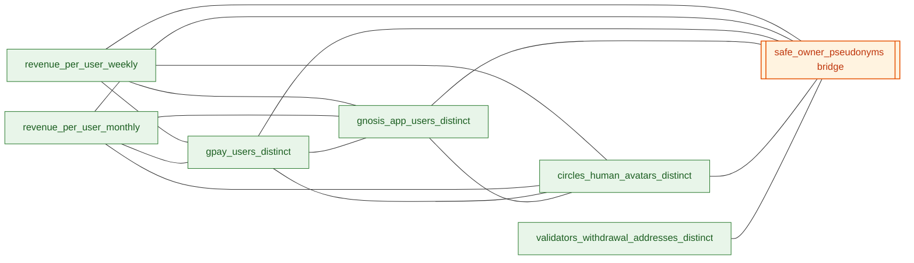

# User-pseudonym graph

The **user-pseudonym graph** is the cross-sector axis for user-overlap
analysis. Every user-keyed mart exposes `user_pseudonym` as a primary
entity, and relationships in `semantic/relationships/user_pseudonym.yml`
declare equi-joins between them. The result: any pair of user-keyed
marts can answer "users who are in BOTH X and Y" with a single
`INNER JOIN ... USING (user_pseudonym)`.

## What is `user_pseudonym`?

A keyed pseudonym of a wallet address:

```sql
sipHash64(concat(unhex(env_var('CEREBRO_PII_SALT')), lower(address)))
```

Returns a `UInt64`. **Deterministic** across modules — the same wallet
always produces the same pseudonym — because every materialization that
calls `pseudonymize_address(addr)` uses the same salt
(`CEREBRO_PII_SALT`). This is the project-wide invariant that makes the
graph work; see [Privacy & Pseudonyms](../privacy-pseudonyms.md) for the
full story.

## The current graph

Seven user-keyed nodes, 26 approved relationships. The five original
sector marts are directly connected; the validator-withdrawal mart and
the Safe owner↔contract **bridge** were added later (the bridge routes
Safe-keyed activity to the underlying EOA owner — see
[Safe-wallet fanout](#safe-wallet-fanout-smart-contract-wallet-human-owner)
below).



See **[Semantic graph](graph.md)** for the auto-generated, interactive
current state (this hand-drawn view may lag nodes added since).

## Cohort sizes (lifetime totals)

| Mart | Population | Source |
| --- | --- | --- |
| `fct_revenue_per_user_weekly` | ~122 k unique users | weekly aggregation of `int_revenue_fees_weekly_per_user`; includes everyone with non-zero rolling fees |
| `fct_revenue_per_user_monthly` | ~121 k unique users | monthly counterpart |
| `fct_execution_gpay_users_distinct` | ~64 k unique users | deduped `int_execution_gpay_safe_identities` — initial-owner, delegate, safe-self roles |
| `fct_execution_gnosis_app_users_distinct` | ~21 k unique users | heuristically identified Gnosis App on-chain users (Circles + Safe-invitation signals) |
| `fct_execution_circles_human_avatars_distinct` | ~17 k unique users | Circles v2 Human avatars (Groups and Orgs excluded) |

These don't add up to a useful total — they're overlapping populations
on the same chain. The point of the graph is to *measure* the overlap.

## Composing cross-sector queries

### Same-grain pair (planner-supported)

When both metrics share a dimension, the planner composes them via
`multi_branch_aggregate_join`:

```python
mcp__cerebro-dev__query_metrics(
    metrics=["revenue_per_user_weekly_users", "execution_gpay_users_distinct"],
    dimensions=["week"],
    limit=5,
)
```

Compiles to:

```sql
WITH
  branch_1 AS (
    SELECT week, count(user_pseudonym) AS revenue_per_user_weekly_users
    FROM dbt.fct_revenue_per_user_weekly
    GROUP BY week
  ),
  branch_2 AS (
    SELECT count(user_pseudonym) AS execution_gpay_users_distinct
    FROM dbt.fct_execution_gpay_users_distinct
  )
  ...
```

The planner picks the join key from the relationship graph and emits the
`UNION DISTINCT` key list.

### Scalar overlap (planner gap — use raw)

The planner doesn't yet support **dimensionless set intersections**
("how many users are in both X and Y?" with no shared dimension to group
by). For now this is a raw `INNER JOIN`:

```sql
WITH
  ga AS (SELECT user_pseudonym FROM dbt.fct_execution_gnosis_app_users_distinct),
  g  AS (SELECT user_pseudonym FROM dbt.fct_execution_gpay_users_distinct),
  c  AS (SELECT user_pseudonym FROM dbt.fct_execution_circles_human_avatars_distinct)
SELECT
  count() AS gnosis_app_total,
  countIf(g.user_pseudonym IS NOT NULL) AS also_in_gpay,
  countIf(c.user_pseudonym IS NOT NULL) AS also_in_circles
FROM ga
LEFT JOIN g USING (user_pseudonym)
LEFT JOIN c USING (user_pseudonym)
```

This shape is documented as a known planner limitation — see the open
items in
[cerebro-mcp improvements](https://github.com/gnosischain/cerebro-mcp).
A future planner enhancement will support a `set_intersection` metric type.

## What's NOT in the graph

Three deliberate omissions worth understanding:

### Mixpanel `user_id_hash`

Mixpanel's `user_id_hash` is in the *same hash space* as `user_pseudonym`
(both use `pseudonymize_address` with the same salt). They would join
directly. But the per-user Mixpanel mart
(`api_mixpanel_ga_users_daily`) is **explicitly excluded** from the
semantic registry:

- Per-user grain + a hashed identifier makes re-identification feasible
  with even modest auxiliary information.
- The project's privacy policy (see [Privacy & Pseudonyms](../privacy-pseudonyms.md))
  blocks this mart from `expose_to_mcp` and from cerebro-api.
- Aggregate Mixpanel views (DAU, modal opens, funnel) are MCP-accessible
  but don't expose `user_id_hash`, so they can't participate as a node in
  the user-pseudonym graph.

The cross-domain join therefore happens **inside the Gnosis App
on-chain mart** (`fct_execution_gnosis_app_users_distinct`), which
identifies users via on-chain heuristics that overlap with Mixpanel
identification roughly 1:1 in practice.

### Lending / LP per-user attribution

Both `fct_execution_lending_weekly.lenders_count_weekly` and the LP-token
holders counts measure *protocol-level* addresses (Vault contracts,
wrapper contracts, staking aggregators), not real human beneficial
owners. Adding these as user-pseudonym graph nodes would be misleading
— most "lending users" by that definition are smart contracts.

The correct attribution lives in the in-progress
UBO (Ultimate Beneficial Owner) module (under construction in
`models/ubo/`; not yet registered in [modules.md](../modules.md)). When
`fct_ubo_known_containers_daily` + `fct_ubo_supply_claims_daily`
stabilize, a per-user lending mart derived from THEM will become the
right graph node. The placeholder is documented in
`semantic/authoring/execution/lending/semantic_models.yml`.

### Validator withdrawal addresses

Now in the graph as `fct_consensus_validators_withdrawal_addresses_distinct`.
Most validators are owned by humans (or pools) with withdrawable
balances, and the withdrawal-address pseudonym is deterministic in the
same hash space. Because many withdrawal addresses are Safes, this node
overlaps the other sectors primarily *through* the
`safe_owner_pseudonyms` bridge rather than via direct edges.

### Safe-wallet fanout (smart-contract wallet → human owner)

A Safe is a smart-contract wallet. Its address hashes into the same
`user_pseudonym` space as any EOA, but analytically the user behind the
activity is **the Safe's owner(s)**, not the Safe contract itself.
Without re-attribution, any sector mart whose `user_pseudonym` is a
Safe (gpay pay_wallets, gnosis_app account-abstraction wallets,
validator withdrawal Safes, Circles avatars deployed as Safes) is a
dead-end in the user-pseudonym graph — it can only overlap with other
sectors *at the Safe-address pseudonym*, missing the shared-EOA
identity that ties multiple Safes back to the same human.

The bridge mart
**`fct_execution_safe_owner_pseudonyms`** closes this gap. It emits
one row per current `(safe_address, owner)` pair, with BOTH columns
projected into the project-wide pseudonym space:

| Bridge column | Hashes | Joinable to |
| --- | --- | --- |
| `safe_user_pseudonym` | Safe contract address | gpay / gnosis_app / Circles / validator-operator marts (Safe-keyed activity) |
| `owner_user_pseudonym` | An EOA listed as a current owner | revenue marts and any other owner-keyed mart |

The planner can then compose any Safe-keyed sector with any
owner-keyed sector via two equi-joins:

```sql
sector_A.user_pseudonym       = bridge.safe_user_pseudonym
bridge.owner_user_pseudonym   = sector_B.user_pseudonym
```

Relationships in `semantic/relationships/user_pseudonym.yml` bind
every user-keyed mart to one side of the bridge. The bridge is
declared with `quality_tier: approved` and `preferred_bridge: false`
so the planner only routes through it when no direct edge exists
between the two sectors (i.e., when the analytical question genuinely
requires Safe-fanout).

**Attribution weighting**. The bridge denormalizes `n_owners_for_safe`
and `current_threshold` onto every owner row. When fanning a Safe's
activity out to its owners, use `1/n_owners_for_safe` as a per-owner
share (or `1/current_threshold` for influence-weighted attribution).
The bridge intentionally does NOT pre-apply the weighting — that's a
modelling decision the analyst makes per query.

**Coverage caveat — read before sizing this against another mart.**
The two bridge columns are *definitional partitions*, not optional
overlays. `safe_user_pseudonym` is **only** the Safe-contract side;
`owner_user_pseudonym` is **only** the owner side. So an outer-join
cardinality like "how many of mart X's pseudonyms appear as
`safe_user_pseudonym` in the bridge" is **not** a coverage metric —
it's the fraction of X's pseudonyms that happen to be Safe addresses
(vs. EOAs).

Worked example: `fct_execution_gpay_users_distinct` (64,418 rows) is
a UNION of three identity layers per Gnosis Pay user:

| Layer | Count | What it hashes |
| --- | --- | --- |
| `safe_self` | 32,209 | The GP Safe contract address |
| `initial_owner` | 32,208 | The EOA that set up the Safe |
| `delegate` | 1 | Shared GP signer EOA |

51,560 (80%) of those 64,418 pseudonyms appear as `safe_user_pseudonym`
in the bridge. That's **not** a Safe-events coverage gap — it's
32,209 `safe_self` rows + 19,350 `initial_owner` rows that happen to
themselves be Safe-owned (nested-Safe ownership: a corporate/treasury
Safe owning the GP Safe). The remaining 12,858 initial-owner
pseudonyms are EOAs by definition; they land on the
`owner_user_pseudonym` side. The arithmetic closes exactly: 32,209 +
19,350 + 1 + 12,858 = 64,418.

This is why every user-keyed mart in
`semantic/relationships/user_pseudonym.yml` declares **both**
directions — one edge to `safe_user_pseudonym`, one to
`owner_user_pseudonym`. The planner picks the side that resolves each
pseudonym row; aggregation against the bridge therefore reaches the
full population.

## Worked example

"Of the 10,807 revenue-active users (≥ $6/year potential revenue),
how are they distributed across sectors?"

```sql
WITH revenue_active AS (
  SELECT DISTINCT user_pseudonym
  FROM dbt.fct_revenue_per_user_weekly
  WHERE week = (SELECT max(week) FROM dbt.fct_revenue_per_user_weekly)
    AND is_revenue_active = 1
)
SELECT
  count() AS revenue_active_total,
  countIf(g.user_pseudonym IS NOT NULL) AS also_in_gpay,
  countIf(c.user_pseudonym IS NOT NULL) AS also_in_circles,
  countIf(ga.user_pseudonym IS NOT NULL) AS also_in_gnosis_app_onchain,
  countIf(g.user_pseudonym IS NOT NULL
       AND c.user_pseudonym IS NOT NULL
       AND ga.user_pseudonym IS NOT NULL) AS in_all_three
FROM revenue_active r
LEFT JOIN dbt.fct_execution_gpay_users_distinct g USING (user_pseudonym)
LEFT JOIN dbt.fct_execution_circles_human_avatars_distinct c USING (user_pseudonym)
LEFT JOIN dbt.fct_execution_gnosis_app_users_distinct ga USING (user_pseudonym)
```

Returned in the May 2026 snapshot:

| Cohort | Count | % of revenue-active |
| --- | --- | --- |
| Total revenue-active | 10,807 | 100% |
| Also in Gnosis Pay | 8,623 | **80%** |
| Also in Circles | 2 | <0.1% |
| Also in Gnosis App on-chain | 2 | <0.1% |
| In all three | 0 | 0% |

The headline insight: the DAO's revenue-active cohort is concentrated
in Gnosis Pay holders. Circles and the on-chain Gnosis App identification
populations are essentially disjoint from revenue. This is a real product
signal — see the [Gnosis App user report](cross-sector-examples.md) for the
fuller analysis.

## Adding a new user-keyed mart

The pattern is well-established. To add a new sector to the graph:

1.  **Build a deduped per-pseudonym mart** in `models/<module>/marts/`:
    ```sql
    {{ config(materialized='view', tags=['production', ...]) }}
    SELECT
        {{ pseudonymize_address('<raw_address_col>') }} AS user_pseudonym,
        -- additional dimensions / flags as needed
    FROM {{ ref('<source>') }}
    WHERE <filter>
    GROUP BY user_pseudonym  -- if needed for dedup
    ```
2.  **Document it** in `models/<module>/marts/schema.yml` — full column
    descriptions, owner, and a cross-sector framing block in the model
    description.
3.  **Register a semantic_model** in
    `semantic/authoring/<module>/semantic_models.yml`:
    ```yaml
    semantic_models:
      - name: <module>_users_distinct
        model: ref('<the_new_mart>')
        entities:
          - name: user_pseudonym
            type: primary
            expr: toString(user_pseudonym)
        dimensions: [...]
        measures:
          - name: <module>_users_distinct_count
            agg: count
            expr: user_pseudonym
        config:
          meta:
            cerebro:
              owner: analytics_team
              quality_tier: approved
              grain: user
              question_synonyms: [...]
    ```
4.  **Add cross-sector relationships** in
    `semantic/relationships/user_pseudonym.yml` — one edge to each
    existing user-keyed mart you want to support joins with. Typical:
    revenue (×2 grains) + gpay + gnosis_app + circles → 5 new edges.
5.  **Rebuild + reload**:
    ```bash
    dbt build --select <the_new_mart>
    python3 scripts/semantic/build_registry.py --target-dir target
    # then call reload_semantic_registry MCP tool
    ```

See [maintenance](maintenance.md#authoring-checklist) for the full
checklist including measure-name uniqueness and the validation pass.
