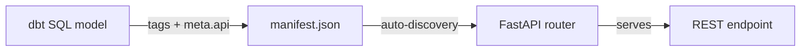
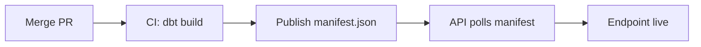

# Adding API Endpoints

The Gnosis Analytics API is metadata-driven. Every API endpoint is backed by a dbt model in the `dbt-cerebro` project. To add a new endpoint, you write a SQL model, apply the correct tags, and optionally configure filtering, pagination, and sorting through the `meta.api` block. No Python code is needed.

## How It Works



1. You create a dbt model with `production` and `api:{name}` tags
2. When the model is deployed, it appears in the dbt `manifest.json`
3. The API server polls the manifest and automatically registers routes for any qualifying model
4. Clients can immediately call the new endpoint

## Step 1: Create the dbt Model

Create a new SQL file in the appropriate module's `marts/` directory within the `dbt-cerebro` project. API models are views that project data from intermediate or fact models.

```
models/
└── consensus/
    └── marts/
        └── api_consensus_blob_commitments_daily.sql
```

!!! tip "Naming convention"
    API models follow the pattern `api_{module}_{entity}_{granularity}`. The `api_` prefix signals that this model is intended for API consumption.

## Step 2: Configure Tags and Metadata

Every API model needs at minimum the `production` tag and an `api:{resource_name}` tag. Additional tags control the URL path, access tier, and time granularity.

### Required Tags

| Tag | Purpose | Example |
|-----|---------|---------|
| `production` | Marks the model for API exposure | `production` |
| `api:{resource_name}` | Defines the resource segment in the URL path | `api:blob_commitments` |
| A category tag | Becomes the URL prefix and Swagger UI group | `consensus`, `execution`, `bridges` |

### Optional Tags

| Tag | Purpose | Default |
|-----|---------|---------|
| `granularity:{period}` | Adds a time dimension suffix to the URL | No suffix |
| `tier0` through `tier3` | Sets the access control level | `tier0` (public) |

### Optional `meta.api` Configuration

The `meta.api` block enables filtering, pagination, sorting, and POST support. Without it, the endpoint is a legacy endpoint that returns the full result set via GET with no query parameters accepted.

!!! info "Legacy vs metadata-driven endpoints"
    If you omit `meta.api`, the endpoint works but is limited: GET only, no filters, no pagination, no sorting. All new endpoints should include a `meta.api` block. See the [meta.api Contract](meta-api-contract.md) for the full specification.

## Step 3: Write the SQL Model

Here is a complete example of an API model with full `meta.api` configuration:

```sql
-- models/consensus/marts/api_consensus_blob_commitments_daily.sql
{{
    config(
        materialized='view',
        tags=[
            'production',
            'consensus',
            'tier1',
            'api:blob_commitments',
            'granularity:daily'
        ],
        meta={
            "api": {
                "methods": ["GET", "POST"],
                "allow_unfiltered": false,
                "parameters": [
                    {
                        "name": "start_date",
                        "column": "date",
                        "operator": ">=",
                        "type": "date",
                        "description": "Start date (inclusive) in YYYY-MM-DD format"
                    },
                    {
                        "name": "end_date",
                        "column": "date",
                        "operator": "<=",
                        "type": "date",
                        "description": "End date (inclusive) in YYYY-MM-DD format"
                    }
                ],
                "pagination": {
                    "enabled": true,
                    "default_limit": 100,
                    "max_limit": 5000
                },
                "sort": [
                    {"column": "date", "direction": "DESC"}
                ]
            }
        }
    )
}}

SELECT
    date,
    total_blob_commitments AS value,
    avg_blob_size,
    total_blob_gas_used
FROM {{ ref('int_consensus_blob_commitments_daily') }}
```

**This produces:**

| Property | Value |
|----------|-------|
| **URL** | `GET /v1/consensus/blob_commitments/daily` |
| **POST URL** | `POST /v1/consensus/blob_commitments/daily` |
| **Access** | tier1 (partner key required) |
| **Filters** | `start_date`, `end_date` |
| **Pagination** | Default 100 rows, max 5000 |
| **Sort** | `date DESC` (newest first) |

### Example: Public Endpoint with No Filters

For simple endpoints that return the latest snapshot with no filtering needed:

```sql
-- models/consensus/marts/api_consensus_blob_commitments_latest.sql
{{
    config(
        materialized='view',
        tags=[
            'production',
            'consensus',
            'tier0',
            'api:blob_commitments',
            'granularity:latest'
        ],
        meta={
            "api": {
                "methods": ["GET"],
                "allow_unfiltered": true,
                "pagination": {
                    "enabled": true,
                    "default_limit": 10,
                    "max_limit": 100
                },
                "sort": [
                    {"column": "date", "direction": "DESC"}
                ]
            }
        }
    )
}}

SELECT
    date,
    total_blob_commitments AS value
FROM {{ ref('int_consensus_blob_commitments_daily') }}
ORDER BY date DESC
LIMIT 1
```

### Example: Endpoint with List Filters

For endpoints that accept multiple values for a parameter (e.g., filtering by multiple addresses):

```sql
-- models/execution/marts/api_execution_token_balances_daily.sql
{{
    config(
        materialized='view',
        tags=[
            'production',
            'execution',
            'tier1',
            'api:token_balances',
            'granularity:daily'
        ],
        meta={
            "api": {
                "methods": ["GET", "POST"],
                "allow_unfiltered": false,
                "require_any_of": ["symbol", "address"],
                "parameters": [
                    {
                        "name": "symbol",
                        "column": "symbol",
                        "operator": "=",
                        "type": "string",
                        "description": "Token symbol (e.g., GNO, USDC)"
                    },
                    {
                        "name": "address",
                        "column": "address",
                        "operator": "IN",
                        "type": "string_list",
                        "case": "lower",
                        "max_items": 200,
                        "description": "Token contract address(es)"
                    },
                    {
                        "name": "start_date",
                        "column": "date",
                        "operator": ">=",
                        "type": "date"
                    },
                    {
                        "name": "end_date",
                        "column": "date",
                        "operator": "<=",
                        "type": "date"
                    }
                ],
                "pagination": {
                    "enabled": true,
                    "default_limit": 100,
                    "max_limit": 5000
                },
                "sort": [
                    {"column": "date", "direction": "DESC"}
                ]
            }
        }
    )
}}

SELECT
    date,
    symbol,
    address,
    balance,
    holder_count
FROM {{ ref('int_execution_token_balances_daily') }}
```

## Step 4: Add Documentation

Create or update the `schema.yml` file in the same directory to document the model and its columns:

```yaml
# models/consensus/marts/schema.yml
version: 2

models:
  - name: api_consensus_blob_commitments_daily
    description: >
      Daily blob commitment statistics for the Gnosis Chain consensus layer.
      Shows the number of blob commitments, average blob size, and total gas used.
    columns:
      - name: date
        description: Calendar date (UTC)
        data_type: Date
        tests:
          - not_null
      - name: value
        description: Total number of blob commitments on this date
        data_type: UInt64
      - name: avg_blob_size
        description: Average blob size in bytes
        data_type: Float64
      - name: total_blob_gas_used
        description: Total blob gas consumed on this date
        data_type: UInt64
```

!!! warning "Column validation"
    Every column referenced in `meta.api.parameters[].column` and `meta.api.sort[].column` must exist in the model's final `SELECT` projection. The API validates this at manifest load time and will skip models with invalid column references.

## Step 5: Test Locally

Before submitting a PR, verify your model works:

```bash
# Enter the dbt-cerebro Docker container
docker exec -it dbt /bin/bash

# Compile the model to check for SQL errors
dbt compile --select api_consensus_blob_commitments_daily

# Run the model (creates/updates the view in ClickHouse)
dbt run --select api_consensus_blob_commitments_daily

# Run tests defined in schema.yml
dbt test --select api_consensus_blob_commitments_daily

# Verify the view returns data
dbt show --select api_consensus_blob_commitments_daily --limit 5
```

## Step 6: Deploy

1. **Create a branch** in the `dbt-cerebro` repository
2. **Add your model** and `schema.yml` documentation
3. **Open a pull request** with a description of the new endpoint
4. **After review and merge**, CI runs `dbt build` to deploy the model and publishes an updated `manifest.json`
5. **The API auto-discovers** the new endpoint on its next manifest refresh cycle (default: every 5 minutes)

No restart or redeployment of the API server is required.



## Tag-to-URL Mapping Reference

The API constructs endpoint URLs from model tags following this pattern:

```
/v1/{category}/{resource}/{granularity}
```

| dbt Tags | Generated Path |
|----------|----------------|
| `production`, `consensus`, `api:blob_commitments`, `granularity:daily` | `/v1/consensus/blob_commitments/daily` |
| `production`, `execution`, `api:transactions` | `/v1/execution/transactions` |
| `production`, `bridges`, `tier1`, `api:transfers`, `granularity:weekly` | `/v1/bridges/transfers/weekly` |
| `production`, `p2p`, `tier0`, `api:client_diversity`, `granularity:latest` | `/v1/p2p/client_diversity/latest` |

## Common Patterns

### Multiple Granularities for One Resource

A common pattern is to expose the same resource at multiple granularities with different access tiers:

```
GET /v1/consensus/blob_commitments/latest    (tier0 -- public, no key)
GET /v1/consensus/blob_commitments/daily     (tier1 -- partner key)
GET /v1/consensus/blob_commitments/all_time  (tier2 -- premium key)
```

Each granularity is a separate dbt model with the same `api:blob_commitments` tag but different `granularity:` and tier tags.

### Enabling POST for Large Filters

Enable POST when clients need to pass large lists of values (e.g., hundreds of addresses) that would create excessively long URLs:

```sql
meta={
    "api": {
        "methods": ["GET", "POST"],
        ...
    }
}
```

POST endpoints accept the same parameters as GET, but in a JSON request body rather than query string parameters.

## Next Steps

- [meta.api Contract](meta-api-contract.md) -- Full reference for all `meta.api` fields
- [Adding dbt Models](add-model.md) -- How to create the upstream intermediate and fact models
- [Conventions](conventions.md) -- Naming conventions, tag ordering, and code style
