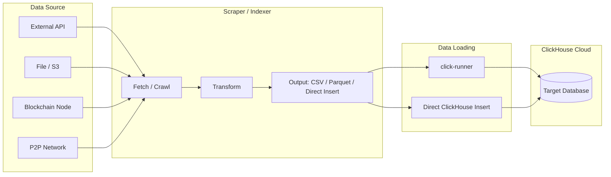

# Adding Scrapers

The Gnosis Analytics platform ingests data from multiple external sources beyond the blockchain itself. This guide covers how to add new data scrapers, crawlers, and external data sources that feed into the ClickHouse data warehouse.

## Types of Scrapers

| Type | Description | Examples |
|------|-------------|----------|
| **External API scrapers** | Fetch data from third-party REST APIs | Ember (energy data), ProbeLab (network metrics), Dune Analytics |
| **Blockchain data indexers** | Extract on-chain data from nodes | cryo-indexer (EL), beacon-indexer (CL) |
| **Network crawlers** | Discover and monitor P2P network peers | nebula (DHT crawler), ip-crawler (geolocation) |

## Architecture

All scrapers follow the same high-level pattern: fetch data from an external source, transform it into a ClickHouse-compatible format, and load it into the appropriate database.



## Using click-runner

For most external data sources, **click-runner** is the recommended ingestion tool. It handles ClickHouse table creation, data loading, and provides three ingestion modes.

### click-runner Modes

=== "Query Mode"

    Executes arbitrary SQL files against ClickHouse. Use for administrative tasks, schema migrations, and custom SQL-based transformations.

    ```bash
    python run_queries.py --ingestor=query \
      --queries=queries/my_source/setup.sql,queries/my_source/transform.sql
    ```

=== "CSV Mode"

    Imports data from CSV files using ClickHouse's built-in URL engine. The workflow involves SQL files for table creation, data insertion, and optional optimization.

    ```bash
    python run_queries.py --ingestor=csv \
      --create-table-sql=queries/my_source/create_table.sql \
      --insert-sql=queries/my_source/insert_data.sql \
      --optimize-sql=queries/my_source/optimize.sql
    ```

=== "Parquet Mode"

    Imports data from Parquet files stored in S3 buckets. Supports three sub-modes:

    - `latest` -- Import only the most recent file
    - `date` -- Import a file for a specific date
    - `all` -- Import all available files

    ```bash
    python run_queries.py --ingestor=parquet \
      --create-table-sql=queries/my_source/create_table.sql \
      --s3-path=assets/my_data/{{DATE}}.parquet \
      --table-name=crawlers_data.my_source_data \
      --mode=latest
    ```

## Workflow: Adding an External API Scraper

This walkthrough adds a new scraper that fetches data from an external REST API, saves it as CSV or Parquet, and loads it into ClickHouse via click-runner.

### Step 1: Create the Scraper Script

Write a Python script that fetches data from the external API and saves it in a ClickHouse-compatible format.

```python
# scrapers/my_source/fetch_data.py
import requests
import csv
from datetime import datetime

API_URL = "https://api.example.com/v1/metrics"

def fetch_and_save():
    response = requests.get(API_URL, timeout=30)
    response.raise_for_status()
    data = response.json()

    output_path = f"/data/my_source_{datetime.utcnow().strftime('%Y-%m-%d')}.csv"

    with open(output_path, 'w', newline='') as f:
        writer = csv.DictWriter(f, fieldnames=["date", "metric_name", "value"])
        writer.writeheader()
        for record in data["results"]:
            writer.writerow({
                "date": record["timestamp"][:10],
                "metric_name": record["name"],
                "value": record["value"],
            })

    print(f"Wrote {len(data['results'])} records to {output_path}")
    return output_path

if __name__ == "__main__":
    fetch_and_save()
```

### Step 2: Define the ClickHouse Table

Create a SQL file that defines the target table schema:

```sql
-- queries/my_source/create_table.sql
CREATE TABLE IF NOT EXISTS crawlers_data.my_source_metrics
(
    date Date,
    metric_name String,
    value Float64
)
ENGINE = ReplacingMergeTree()
ORDER BY (date, metric_name)
PARTITION BY toStartOfMonth(date)
```

!!! tip "Choose the right engine"
    Use `ReplacingMergeTree()` for data that may be re-fetched (deduplicates on the `ORDER BY` key). Use `MergeTree()` for append-only data where duplicates are not expected. Both support efficient partition-level operations.

### Step 3: Create the Insert SQL

For CSV mode, write an INSERT statement using ClickHouse's URL engine:

```sql
-- queries/my_source/insert_data.sql
INSERT INTO crawlers_data.my_source_metrics
SELECT
    date,
    metric_name,
    value
FROM url('{{MY_SOURCE_DATA_URL}}', 'CSV',
    'date Date, metric_name String, value Float64')
```

For Parquet files stored in S3, the click-runner handles the INSERT automatically -- you only need the create table SQL.

### Step 4: Create the Dockerfile

```dockerfile
# scrapers/my_source/Dockerfile
FROM python:3.12-slim

WORKDIR /app

COPY requirements.txt .
RUN pip install --no-cache-dir -r requirements.txt

COPY fetch_data.py .

CMD ["python", "fetch_data.py"]
```

### Step 5: Create a Docker Compose Service

Add the scraper as a service in the click-runner's `docker-compose.yml` or create a standalone compose file:

```yaml
# docker-compose.yml
services:
  my-source-scraper:
    build: ./scrapers/my_source
    volumes:
      - ./data:/data
    environment:
      - API_URL=https://api.example.com/v1/metrics
    restart: "no"

  my-source-ingestor:
    build: .
    command: >
      python run_queries.py --ingestor=csv
      --create-table-sql=queries/my_source/create_table.sql
      --insert-sql=queries/my_source/insert_data.sql
    environment:
      - CH_HOST=${CH_HOST}
      - CH_PORT=${CH_PORT}
      - CH_USER=${CH_USER}
      - CH_PASSWORD=${CH_PASSWORD}
      - CH_DB=crawlers_data
      - CH_SECURE=True
      - CH_QUERY_VAR_MY_SOURCE_DATA_URL=file:///data/my_source_latest.csv
    volumes:
      - ./data:/data
    depends_on:
      - my-source-scraper
    restart: "no"
```

### Step 6: Schedule with Kubernetes CronJob

For production, deploy as a Kubernetes CronJob:

```yaml
# k8s/cronjobs/my-source-scraper.yaml
apiVersion: batch/v1
kind: CronJob
metadata:
  name: my-source-scraper
  namespace: crawlers
spec:
  schedule: "0 3 * * *"  # Daily at 3:00 AM UTC
  concurrencyPolicy: Forbid
  jobTemplate:
    spec:
      template:
        spec:
          containers:
            - name: scraper
              image: ghcr.io/gnosischain/my-source-scraper:latest
              env:
                - name: CH_HOST
                  valueFrom:
                    secretKeyRef:
                      name: clickhouse-credentials
                      key: host
                - name: CH_PASSWORD
                  valueFrom:
                    secretKeyRef:
                      name: clickhouse-credentials
                      key: password
          restartPolicy: OnFailure
          nodeSelector:
            kubernetes.io/arch: arm64
```

## Workflow: Adding a Custom Indexer

For more complex data sources that require continuous processing (not just periodic fetching), build a standalone indexer service.

### Design Principles

1. **Idempotent** -- The indexer can safely re-process data ranges without creating duplicates
2. **Resumable** -- Track processing state so the indexer can restart from where it left off
3. **Configurable range** -- Accept start/end parameters for backfilling
4. **Direct ClickHouse writes** -- Use batch inserts for efficiency

### Example: Indexer Structure

```
my-indexer/
├── Dockerfile
├── docker-compose.yml
├── src/
│   ├── main.py           # Entry point
│   ├── fetcher.py         # Data fetching logic
│   ├── transformer.py     # Data transformation
│   ├── writer.py          # ClickHouse batch writer
│   └── state.py           # Processing state tracker
├── sql/
│   └── create_table.sql   # ClickHouse table definition
└── requirements.txt
```

### ClickHouse Table Creation

```sql
CREATE TABLE IF NOT EXISTS crawlers_data.my_indexer_data
(
    timestamp DateTime,
    block_number UInt64,
    metric_name LowCardinality(String),
    value Float64,
    metadata String
)
ENGINE = ReplacingMergeTree()
ORDER BY (timestamp, block_number, metric_name)
PARTITION BY toStartOfMonth(timestamp)
TTL timestamp + INTERVAL 2 YEAR
```

**Key decisions:**

| Decision | Recommendation |
|----------|----------------|
| **Engine** | `ReplacingMergeTree()` for deduplication safety |
| **ORDER BY** | Choose columns that naturally form a unique key |
| **PARTITION BY** | `toStartOfMonth()` for monthly partitions |
| **TTL** | Optional; set if data has a retention policy |
| **LowCardinality** | Use for string columns with few distinct values (enums, categories) |

## Connecting to dbt

Once your scraper is loading data into ClickHouse, create dbt models to transform it:

### 1. Add a Source Definition

```yaml
# models/crawlers/sources.yml
version: 2

sources:
  - name: crawlers_data
    database: crawlers_data
    tables:
      - name: my_source_metrics
        description: External metrics from my_source API
        columns:
          - name: date
            description: Metric date
          - name: metric_name
            description: Name of the metric
          - name: value
            description: Metric value
```

### 2. Create a Staging Model

```sql
-- models/crawlers/staging/stg_crawlers__my_source_metrics.sql
{{ config(materialized='view') }}

SELECT
    date,
    metric_name,
    value
FROM {{ source('crawlers_data', 'my_source_metrics') }}
WHERE value IS NOT NULL
```

### 3. Create Intermediate and API Models

Follow the standard [model layers](add-model.md#model-layers) pattern to build out intermediate aggregations and API-facing views.

## Production Checklist

Before deploying a new scraper to production, verify:

- [ ] **Table schema** is created and tested in a staging environment
- [ ] **Idempotency** -- Re-running the scraper does not create duplicate data
- [ ] **Error handling** -- The scraper handles API failures, network timeouts, and malformed data gracefully
- [ ] **Logging** -- Sufficient logging for debugging issues in production
- [ ] **Resource limits** -- Docker container has appropriate CPU and memory limits
- [ ] **Secrets** -- All credentials are managed through environment variables, not hardcoded
- [ ] **Scheduling** -- CronJob schedule is appropriate for the data source's update frequency
- [ ] **Monitoring** -- Health checks and failure alerting are configured
- [ ] **dbt models** -- Staging and downstream models exist to transform the raw data
- [ ] **Documentation** -- The scraper's purpose, data schema, and schedule are documented

## Next Steps

- [click-runner](../data-pipeline/ingestion/click-runner.md) -- Detailed click-runner reference
- [nebula](../data-pipeline/crawlers/nebula.md) -- Example of a production network crawler
- [ip-crawler](../data-pipeline/crawlers/ip-crawler.md) -- Example of a production data enrichment service
- [Adding dbt Models](add-model.md) -- Create transformation models for your scraped data
