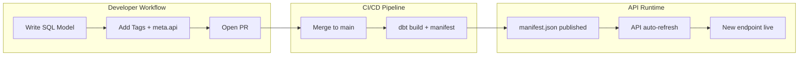

# Developer Guide

This guide is for developers who want to extend the Gnosis Analytics platform. The platform is designed to be metadata-driven, meaning most extensions require only SQL and configuration changes -- no application code modifications.

!!! tip "New here?"
    If you're just getting started with the platform, begin with the [Getting Started](../getting-started/index.md) section for a quick overview, your first API call, and an architecture walkthrough.

## What You Can Do

There are three primary ways to extend the platform:

### Add API Endpoints

The API is entirely metadata-driven. To expose a new dataset through the REST API, you create a dbt model with the right tags and optional `meta.api` configuration. The API server automatically discovers new models from the dbt manifest and registers them as HTTP endpoints.

**No Python code required.** Your workflow is:

1. Write a dbt SQL model
2. Tag it with `production` and `api:{resource_name}`
3. Optionally configure filters, pagination, and sorting via `meta.api`
4. Merge your PR -- the API picks up the new endpoint automatically

[:octicons-arrow-right-24: Adding API Endpoints](add-endpoint.md)

### Add dbt Models

All analytics transformations happen in dbt-cerebro, a dbt project with approximately 400 SQL models organized across 8 modules. Models follow a layered architecture (staging, intermediate, facts, API) with consistent naming conventions and incremental processing strategies.

[:octicons-arrow-right-24: Adding dbt Models](add-model.md)

### Add Data Scrapers

The platform ingests data from external sources such as third-party APIs, blockchain data providers, and network crawlers. Scrapers are containerized services that fetch data and load it into ClickHouse, where dbt models can then transform it.

[:octicons-arrow-right-24: Adding Scrapers](add-scraper.md)

## Key References

| Resource | Description |
|----------|-------------|
| [meta.api Contract](meta-api-contract.md) | Full specification for the metadata contract between dbt models and the API |
| [Conventions](conventions.md) | Naming, tagging, code style, and PR workflow standards |
| [Model Layers](../data-pipeline/transformation/model-layers.md) | Detailed guide to the staging/intermediate/facts/API layer system |
| [Endpoints](../api/endpoints.md) | How dbt tags map to API URL paths |
| [Filtering & Pagination](../api/filtering.md) | How `meta.api` parameters become query filters |

## Architecture at a Glance

The entire pipeline from SQL model to live API endpoint requires no manual deployment steps beyond merging a pull request. The API server periodically polls the dbt manifest and rebuilds its route table when changes are detected.

## Prerequisites

To contribute to the platform, you should be comfortable with:

- **SQL** -- All data transformations are written in SQL with Jinja templating (dbt)
- **dbt** -- The project uses dbt (data build tool) for model management, testing, and documentation
- **ClickHouse** -- The underlying database engine; understanding its columnar storage model and SQL dialect helps when writing performant queries
- **Git** -- All changes go through pull requests with code review
- **Docker** -- Scrapers and local development environments are containerized
