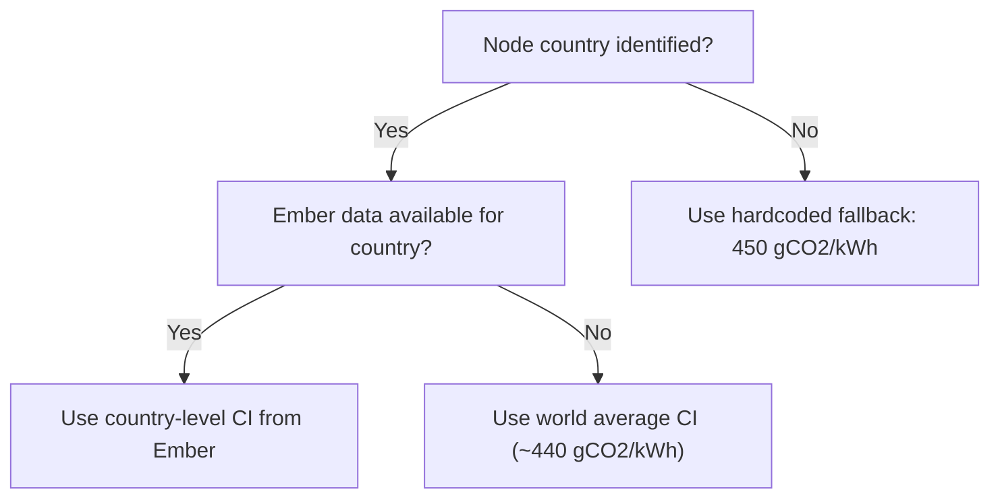

# Carbon Intensity Model

The carbon intensity (CI) model converts electricity generation mix data into grams of CO2 per kilowatt-hour (gCO2/kWh) for each country where Gnosis Chain nodes operate. This is a critical input to the network-wide carbon footprint calculation.

## Data Source: Ember Global Electricity Review

The model ingests data from the [Ember Global Electricity Review](https://ember-climate.org/data/), which provides:

- **Coverage**: 200+ countries and territories
- **Granularity**: Monthly electricity generation data
- **Generation types**: Coal, gas, oil, nuclear, hydro, wind, solar, bioenergy, and other renewables
- **Update frequency**: Monthly, with a typical lag of 1--2 months

!!! info "Ember Data Availability"
    Ember publishes monthly generation mix data for most countries. For smaller territories or countries with incomplete reporting, the model falls back to regional or global averages. See [Fallback Hierarchy](#fallback-hierarchy) below.

## Country-Level Carbon Intensity Calculation

The carbon intensity for each country is computed as a **weighted average** of the emissions factors for each generation type, weighted by each type's share of total generation:

$$
CI_{\text{country}} = \sum_{g \in \text{gen types}} \left( \text{share}_g \times EF_g \right)
$$

Where the emissions factors (gCO2/kWh) by generation type are:

| Generation Type | Emissions Factor (gCO2/kWh) | Category |
|:----------------|:---------------------------:|:--------:|
| Coal            | 820--1,100                  | Fossil   |
| Gas             | 350--500                    | Fossil   |
| Oil             | 650--890                    | Fossil   |
| Nuclear         | 5--15                       | Low-carbon |
| Hydro           | 4--30                       | Renewable |
| Wind            | 7--15                       | Renewable |
| Solar           | 20--50                      | Renewable |
| Bioenergy       | 50--250                     | Renewable |

## Grid-Type Uncertainty

The measurement uncertainty assigned to the carbon intensity estimate depends on the grid's overall CI level. Cleaner grids have higher relative uncertainty because small absolute changes represent larger relative swings.

| CI Range (gCO2/kWh) | Grid Classification | Uncertainty (%) |
|:--------------------:|:-------------------:|:---------------:|
| < 100                | Very clean          | 25              |
| 100 -- 300           | Clean               | 20              |
| 300 -- 600           | Mixed               | 15              |
| > 600                | Fossil-heavy        | 12              |

## Seasonal Adjustments

Electricity generation mix varies with seasons due to heating/cooling demand and renewable availability. The model applies continent-level seasonal adjustment factors.

!!! note "Hemisphere Convention"
    Seasons are defined by meteorological convention. **Winter (W)** refers to December--February in the Northern Hemisphere and June--August in the Southern Hemisphere. **Summer (S)** is the opposite. The adjustment factors below reflect each continent's dominant hemisphere pattern.

| Continent     | Winter Factor (W) | Summer Factor (S) | Notes |
|:--------------|:------------------:|:------------------:|:------|
| Europe        | 1.12               | 0.88               | Higher heating demand increases fossil share in winter |
| N. America    | 1.08               | 0.95               | Moderate seasonal swing, summer AC partially offsets |
| Asia          | 1.05               | 1.02               | Smaller seasonal effect due to diverse climate zones |
| Oceania       | 0.95               | 1.05               | Southern Hemisphere: reversed seasons |
| S. America    | 0.98               | 1.03               | Mild seasonality; hydro-dependent grids |
| Africa        | 1.02               | 0.98               | Minimal seasonal variation |

## Combined Uncertainty

The total uncertainty in the carbon intensity estimate combines the **temporal (seasonal) uncertainty** and the **measurement uncertainty** in quadrature:

$$
\sigma_{\text{total}} = \sqrt{\sigma_{\text{temporal}}^2 + \sigma_{\text{measurement}}^2}
$$

Where:

- $\sigma_{\text{temporal}}$ is derived from the grid-type uncertainty table above
- $\sigma_{\text{measurement}} = 10\%$ (baseline measurement error in Ember data and emissions factors)

??? example "Worked Example"
    **Given:**

    - Country carbon intensity: CI = 250 gCO2/kWh (clean grid)
    - Temporal uncertainty: 20% (from CI range 100--300)
    - Measurement uncertainty: 10%

    **Calculation:**

    $$
    \sigma_{\text{total}} = \sqrt{0.20^2 + 0.10^2} = \sqrt{0.04 + 0.01} = \sqrt{0.05} = 0.224 = 22.4\%
    $$

    **Result:**

    - CI = 250 +/- 56 gCO2/kWh (1-sigma)
    - 95% confidence interval: [140, 360] gCO2/kWh

## Fallback Hierarchy

When country-level Ember data is unavailable, the model applies the following fallback chain:



| Priority | Source                     | CI Value (gCO2/kWh) | When Used |
|:--------:|:---------------------------|:--------------------:|:----------|
| 1        | Country-level Ember data   | Varies               | Default for all mapped countries |
| 2        | World average              | ~440                 | Country has no Ember data |
| 3        | Hardcoded fallback         | 450                  | Node country is unknown |

## Network Effective Carbon Intensity

The network-wide effective carbon intensity is the node-weighted average across all countries:

$$
CI_{\text{effective}} = \frac{\sum_{c} \left( N_c \times CI_c \right)}{\sum_{c} N_c}
$$

Where:

- $N_c$ = estimated number of nodes in country $c$
- $CI_c$ = carbon intensity for country $c$ (from Ember or fallback)

This produces a single network-level CI value used in headline reporting and cross-chain comparisons.

## dbt Implementation

The carbon intensity pipeline is implemented as a series of dbt models across staging and intermediate layers.

??? abstract "Model Details"
    **Staging Layer**

    `stg_crawlers_data__ember_electricity_data`

    :   Ingests raw Ember CSV data. Standardizes country names to ISO 3166-1 codes, pivots generation shares from wide to long format, and filters to the most recent available month per country.

    **Intermediate Layer**

    `int_esg_carbon_intensity_ensemble`

    :   Computes country-level carbon intensity with full uncertainty bands. Applies emissions factors to generation shares, calculates grid-type uncertainty, applies seasonal adjustments, and combines uncertainties in quadrature. Outputs CI mean, standard deviation, and upper/lower bounds per country per month.

    `int_esg_node_geographic_distribution`

    :   Maps observed nodes to countries using IP geolocation data from the crawler pipeline. Produces daily country-level node counts used to weight the network effective CI calculation. Handles VPN/proxy detection flags and applies geographic confidence scores.

    ```sql
    -- Simplified CI ensemble logic
    SELECT
        country_code,
        date,
        ci_mean,
        ci_mean * (1 + seasonal_factor) AS ci_adjusted,
        ci_mean * grid_uncertainty AS ci_std_temporal,
        ci_mean * 0.10 AS ci_std_measurement,
        sqrt(
            power(ci_mean * grid_uncertainty, 2)
            + power(ci_mean * 0.10, 2)
        ) AS ci_std_total
    FROM intermediate_carbon_intensity
    ```
