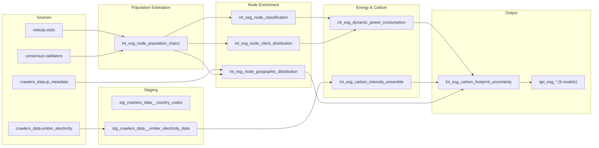

# ESG Data Pipeline

This page documents the complete dbt model DAG (directed acyclic graph) for the ESG reporting pipeline, including detailed specifications for every model from staging through to the final mart layer.

## Architecture Overview

The ESG pipeline follows the standard dbt layered architecture: **staging** models normalize raw source data, **intermediate** models apply business logic and statistical methods, and **mart** models produce the final fact tables and API-ready views.

!!! tip "Incremental Materialization"
    All intermediate and mart models are **incrementally materialized** and partitioned by date. On each dbt run, only new or updated date partitions are processed. dbt tests validate row counts, not-null constraints, and cross-model referential integrity.

---

## Staging Layer

### `stg_crawlers_data__country_codes`

Country code reference table providing standardized ISO 3166-1 mappings.

??? abstract "Model Specification"
    **Purpose**: Normalize country identifiers across all upstream data sources (Ember, IP geolocation, manual mappings) to a consistent ISO 3166-1 alpha-2 standard.

    **Inputs**:

    - `crawlers_data.country_codes` (seed/reference table)

    **Key Transformations**:

    - Standardize country name variations (e.g., "USA", "United States", "US" all map to `US`)
    - Map ISO alpha-3 codes to alpha-2
    - Handle disputed territories and historical country codes

    **Output Columns**:

    | Column | Type | Description |
    |:-------|:-----|:------------|
    | `country_code` | `String` | ISO 3166-1 alpha-2 code |
    | `country_name` | `String` | Standardized English country name |
    | `continent` | `String` | Continent classification |
    | `region` | `String` | Sub-continental region |

---

### `stg_crawlers_data__ember_electricity_data`

Ingests and normalizes raw Ember Global Electricity Review data.

??? abstract "Model Specification"
    **Purpose**: Transform raw Ember CSV data into a structured, query-ready format with standardized country codes and pivoted generation shares.

    **Inputs**:

    - `crawlers_data.ember_electricity` (raw CSV ingestion)
    - `stg_crawlers_data__country_codes` (country standardization)

    **Key Transformations**:

    - Parse Ember CSV columns (country, year, month, generation type, TWh)
    - Standardize country names to ISO 3166-1 alpha-2 via country codes reference
    - Pivot generation data from wide format (one column per fuel type) to long format
    - Calculate percentage shares per generation type per country-month
    - Filter to the most recent available month per country

    **Output Columns**:

    | Column | Type | Description |
    |:-------|:-----|:------------|
    | `country_code` | `String` | ISO 3166-1 alpha-2 code |
    | `date` | `Date` | First day of the month |
    | `generation_type` | `String` | Fuel/source type (coal, gas, solar, etc.) |
    | `generation_twh` | `Float64` | Generation in terawatt-hours |
    | `share_pct` | `Float64` | Percentage share of total generation |

---

## Intermediate Layer

### `int_esg_node_population_chao1`

Estimates the total node population (including hidden nodes) using the Chao-1 ecological estimator.

??? abstract "Model Specification"
    **Purpose**: Apply the Chao-1 nonparametric estimator to Nebula crawler observations to estimate the true network size, including nodes not directly observed.

    **Inputs**:

    - `nebula.visits` (crawler observation records)
    - `consensus.validators` (active validator set)

    **Key Transformations**:

    - Aggregate daily unique node observations from Nebula crawl sessions
    - Compute observation frequency histogram: $f_1$ (nodes seen exactly once), $f_2$ (nodes seen exactly twice)
    - Apply Chao-1 estimator: $\hat{N} = S_{obs} + \frac{f_1^2}{2 f_2}$
    - Compute standard error and confidence intervals using Chao's variance formula
    - Cross-reference with consensus layer validator count for validation

    **Output Columns**:

    | Column | Type | Description |
    |:-------|:-----|:------------|
    | `date` | `Date` | Observation date |
    | `nodes_observed` | `UInt32` | Directly observed unique nodes ($S_{obs}$) |
    | `f1` | `UInt32` | Nodes observed exactly once |
    | `f2` | `UInt32` | Nodes observed exactly twice |
    | `nodes_estimated` | `Float64` | Chao-1 population estimate ($\hat{N}$) |
    | `nodes_hidden` | `Float64` | Estimated hidden nodes ($\hat{N} - S_{obs}$) |
    | `std_error` | `Float64` | Standard error of the estimate |
    | `ci_lower_95` | `Float64` | 95% CI lower bound |
    | `ci_upper_95` | `Float64` | 95% CI upper bound |

---

### `int_esg_node_classification`

Classifies nodes into operational categories (Home, Professional, Cloud) based on observed characteristics.

??? abstract "Model Specification"
    **Purpose**: Assign each observed node to a category that determines its power consumption profile and PUE.

    **Inputs**:

    - `int_esg_node_population_chao1` (estimated node population)
    - Hosting provider and ASN reference data

    **Key Transformations**:

    - Match node IP addresses against known cloud provider ASN ranges (AWS, GCP, Azure, Hetzner, OVH, etc.)
    - Classify remaining nodes as Professional or Home based on ISP type, uptime patterns, and port configurations
    - Apply classification proportions to hidden node estimate (assumes hidden nodes follow same distribution)
    - Compute daily category counts with uncertainty

    **Output Columns**:

    | Column | Type | Description |
    |:-------|:-----|:------------|
    | `date` | `Date` | Observation date |
    | `category` | `String` | Node category: `home`, `professional`, `cloud` |
    | `nodes_observed` | `UInt32` | Observed nodes in this category |
    | `nodes_estimated` | `Float64` | Estimated total (including hidden) |
    | `fraction` | `Float64` | Category share of total network |
    | `classification_confidence` | `Float64` | Confidence score for classification |

---

### `int_esg_node_geographic_distribution`

Maps nodes to countries using IP geolocation data.

??? abstract "Model Specification"
    **Purpose**: Determine the geographic distribution of nodes across countries to enable country-level carbon intensity weighting.

    **Inputs**:

    - `int_esg_node_population_chao1` (estimated node population)
    - `crawlers_data.ip_metadata` (IP geolocation database)
    - `stg_crawlers_data__country_codes` (country standardization)

    **Key Transformations**:

    - Join node IPs to geolocation database for country-level resolution
    - Flag nodes using known VPN/proxy services (reduces misattribution)
    - Apply geographic distribution proportions to hidden node estimates
    - Aggregate to daily country-level node counts
    - Compute geographic concentration metrics (Herfindahl index)

    **Output Columns**:

    | Column | Type | Description |
    |:-------|:-----|:------------|
    | `date` | `Date` | Observation date |
    | `country_code` | `String` | ISO 3166-1 alpha-2 code |
    | `country_name` | `String` | Country name |
    | `continent` | `String` | Continent |
    | `nodes_observed` | `UInt32` | Observed nodes in country |
    | `nodes_estimated` | `Float64` | Estimated total in country |
    | `share_pct` | `Float64` | Country share of total network |
    | `is_vpn_flagged` | `Boolean` | Whether VPN/proxy detected |

---

### `int_esg_node_client_distribution`

Tracks the distribution of execution and consensus client software across the network.

??? abstract "Model Specification"
    **Purpose**: Determine which client software combinations nodes are running to assign client-specific power consumption estimates.

    **Inputs**:

    - `int_esg_node_population_chao1` (estimated node population)
    - Nebula client identification data

    **Key Transformations**:

    - Parse client user-agent strings from Nebula crawl data
    - Identify execution client (Nethermind, Erigon, etc.) and consensus client (Lighthouse, Teku, Lodestar, Nimbus)
    - Compute daily client pair distributions
    - Apply distribution proportions to hidden node estimates

    **Output Columns**:

    | Column | Type | Description |
    |:-------|:-----|:------------|
    | `date` | `Date` | Observation date |
    | `execution_client` | `String` | Execution layer client name |
    | `consensus_client` | `String` | Consensus layer client name |
    | `nodes_observed` | `UInt32` | Observed nodes with this client pair |
    | `nodes_estimated` | `Float64` | Estimated total with this client pair |
    | `share_pct` | `Float64` | Share of total network |

---

### `int_esg_dynamic_power_consumption`

Computes dynamic power consumption estimates per node category and client combination.

??? abstract "Model Specification"
    **Purpose**: Estimate per-node power consumption (watts) based on hardware category and client software, using CCRI benchmark data.

    **Inputs**:

    - `int_esg_node_classification` (node categories)
    - `int_esg_node_client_distribution` (client software distribution)
    - CCRI benchmark reference data

    **Key Transformations**:

    - Map client combinations to CCRI power consumption benchmarks
    - Apply category-specific PUE multipliers (Home=1.0, Professional=1.2, Cloud=1.1--1.4)
    - Compute weighted average power consumption across client distributions
    - Calculate power uncertainty bands from benchmark measurement variance
    - Produce total network energy consumption estimate (kWh/day)

    **Output Columns**:

    | Column | Type | Description |
    |:-------|:-----|:------------|
    | `date` | `Date` | Observation date |
    | `category` | `String` | Node category |
    | `client_pair` | `String` | Execution + consensus client |
    | `power_w` | `Float64` | Estimated power consumption (watts) |
    | `pue` | `Float64` | Power Usage Effectiveness factor |
    | `power_w_with_pue` | `Float64` | Power including PUE overhead |
    | `power_std` | `Float64` | Power uncertainty (1-sigma, watts) |
    | `energy_kwh_day` | `Float64` | Daily energy consumption (kWh) |

---

### `int_esg_carbon_intensity_ensemble`

Computes country-level carbon intensity with full uncertainty quantification.

??? abstract "Model Specification"
    **Purpose**: Transform Ember generation mix data into carbon intensity estimates (gCO2/kWh) with temporal and measurement uncertainty bands.

    **Inputs**:

    - `stg_crawlers_data__ember_electricity_data` (generation mix)
    - `stg_crawlers_data__country_codes` (country reference)
    - Emissions factor reference data

    **Key Transformations**:

    - Apply generation-type emissions factors to compute weighted average CI per country
    - Classify grids by CI range and assign grid-type uncertainty
    - Apply continent-level seasonal adjustment factors
    - Combine temporal and measurement uncertainties in quadrature
    - Apply fallback hierarchy for countries without Ember data

    See [Carbon Intensity Model](carbon-intensity.md) for full methodology details.

    **Output Columns**:

    | Column | Type | Description |
    |:-------|:-----|:------------|
    | `date` | `Date` | Reference date |
    | `country_code` | `String` | ISO 3166-1 alpha-2 code |
    | `ci_mean` | `Float64` | Carbon intensity mean (gCO2/kWh) |
    | `ci_std_total` | `Float64` | Combined uncertainty (gCO2/kWh) |
    | `ci_lower_95` | `Float64` | 95% CI lower bound |
    | `ci_upper_95` | `Float64` | 95% CI upper bound |
    | `seasonal_factor` | `Float64` | Applied seasonal adjustment |
    | `grid_classification` | `String` | Grid type (very clean/clean/mixed/fossil-heavy) |
    | `data_source` | `String` | Source: `ember`, `world_average`, or `fallback` |

---

## Mart Layer

### `fct_esg_carbon_footprint_uncertainty`

The central fact table producing daily carbon footprint estimates with full uncertainty propagation.

??? abstract "Model Specification"
    **Purpose**: Combine node population, power consumption, geographic distribution, and carbon intensity into a single daily carbon footprint estimate with disaggregated uncertainty.

    **Inputs**:

    - `int_esg_dynamic_power_consumption` (energy estimates)
    - `int_esg_carbon_intensity_ensemble` (CI estimates)
    - `int_esg_node_geographic_distribution` (country distribution)
    - `int_esg_node_population_chao1` (population estimates)
    - `int_esg_node_classification` (category breakdowns)

    **Key Transformations**:

    - Cross-join categories and countries to compute per-cell (category x country) emissions
    - Propagate uncertainties from all upstream sources in quadrature
    - Aggregate to daily network-level totals with combined uncertainty
    - Compute annualized projections (daily * 365.25)
    - Calculate confidence intervals at 68%, 90%, 95%, and 99% levels

    **Output**: A 56+ column fact table with daily granularity. Key column groups include:

    | Column Group | Example Columns | Description |
    |:-------------|:----------------|:------------|
    | Date & identity | `date` | Partition key |
    | Node counts | `nodes_observed`, `nodes_estimated`, `nodes_hidden`, `nodes_std` | Population estimates |
    | Category breakdown | `nodes_home`, `nodes_professional`, `nodes_cloud` | Per-category counts |
    | Energy | `energy_kwh_day`, `energy_kwh_day_std`, `energy_mwh_year` | Energy consumption |
    | Carbon intensity | `ci_effective`, `ci_effective_std` | Network-weighted CI |
    | Emissions | `co2_kg_day`, `co2_kg_day_std`, `co2_tonnes_year` | Carbon footprint |
    | Uncertainty | `combined_rel_uncertainty`, `co2_ci_lower_95`, `co2_ci_upper_95` | Confidence intervals |
    | Per-category emissions | `co2_kg_day_home`, `co2_kg_day_professional`, `co2_kg_day_cloud` | Disaggregated emissions |

---

### API Models

Nine API-facing models transform the fact table into endpoint-specific views. All are materialized as tables optimized for low-latency queries.

??? abstract "API Model Specifications"

    #### `api_esg_carbon_emissions_daily`
    Daily carbon emissions with headline metrics. Serves the primary emissions timeseries endpoint.

    - **Key columns**: `date`, `co2_kg_day`, `co2_kg_day_lower`, `co2_kg_day_upper`, `energy_kwh_day`, `nodes_estimated`
    - **Sort key**: `date DESC`

    ---

    #### `api_esg_carbon_emissions_annualised_latest`
    Latest annualized carbon emissions projection with uncertainty bounds. Single-row snapshot.

    - **Key columns**: `co2_tonnes_year`, `co2_tonnes_year_lower_95`, `co2_tonnes_year_upper_95`, `energy_mwh_year`, `as_of_date`

    ---

    #### `api_esg_carbon_timeseries_bands`
    Daily emissions with confidence bands for chart rendering. Includes 68%, 90%, and 95% intervals.

    - **Key columns**: `date`, `co2_kg_day`, `band_68_lower`, `band_68_upper`, `band_90_lower`, `band_90_upper`, `band_95_lower`, `band_95_upper`

    ---

    #### `api_esg_energy_monthly`
    Monthly aggregated energy consumption by category.

    - **Key columns**: `month`, `energy_kwh_total`, `energy_kwh_home`, `energy_kwh_professional`, `energy_kwh_cloud`

    ---

    #### `api_esg_energy_consumption_annualised_latest`
    Latest annualized energy consumption projection. Single-row snapshot.

    - **Key columns**: `energy_mwh_year`, `energy_mwh_year_lower`, `energy_mwh_year_upper`, `avg_power_per_node_w`, `as_of_date`

    ---

    #### `api_esg_cif_network_vs_countries_daily`
    Carbon intensity comparison: Gnosis network effective CI vs. individual countries.

    - **Key columns**: `date`, `network_ci`, `country_code`, `country_ci`, `network_vs_country_ratio`

    ---

    #### `api_esg_estimated_nodes_daily`
    Daily node count estimates with category breakdown.

    - **Key columns**: `date`, `nodes_observed`, `nodes_estimated`, `nodes_home`, `nodes_professional`, `nodes_cloud`, `nodes_hidden_pct`

    ---

    #### `api_esg_info_category_daily`
    Daily per-category breakdown of nodes, energy, and emissions.

    - **Key columns**: `date`, `category`, `nodes`, `energy_kwh`, `co2_kg`, `power_w_avg`, `pue`

    ---

    #### `api_esg_info_annual_daily`
    Rolling annual projections updated daily.

    - **Key columns**: `date`, `co2_tonnes_year`, `energy_mwh_year`, `co2_per_validator_kg_year`, `comparison_btc_ratio`, `comparison_eth_ratio`
