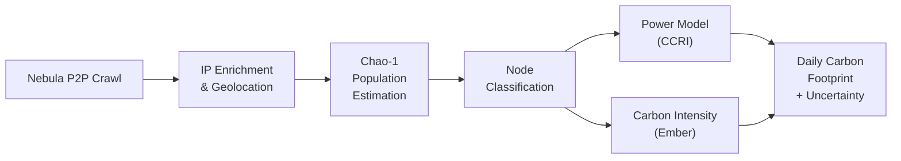

# ESG Reporting

The ESG module produces daily estimates of the **carbon emissions** (kg CO2) and **energy consumption** (kWh) attributable to operating the Gnosis Chain validator network. Every metric is published with full uncertainty bounds so that downstream consumers can assess confidence in the reported figures.

!!! abstract "What's in this section"
    This section covers the full ESG methodology, data pipeline, and reporting tools. For dbt model schemas and SQL query examples, see the [ESG Model Catalog](../models/esg.md).

---

## Key Outputs

| Metric | Unit | Granularity | Uncertainty |
|--------|------|-------------|-------------|
| Network carbon footprint | kg CO2 / day | Daily | 95% CI |
| Network energy consumption | kWh / day | Daily | 95% CI |
| Per-validator carbon footprint | g CO2 / validator / day | Daily | 95% CI |
| Per-validator energy consumption | Wh / validator / day | Daily | 95% CI |
| Carbon intensity factor | gCO2 / kWh | Daily | By country |
| Node population estimate | Nodes | Daily | 95% CI (Chao-1) |

---

## Estimation Pipeline

The end-to-end calculation follows five sequential stages, each implemented as one or more dbt models:

| Stage | Method | Documentation |
|-------|--------|---------------|
| 1. Population estimation | Chao-1 nonparametric estimator + failure recovery | [Node Population](node-population.md) |
| 2. Node classification | ASN-based classification into Home / Professional / Cloud | [Node Classification](node-classification.md) |
| 3. Power consumption | CCRI hardware profiles, client efficiency, PUE | [Power Model](power-model.md) |
| 4. Carbon intensity | Ember electricity data, seasonal adjustments | [Carbon Intensity](carbon-intensity.md) |
| 5. Final footprint | Per-category, per-country aggregation + uncertainty propagation | [Carbon Footprint](carbon-footprint.md) |

---

## Gnosis Chain vs. Other Networks

Gnosis Chain uses Proof-of-Stake consensus with only 1 GNO per validator, resulting in one of the lowest energy footprints of any blockchain network:

| Network | Consensus | Annual Energy (est.) | Ratio |
|---------|-----------|----------------------|-------|
| Gnosis Chain | Proof-of-Stake (1 GNO) | ~500--1,000 MWh | 1x |
| Ethereum | Proof-of-Stake (32 ETH) | ~2,600 MWh | ~3--5x |
| Bitcoin | Proof-of-Work | ~130,000,000 MWh | ~150,000x |

!!! info "Orders of Magnitude"
    Gnosis Chain's energy consumption is approximately **5 orders of magnitude** lower than Bitcoin and roughly **3x lower** than Ethereum (due to lower hardware requirements per validator).

---

## Data Sources

The ESG module combines data from multiple external and internal sources:

| Source | Database | Used For |
|--------|----------|----------|
| [Nebula P2P crawler](../data-pipeline/crawlers/nebula.md) | `nebula` | Node discovery, peer contact frequency |
| [IP geolocation crawler](../data-pipeline/crawlers/ip-crawler.md) | `crawlers_data` | ASN classification, country mapping |
| [Ember Global Electricity Review](https://ember-climate.org/data/) | `crawlers_data` | Country-level carbon intensity factors |
| Consensus layer data | `consensus` | Active validator counts, client distribution |
| [CCRI 2022 Study](https://carbon-ratings.com/) | Built-in | Hardware power consumption profiles |

---

## Section Guide

-   :material-account-group: **[Node Population](node-population.md)**

    Chao-1 nonparametric estimator for hidden node discovery, failure-recovery augmentation, and population confidence intervals.

-   :material-tag-outline: **[Node Classification](node-classification.md)**

    ASN-based classification of validators into Home Staker, Professional, and Cloud Hosted archetypes.

-   :material-lightning-bolt: **[Power Model](power-model.md)**

    CCRI hardware profiles, per-client efficiency multipliers, diversity bonus, and PUE factors.

-   :material-molecule-co2: **[Carbon Intensity](carbon-intensity.md)**

    Ember electricity data integration, grid-type uncertainty, seasonal adjustments, and fallback hierarchy.

-   :material-calculator: **[Carbon Footprint](carbon-footprint.md)**

    Final emissions formula, uncertainty propagation, confidence intervals, limitations, and references.

-   :material-pipe: **[Data Pipeline](data-pipeline.md)**

    Full dbt model DAG with detailed specs for all 18 ESG models across staging, intermediate, and mart layers.

-   :material-monitor-dashboard: **[Dashboard & API](dashboard-api.md)**

    ESG dashboard tabs, available API endpoints, response schemas, and query examples.

