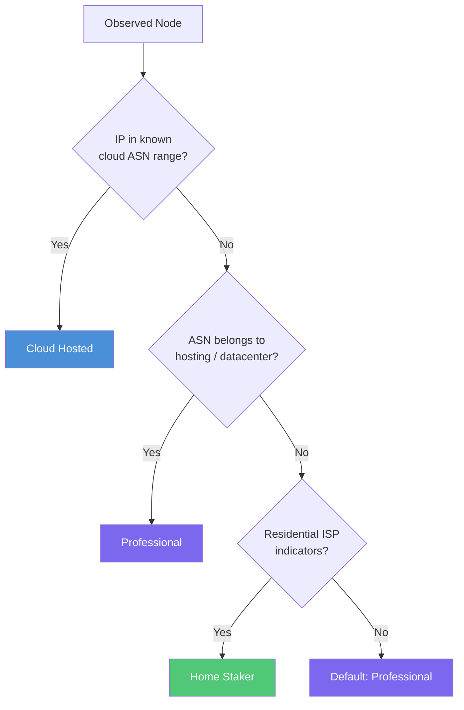
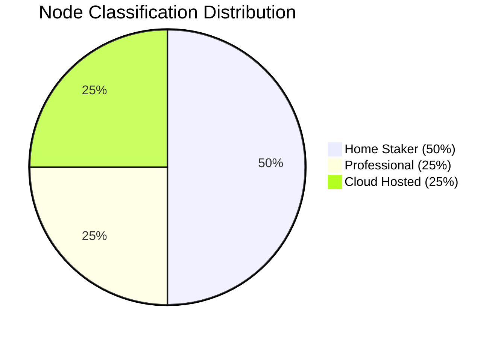

# Node Classification

## Overview

Once the total node population has been estimated, each node must be classified
into one of three categories. The classification drives the power model because
each category has a fundamentally different hardware profile and energy footprint.

| Category | Description |
|---|---|
| **Home Staker** | Consumer-grade hardware (NUC, Raspberry Pi, mini-PC) on a residential ISP |
| **Professional** | Dedicated bare-metal servers in co-location facilities or managed hosting |
| **Cloud Hosted** | Virtual machines running on hyperscale cloud providers (AWS, GCP, Azure, etc.) |



---

## Classification Criteria

The classification engine evaluates multiple signals for each node. Signals are
weighted by confidence and resolved through a strict priority hierarchy.

| Category | Signal | Confidence | Power Tier |
|---|---|---|---|
| **Cloud Hosted** | IP belongs to a known cloud provider ASN (AWS, GCP, Azure, Hetzner, OVH, DigitalOcean) | High | 155 W |
| **Cloud Hosted** | Reverse DNS matches cloud naming patterns (e.g., `*.compute.amazonaws.com`) | High | 155 W |
| **Professional** | ASN registered to a datacenter or hosting provider (non-cloud) | Medium | 48 W |
| **Professional** | Low-latency, high-uptime pattern consistent with co-located servers | Medium | 48 W |
| **Home Staker** | ASN registered to a residential ISP | Medium | 22 W |
| **Home Staker** | IP geolocation resolves to a residential area with typical consumer latency patterns | Low | 22 W |
| **Home Staker** | Dynamic IP address observed across crawl sessions | Low | 22 W |

---

## Classification Hierarchy

The classifier follows a **strict priority order** to resolve ambiguities. The
first matching rule wins.

1. **Cloud ASN match** -- If the node's IP falls within a known cloud provider
   range, classify as **Cloud Hosted** regardless of other signals.
2. **Hosting / datacenter ASN** -- If the ASN is registered to a non-cloud
   hosting provider or datacenter, classify as **Professional**.
3. **Residential ISP indicators** -- If the ASN belongs to a residential ISP and
   geolocation plus latency patterns are consistent, classify as **Home Staker**.
4. **Default** -- If none of the above rules match, apply the default.

!!! warning "Unclassified nodes default to Professional"
    Nodes that cannot be confidently classified are assigned to the **Professional**
    category. This is a deliberate conservative choice: Professional nodes have a
    mid-range power draw (48 W), so the default avoids both the underestimate that
    would come from defaulting to Home Staker and the overestimate from defaulting
    to Cloud Hosted.

---

## Cloud Provider Detection

Cloud classification relies on matching each node's IP address against known
**Autonomous System Numbers (ASNs)** published by major cloud providers.

### Tracked Cloud Providers

| Provider | ASN(s) | Detection Method |
|---|---|---|
| **AWS** | AS16509, AS14618 | ASN match + reverse DNS (`*.amazonaws.com`) |
| **Google Cloud (GCP)** | AS15169, AS396982 | ASN match + reverse DNS (`*.googleusercontent.com`) |
| **Microsoft Azure** | AS8075 | ASN match + reverse DNS (`*.azure.com`) |
| **Hetzner** | AS24940 | ASN match |
| **OVH** | AS16276 | ASN match |
| **DigitalOcean** | AS14061 | ASN match |
| **Contabo** | AS51167 | ASN match |
| **Vultr** | AS20473 | ASN match |

!!! note "ASN databases are updated weekly"
    Cloud providers frequently add and retire IP ranges. The ASN-to-provider
    mapping is refreshed weekly from RIPE, ARIN, and provider-published IP
    range feeds to maintain classification accuracy.

---

## dbt Implementation

Node classification is implemented across two intermediate dbt models.

### `int_nodes_geolocated`

This model enriches raw node observations with geographic and network metadata.

```sql
-- int_nodes_geolocated.sql
-- IP enrichment, VPN flagging, and latency checks

SELECT
    n.peer_id,
    n.ip_address,
    -- Geographic enrichment from MaxMind GeoIP2
    geo.country_code,
    geo.city,
    geo.latitude,
    geo.longitude,
    -- ASN enrichment
    asn.autonomous_system_number AS asn_number,
    asn.autonomous_system_organization AS asn_org,
    -- VPN / proxy detection
    CASE
        WHEN vpn.ip_address IS NOT NULL THEN true
        WHEN asn.autonomous_system_organization ILIKE '%vpn%' THEN true
        WHEN asn.autonomous_system_organization ILIKE '%proxy%' THEN true
        ELSE false
    END AS is_vpn_flagged,
    -- Latency statistics from crawl probes
    avg(n.latency_ms) AS avg_latency_ms,
    stddevPop(n.latency_ms) AS stddev_latency_ms,
    count(DISTINCT toDate(n.crawl_timestamp)) AS days_active,
    count(DISTINCT n.ip_address) AS distinct_ips_observed
FROM {{ ref('stg_chao1_observers') }} n
LEFT JOIN {{ ref('stg_maxmind_geoip') }} geo
    ON n.ip_address = geo.ip_address
LEFT JOIN {{ ref('stg_maxmind_asn') }} asn
    ON n.ip_address = asn.ip_address
LEFT JOIN {{ ref('stg_vpn_ip_ranges') }} vpn
    ON n.ip_address = vpn.ip_address
GROUP BY
    n.peer_id, n.ip_address,
    geo.country_code, geo.city, geo.latitude, geo.longitude,
    asn.autonomous_system_number, asn.autonomous_system_organization,
    vpn.ip_address
```

**Key enrichments:**

| Enrichment | Source | Purpose |
|---|---|---|
| Geolocation | MaxMind GeoIP2 | Country, city, lat/lon for geographic distribution |
| ASN metadata | MaxMind ASN | Autonomous system number and organization name |
| VPN flagging | VPN IP range database | Flag nodes using known VPN/proxy services |
| Latency stats | Crawl probe data | Average and standard deviation for staking pattern analysis |

### `int_esg_node_classification`

This model applies the classification hierarchy using CASE statements and cloud
IP range matching.

```sql
-- int_esg_node_classification.sql
-- Classifies nodes into Home Staker, Professional, or Cloud Hosted

WITH cloud_asns AS (
    SELECT asn_number, provider_name
    FROM {{ ref('stg_cloud_provider_asns') }}
),

classified AS (
    SELECT
        g.peer_id,
        g.ip_address,
        g.country_code,
        g.city,
        g.asn_number,
        g.asn_org,
        g.is_vpn_flagged,
        g.avg_latency_ms,

        -- Classification CASE: strict priority order
        CASE
            -- Priority 1: Cloud provider ASN match
            WHEN c.asn_number IS NOT NULL
                THEN 'Cloud Hosted'

            -- Priority 2: Hosting / datacenter ASN patterns
            WHEN g.asn_org ILIKE '%hosting%'
                OR g.asn_org ILIKE '%datacenter%'
                OR g.asn_org ILIKE '%data center%'
                OR g.asn_org ILIKE '%colocation%'
                OR g.asn_org ILIKE '%server%'
                THEN 'Professional'

            -- Priority 3: Residential ISP indicators
            WHEN g.asn_org ILIKE '%telecom%'
                OR g.asn_org ILIKE '%broadband%'
                OR g.asn_org ILIKE '%cable%'
                OR g.asn_org ILIKE '%fiber%'
                OR g.asn_org ILIKE '%dsl%'
                OR g.asn_org ILIKE '%residential%'
                OR g.asn_org ILIKE '%mobile%'
                THEN 'Home Staker'

            -- Default: Professional (conservative mid-range estimate)
            ELSE 'Professional'
        END AS node_category,

        -- Confidence score
        CASE
            WHEN c.asn_number IS NOT NULL THEN 'high'
            WHEN g.asn_org ILIKE '%hosting%'
                OR g.asn_org ILIKE '%datacenter%' THEN 'medium'
            WHEN g.asn_org ILIKE '%telecom%'
                OR g.asn_org ILIKE '%broadband%' THEN 'medium'
            ELSE 'low'
        END AS classification_confidence,

        -- Cloud provider name (if applicable)
        c.provider_name AS cloud_provider

    FROM {{ ref('int_nodes_geolocated') }} g
    LEFT JOIN cloud_asns c
        ON g.asn_number = c.asn_number
)

SELECT * FROM classified
```

**Output columns:**

| Column | Type | Description |
|---|---|---|
| `peer_id` | `String` | Unique libp2p peer identifier |
| `node_category` | `String` | One of: `Home Staker`, `Professional`, `Cloud Hosted` |
| `classification_confidence` | `String` | `high`, `medium`, or `low` |
| `cloud_provider` | `String` | Provider name if Cloud Hosted, else `NULL` |

---

## Typical Distribution

The table below shows a representative classification distribution for the
Gnosis Chain network:

| Category | Estimated Count | Share | Avg Power Draw |
|---|---|---|---|
| **Home Staker** | ~1,100 | ~50 % | 22 W |
| **Professional** | ~550 | ~25 % | 48 W |
| **Cloud Hosted** | ~550 | ~25 % | 155 W |
| **Total** | **~2,200** | **100 %** | -- |



!!! info "Home stakers are the majority"
    Gnosis Chain's low hardware requirements (validators can run on a Raspberry Pi
    or NUC) result in a significantly higher proportion of home stakers compared to
    other Proof-of-Stake networks. This directly contributes to lower average
    per-node energy consumption.

??? example "Example classification output"
    ```
    peer_id                    | node_category  | confidence | cloud_provider
    ---------------------------+----------------+------------+---------------
    16Uiu2HAm...abc            | Cloud Hosted   | high       | AWS
    16Uiu2HAm...def            | Home Staker    | medium     | NULL
    16Uiu2HAm...ghi            | Professional   | medium     | NULL
    16Uiu2HAm...jkl            | Cloud Hosted   | high       | Hetzner
    16Uiu2HAm...mno            | Home Staker    | medium     | NULL
    16Uiu2HAm...pqr            | Professional   | low        | NULL
    ```
