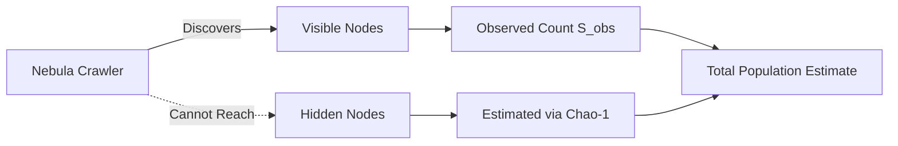
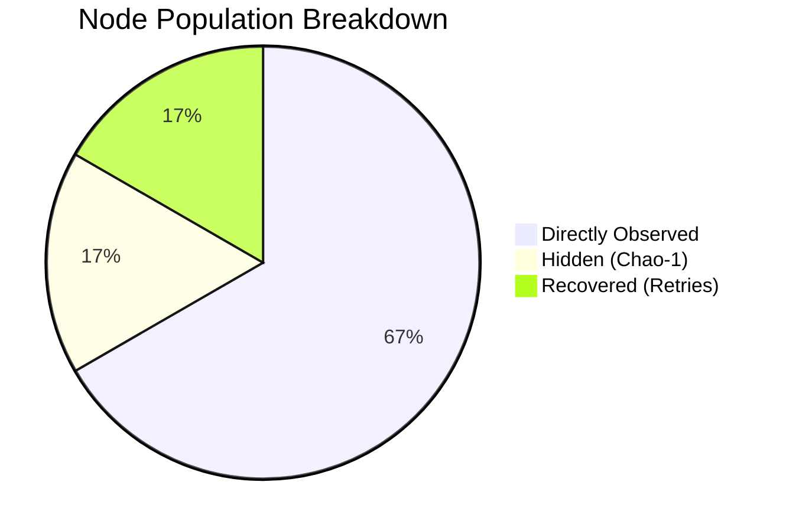

# Node Population Estimation

## The Hidden-Node Problem

Network crawlers such as Nebula traverse the Gnosis Chain's libp2p DHT and record every peer they can reach. However, a significant fraction of validators sit behind NAT gateways, firewalls, or restrictive cloud security groups and are never directly contacted. Reporting only the *observed* node count would systematically underestimate the true network size and, by extension, the energy footprint.



!!! warning "Why raw counts are insufficient"
    A naive count of observed peers typically captures only **55--65 %** of the true
    validator population. Nodes behind NAT, VPN tunnels, or ephemeral cloud instances
    are systematically missed, leading to a substantial undercount of both network
    size and energy consumption.

---

## Chao-1 Nonparametric Estimator

The module applies the **Chao-1 estimator** (Chao, 1984), a species-richness method from ecology that infers the number of unseen classes from the frequency distribution of rare observations. In our context, a "class" is a unique node and the observation frequency is the number of independent crawl sessions in which that node was successfully contacted.

### Definitions

| Symbol | Meaning |
|--------|---------|
| `S_obs` | Number of distinct nodes observed across all crawl sessions |
| `f1` | Number of **singletons** -- nodes seen in exactly **1** session |
| `f2` | Number of **doubletons** -- nodes seen in exactly **2** sessions |

### Standard Chao-1 Formula

The standard Chao-1 estimate of total node population is:

$$
\hat{S}_{\text{Chao1}} = S_{\text{obs}} + \frac{f_1^2}{2 \, f_2}
$$

### Bias-Corrected Form

When $f_2 = 0$ (no doubletons), the bias-corrected form is used:

$$
\hat{S}_{\text{Chao1}} = S_{\text{obs}} + \frac{f_1 \,(f_1 - 1)}{2}
$$

!!! tip "When to use the bias-corrected form"
    In practice, $f_2 = 0$ is rare for multi-session crawls. The bias-corrected
    variant guards against division-by-zero and is automatically selected by the
    dbt model when the doubleton count drops to zero.

### Variance and Confidence Intervals

The analytical variance of the Chao-1 estimator is:

$$
\widehat{\text{Var}}(\hat{S}_{\text{Chao1}}) = f_2 \left[\frac{1}{4}\left(\frac{f_1}{f_2}\right)^4 + \left(\frac{f_1}{f_2}\right)^3 + \frac{1}{2}\left(\frac{f_1}{f_2}\right)^2\right]
$$

A **95 % confidence interval** is constructed using a log-transformation to ensure
the lower bound never falls below `S_obs`:

$$
\left[\; S_{\text{obs}} + \frac{\hat{S}_{\text{Chao1}} - S_{\text{obs}}}{C}, \;\; S_{\text{obs}} + C \cdot (\hat{S}_{\text{Chao1}} - S_{\text{obs}}) \;\right]
$$

where $C = \exp\!\bigl(1.96 \sqrt{\ln(1 + \widehat{\text{Var}} / (\hat{S}_{\text{Chao1}} - S_{\text{obs}})^2)}\bigr)$.

!!! note "Reference: Chao & Chiu (2016)"
    The log-transform confidence interval follows the methodology described in
    Chao & Chiu (2016), *Species Richness: Estimation and Comparison*. The
    log-normal approach yields asymmetric intervals that respect the natural
    lower bound of $S_{\text{obs}}$ and perform well even when the sample
    coverage is low.

---

## Failure-Recovery Augmentation

Not every failed connection represents a permanently invisible node. Some failures are transient and can be resolved by retry logic. The recovery layer re-attempts failed peers and assigns a **recovery rate** based on the failure type:

| Failure Mode | Recovery Rate | Description |
|---|---|---|
| **Timeout** | 30 % | Peer was reachable but did not respond within the deadline |
| **Connection Refused** | 10 % | TCP handshake rejected; port may be intermittently closed |
| **Unreachable** | 5 % | No route to host; typically hard NAT or offline nodes |
| **Protocol Mismatch** | 80 % | Peer responded but with an incompatible protocol version |
| **Other** | 20 % | Catch-all for unclassified connection errors |

### Recovered Count Formula

The recovered node count for each failure category is:

$$
N_{\text{recovered}} = \sum_{i \in \text{failure types}} \text{failed}_i \times \text{rate}_i
$$

The total adjusted population becomes:

$$
\hat{S}_{\text{total}} = \hat{S}_{\text{Chao1}} + N_{\text{recovered}}
$$

!!! warning "Recovery rates are empirically calibrated"
    The rates above are derived from periodic full-retry experiments run against
    the Gnosis Chain mainnet. They are reviewed quarterly and may change as
    network conditions evolve.

---

## dbt Implementation

The Chao-1 estimation is split across two dbt models: a staging model that
consolidates raw crawl data and an intermediate model that computes the
estimator.

### `stg_chao1_observers`

This staging model consolidates crawl data from multiple independent observer
instances into a single unified stream. Each observer contributes its own
perspective of the network, which is essential for the frequency-based estimator.

```sql
-- stg_chao1_observers.sql
-- Consolidates crawl data from multiple observer instances

WITH observer_alpha AS (
    SELECT
        crawl_timestamp,
        peer_id,
        ip_address,
        'alpha' AS observer_id
    FROM {{ source('nebula', 'crawl_results_alpha') }}
),

observer_beta AS (
    SELECT
        crawl_timestamp,
        peer_id,
        ip_address,
        'beta' AS observer_id
    FROM {{ source('nebula', 'crawl_results_beta') }}
)

SELECT * FROM observer_alpha
UNION ALL
SELECT * FROM observer_beta
```

**Output columns:**

| Column | Type | Description |
|---|---|---|
| `crawl_timestamp` | `DateTime` | Timestamp of the crawl session |
| `peer_id` | `String` | Unique libp2p peer identifier |
| `ip_address` | `String` | IP address observed during the crawl |
| `observer_id` | `String` | Identifier for the observer instance (`alpha`, `beta`, etc.) |

### `int_esg_node_population_chao1`

This intermediate model groups crawl observations into hourly windows and
applies the Chao-1 estimator within each window.

```sql
-- int_esg_node_population_chao1.sql
-- Applies Chao-1 estimator in hourly windows

WITH peer_frequencies AS (
    -- Count how many sessions each peer was seen in per hour
    SELECT
        toStartOfHour(crawl_timestamp) AS hour_timestamp,
        peer_id,
        count(DISTINCT observer_id) AS session_count
    FROM {{ ref('stg_chao1_observers') }}
    GROUP BY hour_timestamp, peer_id
),

singletons AS (
    -- F1: peers seen in exactly 1 session
    SELECT
        hour_timestamp,
        countIf(session_count = 1) AS f1
    FROM peer_frequencies
    GROUP BY hour_timestamp
),

doubletons AS (
    -- F2: peers seen in exactly 2 sessions
    SELECT
        hour_timestamp,
        countIf(session_count = 2) AS f2
    FROM peer_frequencies
    GROUP BY hour_timestamp
),

observed AS (
    -- S_obs: total distinct peers per hour
    SELECT
        hour_timestamp,
        count(DISTINCT peer_id) AS s_obs
    FROM peer_frequencies
    GROUP BY hour_timestamp
)

SELECT
    o.hour_timestamp,
    o.s_obs,
    s.f1,
    d.f2,
    -- Chao-1 estimate (bias-corrected when f2 = 0)
    CASE
        WHEN d.f2 > 0
            THEN o.s_obs + (pow(s.f1, 2) / (2.0 * d.f2))
        ELSE
            o.s_obs + (s.f1 * (s.f1 - 1)) / 2.0
    END AS chao1_estimate,
    -- 7-day moving average for smoothing
    avg(
        CASE
            WHEN d.f2 > 0
                THEN o.s_obs + (pow(s.f1, 2) / (2.0 * d.f2))
            ELSE
                o.s_obs + (s.f1 * (s.f1 - 1)) / 2.0
        END
    ) OVER (
        ORDER BY o.hour_timestamp
        ROWS BETWEEN 167 PRECEDING AND CURRENT ROW  -- 7 days * 24 hours
    ) AS chao1_estimate_7day_avg
FROM observed o
LEFT JOIN singletons s ON o.hour_timestamp = s.hour_timestamp
LEFT JOIN doubletons d ON o.hour_timestamp = d.hour_timestamp
ORDER BY o.hour_timestamp
```

**Output columns:**

| Column | Type | Description |
|---|---|---|
| `hour_timestamp` | `DateTime` | Start of the hourly observation window |
| `chao1_estimate` | `Float64` | Point estimate of total node population |
| `chao1_estimate_7day_avg` | `Float64` | 7-day rolling average of the Chao-1 estimate |

---

## Typical Results

The table below shows a representative breakdown for a recent estimation window:

| Component | Count | Source |
|---|---|---|
| Directly observed nodes (`S_obs`) | ~1,200 | Nebula crawl sessions |
| Hidden nodes (Chao-1 unseen estimate) | ~300 | $f_1^2 / (2 f_2)$ |
| Recovered from failed connections | ~300 | Failure-recovery augmentation |
| **Total estimated population** | **~2,200** | Combined estimate |

!!! info "Why this matters"
    Without the Chao-1 estimator and failure-recovery augmentation, the reported
    node count would be roughly **1,200** instead of **2,200** -- an undercount
    of approximately **45 %**. This directly affects the accuracy of the network's
    energy consumption estimate and, consequently, the ESG report's credibility.


