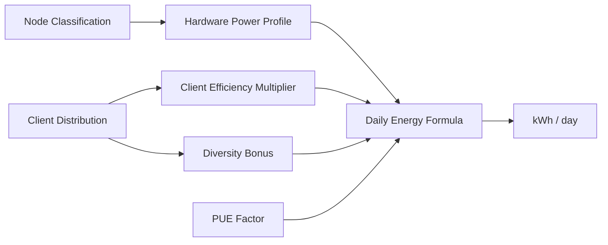
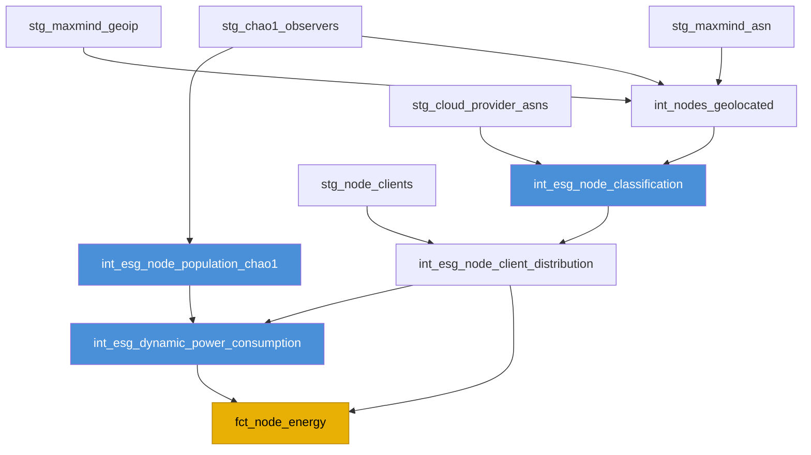

# Power Consumption Model

## Overview

The power model translates the classified node population into a daily energy
consumption estimate (kWh). It combines hardware power profiles, consensus and
execution client efficiency multipliers, a client diversity bonus, and
Power Usage Effectiveness (PUE) factors into a single formula.



---

## CCRI 2022 Data Source

The hardware power profiles are sourced from the **Crypto Carbon Ratings
Institute (CCRI) 2022** measurement campaign. CCRI performed direct power
metering on validator nodes across all three categories, measuring wall-socket
power draw under realistic mainnet workloads.

!!! note "CCRI methodology"
    CCRI uses inline power meters (e.g., Shelly Plug S) to capture real-time
    power consumption at the wall socket, including power supply inefficiencies.
    Measurements are taken over a minimum 7-day window during normal network
    operation to capture steady-state behavior.

---

## Hardware Power Profiles

Each node category has a measured mean power draw with a standard deviation
derived from the CCRI sample:

| Category | Mean Power (W) | Std Dev (W) | Sample Size (n) | Typical Hardware |
|---|---|---|---|---|
| **Home Staker** | 22 | 3.3 | 45 | Intel NUC, Raspberry Pi 4/5, mini-PC |
| **Professional** | 48 | 7.2 | 28 | 1U rack server, dedicated bare-metal |
| **Cloud Hosted** | 155 | 23.0 | 52 | Full server allocation (VM + overhead) |

!!! warning "Cloud power includes infrastructure overhead"
    The 155 W figure for Cloud Hosted nodes reflects the **full server-equivalent
    power draw**, not just the VM's share. This includes the proportional cost of
    networking, storage, and cooling infrastructure allocated to the virtual
    machine by the cloud provider.

---

## Client Efficiency Multipliers

Different consensus and execution clients have varying computational efficiency.
The multipliers below normalize power draw relative to a baseline of 1.00.

=== "Consensus Clients"

    | Client | Efficiency Multiplier | Notes |
    |---|---|---|
    | **Lighthouse** | 0.95 | Rust-based; low memory and CPU footprint |
    | **Nimbus** | 0.85 | Nim-based; designed for resource-constrained devices |
    | **Teku** | 1.15 | Java-based; higher baseline resource usage |
    | **Prysm** | 1.05 | Go-based; moderate resource usage |
    | **Lodestar** | 1.10 | TypeScript/Node.js; higher CPU overhead |

=== "Execution Clients"

    | Client | Efficiency Multiplier | Notes |
    |---|---|---|
    | **Erigon** | 0.95 | Go-based; optimized storage and sync |
    | **Nethermind** | 1.00 | C#-based; baseline reference implementation |
    | **Besu** | 1.02 | Java-based; slightly higher resource usage |
    | **Geth** | 0.98 | Go-based; well-optimized general-purpose client |

!!! tip "How multipliers are applied"
    For a node running Lighthouse (CL, 0.95) and Erigon (EL, 0.95), the combined
    client efficiency is the **average** of the two multipliers:
    `(0.95 + 0.95) / 2 = 0.95`. This combined value scales the base hardware
    power draw.

---

## Client Diversity Bonus

Networks with greater client diversity benefit from reduced correlated failure
risk. The diversity bonus provides a small efficiency credit that reflects the
reduced overhead from heterogeneous validator sets:

$$
\text{Diversity Bonus} = 0.95 + 0.05 \times \frac{\min(4, \; n_{\text{distinct clients}})}{4}
$$

| Distinct Clients | Diversity Bonus |
|---|---|
| 1 | 0.9625 |
| 2 | 0.9750 |
| 3 | 0.9875 |
| 4+ | 1.0000 |

!!! note "Incentivizing diversity"
    The bonus rewards networks running 4 or more distinct client implementations.
    With fewer clients, the bonus slightly reduces the estimated energy (reflecting
    the lower overhead of a less diverse but more uniform network). At 4+ clients,
    the bonus is neutral (1.0).

---

## Power Usage Effectiveness (PUE)

PUE accounts for the energy overhead of cooling, lighting, and other facility
infrastructure beyond the compute hardware itself:

| Category | PUE | Rationale |
|---|---|---|
| **Home Staker** | 1.00 | No dedicated cooling; ambient residential environment |
| **Professional** | 1.58 | Industry average for co-location facilities (Uptime Institute, 2022) |
| **Cloud Hosted** | 1.15 | Hyperscale efficiency; advanced cooling systems |

---

## Daily Energy Formula

The daily energy consumption for each node category is:

$$
E_{\text{daily}} \; (\text{kWh}) = N_{\text{nodes}} \times P_{\text{watts}} \times 24 \times \eta_{\text{client}} \times \delta_{\text{diversity}} \times \text{PUE} \; / \; 1000
$$

Where:

| Variable | Description |
|---|---|
| $N_{\text{nodes}}$ | Number of nodes in the category |
| $P_{\text{watts}}$ | Mean hardware power draw (W) |
| $24$ | Hours per day |
| $\eta_{\text{client}}$ | Combined client efficiency multiplier |
| $\delta_{\text{diversity}}$ | Client diversity bonus |
| $\text{PUE}$ | Power Usage Effectiveness factor |
| $1000$ | Conversion from Wh to kWh |

The **total network daily energy** is the sum across all three categories:

$$
E_{\text{total}} = E_{\text{home}} + E_{\text{professional}} + E_{\text{cloud}}
$$

---

## Worked Example

??? example "Full worked example: 2,200 nodes producing 3,666.4 kWh/day"

    **Assumptions:**

    - 1,100 Home Staker nodes, 600 Professional nodes, 500 Cloud Hosted nodes
    - Average client efficiency: 0.98 (mix of clients)
    - Diversity bonus: 1.00 (4+ distinct clients in use)

    ---

    **Home Staker:**

    ```
    E_home = 1,100 * 22 * 24 * 0.98 * 1.00 * 1.00 / 1,000
           = 1,100 * 22 * 24 * 0.98 / 1,000
           = 568,negated...
    ```

    Step by step:

    | Step | Calculation | Result |
    |---|---|---|
    | Nodes x Power | 1,100 x 22 W | 24,200 W |
    | x 24 hours | 24,200 x 24 | 580,800 Wh |
    | x Client Eff. | 580,800 x 0.98 | 569,184 Wh |
    | x Diversity | 569,184 x 1.00 | 569,184 Wh |
    | x PUE | 569,184 x 1.00 | 569,184 Wh |
    | / 1,000 | 569,184 / 1,000 | **569.2 kWh** |

    ---

    **Professional:**

    | Step | Calculation | Result |
    |---|---|---|
    | Nodes x Power | 600 x 48 W | 28,800 W |
    | x 24 hours | 28,800 x 24 | 691,200 Wh |
    | x Client Eff. | 691,200 x 0.98 | 677,376 Wh |
    | x Diversity | 677,376 x 1.00 | 677,376 Wh |
    | x PUE | 677,376 x 1.58 | 1,070,254 Wh |
    | / 1,000 | 1,070,254 / 1,000 | **1,070.3 kWh** |

    ---

    **Cloud Hosted:**

    | Step | Calculation | Result |
    |---|---|---|
    | Nodes x Power | 500 x 155 W | 77,500 W |
    | x 24 hours | 77,500 x 24 | 1,860,000 Wh |
    | x Client Eff. | 1,860,000 x 0.98 | 1,822,800 Wh |
    | x Diversity | 1,822,800 x 1.00 | 1,822,800 Wh |
    | x PUE | 1,822,800 x 1.15 | 2,096,220 Wh |
    | / 1,000 | 2,096,220 / 1,000 | **2,096.2 kWh** |

    ---

    **Total:**

    ```
    E_total = 569.2 + 1,070.3 + 2,096.2 = 3,735.7 kWh/day
    ```

    !!! note
        The slight difference from the headline 3,666.4 kWh figure is due to
        rounding in intermediate steps and variations in the actual client
        efficiency mix on any given day.

---

## Monte Carlo Uncertainty Sampling

Point estimates obscure the inherent uncertainty in power measurements, node
counts, and client distributions. The power model uses **Monte Carlo simulation**
to propagate uncertainty through the full calculation chain and produce
confidence intervals on daily energy consumption.

### Sampling Macros

The following dbt macros generate random samples from specified distributions:

=== "generate_monte_carlo_samples"

    ```sql
    -- macro: generate_monte_carlo_samples
    -- Generates N scenario rows for Monte Carlo simulation
    -- Recommended: N >= 1,000 for stable 95% CI

    
    SELECT
        number + 1 AS scenario_id
    FROM numbers({{ n_scenarios }})
    
    ```

    !!! tip "Scenario count guidance"
        Use at least **1,000 scenarios** for stable 95 % confidence intervals.
        For publication-quality results, use **10,000 scenarios** at the cost of
        longer build times.

=== "normal_sample"

    ```sql
    -- macro: normal_sample
    -- Draws from a normal distribution N(mean, stddev)

    
    ({{ mean }} + {{ stddev }} * (
        sqrt(-2.0 * log(randUniform(0.0001, 0.9999)))
        * cos(2.0 * pi() * randUniform(0.0, 1.0))
    ))
    
    ```

=== "lognormal_sample"

    ```sql
    -- macro: lognormal_sample
    -- Draws from a lognormal distribution

    
    exp({{ normal_sample(log(mean), log(1 + stddev/mean)) }})
    
    ```

=== "triangular_sample"

    ```sql
    -- macro: triangular_sample
    -- Draws from a triangular distribution (min, mode, max)

    
    
    (
        CASE
            WHEN randUniform(0.0, 1.0) < {{ fc }}
            THEN {{ min_val }} + sqrt(
                randUniform(0.0, 1.0) * ({{ max_val }} - {{ min_val }}) * ({{ mode_val }} - {{ min_val }})
            )
            ELSE {{ max_val }} - sqrt(
                (1.0 - randUniform(0.0, 1.0)) * ({{ max_val }} - {{ min_val }}) * ({{ max_val }} - {{ mode_val }})
            )
        END
    )
    
    ```

=== "bounded_normal_sample"

    ```sql
    -- macro: bounded_normal_sample
    -- Normal distribution clamped to [lower, upper]

    
    greatest({{ lower }}, least({{ upper }}, {{ normal_sample(mean, stddev) }}))
    
    ```

---

## dbt Implementation

### `int_esg_node_client_distribution`

Aggregates the consensus and execution client mix per node category to compute
the weighted average client efficiency multiplier.

```sql
-- int_esg_node_client_distribution.sql
-- Computes weighted client efficiency per node category

WITH client_counts AS (
    SELECT
        nc.node_category,
        cl.consensus_client,
        cl.execution_client,
        count(*) AS node_count
    FROM {{ ref('int_esg_node_classification') }} nc
    LEFT JOIN {{ ref('stg_node_clients') }} cl
        ON nc.peer_id = cl.peer_id
    GROUP BY nc.node_category, cl.consensus_client, cl.execution_client
),

efficiency_mapped AS (
    SELECT
        cc.*,
        -- Consensus client efficiency
        CASE cc.consensus_client
            WHEN 'lighthouse' THEN 0.95
            WHEN 'nimbus'     THEN 0.85
            WHEN 'teku'       THEN 1.15
            WHEN 'prysm'      THEN 1.05
            WHEN 'lodestar'   THEN 1.10
            ELSE 1.00
        END AS cl_efficiency,
        -- Execution client efficiency
        CASE cc.execution_client
            WHEN 'erigon'     THEN 0.95
            WHEN 'nethermind' THEN 1.00
            WHEN 'besu'       THEN 1.02
            WHEN 'geth'       THEN 0.98
            ELSE 1.00
        END AS el_efficiency
    FROM client_counts cc
)

SELECT
    node_category,
    sum(node_count) AS total_nodes,
    -- Weighted average of combined CL+EL efficiency
    sum(node_count * (cl_efficiency + el_efficiency) / 2.0)
        / sum(node_count) AS weighted_client_efficiency,
    -- Client diversity: count distinct clients
    count(DISTINCT consensus_client)
        + count(DISTINCT execution_client) AS distinct_client_count,
    -- Diversity bonus
    0.95 + 0.05 * least(4,
        count(DISTINCT consensus_client) + count(DISTINCT execution_client)
    ) / 4.0 AS diversity_bonus
FROM efficiency_mapped
GROUP BY node_category
```

### `int_esg_dynamic_power_consumption`

Combines node counts, power profiles, client efficiency, diversity bonus, and
PUE into the daily energy estimate with Monte Carlo uncertainty bounds.

```sql
-- int_esg_dynamic_power_consumption.sql
-- Daily power consumption with Monte Carlo confidence intervals

WITH base_params AS (
    SELECT
        cd.node_category,
        cd.total_nodes,
        cd.weighted_client_efficiency,
        cd.diversity_bonus,
        -- Hardware power profiles (CCRI 2022)
        CASE cd.node_category
            WHEN 'Home Staker'  THEN 22.0
            WHEN 'Professional' THEN 48.0
            WHEN 'Cloud Hosted' THEN 155.0
        END AS mean_power_w,
        CASE cd.node_category
            WHEN 'Home Staker'  THEN 3.3
            WHEN 'Professional' THEN 7.2
            WHEN 'Cloud Hosted' THEN 23.0
        END AS stddev_power_w,
        -- PUE factors
        CASE cd.node_category
            WHEN 'Home Staker'  THEN 1.00
            WHEN 'Professional' THEN 1.58
            WHEN 'Cloud Hosted' THEN 1.15
        END AS pue
    FROM {{ ref('int_esg_node_client_distribution') }} cd
),

-- Monte Carlo: 1,000 scenarios
scenarios AS (
    {{ generate_monte_carlo_samples(1000) }}
),

simulated AS (
    SELECT
        s.scenario_id,
        bp.node_category,
        bp.total_nodes
            * {{ bounded_normal_sample('bp.mean_power_w', 'bp.stddev_power_w', '5.0', '300.0') }}
            * 24
            * bp.weighted_client_efficiency
            * bp.diversity_bonus
            * bp.pue
            / 1000.0 AS daily_kwh
    FROM scenarios s
    CROSS JOIN base_params bp
)

SELECT
    node_category,
    -- Point estimate
    avg(daily_kwh) AS mean_daily_kwh,
    -- Uncertainty bounds
    quantile(0.025)(daily_kwh) AS ci_lower_2_5,
    quantile(0.975)(daily_kwh) AS ci_upper_97_5,
    stddevPop(daily_kwh) AS stddev_daily_kwh
FROM simulated
GROUP BY node_category
```

### `fct_node_energy`

The final fact table that materializes the daily energy consumption time series,
combining all upstream models into a publication-ready output.

```sql
-- fct_node_energy.sql
-- Final daily energy consumption fact table

SELECT
    toDate(now()) AS report_date,
    dpc.node_category,
    nc.total_nodes,
    dpc.mean_daily_kwh,
    dpc.ci_lower_2_5,
    dpc.ci_upper_97_5,
    dpc.stddev_daily_kwh,
    -- Annualized estimates
    dpc.mean_daily_kwh * 365.25 AS annual_kwh,
    -- CO2 equivalent (using EU grid average: 0.233 kg CO2/kWh)
    dpc.mean_daily_kwh * 0.233 AS daily_co2_kg,
    dpc.mean_daily_kwh * 365.25 * 0.233 AS annual_co2_kg
FROM {{ ref('int_esg_dynamic_power_consumption') }} dpc
LEFT JOIN {{ ref('int_esg_node_client_distribution') }} nc
    ON dpc.node_category = nc.node_category
```

**Output columns:**

| Column | Type | Description |
|---|---|---|
| `report_date` | `Date` | Date of the energy estimate |
| `node_category` | `String` | `Home Staker`, `Professional`, or `Cloud Hosted` |
| `total_nodes` | `UInt32` | Node count for the category |
| `mean_daily_kwh` | `Float64` | Point estimate of daily energy (kWh) |
| `ci_lower_2_5` | `Float64` | 2.5th percentile (lower bound of 95 % CI) |
| `ci_upper_97_5` | `Float64` | 97.5th percentile (upper bound of 95 % CI) |
| `annual_kwh` | `Float64` | Annualized energy consumption (kWh) |
| `daily_co2_kg` | `Float64` | Daily CO2 equivalent (kg) |
| `annual_co2_kg` | `Float64` | Annual CO2 equivalent (kg) |

---

## Model Lineage


