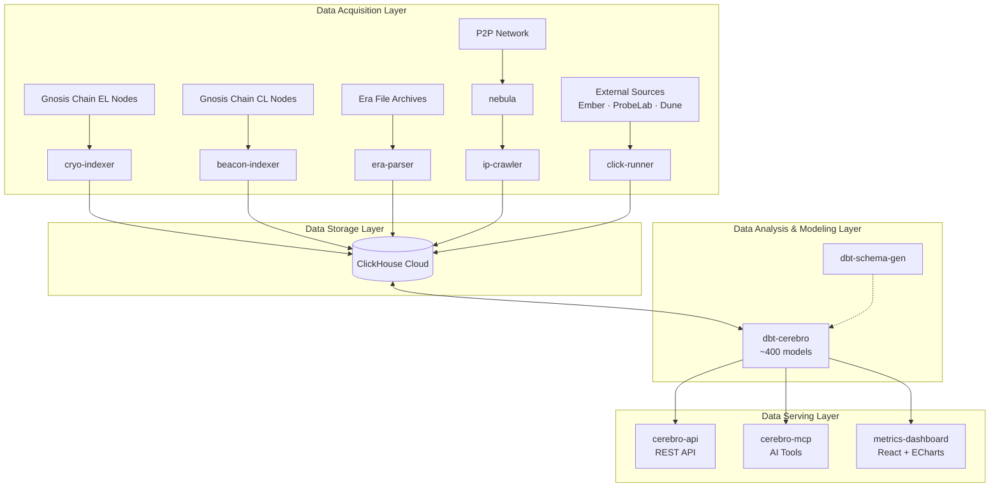

# Architecture

The Gnosis Analytics platform follows a layered architecture that separates data acquisition, storage, transformation, and serving into distinct components. This design enables independent scaling, clear ownership boundaries, and a metadata-driven approach where new data models automatically become API endpoints.

## System Diagram

## Layer 1: Data Acquisition

The data acquisition layer is responsible for extracting raw blockchain data from multiple sources and loading it into ClickHouse. Each indexer operates independently and is designed to be idempotent, meaning it can safely re-run without creating duplicate data.

**Execution layer data** is indexed by `cryo-indexer`, which uses the [Cryo](https://github.com/paradigmxyz/cryo) framework to extract blocks, transactions, logs, traces, and contract state from Gnosis Chain execution layer nodes. The indexer runs as a containerized workload built on top of the `cryo-base` Docker image, optimized for ARM64 architecture.

**Consensus layer data** comes from two sources. The `beacon-indexer` connects to Gnosis Chain beacon nodes via the standard Beacon API and captures real-time validator activity, attestations, sync committee participation, blob sidecars, and epoch-level summaries. For historical data, `era-parser` processes `.era` archive files that contain beacon chain state snapshots, enabling efficient backfilling of consensus data.

**P2P network data** is gathered by `nebula`, a DHT crawler that discovers and monitors peers on the Gnosis Chain network. It records peer sessions, agent strings, supported protocols, and connection metadata. The `ip-crawler` service then enriches this peer data with geolocation information, mapping IP addresses to geographic coordinates, ISP names, and autonomous system numbers.

**External data** is ingested by `click-runner`, which runs scheduled import jobs pulling data from third-party providers such as Ember (energy and carbon data), ProbeLab (network performance metrics), and Dune Analytics (cross-chain metrics).

## Layer 2: Data Storage

All data converges into a centralized **ClickHouse Cloud** cluster. ClickHouse is a column-oriented database optimized for online analytical processing (OLAP) workloads, capable of scanning billions of rows per second for aggregation queries.

The cluster is organized into five databases, each corresponding to a data domain:

| Database | Contents | Primary Sources |
|----------|----------|-----------------|
| `execution` | Blocks, transactions, logs, traces, contracts | cryo-indexer |
| `consensus` | Validators, attestations, proposals, slots, epochs, blobs | beacon-indexer, era-parser |
| `crawlers_data` | Energy data, network metrics, cross-chain analytics | click-runner |
| `nebula` | Peer sessions, DHT crawl results, agent strings | nebula, ip-crawler |
| `dbt` | Transformed models, materialized views, API-facing tables | dbt-cerebro |

Raw data lands in the source databases (`execution`, `consensus`, `crawlers_data`, `nebula`) and is transformed by dbt into the `dbt` database where it becomes available for serving.

## Layer 3: Data Analysis & Modeling

The modeling layer uses **dbt-cerebro**, a dbt project containing approximately 400 SQL models organized into 8 modules:

| Module | Description |
|--------|-------------|
| `execution` | Transaction volumes, gas usage, contract deployments, token metrics |
| `consensus` | Validator performance, attestation rates, proposal statistics, blob analysis |
| `p2p` | Network topology, client diversity, peer distribution |
| `bridges` | Cross-chain bridge volumes, transfer activity |
| `ESG` | Energy consumption, carbon footprint, sustainability metrics |
| `probelab` | Network performance, latency measurements |
| `crawlers_data` | Aggregated external data metrics |
| `contracts` | Smart contract analytics, protocol-specific models |

Models follow a layered pattern: `staging` models clean and standardize raw data, `intermediate` models join and aggregate across sources, and `api_*` models provide the final projections optimized for API consumption. Each API-facing model declares its endpoint configuration through dbt tags and `meta.api` metadata, enabling the serving layer to automatically discover and expose new endpoints.

The **dbt-schema-gen** tool assists model development by using LLMs to automatically generate schema YAML files with column descriptions, data tests, and documentation from SQL model definitions.

## Layer 4: Data Serving

The serving layer provides three complementary interfaces for consuming analytics data:

**cerebro-api** is a Python FastAPI application that serves as the primary REST API. It reads the dbt `manifest.json` to automatically discover and register API endpoints. Each dbt model tagged with `production` and `api:*` becomes an endpoint with its URL path, access tier, filters, pagination, and sort behavior derived entirely from dbt metadata. The API refreshes its endpoint registry periodically (default: every 5 minutes), so deploying new dbt models automatically creates new API endpoints without code changes.

**cerebro-mcp** implements the Model Context Protocol (MCP) to provide AI assistant capabilities. It connects to the same ClickHouse backend and enables natural language queries, automated chart generation using ECharts, and interactive report building. This powers the AI-driven analytics experience through compatible LLM clients.

**metrics-dashboard** is a React web application using ECharts for data visualization. It consumes data from the cerebro-api and renders interactive dashboards displaying Gnosis Chain metrics across all analytics domains.

## Infrastructure

The platform runs on **AWS EKS** (Elastic Kubernetes Service) with the following infrastructure characteristics:

- **Compute**: ARM64 (Graviton) node groups for cost-efficient workload execution
- **Networking**: Application Load Balancer (ALB) with TLS termination for API and dashboard traffic
- **Storage**: ClickHouse Cloud managed service (external to the EKS cluster)
- **CI/CD**: Automated deployments triggered by manifest updates; the API auto-refreshes routes when the dbt manifest changes
- **Containerization**: All services are containerized with multi-stage Docker builds optimized for ARM64

## Next Steps

- [Quick Start](quickstart.md) -- Start making API calls
- [API Reference](../api/index.md) -- Full REST API documentation
- [Platform Overview](platform-overview.md) -- High-level repository catalog
