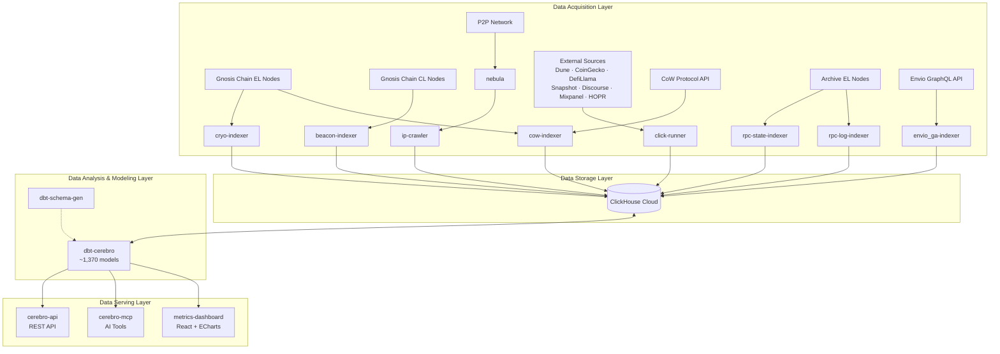

# Architecture

The Gnosis Analytics platform follows a layered architecture that separates data acquisition, storage, transformation, and serving into distinct components. This design enables independent scaling, clear ownership boundaries, and a metadata-driven approach where new data models automatically become API endpoints.

## System Diagram

```mermaid
flowchart TD
    subgraph L1["Data Acquisition Layer"]
        EL[Gnosis Chain EL Nodes] --> CRYO[cryo-indexer]
        CL[Gnosis Chain CL Nodes] --> BI[beacon-indexer]
        P2P_NET[P2P Network] --> NEB[nebula]
        EXT["External Sources\nDune · CoinGecko · DefiLlama\nSnapshot · Discourse · Mixpanel · HOPR"] --> CR[click-runner]
        NEB --> IPC[ip-crawler]
        COW_API[CoW Protocol API] --> COWIDX[cow-indexer]
        EL --> COWIDX
        ARC[Archive EL Nodes] --> RPCSI[rpc-state-indexer]
        ARC --> RPCL[rpc-log-indexer]
        GQL[Envio GraphQL API] --> ENV[envio_ga-indexer]
    end
    subgraph L2["Data Storage Layer"]
        CH[(ClickHouse Cloud)]
    end
    subgraph L3["Data Analysis & Modeling Layer"]
        DBT["dbt-cerebro\n~1,370 models"]
        DSG[dbt-schema-gen]
    end
    subgraph L4["Data Serving Layer"]
        API["cerebro-api\nREST API"]
        MCP["cerebro-mcp\nAI Tools"]
        DASH["metrics-dashboard\nReact + ECharts"]
    end
    CRYO --> CH
    BI --> CH
    IPC --> CH
    CR --> CH
    COWIDX --> CH
    RPCSI --> CH
    RPCL --> CH
    ENV --> CH
    CH <--> DBT
    DSG -.-> DBT
    DBT --> API
    DBT --> MCP
    DBT --> DASH
```

## Layer 1: Data Acquisition

The data acquisition layer is responsible for extracting raw blockchain data from multiple sources and loading it into ClickHouse. Each indexer operates independently and is designed to be idempotent, meaning it can safely re-run without creating duplicate data.

**Execution layer data** is indexed by `cryo-indexer`, which uses the [Cryo](https://github.com/paradigmxyz/cryo) framework to extract blocks, transactions, logs, traces, and contract state from Gnosis Chain execution layer nodes. The indexer runs as a containerized workload built on top of the `cryo-base` Docker image, with three writers: Gnosis (`execution`), a low-latency Gnosis twin (`execution_live`) and Celo (`celo_execution`).

**Consensus layer data** comes from the `beacon-indexer`, which connects to Gnosis Chain beacon nodes via the standard Beacon API and captures blocks, rewards and data-column sidecars in real time plus a daily validators snapshot, then transforms the raw payloads into structured tables. Historical ranges are loaded with the same `load backfill` command.

**P2P network data** is gathered by `nebula`, a DHT crawler that discovers and monitors peers on the Gnosis Chain network. It records peer sessions, agent strings, supported protocols, and connection metadata. The `ip-crawler` service then enriches this peer data with geolocation information, mapping IP addresses to geographic coordinates, ISP names, and autonomous system numbers.

**External data** is ingested by `click-runner`, which runs scheduled import jobs pulling data from third-party providers such as Ember (energy and carbon data), ProbeLab (network performance metrics), and Dune Analytics (cross-chain metrics). It also covers governance data (Snapshot proposals and votes, Discourse forum activity), Mixpanel product-analytics events and profiles, CoinGecko and DefiLlama prices, CoW trade fees, HOPR network snapshots and the Circles blacklist.

**CoW Protocol data** is indexed by `cow-indexer`, a standalone multi-chain indexer that reads canonical CoW contract events directly from execution-layer JSON-RPC, enriches discovered orders and settlements through the public CoW API, and can import authoritative off-chain order-book history from export bundles. It writes canonical tables to the `cow_db` database with reorg reconciliation, independent of the dbt pipeline. See [CoW Protocol Indexer](../data-pipeline/ingestion/cow-indexer.md).

**Verified historical state** is captured by `rpc-state-indexer`, which reads contract state (ERC-20 balances and supply, Aave/Spark aToken scaled balances, pool reserves) at exact UTC day-end anchor blocks via archive JSON-RPC and publishes only verified, complete snapshots into the `rpc_state_indexer` database. It deliberately takes no input from dbt so it can serve as an independent cross-check of warehouse balances. See [RPC State Indexer](../data-pipeline/ingestion/rpc-state-indexer.md).

**Governance events** are captured by `rpc-log-indexer`, a small durable `eth_getLogs` indexer that decodes the Snapshot DelegateRegistry on Ethereum and Gnosis into `rpc_log_indexer` with per-chain checkpoints and reorg-safe canonical views. See [RPC Log Indexer](../data-pipeline/ingestion/rpc-log-indexer.md).

**Circles, Metri and Gnosis Pay entities** are mirrored by `envio_ga-indexer` from a Hasura/Envio GraphQL API into `envio_ga`, with delete detection via a daily reconcile. See [Envio GA Indexer](../data-pipeline/ingestion/envio-ga-indexer.md).

## Layer 2: Data Storage

All data converges into a centralized **ClickHouse Cloud** cluster. ClickHouse is a column-oriented database optimized for online analytical processing (OLAP) workloads, capable of scanning billions of rows per second for aggregation queries.

The cluster is organized into databases, each corresponding to a data domain:

| Database | Contents | Primary Sources |
|----------|----------|-----------------|
| `execution`, `execution_live`, `celo_execution` | Blocks, transactions, logs, traces, contracts, native transfers | cryo-indexer |
| `consensus` | Blocks, validators, rewards, sidecars and their transformed tables | beacon-indexer |
| `crawlers_data` | Prices, Dune exports, IP geolocation, CoW fees, energy data | click-runner, ip-crawler |
| `governance_db` | Snapshot proposals/votes, Discourse forum topics/posts | click-runner |
| `mixpanel_ga`, `hopr_db` | Product analytics; HOPR network snapshots | click-runner |
| `nebula`, `nebula_discv4` | Peer sessions, DHT crawl results, agent strings | nebula |
| `cow_db` | CoW Protocol trades, settlements, order-book history | cow-indexer |
| `rpc_state_indexer` | Verified day-end contract state | rpc-state-indexer |
| `rpc_log_indexer` | Decoded DelegateRegistry events, canonical views | rpc-log-indexer |
| `envio_ga` | Circles / Metri / Gnosis Pay entities | envio_ga-indexer |
| `dbt` | Transformed models, materialized views, API-facing tables | dbt-cerebro |

Raw data lands in the source databases and is transformed by dbt into the `dbt` database where it becomes available for serving. Two exceptions: `rpc_state_indexer` is consumed as an independent cross-check, and `cow_db` is not read by dbt at all — the CoW models read the on-chain decode from `execution`.

## Layer 3: Data Analysis & Modeling

The modeling layer uses **dbt-cerebro**, a dbt project containing about 1,370 SQL models (roughly 1,250 tagged `production`) organized into 15 modules, including:

| Module | Description |
|--------|-------------|
| `execution` | Transaction volumes, gas usage, contract deployments, token metrics |
| `consensus` | Validator performance, attestation rates, proposal statistics, blob analysis |
| `p2p` | Network topology, client diversity, peer distribution |
| `bridges` | Cross-chain bridge volumes, transfer activity |
| `ESG` | Energy consumption, carbon footprint, sustainability metrics |
| `probelab` | Network performance, latency measurements |
| `crawlers_data` | Aggregated external data metrics |
| `contracts` | Smart contract analytics, protocol-specific models |
| `celo` | Gnosis Pay activity on the Celo chain |
| `revenue` | Protocol revenue and per-user revenue metrics |
| `quarterly_data` | Quarterly reporting rollups |
| `mixpanel_ga` | Mixpanel and Google Analytics product analytics |
| `mta` | Multi-touch attribution for user journeys |
| `mmm` | Marketing-mix modeling inputs |

Models follow a layered pattern: `staging` models clean and standardize raw data, `intermediate` models join and aggregate across sources, and `api_*` models provide the final projections optimized for API consumption. Each API-facing model declares its endpoint configuration through dbt tags and `meta.api` metadata, enabling the serving layer to automatically discover and expose new endpoints.

The **dbt-schema-gen** tool assists model development by using LLMs to automatically generate schema YAML files with column descriptions, data tests, and documentation from SQL model definitions.

## Layer 4: Data Serving

The serving layer provides three complementary interfaces for consuming analytics data:

**cerebro-api** is a Python FastAPI application that serves as the primary REST API. It reads the dbt `manifest.json` to automatically discover and register API endpoints. Each dbt model tagged with `production` and `api:*` becomes an endpoint with its URL path, access tier, filters, pagination, and sort behavior derived entirely from dbt metadata. The API refreshes its endpoint registry periodically (default: every 5 minutes), so deploying new dbt models automatically creates new API endpoints without code changes.

**cerebro-mcp** implements the Model Context Protocol (MCP) to provide AI assistant capabilities. It connects to the same ClickHouse backend and enables natural language queries, automated chart generation using ECharts, and interactive report building. This powers the AI-driven analytics experience through compatible LLM clients.

**metrics-dashboard** is a React web application using ECharts for data visualization. It consumes data from the cerebro-api and renders interactive dashboards displaying Gnosis Chain metrics across all analytics domains.

## Infrastructure

The platform runs on **GKE Autopilot** on Google Cloud, with every workload deployed by Terraform — one root stack per service, no CI deploy and no GitOps reconcile loop:

- **Compute**: Autopilot-managed nodes; ephemeral storage is capped at 10 Gi per pod, which shapes how backfills are chunked
- **Warehouse**: ClickHouse Cloud, reached over a Private Service Connect endpoint, never the public hostname
- **Secrets**: Google Secret Manager, synced into Kubernetes by the External Secrets Operator
- **Images**: multi-arch builds in GHCR on every push to `main`, pinned by index digest in each stack
- **Ingress**: one shared external gateway for the API and these docs; the MCP server sits on an internal gateway behind the VPN
- **Serving**: the API auto-refreshes its routes when the dbt manifest changes, so a dbt deploy needs no API deploy

Operating detail — deployment ritual, monitoring, the per-ingestor recovery procedures — is under [Operations](../operations/index.md).

## Next Steps

- [Quick Start](quickstart.md) -- Start making API calls
- [API Reference](../api/index.md) -- Full REST API documentation
- [Platform Overview](platform-overview.md) -- High-level repository catalog
