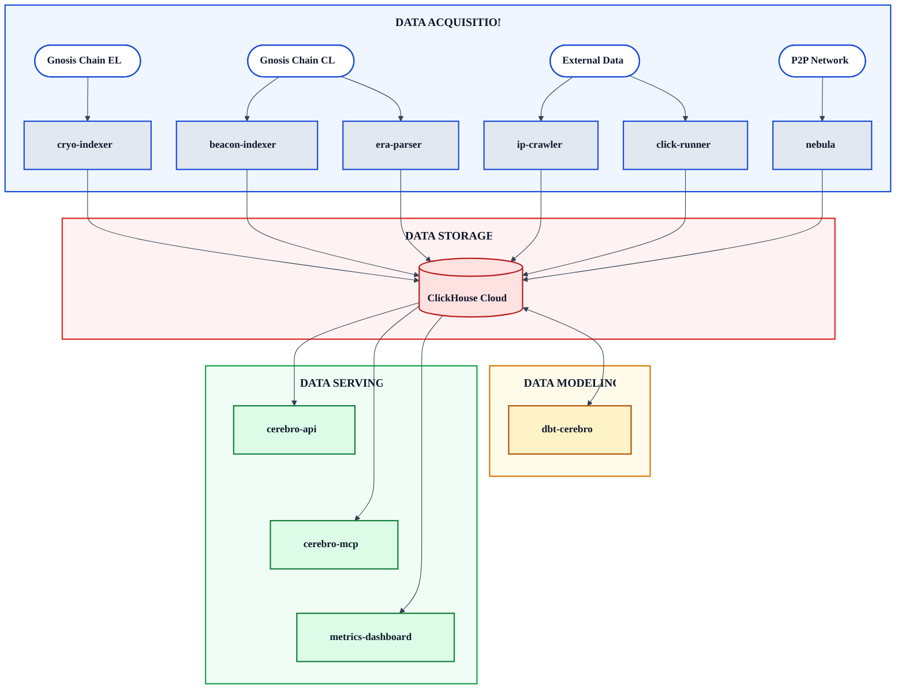
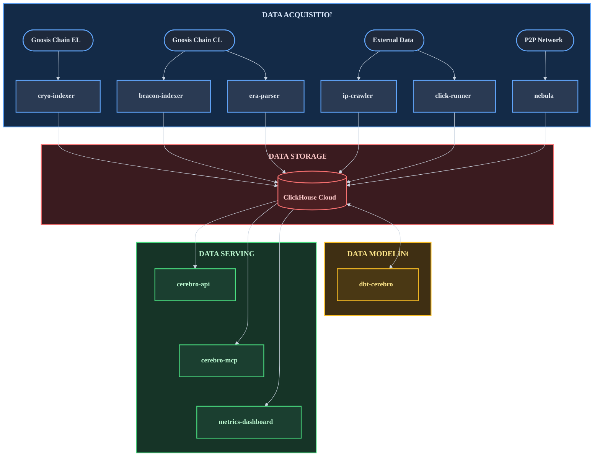

# Gnosis Analytics Documentation

Gnosis Analytics is a comprehensive blockchain analytics platform for Gnosis Chain providing real-time and historical data through REST APIs, AI-powered tools, and interactive dashboards. The platform ingests data from execution and consensus layer nodes, P2P network crawlers, and external sources, transforming it through a robust dbt modeling pipeline and serving it via multiple interfaces.

## Data Flow

The platform is organized into four layers that form a complete data pipeline from raw blockchain data to consumer-ready APIs and dashboards.

Gnosis Analytics Data Flow

## Quick Links

-   **API Reference**

    ---

    REST API documentation including authentication, endpoints, filtering, and error handling.

    [:octicons-arrow-right-24: API Reference](api/index.md)

-   **Data Pipeline**

    ---

    Architecture overview, data acquisition, storage, and transformation layers.

    [:octicons-arrow-right-24: Data Pipeline](data-pipeline/index.md)

-   **Model Catalog**

    ---

    Browse the ~400 dbt models across 8 modules powering the analytics platform.

    [:octicons-arrow-right-24: Model Catalog](models/index.md)

-   **Developer Guide**

    ---

    Get started quickly with the API, understand the platform, and integrate with your applications.

    [:octicons-arrow-right-24: Developer Guide](developer/index.md)

## Getting Started

New to Gnosis Analytics? Start here:

- [Quick Start](getting-started/quickstart.md) -- Make your first API call in under a minute
- [Platform Overview](getting-started/platform-overview.md) -- Understand the 13-repo ecosystem
- [Architecture](getting-started/architecture.md) -- Deep dive into the 4-layer architecture
