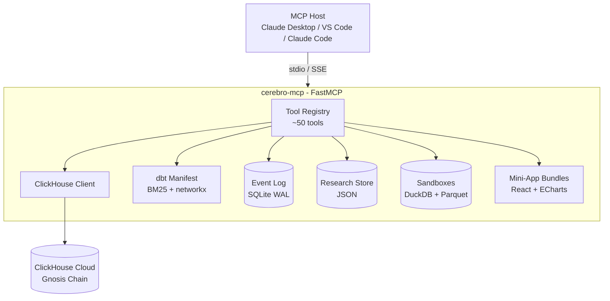

# Cerebro MCP Server

Cerebro MCP is a [Model Context Protocol](https://modelcontextprotocol.io/) server that connects AI assistants to Gnosis Chain's on-chain analytics infrastructure. It exposes ~50 tools that query a ClickHouse data warehouse, traverse ~862 dbt models, drive six interactive mini-apps, and orchestrate multi-phase analytical workflows — all over a single MCP connection.

!!! tip "New to Cerebro?"
    Start with the [Setup Guide](setup.md), then the [Usage Guide](advanced/usage-guide.md) for an end-to-end tour. For the dispatcher pattern (the front door for non-trivial requests) see [Cerebro Dispatcher](dispatcher.md).

## What is MCP?

The Model Context Protocol (MCP) is an open standard that lets AI hosts (Claude Desktop, VS Code, Claude Code, custom clients) connect to external tools and data sources through a unified interface. A single MCP server can serve every MCP-compatible client without per-client integration work.

## What's in this section

| Subsection | Purpose |
|---|---|
| [Setup](setup.md) | Install, configure, connect Claude Desktop / VS Code / Claude Code. Multi-tenant `CEREBRO_OWNER` env. |
| [Available Tools](tools.md) | Categorised reference of every MCP tool. |
| [Agent Fleet](agents.md) | The 27-persona library loadable via `get_agent_persona`. |
| [Cerebro Dispatcher](dispatcher.md) | Top-level intent triage + binding dispatch manifest. |
| [Report Generation](reports.md) | `generate_report`, `generate_research_report`, `generate_case_study_report`, gates. |
| [Security & Audit](security.md) | Tool risk classes, JSONL audit log, multi-tenant identity. |
| [Observability](observability.md) | Prometheus metrics, structured logs, Grafana dashboard. |
| **[Workflows](workflows/index.md)** | Research projects, storyteller, sandboxes, resumable workflows. |
| **[Mini-Apps](mini-apps/index.md)** | Five interactive UI surfaces (Report Renderer, Portfolio, Graph Explorer, Metric Lab, Contract Explorer). |
| **[Advanced](advanced/index.md)** | Hybrid search internals, event log, quality gates, multi-tenant, semantic metrics, full usage guide. |
| [MMM](mmm.md) / [MMM User Guide](mmm-user-guide.md) | Marketing-mix modeling SOP and prompt recipes. |

## Architecture



The server multiplexes four persistence layers:

1. **Event log** (`~/.cerebro/cerebro_state.db`) — append-only SQLite WAL holding workflows / events / gates. Powers crash recovery and resume hints. See [Memory & Resume](advanced/memory-and-resume.md).
2. **Research JSON store** (`~/.cerebro/research_projects/`) — durable per-project state.
3. **Sandbox snapshots** (`~/.cerebro/sandboxes/`) — DuckDB + Parquet for what-if simulations.
4. **In-memory singletons** — storyteller phase machine, session counters.

## Transport modes

### stdio (default)

Local-only. Claude Desktop / Claude Code spawn `cerebro-mcp` as a subprocess and talk over stdin/stdout.

```bash
cerebro-mcp
```

### SSE / HTTP (remote)

For team deployments. Starts a uvicorn server.

```bash
cerebro-mcp --sse
# Defaults to 0.0.0.0:8000 — bind via FASTMCP_HOST / FASTMCP_PORT
```

The hosted team instance is at `mcp.analytics.gnosis.io` with bearer-token auth.

## Capability summary

### Discovery & query

- 6 ClickHouse databases, ~862 dbt models across 8 modules (execution, consensus, bridges, p2p, contracts, ESG, probelab, crawlers).
- Hybrid BM25 + RRF search (`search_models`, `discover_models`) — `hit@1` improved 4× over the legacy ranker (see [Hybrid Search](advanced/hybrid-search.md)).
- Deterministic networkx lineage (`get_upstream_lineage`, `get_downstream_impact`).
- Column-scoped schema injection for wide tables (`get_relevant_columns`).
- 5.3M+ Dune address labels, token metadata, ENS / Safe / Circles / GPay resolution.

### Visualisation & reporting

- Batch chart generation with ECharts (`generate_charts`).
- Three report layouts: dashboard (`generate_report`), research essay (`generate_research_report`), scrollytelling case study (`generate_case_study_report`).
- Eight enforcement gates on `generate_report` (stock/flow discipline, residual buckets, stationarity, aggregator dedup, discovered-model coverage, …). See [Quality Gates](advanced/quality-gates.md).
- Reports render as native UI in MCP-aware hosts; standalone HTML at `~/.cerebro/reports/`.

### Workflows

- **Research projects** — multi-phase plan/execute/verify with peer-review gate.
- **Storyteller** — eight-step narrative pipeline (context brief → big idea → storyboard → visual specs → final story).
- **Simulation sandboxes** — DuckDB + Parquet what-if isolation.
- **Resumable workflows** — every workflow phase logged; `list_resumable_workflows` recovers from crashes.

### Mini-apps

Five React + ECharts mini-apps that render inline in MCP-aware hosts: Report Renderer, Portfolio, Graph Explorer, Metric Lab, Contract Explorer. See [Mini-Apps](mini-apps/index.md).

### Safety

- Read-only ClickHouse SQL (allowlisted statements, identifier validation, row + time caps).
- Tool-risk classification with detection-first JSONL audit log.
- Optional multi-tenant identity via SHA-256 `owner` hash on every workflow.
- 30-day reasoning trace retention with auto-redaction of secrets.

## Where to go next

- New users → [Setup](setup.md) → [Usage Guide](advanced/usage-guide.md).
- Looking for a tool? → [Available Tools](tools.md).
- Building a report? → [Report Generation](reports.md) + [Quality Gates](advanced/quality-gates.md).
- Long-running analysis crashed? → [Resumable Workflows](workflows/resumable-workflows.md).
- Want to write narrative deliverables? → [Storyteller](workflows/storyteller.md).
- Running counterfactuals? → [Simulation Sandboxes](workflows/simulation-sandboxes.md).
- Dashboards / specific data? → [Mini-Apps](mini-apps/index.md).
