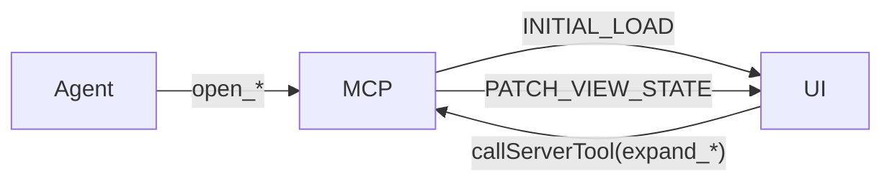

# Mini-Apps

Interactive React + ECharts mini-apps that render inline in any MCP-aware host (Claude Desktop, Claude Code, custom hosts). Each is a single-file HTML bundle served by the MCP server over a `ui://cerebro/<app>` resource URI.

## Apps at a glance

| App | Resource URI | Entry tool | Purpose |
|---|---|---|---|
| [Portfolio](portfolio.md) | `ui://cerebro/portfolio` | `open_portfolio` | Address-centric view across Circles / GPay / Safe / DeFi |
| [Graph Explorer](graph-explorer.md) | `ui://cerebro/graph_explorer` | `open_graph_explorer` | Cross-sector force graph |
| [Metric Lab](metric-lab.md) | `ui://cerebro/metric_lab` | `open_metric_lab*` | Build a metric from SQL or the semantic registry |
| [Contract Explorer](contract-explorer.md) | `ui://cerebro/contract_explorer` | `open_contract_explorer` | Inspect any EVM contract via RPC: ABI, read calls, decoded txs |

The Report Renderer (`ui://cerebro/report`, entry `generate_report`) shares the same plumbing — covered on the [Reports](../reports.md) page.

## Shared plumbing

All mini-apps follow the same protocol:

1. The entry tool returns a `MiniAppPayload` of type `INITIAL_LOAD` with `view_state` and one or more `datasets`.
2. The frontend reads it via `useMiniApp` and calls back to the MCP host with `callServerTool` (e.g. `expand_graph_explorer_node`).
3. Subsequent tool calls return `PATCH_VIEW_STATE` payloads that the UI merges in place.
4. Hidden hydration tools (`get_mini_app_rows`, `get_mini_app_state`) are callable only by the frontend (classified `app_only` — see [Security](../security.md)).



## Launching a mini-app

### Inside an MCP host (live data)

This is the only path that gives you real ClickHouse / RPC results. Connect a host to either your local `cerebro-mcp` or the hosted endpoint — see [Setup](../setup.md) for Claude Desktop, Claude Code, and VS Code configurations. Then:

```text
> Open the portfolio for 0xabc…
agent calls open_portfolio(address="0xabc…")
→ panel renders inline
```

GUI hosts render the bundle inline. Terminal hosts open the temp HTML in your default browser, hydrated with the same payload.

### Standalone in a browser (UI only, mock data)

For UI development you can run the React bundles directly via Vite, with no MCP host and no ClickHouse:

```bash
cd cerebro-mcp/ui
npm install      # first time only
npm run dev      # Vite on http://localhost:5173/
```

Then open any of:

- `http://localhost:5173/`                          — Report Renderer
- `http://localhost:5173/portfolio.html`            — Portfolio
- `http://localhost:5173/graph-explorer.html`       — Graph Explorer
- `http://localhost:5173/metric-lab.html`           — Metric Lab
- `http://localhost:5173/contract-explorer.html`    — Contract Explorer

(Or `make dev` from the repo root.)

Each app boots into its `MOCK_PAYLOAD` fixture defined inside the app's React component. Layout, styling, and client-side state all work, but **`callServerTool` is unavailable**, so Call / Expand / Load buttons are no-ops — you'll see `[useMiniApp] callServerTool(...) unavailable (no ext-apps host)` in the devtools console. Use this loop only for UI iteration; switch to the MCP-host flow for anything data-driven.

There is no `https://mcp.analytics.gnosis.io/mini-apps/<id>` route on the deployed server — mini-apps are exposed solely as MCP resources (`ui://cerebro/<app>`), unlike reports which have a `/reports/{id}` HTTP route.

## See also

- [Tools](../tools.md#6-mini-apps-live-ui-surfaces) — full tool reference
- [Portfolio](portfolio.md), [Graph Explorer](graph-explorer.md), [Metric Lab](metric-lab.md), [Contract Explorer](contract-explorer.md)
- [Reports](../reports.md) — the Report Renderer mini-app
