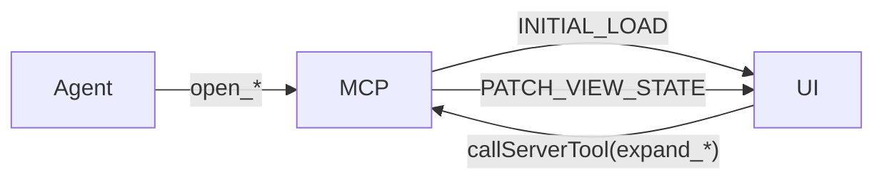

# Mini-Apps

Interactive React + ECharts mini-apps that render inline in any MCP-aware host (Claude Desktop, Claude Code, custom hosts). Each is a single-file HTML bundle served by the MCP server over a `ui://cerebro/<app>` resource URI.

## Apps at a glance

| App | Resource URI | Entry tool | Purpose |
|---|---|---|---|
| [Portfolio](portfolio.md) | `ui://cerebro/portfolio` | `open_portfolio` | Address-centric view across Circles / GPay / Safe / DeFi |
| [Graph Explorer](graph-explorer.md) | `ui://cerebro/graph_explorer` | `open_graph_explorer` | Cross-sector force graph |
| [Metric Lab](metric-lab.md) | `ui://cerebro/metric_lab` | `open_metric_lab*` | Build a metric from SQL or the semantic registry |
| [Contract Explorer](contract-explorer.md) | `ui://cerebro/contract_explorer` | `open_contract_explorer` | Inspect any EVM contract via RPC: ABI, read calls, decoded txs |
| [Model Lineage](model-lineage.md) | `ui://cerebro/model_lineage` | `open_model_lineage` | dbt-Explorer-style DAG view with layer toggle + column-level lineage |
| [Data Catalog](data-catalog.md) | `ui://cerebro/data_catalog` | `open_data_catalog` | OpenMetadata-style search-first catalog over models / metrics / glossary |
| [CoW Explorer](cow-explorer.md) | `ui://cerebro/cow_explorer` | `open_cow_explorer` | CoW Protocol trades, settlements, and order-book data from `cow_db` |
| [Governance Explorer](governance.md) | `ui://cerebro/governance` | `open_governance` | Snapshot proposals/votes + Discourse forum activity (off-chain signaling) |
| [Report Studio](report-studio.md) | `ui://cerebro/report_studio` | `open_report_studio` | Browse the report archive and compose reports from session charts |

The Report Renderer (`ui://cerebro/report`, entry `generate_report`) shares the same plumbing — report generation is covered on the [Reports](../reports.md) page, and archive management/composition on the [Report Studio](report-studio.md) page.

## Shared plumbing

All mini-apps follow the same protocol:

1. The entry tool returns a `MiniAppPayload` of type `INITIAL_LOAD` with `view_state` and one or more `datasets`.
2. The frontend reads it via `useMiniApp` and calls back to the MCP host with `callServerTool` (e.g. `expand_graph_explorer_node`).
3. Subsequent tool calls return `PATCH_VIEW_STATE` payloads that the UI merges in place.
4. Hidden hydration tools (`get_mini_app_rows`, `get_mini_app_state`) are callable only by the frontend (classified `app_only` — see [Security](../security.md)).



## Launching a mini-app

### Inside an MCP host (live data)

This is the only path that gives you real ClickHouse / RPC results. Connect a host to either your local `cerebro-mcp` or the hosted endpoint — see [Setup](../setup.md) for Claude Desktop, Claude Code, and VS Code configurations. Then:

```text
> Open the portfolio for 0xabc…
agent calls open_portfolio(address="0xabc…")
→ panel renders inline
```

GUI hosts render the bundle inline. Terminal hosts open the temp HTML in your default browser, hydrated with the same payload.

### Standalone in a browser (UI only, mock data)

For UI development you can run the React bundles directly via Vite, with no MCP host and no ClickHouse:

```bash
cd cerebro-mcp/ui
npm install      # first time only
npm run dev      # Vite on http://localhost:5173/
```

Then open any of:

- `http://localhost:5173/`                          — Report Renderer
- `http://localhost:5173/portfolio.html`            — Portfolio
- `http://localhost:5173/graph-explorer.html`       — Graph Explorer
- `http://localhost:5173/metric-lab.html`           — Metric Lab
- `http://localhost:5173/contract-explorer.html`    — Contract Explorer
- `http://localhost:5173/model-lineage.html`        — Model Lineage
- `http://localhost:5173/data-catalog.html`         — Data Catalog
- `http://localhost:5173/cow-explorer.html`         — CoW Explorer
- `http://localhost:5173/governance.html`           — Governance Explorer
- `http://localhost:5173/report-studio.html`        — Report Studio

(Or `make dev` from the repo root.)

Each app boots into its `MOCK_PAYLOAD` fixture defined inside the app's React component. Layout, styling, and client-side state all work, but **`callServerTool` is unavailable**, so Call / Expand / Load buttons are no-ops — you'll see `[useMiniApp] callServerTool(...) unavailable (no ext-apps host)` in the devtools console. Use this loop only for UI iteration; switch to the MCP-host flow for anything data-driven.

### Standalone web-app delivery

Every mini-app is also served as a plain browser URL by the SSE server — no MCP host required, with live data:

- `GET /app/{app_id}` — serves the bundled single-file React app with the initial `MiniAppPayload` injected inline. Query params are forwarded to the app's entry tool, with a `seed` alias that maps onto whichever seed-like parameter the open tool exposes (`seed_model`, `seed_node_id`, `address`) — e.g. `/app/portfolio?seed=0xabc…` or `/app/model_lineage?seed_model=fct_transactions`.
- `POST /app/{app_id}/api/tool/{tool_name}` — the HTTP fallback the frontend uses for follow-up tool calls (`expand_*`, `load_*`, …). Returns the same `{structuredContent, isError, content}` shape as the ext-apps bridge.
- `GET /app/{app_id}/assets/{path}` — hashed, immutable build assets for split-bundle apps.

Valid `app_id` values: `portfolio`, `graph_explorer`, `metric_lab`, `contract_explorer`, `model_lineage`, `data_catalog`, `cow_explorer`, `governance`, `report_studio`. When `MCP_AUTH_TOKEN` is set, both routes accept it as an `Authorization: Bearer` header or a `?token=` query param (mirroring the `/reports/{id}` auth); the served page embeds the presented token so in-app tool calls and cross-app links stay authenticated. See `src/cerebro_mcp/tools/visualization/web_apps.py`.

## See also

- [Tools](../tools.md) — full tool reference
- [Portfolio](portfolio.md), [Graph Explorer](graph-explorer.md), [Metric Lab](metric-lab.md), [Contract Explorer](contract-explorer.md), [Model Lineage](model-lineage.md), [Data Catalog](data-catalog.md), [CoW Explorer](cow-explorer.md), [Governance Explorer](governance.md), [Report Studio](report-studio.md)
- [Reports](../reports.md) — the Report Renderer mini-app
