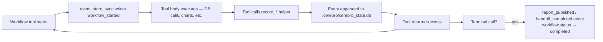

# Workflows

Cerebro MCP supports four long-running workflow shapes. Each has its own state machine, persistence, and resume semantics — but they share the [event log](../advanced/memory-and-resume.md) so a crash never loses progress.

## When to use which

| Workflow | Use it when… | Terminal step | Crash-safe? |
|---|---|---|---|
| [Research projects](research-projects.md) | Multi-phase analysis with hypothesis, evidence, peer review | `publish_research_report` | ✅ Phase 3 |
| [Storyteller](storyteller.md) | Narrative-first deliverables: memos, decision briefs, pitches, investor updates | `storyteller_generate_story_report` | Partial — events captured, state machine in memory |
| [Simulation sandboxes](simulation-sandboxes.md) | Counterfactual SQL — UPDATE / INSERT / DELETE without touching CH | `destroy_sandbox` | Parquet survives, DuckDB connection does not |
| [Resumable workflows (mechanism)](resumable-workflows.md) | Recovering any of the above after a crash, restart, or `/clear` | `recompute_workflow_resume_hint` | ✅ |

## Common pattern



Crash recovery rides this same log. After any restart:

```text
list_resumable_workflows()           # → which workflows still need work
get_workflow_resume_hint(id)         # → the resume hint with next_action
recompute_workflow_resume_hint(id)   # → force fresh scan
```

The hint payload includes a kind-specific block:

- Research → `work` block (queries / memories / findings / evidence)
- Storyteller → `content` block (audience / big idea / scenes / specs)

## See also

- [Memory & Resume](../advanced/memory-and-resume.md) — event-log internals
- [Resumable Workflows](resumable-workflows.md) — recovery commands and shapes
- [Cerebro Dispatcher](../dispatcher.md) — when the dispatcher routes you into a workflow
