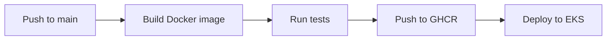
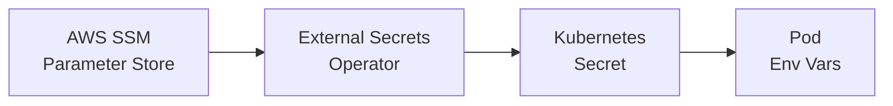

# Deployment

This page documents how Gnosis Analytics services are built, deployed, and updated. All services follow the same pattern: multi-stage Docker builds, GitHub Actions CI/CD, Kubernetes deployments, and secrets injected from AWS SSM Parameter Store.

## Docker Builds

### Multi-Stage Build Pattern

All services use multi-stage Docker builds to minimize image size and attack surface. The pattern separates build-time dependencies from the runtime image:

```dockerfile
# Stage 1: Build
FROM python:3.11-slim AS builder
WORKDIR /build
RUN apt-get update && apt-get install -y --no-install-recommends gcc
COPY requirements.txt .
RUN pip install --no-cache-dir --user -r requirements.txt

# Stage 2: Runtime
FROM python:3.11-slim
WORKDIR /code
RUN useradd -m -u 1000 appuser
COPY --from=builder /root/.local /home/appuser/.local
ENV PATH=/home/appuser/.local/bin:$PATH
COPY ./app /code/app
RUN chown -R appuser:appuser /code
USER appuser
EXPOSE 8000
HEALTHCHECK --interval=30s --timeout=10s --start-period=5s --retries=3 \
    CMD curl -f http://localhost:8000/ || exit 1
CMD ["uvicorn", "app.main:app", "--host", "0.0.0.0", "--port", "8000", "--proxy-headers"]
```

**Key practices:**

- **Non-root user** -- All containers run as `appuser` (UID 1000)
- **Health checks** -- Built into the Dockerfile for Kubernetes liveness probes
- **Minimal runtime** -- Only runtime dependencies in the final image (no compilers, build tools)
- **ARM64 target** -- All images are built for `linux/arm64` to run on Graviton nodes

### Service-Specific Builds

| Service | Base Image | Language | Notes |
|---------|-----------|----------|-------|
| cerebro-api | `python:3.11-slim` | Python | FastAPI + uvicorn |
| cerebro-mcp | `python:3.11-slim` | Python | FastMCP server |
| metrics-dashboard | `node:20-slim` | TypeScript | React build, served via nginx |
| cryo-indexer | `cryo-base` (custom) | Rust | Built on custom ARM64 Cryo base image |
| beacon-indexer | `golang:1.23-alpine` | Go | Compiled binary |
| nebula | `golang:1.23-alpine` | Go | Compiled binary |
| ip-crawler | `python:3.12-slim` | Python | Lightweight crawler |
| click-runner | `python:3.12-slim` | Python | SQL execution toolkit |

## CI/CD Pipeline

### GitHub Actions

The CI/CD pipeline runs on GitHub Actions. Each repository has its own workflow that triggers on pushes to `main`.



### Image Publishing

Images are published to GitHub Container Registry (GHCR) with two tags:

- `latest` -- Always points to the most recent build from `main`
- `sha-{commit}` -- Git commit SHA for traceability and rollback

```yaml
# Example GitHub Actions workflow step
- name: Build and push
  uses: docker/build-push-action@v5
  with:
    context: .
    platforms: linux/arm64
    push: true
    tags: |
      ghcr.io/gnosischain/cerebro-api:latest
      ghcr.io/gnosischain/cerebro-api:sha-${{ github.sha }}
```

## Kubernetes Deployment

### Deployments

Long-running services (API, dashboard, crawlers) are deployed as Kubernetes Deployments:

```yaml
apiVersion: apps/v1
kind: Deployment
metadata:
  name: cerebro-api
  namespace: cerebro
spec:
  replicas: 2
  strategy:
    type: RollingUpdate
    rollingUpdate:
      maxSurge: 1
      maxUnavailable: 0
  selector:
    matchLabels:
      app: cerebro-api
  template:
    metadata:
      labels:
        app: cerebro-api
    spec:
      containers:
        - name: cerebro-api
          image: ghcr.io/gnosischain/cerebro-api:latest
          ports:
            - containerPort: 8000
          envFrom:
            - secretRef:
                name: cerebro-api-secrets
          env:
            - name: DBT_MANIFEST_URL
              value: "https://gnosischain.github.io/dbt-cerebro/manifest.json"
            - name: DBT_MANIFEST_REFRESH_ENABLED
              value: "true"
            - name: DBT_MANIFEST_REFRESH_INTERVAL_SECONDS
              value: "300"
          readinessProbe:
            httpGet:
              path: /
              port: 8000
            initialDelaySeconds: 10
            periodSeconds: 15
          livenessProbe:
            httpGet:
              path: /
              port: 8000
            initialDelaySeconds: 30
            periodSeconds: 30
          resources:
            requests:
              cpu: 250m
              memory: 512Mi
            limits:
              cpu: "1"
              memory: 1Gi
      nodeSelector:
        kubernetes.io/arch: arm64
      imagePullSecrets:
        - name: ghcr-pull-secret
```

### Services

Each deployment is fronted by a Kubernetes Service:

```yaml
apiVersion: v1
kind: Service
metadata:
  name: cerebro-api
  namespace: cerebro
spec:
  selector:
    app: cerebro-api
  ports:
    - port: 8000
      targetPort: 8000
      protocol: TCP
  type: ClusterIP
```

### Ingress

External access is configured via Ingress resources with the AWS Load Balancer Controller:

```yaml
apiVersion: networking.k8s.io/v1
kind: Ingress
metadata:
  name: cerebro-api
  namespace: cerebro
  annotations:
    kubernetes.io/ingress.class: alb
    alb.ingress.kubernetes.io/scheme: internet-facing
    alb.ingress.kubernetes.io/target-type: ip
    alb.ingress.kubernetes.io/certificate-arn: arn:aws:acm:...
    alb.ingress.kubernetes.io/listen-ports: '[{"HTTPS":443}]'
    alb.ingress.kubernetes.io/ssl-redirect: "443"
spec:
  rules:
    - host: api.analytics.gnosis.io
      http:
        paths:
          - path: /
            pathType: Prefix
            backend:
              service:
                name: cerebro-api
                port:
                  number: 8000
```

### CronJobs

Periodic data ingestion tasks run as Kubernetes CronJobs:

```yaml
apiVersion: batch/v1
kind: CronJob
metadata:
  name: click-runner-ember
  namespace: crawlers
spec:
  schedule: "0 2 * * *"
  concurrencyPolicy: Forbid
  successfulJobsHistoryLimit: 3
  failedJobsHistoryLimit: 3
  jobTemplate:
    spec:
      backoffLimit: 2
      template:
        spec:
          containers:
            - name: click-runner
              image: ghcr.io/gnosischain/click-runner:latest
              command: ["python", "run_queries.py"]
              args: ["--ingestor=csv", "--create-table-sql=...", "--insert-sql=..."]
              envFrom:
                - secretRef:
                    name: clickhouse-credentials
          restartPolicy: OnFailure
          nodeSelector:
            kubernetes.io/arch: arm64
```

## Rolling Updates Strategy

The API uses a rolling update strategy that ensures zero-downtime deployments:

| Parameter | Value | Effect |
|-----------|-------|--------|
| `maxSurge` | 1 | One additional pod is created before old pods are terminated |
| `maxUnavailable` | 0 | No existing pods are terminated until the new pod is ready |
| Readiness probe | HTTP GET `/` | New pod must pass health check before receiving traffic |

This means during a deployment:

1. A new pod is started with the updated image
2. Kubernetes waits for the readiness probe to pass
3. The new pod starts receiving traffic
4. The old pod is terminated
5. This repeats for each replica

## Secrets Management

Secrets follow a chain from AWS SSM Parameter Store through the External Secrets Operator into Kubernetes Secrets, which are injected into pods as environment variables.



### AWS SSM Parameter Store

All secrets are stored as SecureString parameters in AWS Systems Manager Parameter Store:

| Parameter Path | Description |
|---------------|-------------|
| `/cerebro/clickhouse/host` | ClickHouse Cloud hostname |
| `/cerebro/clickhouse/user` | ClickHouse username |
| `/cerebro/clickhouse/password` | ClickHouse password |
| `/cerebro/api/keys` | API key registry (JSON) |
| `/cerebro/ipinfo/token` | ipinfo.io API token |

### External Secrets Operator

The External Secrets Operator (ESO) runs in the cluster and synchronizes SSM parameters into Kubernetes Secrets:

```yaml
apiVersion: external-secrets.io/v1beta1
kind: ExternalSecret
metadata:
  name: cerebro-api-secrets
  namespace: cerebro
spec:
  refreshInterval: 1h
  secretStoreRef:
    name: aws-ssm
    kind: ClusterSecretStore
  target:
    name: cerebro-api-secrets
    creationPolicy: Owner
  data:
    - secretKey: CLICKHOUSE_URL
      remoteRef:
        key: /cerebro/clickhouse/host
    - secretKey: CLICKHOUSE_USER
      remoteRef:
        key: /cerebro/clickhouse/user
    - secretKey: CLICKHOUSE_PASSWORD
      remoteRef:
        key: /cerebro/clickhouse/password
```

### Environment Variable Injection

Secrets are injected into pods via `envFrom` on the container spec:

```yaml
envFrom:
  - secretRef:
      name: cerebro-api-secrets
```

This makes all keys in the Kubernetes Secret available as environment variables in the container (e.g., `CLICKHOUSE_URL`, `CLICKHOUSE_PASSWORD`).

!!! warning "Secret rotation"
    When secrets are updated in SSM Parameter Store, ESO synchronizes them to Kubernetes Secrets on the configured `refreshInterval` (default: 1 hour). Pods must be restarted to pick up updated secrets since environment variables are set at pod creation time.

## Manifest Auto-Refresh

The cerebro-api has a built-in mechanism to auto-discover new dbt models without redeployment:

1. The API periodically polls the `DBT_MANIFEST_URL` (default: every 5 minutes)
2. It uses HTTP conditional requests (`ETag`, `If-Modified-Since`) to avoid unnecessary downloads
3. When the manifest changes, it rebuilds the FastAPI route table with new/updated/removed endpoints
4. No restart or redeployment is required

| Environment Variable | Default | Description |
|---------------------|---------|-------------|
| `DBT_MANIFEST_URL` | `https://gnosischain.github.io/dbt-cerebro/manifest.json` | Remote manifest URL |
| `DBT_MANIFEST_REFRESH_ENABLED` | `true` | Enable periodic refresh |
| `DBT_MANIFEST_REFRESH_INTERVAL_SECONDS` | `300` | Refresh interval (5 minutes) |

Internal users with tier3 access can force an immediate refresh:

```bash
curl -X POST "https://api.analytics.gnosis.io/v1/system/manifest/refresh" \
  -H "X-API-Key: sk_live_internal_key"
```

## Deployment Checklist

When deploying a new service or updating an existing one:

- [ ] Docker image builds successfully for `linux/arm64`
- [ ] Image is pushed to GHCR with `latest` and SHA tags
- [ ] Kubernetes manifests are updated (Deployment, Service, Ingress, CronJob as applicable)
- [ ] Secrets are provisioned in SSM Parameter Store
- [ ] ExternalSecret resource is created/updated
- [ ] Resource requests and limits are set appropriately
- [ ] Health checks (readiness and liveness probes) are configured
- [ ] Node selector includes `kubernetes.io/arch: arm64`
- [ ] Rolling update strategy is configured for zero-downtime deployment

## Next Steps

- [Infrastructure](infrastructure.md) -- Underlying AWS infrastructure
- [Monitoring](monitoring.md) -- Observability and alerting
- [Troubleshooting](troubleshooting.md) -- Common deployment issues
