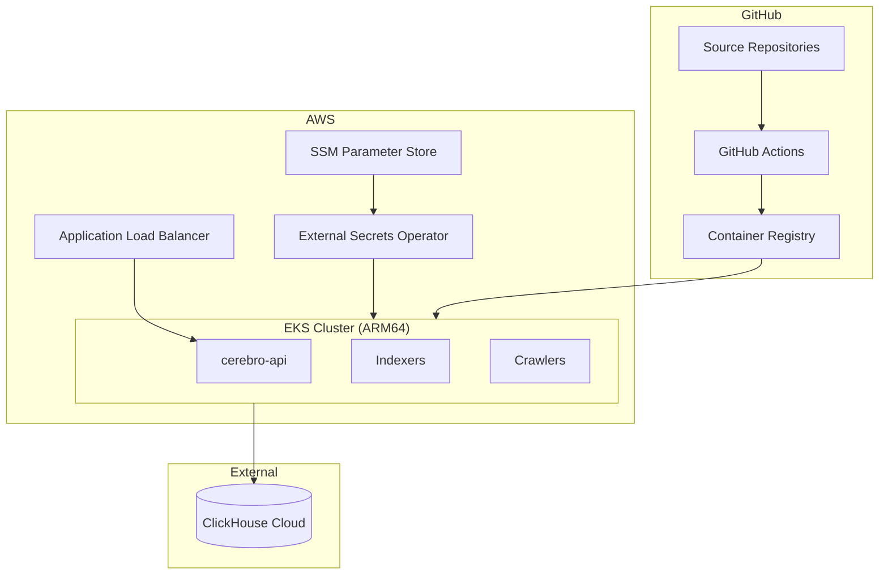

# Operations

This section covers the operational aspects of the Gnosis Analytics platform: infrastructure architecture, deployment procedures, monitoring and observability, and troubleshooting guides.

## Overview

The platform runs on **AWS EKS** (Elastic Kubernetes Service) with all workloads containerized and deployed via Kubernetes. Data is stored in **ClickHouse Cloud**, and the CI/CD pipeline uses **GitHub Actions** with images published to **GitHub Container Registry (GHCR)**.

## Sections

| Section | Description |
|---------|-------------|
| [Infrastructure](infrastructure.md) | AWS EKS cluster architecture, node groups, networking, and storage |
| [Deployment](deployment.md) | Docker builds, CI/CD pipeline, Kubernetes deployment, and secrets management |
| [Monitoring](monitoring.md) | Metrics, logging, alerting, and health checks |
| [Troubleshooting](troubleshooting.md) | Common issues and their resolution steps |

## Key Contacts

| Area | Team |
|------|------|
| API and dbt models | Gnosis Analytics engineering |
| Infrastructure and Kubernetes | Gnosis DevOps |
| ClickHouse Cloud | Managed by ClickHouse (external) |
