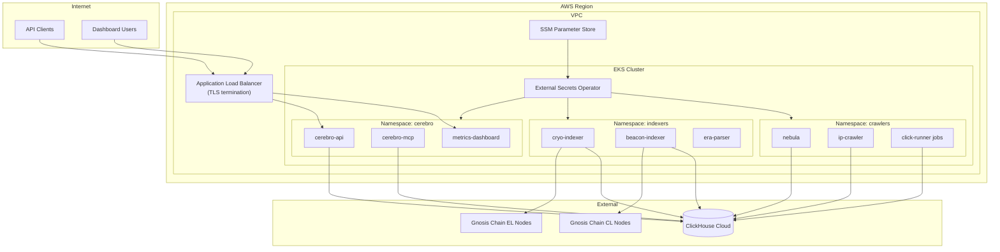

# Infrastructure

The Gnosis Analytics platform runs on AWS infrastructure with an EKS Kubernetes cluster at its core. This page documents the infrastructure components, their configuration, and the rationale behind key architectural decisions.

## Architecture Overview



## Compute

### AWS EKS Cluster

The platform runs on a managed Kubernetes cluster using AWS Elastic Kubernetes Service (EKS).

| Property | Value |
|----------|-------|
| **Kubernetes version** | 1.29+ (managed upgrades) |
| **Node architecture** | ARM64 (Graviton) |
| **Instance type** | M6G family (Graviton2) |
| **Scaling** | Managed node groups with auto-scaling |

### ARM64 Nodes (Graviton)

All workloads run on ARM64 (Graviton) instances for cost efficiency. Graviton processors deliver better price-performance than equivalent x86 instances for the workloads in this platform (API serving, data indexing, network crawling).

!!! info "Image compatibility"
    All Docker images must be built for the `linux/arm64` platform. Multi-architecture builds are configured in CI to produce ARM64 images. Node selectors in Kubernetes manifests ensure pods are scheduled on ARM64 nodes:

    ```yaml
    nodeSelector:
      kubernetes.io/arch: arm64
    ```

## Namespaces

The EKS cluster is organized into three namespaces that separate workloads by function:

| Namespace | Purpose | Key Workloads |
|-----------|---------|---------------|
| `cerebro` | Data serving layer | cerebro-api, cerebro-mcp, metrics-dashboard |
| `indexers` | Blockchain data indexing | cryo-indexer, beacon-indexer, era-parser |
| `crawlers` | External data collection | nebula, ip-crawler, click-runner CronJobs |

This separation provides:

- **Resource isolation** -- CPU and memory quotas per namespace
- **RBAC boundaries** -- Namespace-scoped roles and service accounts
- **Independent scaling** -- Each namespace's workloads scale independently

## Networking

### Application Load Balancer (ALB)

External traffic enters the cluster through an AWS Application Load Balancer configured with the AWS Load Balancer Controller.

| Property | Value |
|----------|-------|
| **TLS termination** | At ALB level using AWS Certificate Manager |
| **Protocol** | HTTPS (443) -> HTTP (8000) to pods |
| **Health checks** | HTTP GET `/` on the API service |
| **DNS** | `api.analytics.gnosis.io` via Route53 |

The ALB is provisioned through Kubernetes Ingress resources with the `alb` ingress class:

```yaml
apiVersion: networking.k8s.io/v1
kind: Ingress
metadata:
  name: cerebro-api
  namespace: cerebro
  annotations:
    kubernetes.io/ingress.class: alb
    alb.ingress.kubernetes.io/scheme: internet-facing
    alb.ingress.kubernetes.io/target-type: ip
    alb.ingress.kubernetes.io/certificate-arn: arn:aws:acm:...
    alb.ingress.kubernetes.io/listen-ports: '[{"HTTPS":443}]'
spec:
  rules:
    - host: api.analytics.gnosis.io
      http:
        paths:
          - path: /
            pathType: Prefix
            backend:
              service:
                name: cerebro-api
                port:
                  number: 8000
```

### Internal Networking

Within the cluster, services communicate over the Kubernetes internal network:

- **Service-to-service** -- Kubernetes ClusterIP services for internal communication
- **External egress** -- All pods can reach ClickHouse Cloud, blockchain nodes, and external APIs over the internet
- **No service mesh** -- Direct pod-to-pod networking via Kubernetes native DNS

## Data Storage

### ClickHouse Cloud

All persistent data is stored in **ClickHouse Cloud**, a managed columnar database service external to the EKS cluster.

| Property | Value |
|----------|-------|
| **Provider** | ClickHouse Cloud (managed service) |
| **Protocol** | HTTPS (port 8443) |
| **Authentication** | Username/password |
| **Databases** | `execution`, `consensus`, `crawlers_data`, `nebula`, `dbt` |

The EKS cluster connects to ClickHouse Cloud over the internet via HTTPS. Connection credentials are stored in AWS SSM Parameter Store and injected into pods via External Secrets Operator.

!!! note "No in-cluster database"
    The platform does not run any database instances inside the EKS cluster. ClickHouse Cloud handles storage, replication, backups, and scaling as a managed service.

### S3 Storage

S3 is used for:

- **Parquet file staging** -- External data files staged for click-runner ingestion
- **dbt artifacts** -- Compiled `manifest.json` published for API consumption
- **Backup exports** -- Periodic data snapshots

## Infrastructure as Code

All infrastructure is managed through **Terraform**:

| Component | Managed By |
|-----------|-----------|
| EKS cluster and node groups | Terraform |
| VPC, subnets, security groups | Terraform |
| ALB and Ingress configuration | Kubernetes manifests + AWS LB Controller |
| IAM roles and policies | Terraform |
| SSM Parameter Store entries | Terraform |
| Route53 DNS records | Terraform |
| S3 buckets | Terraform |

### Repository Structure

Infrastructure code lives in a dedicated repository separate from application code. Changes to infrastructure go through the same PR review process as application changes.

## Container Registry

Docker images are stored in **GitHub Container Registry (GHCR)**:

| Property | Value |
|----------|-------|
| **Registry** | `ghcr.io/gnosischain/` |
| **Authentication** | GitHub token (GHCR_TOKEN) |
| **Image naming** | `ghcr.io/gnosischain/{service-name}:latest` |
| **Tagging** | `latest` + Git SHA for production images |

Images are built and pushed by GitHub Actions on every merge to `main`. The EKS cluster pulls images from GHCR using an image pull secret.

## Resource Allocation

### Recommended Resource Requests

| Service | CPU Request | Memory Request | Replicas |
|---------|------------|----------------|----------|
| cerebro-api | 250m | 512Mi | 2 |
| cerebro-mcp | 250m | 512Mi | 1 |
| metrics-dashboard | 100m | 256Mi | 2 |
| cryo-indexer | 500m | 1Gi | 1 |
| beacon-indexer | 500m | 1Gi | 1 |
| nebula | 250m | 512Mi | 1 |
| ip-crawler | 100m | 256Mi | 1 |

These are baseline recommendations. Actual values should be tuned based on observed usage.

## Next Steps

- [Deployment](deployment.md) -- How services are built and deployed
- [Monitoring](monitoring.md) -- Metrics, logging, and alerting
- [Troubleshooting](troubleshooting.md) -- Common infrastructure issues
