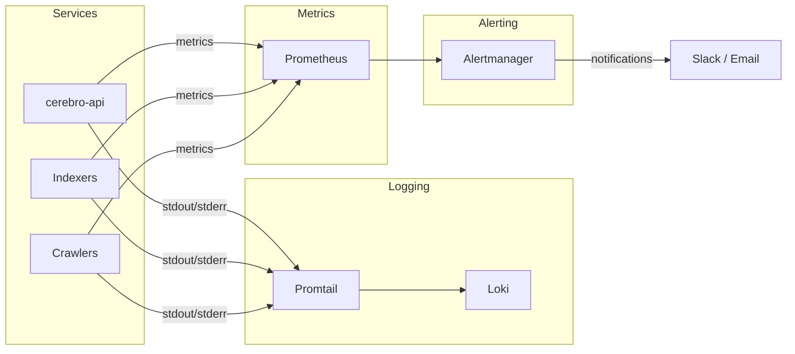

# Monitoring

The Gnosis Analytics platform uses Prometheus for metrics collection, Promtail and Loki for log aggregation, and configured alerting rules for proactive issue detection. This page documents the observability stack, key metrics, and alerting configuration.

## Observability Stack



## Metrics Collection

### Prometheus

Prometheus runs in the EKS cluster and scrapes metrics from all services via Kubernetes service discovery. It automatically discovers pods with the appropriate annotations.

**Pod annotations for scraping:**

```yaml
metadata:
  annotations:
    prometheus.io/scrape: "true"
    prometheus.io/port: "8000"
    prometheus.io/path: "/metrics"
```

### Key Metrics

#### API Metrics

| Metric | Type | Description |
|--------|------|-------------|
| `http_requests_total` | Counter | Total HTTP requests by method, path, and status code |
| `http_request_duration_seconds` | Histogram | Request latency distribution |
| `http_requests_in_progress` | Gauge | Number of requests currently being processed |
| `api_manifest_refresh_total` | Counter | Number of manifest refresh attempts |
| `api_manifest_refresh_errors_total` | Counter | Number of failed manifest refreshes |
| `api_endpoints_registered` | Gauge | Number of currently registered API endpoints |
| `api_rate_limit_hits_total` | Counter | Number of requests rejected by rate limiting |

#### ClickHouse Query Metrics

| Metric | Type | Description |
|--------|------|-------------|
| `clickhouse_query_duration_seconds` | Histogram | ClickHouse query execution time |
| `clickhouse_query_errors_total` | Counter | Number of failed ClickHouse queries |
| `clickhouse_connection_pool_size` | Gauge | Current connection pool size |
| `clickhouse_rows_returned` | Histogram | Number of rows returned per query |

#### Indexer Metrics

| Metric | Type | Description |
|--------|------|-------------|
| `indexer_blocks_processed_total` | Counter | Total blocks indexed |
| `indexer_current_block` | Gauge | Most recently indexed block number |
| `indexer_chain_head_block` | Gauge | Current chain head block number |
| `indexer_lag_blocks` | Gauge | Difference between chain head and indexed block |
| `indexer_processing_duration_seconds` | Histogram | Time to process each block batch |

#### Crawler Metrics

| Metric | Type | Description |
|--------|------|-------------|
| `crawler_peers_discovered` | Gauge | Number of peers found in last crawl |
| `crawler_crawl_duration_seconds` | Histogram | Duration of each crawl cycle |
| `crawler_ips_enriched_total` | Counter | Total IP addresses enriched with geolocation |
| `crawler_api_errors_total` | Counter | External API call failures |

## Log Aggregation

### Promtail + Loki

**Promtail** runs as a DaemonSet on every node, tailing container logs and shipping them to **Loki** for centralized storage and querying.

**Log pipeline:**

1. Containers write to stdout/stderr (standard Kubernetes logging)
2. Promtail discovers containers via Kubernetes API and tails their log files
3. Logs are enriched with labels: namespace, pod name, container name
4. Logs are pushed to Loki for storage
5. Logs are queryable via LogQL

### Structured Logging

Services use structured JSON logging for machine-parseable log entries:

```json
{
  "timestamp": "2024-03-15T10:30:45Z",
  "level": "INFO",
  "message": "Manifest refreshed successfully",
  "service": "cerebro-api",
  "models_loaded": 412,
  "duration_ms": 1250
}
```

### Log Queries (LogQL)

Common LogQL queries for troubleshooting:

=== "API errors"

    ```logql
    {namespace="cerebro", container="cerebro-api"} |= "ERROR"
    ```

=== "ClickHouse connection issues"

    ```logql
    {namespace="cerebro"} |= "ClickHouse" |= "error"
    ```

=== "Manifest refresh events"

    ```logql
    {container="cerebro-api"} |= "Manifest"
    ```

=== "Indexer progress"

    ```logql
    {namespace="indexers"} |= "block" | json | line_format "{{.block_number}}"
    ```

## Alerting

### Alertmanager

Prometheus Alertmanager handles alert routing and notification delivery. Alerts are routed to Slack channels and email based on severity.

### Alert Rules

#### Critical Alerts

These alerts indicate service outages requiring immediate attention:

| Alert | Condition | Severity |
|-------|-----------|----------|
| **API Down** | No successful health check responses for 5 minutes | Critical |
| **ClickHouse Unreachable** | All ClickHouse queries failing for 3 minutes | Critical |
| **High Error Rate** | HTTP 5xx error rate exceeds 5% for 5 minutes | Critical |
| **Manifest Refresh Failing** | No successful manifest refresh in 30 minutes | Critical |

```yaml
# Example Prometheus alert rule
groups:
  - name: cerebro-api
    rules:
      - alert: APIHighErrorRate
        expr: |
          sum(rate(http_requests_total{namespace="cerebro",status=~"5.."}[5m]))
          /
          sum(rate(http_requests_total{namespace="cerebro"}[5m]))
          > 0.05
        for: 5m
        labels:
          severity: critical
        annotations:
          summary: "API error rate above 5%"
          description: >
            The cerebro-api 5xx error rate has exceeded 5% for the last 5 minutes.
            Current rate: {{ $value | humanizePercentage }}.
```

#### Warning Alerts

These alerts indicate degraded performance or potential issues:

| Alert | Condition | Severity |
|-------|-----------|----------|
| **High Latency** | P95 API latency exceeds 5 seconds for 10 minutes | Warning |
| **Indexer Lag** | Block indexer more than 100 blocks behind chain head | Warning |
| **Rate Limit Spike** | Rate limit rejections exceed 50/min | Warning |
| **Pod Restarts** | Pod restarted more than 3 times in 15 minutes | Warning |
| **Memory Pressure** | Pod memory usage exceeds 80% of limit | Warning |
| **Disk Usage** | PVC usage exceeds 80% | Warning |

#### Informational Alerts

| Alert | Condition | Severity |
|-------|-----------|----------|
| **Manifest Updated** | Manifest refreshed with route changes | Info |
| **CronJob Failed** | A click-runner CronJob did not complete successfully | Info |
| **New Endpoint Registered** | API endpoint count changed | Info |

### Notification Channels

| Channel | Alert Severities | Purpose |
|---------|-----------------|---------|
| `#cerebro-alerts` (Slack) | Critical, Warning | Immediate team notification |
| `#cerebro-info` (Slack) | Info | Non-urgent operational updates |
| Email distribution list | Critical | Escalation for outages |

## Health Checks

### API Health Check

The cerebro-api exposes a health check at the root endpoint:

```bash
curl https://api.analytics.gnosis.io/
```

```json
{
  "status": "online",
  "service": "Gnosis Cerebro Data API",
  "docs": "/docs"
}
```

This endpoint is used by:

- **Kubernetes readiness probe** -- Determines if the pod should receive traffic
- **Kubernetes liveness probe** -- Determines if the pod should be restarted
- **ALB health check** -- Determines if the target is healthy

### Container Health Checks

Each Docker container includes a built-in `HEALTHCHECK` instruction:

```dockerfile
HEALTHCHECK --interval=30s --timeout=10s --start-period=5s --retries=3 \
    CMD curl -f http://localhost:8000/ || exit 1
```

### Kubernetes Probes

```yaml
readinessProbe:
  httpGet:
    path: /
    port: 8000
  initialDelaySeconds: 10
  periodSeconds: 15
  failureThreshold: 3

livenessProbe:
  httpGet:
    path: /
    port: 8000
  initialDelaySeconds: 30
  periodSeconds: 30
  failureThreshold: 5
```

| Probe | Purpose | Failure Action |
|-------|---------|----------------|
| **Readiness** | Is the pod ready to serve traffic? | Remove from Service endpoints |
| **Liveness** | Is the pod still functioning? | Restart the pod |

## Dashboards

Key monitoring dashboards:

| Dashboard | Metrics Displayed |
|-----------|-------------------|
| **API Overview** | Request rate, error rate, latency distribution, endpoint counts |
| **ClickHouse Performance** | Query duration, rows scanned, connection pool, error rates |
| **Indexer Status** | Current block, chain head, lag, processing rate |
| **Crawler Activity** | Peers discovered, crawl duration, IP enrichment rate |
| **Infrastructure** | CPU/memory usage, pod status, node health |

## Next Steps

- [Troubleshooting](troubleshooting.md) -- Use monitoring data to diagnose issues
- [Infrastructure](infrastructure.md) -- Underlying platform architecture
- [Deployment](deployment.md) -- Deployment procedures and configuration
