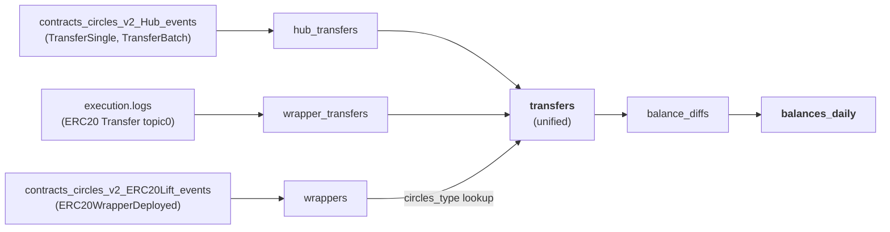
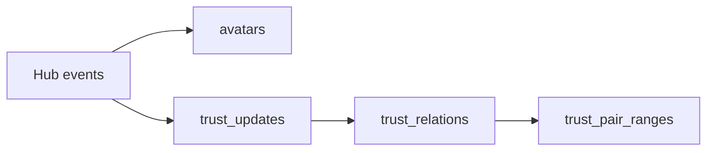
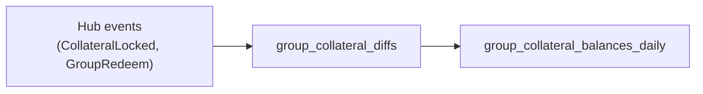

# Circles V2 — Data Models

This page documents the analytics data pipeline for Circles V2: how raw blockchain events are transformed into queryable transfer and balance tables.

## Pipeline Overview

### Transfers & Balances



### Trust & Avatars



### Group Collateral



## dbt Models Reference

All models are prefixed with `int_execution_circles_v2_` and materialized as **incremental** tables in ClickHouse using `ReplacingMergeTree`.

### Transfer Models

| Model | Description | Order By |
|-------|-------------|----------|
| `hub_transfers` | Hub ERC-1155 `TransferSingle` and `TransferBatch` events, with batch events exploded into individual rows. | `(block_timestamp, tx_hash, log_index, batch_index)` |
| `wrapper_transfers` | ERC-20 `Transfer` events from wrapper contract addresses (filtered via join with `wrappers`). | `(block_timestamp, tx_hash, log_index)` |
| `wrappers` | Maps wrapper contract address → avatar address + `circles_type` (0=demurrage, 1=static). Source: `ERC20WrapperDeployed` events. | `(block_timestamp, tx_hash, log_index)` |
| **`transfers`** | **Unified** table combining hub and wrapper transfers. Static amounts converted to demurrage. Includes `unit_type` and `amount_raw_original` columns. | `(block_timestamp, tx_hash, log_index, batch_index)` |

### Balance Models

| Model | Description | Order By |
|-------|-------------|----------|
| `balance_diffs` | Signed deltas (debit/credit) derived from the unified transfers table. One row per account per transfer event. | `(block_timestamp, account, token_address)` |
| **`balances_daily`** | Daily end-of-day balance snapshots per (account, token_address). Includes running cumulative balance and demurrage-adjusted balance. | `(date, token_address, account)` |

### Trust & Avatar Models

| Model | Description |
|-------|-------------|
| `avatars` | Avatar registration events (Human, Group, Organization) with type classification. |
| `trust_updates` | Raw `Trust` events with truster, trustee, and expiry time. |
| `trust_relations` | Intervalized trust relations with `valid_from`/`valid_to` windows and `is_active` flag. |
| `trust_pair_ranges` | Aggregated validity ranges per trust pair. |

### Group Models

| Model | Description |
|-------|-------------|
| `group_collateral_diffs` | Per-group collateral deltas from `CollateralLockedSingle`, `CollateralLockedBatch`, `GroupRedeemCollateralBurn`, `GroupRedeemCollateralReturn`. |
| `group_collateral_balances_daily` | Sparse daily group collateral balances per token, using running cumulative sum. |

## Unified Transfers Model — Detail

The `int_execution_circles_v2_transfers` model combines two sources:

### Hub Transfers (ERC-1155)

- Source: `int_execution_circles_v2_hub_transfers`
- `token_address` = avatar address (derived from ERC-1155 token ID)
- `unit_type` = `'demurrage'` (always)
- `amount_raw` = `amount_raw_original` (no conversion needed)

### Wrapper Transfers (ERC-20)

- Source: `int_execution_circles_v2_wrapper_transfers` joined with `int_execution_circles_v2_wrappers`
- `token_address` = wrapper contract address (not the avatar)
- `unit_type` = `'demurrage'` if `circles_type = 0`, `'static'` if `circles_type = 1`
- For static wrappers: `amount_raw` is converted to demurrage units at transfer time

### Static → Demurrage Conversion

For `circles_type = 1` (static/inflationary) wrapper transfers, the amount is converted:

$$\text{amount\_raw} = \text{amount\_raw\_original} \times \gamma^{\,\text{day}(\text{block\_timestamp})}$$

Where $\gamma \approx 0.9998013$ is the daily decay factor and $\text{day}(t) = \lfloor(t - 1602720000) / 86400\rfloor$.

This uses the `circles_demurrage_factor` macro with `last_activity_ts` set to inflation day zero (`1602720000`):

```sql
multiplyDecimal(
    toDecimal256(amount_raw, 0),
    circles_demurrage_factor('1602720000', 'toUInt64(toUnixTimestamp(block_timestamp))'),
    0
)
```

## Balance Computation — Detail

The `int_execution_circles_v2_balances_daily` model produces daily snapshots:

### Processing Steps

1. **Aggregate daily deltas**: sum all `delta_raw` from `balance_diffs` per (date, account, token_address).
2. **Generate dense calendar**: for each (account, token_address) position, create a row for every day from first activity to yesterday.
3. **Running cumulative sum**: window function computes `balance_raw` across the calendar.
4. **Track last activity**: `last_activity_ts` = most recent transfer timestamp per position (carried forward via window max).
5. **Filter zeros**: only non-zero balances are stored.
6. **Apply demurrage**: compute `demurraged_balance_raw` using the decay between `last_activity_ts` and the end-of-day snapshot timestamp.

### Demurrage Formula

$$\text{demurraged\_balance} = \text{balance\_raw} \times \gamma^{\,\text{day}(\text{snapshot\_ts}) - \text{day}(\text{last\_activity\_ts})}$$

### Incremental Mode

In incremental runs, the model:

- Reads the last partition's ending balances and `last_activity_ts` from the existing table
- Only processes new days (from last stored date to yesterday)
- Adds the previous balance to the running sum as a starting offset

## Key Columns Reference

### `int_execution_circles_v2_transfers`

| Column | Type | Description |
|--------|------|-------------|
| `block_timestamp` | DateTime64 | UTC timestamp of the block |
| `transaction_hash` | String | Transaction hash |
| `log_index` | UInt64 | Log index within the block |
| `batch_index` | UInt64 | Index within TransferBatch (0 for single/wrapper) |
| `from_address` | String | Sender address (`0x0` for mints) |
| `to_address` | String | Recipient address (`0x0` for burns) |
| `token_address` | String | Avatar address (hub) or wrapper contract (wrapper) |
| `amount_raw` | UInt256 | Amount in demurrage units (18 decimals) |
| `amount_raw_original` | UInt256 | Original amount before static→demurrage conversion |
| `unit_type` | String | `'demurrage'` or `'static'` |
| `transfer_type` | String | `CrcV2_TransferSingle`, `CrcV2_TransferBatch`, or `CrcV2_ERC20WrapperTransfer` |

### `int_execution_circles_v2_balance_diffs`

| Column | Type | Description |
|--------|------|-------------|
| `block_timestamp` | DateTime64 | UTC timestamp |
| `account` | String | Address whose balance changed |
| `counterparty` | String | Other party in the transfer |
| `token_address` | String | Token contract address |
| `delta_raw` | Int256 | Signed balance change (negative = debit, positive = credit) |
| `transfer_type` | String | Transfer classification |

### `int_execution_circles_v2_balances_daily`

| Column | Type | Description |
|--------|------|-------------|
| `date` | Date | Calendar date of the snapshot |
| `account` | String | Token holder address |
| `token_address` | String | Token contract address |
| `balance_raw` | Int256 | Cumulative nominal balance in demurrage units |
| `last_activity_ts` | UInt64 | Unix timestamp of the most recent transfer |
| `snapshot_ts` | UInt64 | End-of-day Unix timestamp used for demurrage calculation |
| `demurraged_balance_raw` | Int256 | Balance after applying demurrage decay |

## Demurrage in SQL

The `circles_demurrage_factor` macro (in `macros/circles/circles_utils.sql`) computes the decay factor:

```sql
-- Decay factor between two timestamps
toDecimal256(
  pow(
    toDecimal256('0.9998013320085989574306481700129226782902039065082930593676448873', 64),
    intDiv(now_ts - 1602720000, 86400)
    - intDiv(last_activity_ts - 1602720000, 86400)
  ),
  18
)
```

**Two use cases:**

| Use | `last_activity_ts` | `now_ts` | Result |
|-----|-------------------|----------|--------|
| **Time decay** (balances) | Last transfer timestamp | Snapshot timestamp | $\gamma^{\text{days since last transfer}}$ |
| **Static→demurrage** (transfers) | `1602720000` (day zero) | Block timestamp | $\gamma^{\text{day of transfer}}$ |

## See Also

- [Circles V2 Protocol Overview](index.md) — protocol mechanics, trust system, demurrage
- [Protocol Analytics Index](../index.md)
- [Contract ABI Decoding](../../data-pipeline/transformation/abi-decoding.md)
- [dbt Model Catalog — Contracts](../../models/contracts.md)
