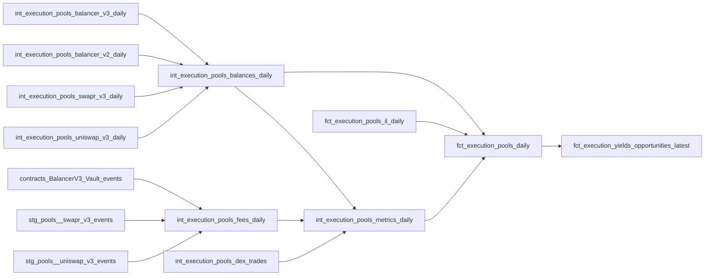

# Pool Fee APR Analytics

This page documents how the analytics pipeline derives daily pool fees, TVL, fee APR, and per-user LP position tracking from raw DEX events on Gnosis Chain. For the underlying AMM mechanics and event structures, see the [DEX Protocols](index.md) hub page.

## Pipeline Overview



## Fee Computation — `int_execution_pools_fees_daily`

Daily accrued pool fees and trading volume at `(date, protocol, pool_address, token_address)` grain.

### How fees are derived from swap events

Fees are computed as **gross accrued fees** from swap and flash events, independent of fee collection (`Collect`) events. For each incoming swap leg:

```
fee_raw = floor(swap_in_amount × fee_ppm / 1e6)
```

Volume equals the gross incoming token amount per swap; flash loans contribute zero volume.

### Protocol-specific fee handling

**Uniswap V3**: Static fee tier per pool, looked up from `PoolCreated` events in `contracts_UniswapV3_Factory_events`. Fee tiers are in hundredths of a bip (e.g. `3000` = 0.3%).

**Swapr V3 (Algebra)**: Dynamic fees via `Fee` events. The latest fee is applied as-of each swap using an `ASOF LEFT JOIN` on `(pool_address, event_order)`. Swaps occurring before the pool's first `Fee` event are backfilled with the pool's first observed fee.

**Balancer V3**: Explicit `swapFeeAmount` field on `Swap` events — no fee-tier calculation needed. ERC4626 wrapper tokens (e.g. `waGnoWETH`) are resolved to their underlying tokens for symbol and price lookups.

### USD pricing

Token amounts are converted to USD via an `ASOF LEFT JOIN` against `int_execution_token_prices_daily` (Dune oracle prices). Daily totals:

```sql
sum(fee_amount * price) AS fees_usd,
sum(volume_amount * price) AS volume_usd
```

### Output columns

| Column | Type | Description |
|--------|------|-------------|
| `date` | Date | Calendar day |
| `protocol` | String | `'Uniswap V3'`, `'Swapr V3'`, or `'Balancer V3'` |
| `pool_address` | String | Pool contract address (lowercase, `0x`-prefixed) |
| `token_address` | String | Token address for fee/volume |
| `token` | String | Token symbol |
| `fee_amount` | Float64 | Daily fees in token units |
| `fees_usd` | Float64 | Daily fees in USD |
| `volume_amount` | Float64 | Daily volume in token units |
| `volume_usd` | Float64 | Daily volume in USD |

## TVL Computation — `int_execution_pools_balances_daily`

Pool TVL is derived from **event-based delta accounting**, not from on-chain `balanceOf` calls. Each protocol has its own daily balance model:

- **`int_execution_pools_uniswap_v3_daily`** — Mint/Burn/Swap/Collect/Flash deltas with static fee tiers.
- **`int_execution_pools_swapr_v3_daily`** — Same structure with dynamic fee rates via `Fee` events.
- **`int_execution_pools_balancer_v2_daily`** — PoolBalanceChanged/Swap/PoolBalanceManaged deltas.
- **`int_execution_pools_balancer_v3_daily`** — LiquidityAdded/LiquidityRemoved/Swap with ERC4626 wrapper resolution.

Each protocol model separates **reserve balance** (TVL-contributing) from **unclaimed fee balance** (for V3 pools: swap fee income minus collected fees plus flash loan fees). TVL uses only the reserve component:

```
tvl_component_usd = reserve_amount × price_usd
```

The union model `int_execution_pools_balances_daily` combines all four protocols into a single table.

## Fee APR — `int_execution_pools_metrics_daily`

Pool-level daily metrics with a 7-day trailing fee APR.

### APR formula

```sql
fee_apr_7d = (fees_usd_7d / tvl_usd_7d_avg) * (365.0 / 7.0) * 100.0
```

Where:

- `fees_usd_7d` = rolling 7-day sum of `fees_usd_daily` (window: `RANGE BETWEEN 6 PRECEDING AND CURRENT ROW`)
- `tvl_usd_7d_avg` = rolling 7-day average of pool TVL

### Guard conditions

Fee APR is set to NULL when:

- Protocol is not a V3-style DEX (Uniswap V3, Swapr V3, Balancer V3)
- Fewer than 3 days of data in the window (warmup period)
- 7-day average TVL is zero or below $500 (prevents division by near-zero)

### Output columns

| Column | Type | Description |
|--------|------|-------------|
| `date` | Date | Calendar day |
| `protocol` | String | Protocol name |
| `pool_address` | String | Pool contract address |
| `tvl_usd` | Float64 | Pool TVL in USD |
| `fees_usd_daily` | Float64 | Daily fees in USD |
| `volume_usd_daily` | Float64 | Daily volume in USD |
| `swap_count` | UInt64 | Number of swaps |
| `fee_apr_7d` | Float64 | 7-day trailing fee APR (%), annualized |

## Pool Daily Facts — `fct_execution_pools_daily`

The mart-level fact table joins `int_execution_pools_balances_daily` (TVL and pool labeling), `int_execution_pools_metrics_daily` (fee APR), and `fct_execution_pools_il_daily` (LVR cost) into a single per-pool daily row. It filters to the **top 5 pools per token** by 30-day average TVL (minimum $1,000) to keep the table focused on meaningful liquidity.

### Double-smoothing of fee APR

The `fee_apr_7d` from `int_execution_pools_metrics_daily` is already a 7-day trailing figure. In `fct_execution_pools_daily`, it is **further smoothed** with a 7-day moving average:

```sql
avg(fee_apr_7d_raw) OVER (
    PARTITION BY protocol, pool_address
    ORDER BY date
    RANGE BETWEEN 6 PRECEDING AND CURRENT ROW
) AS fee_apr_7d
```

This double-smoothing dampens day-to-day noise, especially for pools with sporadic swap activity.

### Net APR

```sql
net_apr_7d = avg(fee_apr_7d + lvr_apr_7d) OVER (7-day window)
```

Net APR combines fee income with an adverse-selection cost estimate. Since `lvr_apr_7d` is negative (it represents a cost to LPs), net APR is always ≤ fee APR.

### Pool labeling

Human-readable pool labels are generated from the token registry:

- V3 pools: `WETH/USDC • Uniswap V3 • a1b2c3`
- Balancer pools: `WETH/wstETH/GNO • Balancer V3 • d4e5f6`

### Output columns

| Column | Type | Description |
|--------|------|-------------|
| `date` | Date | Calendar day |
| `protocol` | String | Protocol name |
| `pool_address` | String | Pool contract address |
| `pool` | String | Human-readable pool label |
| `token_address` | String | Filter token (one row per pool×token) |
| `token` | String | Token symbol for filtering |
| `tvl_usd` | Float64 | Pool TVL |
| `fees_usd_daily` | Float64 | Daily fees |
| `volume_usd_daily` | Float64 | Daily volume |
| `swap_count` | UInt64 | Daily swaps |
| `fee_apr_7d` | Float64 | 7-day fee APR (%), double-smoothed (7d trailing then 7d moving avg) |
| `lvr_apr_7d` | Float64 | 7-day LVR cost (%, negative), smoothed |
| `net_apr_7d` | Float64 | `avg(fee_apr_7d + lvr_apr_7d)` over 7-day window |

## User LP Positions — `int_execution_yields_user_lp_positions`

Per-wallet LP position economics, tracking capital in/out, fees collected, and in-range status.

Built from `int_execution_pools_dex_liquidity_events` (Mint/Burn/Collect events across all protocols), this model computes:

- **Capital deployed**: USD value of Mint events for the position
- **Capital withdrawn**: USD value of Burn events
- **Fees collected**: USD value of Collect events
- **Liquidity**: Current V3 liquidity units (sum of `liquidity_delta`)
- **In-range status**: Whether the position's `[tickLower, tickUpper]` range contains the pool's current tick

This feeds the User Portfolio tab in the Yields dashboard, where users can look up any wallet's LP economics.

## Example Queries

### Fee APR for top WETH pools (last 30 days)

```sql
SELECT
    date,
    pool,
    tvl_usd,
    fee_apr_7d,
    net_apr_7d
FROM dbt.fct_execution_pools_daily
WHERE token = 'WETH'
  AND date >= today() - 30
  AND fee_apr_7d IS NOT NULL
ORDER BY date DESC, fee_apr_7d DESC
```

### Daily fees by protocol

```sql
SELECT
    date,
    protocol,
    sum(fees_usd) AS total_fees_usd,
    sum(volume_usd) AS total_volume_usd
FROM dbt.int_execution_pools_fees_daily
WHERE date >= today() - 7
GROUP BY date, protocol
ORDER BY date, protocol
```

### Compare fee APR vs lending supply APY for WETH

```sql
SELECT
    p.date,
    p.pool,
    p.fee_apr_7d AS lp_fee_apr,
    l.apy_daily AS lending_supply_apy
FROM dbt.fct_execution_pools_daily p
INNER JOIN dbt.int_execution_lending_aave_daily l
    ON l.date = p.date
   AND l.symbol = p.token
WHERE p.token = 'WETH'
  AND p.date >= today() - 30
  AND p.fee_apr_7d IS NOT NULL
ORDER BY p.date DESC
```

## See Also

- [DEX Protocols Overview](index.md) — AMM mechanics, sqrtPriceX96, ticks
- [Lending Rate Analytics](../lending/analytics.md) — supply/borrow APY methodology
- [Savings xDAI](../savings/index.md) — vault APY methodology
- [Contract ABI Decoding](../../data-pipeline/transformation/abi-decoding.md)
