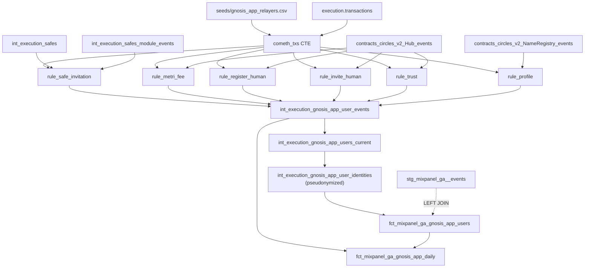

# Gnosis App (heuristic sector)

## What this is

**Gnosis App** is the consumer wallet experience at [app.gnosis.io](https://app.gnosis.io) — a Safe-backed smart account that uses [Cometh](https://www.cometh.io) ERC-4337 bundlers as the relayer layer and integrates Circles V2 for social-recovery-style onboarding. There is no single "Gnosis App contract"; the app is a collection of frontend flows that orchestrate Safes, Zodiac modules, the Circles InvitationModule, and the Cometh relayers into a coherent product.

Because there is no contract to query, **there is no authoritative on-chain label list of Gnosis App users**. Cerebro's other product sectors all have a clean discovery source — Gnosis Pay reads `int_crawlers_data_labels WHERE project = 'gpay'`, lending positions are pulled from explicit deposit/borrow events, and so on. Gnosis App is the first sector where we have to **derive membership from heuristics** instead.

The good news: those heuristics are reliable. Every Gnosis App action funnels through the same chokepoint — a **Cometh ERC-4337 bundler relays a userOp into the canonical EntryPoint**. If the outer transaction's `from_address` is one of the three known Cometh v4 bundlers and its `to_address` is the EntryPoint v0.7, then any account that appears as an event parameter inside that transaction is, by construction, a Gnosis App user for that action. Six rule variants on top of this chokepoint cover the distinct user-facing flows.

## Mixpanel is the check, not the ground truth

This is the key design constraint. Mixpanel's instrumentation does not capture every Gnosis App user — some users never log in to anything that fires an `identify(...)` call, some cohorts predate the current tracking, some flows happen exclusively on mobile where Mixpanel is sparser. **Mixpanel coverage is incomplete by definition**, so it cannot be used to *gate* sector membership.

Instead:

- The **heuristic set is authoritative**. If an address appears as the avatar in a Cometh-relayed `RegisterHuman` event, it is a Gnosis App user. Period.
- The **Mixpanel match is diagnostic**. We compute it as a `matched_mp` boolean on every row of the per-user fact, and we report the fraction as a coverage metric. A user being missing from Mixpanel is information about Mixpanel, not about the user's sector membership.

The bridge model `fct_mixpanel_ga_gnosis_app_users` reflects this directly: every row in `int_execution_gnosis_app_user_identities` appears in the fact table regardless of whether it has a matching Mixpanel row. `matched_mp` is just a column.

This is the opposite of the [Gnosis Pay bridge](../gnosis-pay/mixpanel-bridge.md), where membership comes from a clean upstream label list and Mixpanel is queried with `INNER JOIN`. The two patterns coexist in the repo by design.

## The chokepoint

Every Gnosis App on-chain action passes through these two known addresses:

| Address | Role |
|---|---|
| `0x0000000071727de22e5e9d8baf0edac6f37da032` | ERC-4337 EntryPoint v0.7 |
| `0x79c02f38dba39da361b4a0484c40351d50d55a94` | Cometh Bundler 1 |
| `0xf03ddbe5b9b4ddec66009d94dc5d33dd719f34e1` | Cometh Bundler 2 |
| `0xf0f772fa5f01bc19064a8ba323a4f53505586ce1` | Cometh Bundler 3 |

The Cometh bundler set is the **v4** generation, which went live on **2025-11-12**. Cerebro's heuristic is scoped to that date and later — earlier Cometh generations are explicitly out of scope.

The bundler addresses are stored in `seeds/gnosis_app_relayers.csv` so they can be rotated without touching SQL. The seed schema:

```csv
address,label,is_active,since_date
0x79c02f38dba39da361b4a0484c40351d50d55a94,Bundler1,1,2025-11-12
0xf03ddbe5b9b4ddec66009d94dc5d33dd719f34e1,Bundler2,1,2025-11-12
0xf0f772fa5f01bc19064a8ba323a4f53505586ce1,Bundler3,1,2025-11-12
```

## The heuristic rules

Six rules, each independent. An address that triggers any rule is a Gnosis App user; an address that triggers multiple rules has higher confidence.

| # | `heuristic_kind` | What it looks for | Source model |
|---|---|---|---|
| 1 | `safe_invitation_module` | A Safe was created in the same Cometh-relayed transaction that enabled the Circles InvitationModule (`0x00738aca013b7b2e6cfe1690f0021c3182fa40b5`). Marks Gnosis App's Safe-onboarding flow into Circles. | `int_execution_safes` + `int_execution_safes_module_events` |
| 2 | `circles_metri_fee` | A CRC ERC-1155 transfer to the Metri fee receiver (`0x97fd8f7829a019946329f6d2e763a72741047518`) inside a Cometh-relayed transaction. | `contracts_circles_v2_Hub_events` |
| 3 | `circles_register_human` | A `RegisterHuman` event on the Circles V2 Hub inside a Cometh-relayed transaction. The avatar is the user. | `contracts_circles_v2_Hub_events` |
| 4 | `circles_invite_human` | A `RegisterHuman` event whose `inviter` field is a non-zero address, inside a Cometh-relayed transaction. The inviter is the user (i.e. they successfully invited someone). | `contracts_circles_v2_Hub_events` |
| 5 | `circles_trust` | A `Trust` event on the Hub inside a Cometh-relayed transaction. The truster is the user. | `contracts_circles_v2_Hub_events` |
| 6 | `circles_profile_update` | An `UpdateMetadataDigest` event on the Circles NameRegistry inside a Cometh-relayed transaction. The avatar is the user (they edited their V2 profile). | `contracts_circles_v2_NameRegistry_events` |

All six rules are derived from a Dune spell that the Gnosis Analytics team already runs in production. The Cerebro implementation reproduces them on top of the already-decoded Circles V2 events, so we don't repeat any ABI decoding — the existing `contracts_circles_v2_Hub_events` and `contracts_circles_v2_NameRegistry_events` models are the source of truth for the per-event data.

## Pipeline



The `cometh_txs` CTE is the key shared optimization: it filters `execution.transactions` to the few thousand Cometh-relayed transactions per month **once**, then every per-rule sub-query joins to it instead of re-scanning the transactions table six times.

## Data models

### `int_execution_gnosis_app_user_events`

Long-form heuristic event log. One row per `(address, heuristic_kind, transaction_hash)`. An address that fires three rules across two transactions produces six rows; aggregation happens in the snapshot model below.

| Column | Type | Notes |
|---|---|---|
| `address` | String | The user (avatar / inviter / truster, depending on rule). Lowercase, 0x-prefixed. **Raw**, kept inside the intermediate layer because the snapshot model needs it; never reaches marts without pseudonymization. |
| `heuristic_kind` | String | Enum: `safe_invitation_module`, `circles_metri_fee`, `circles_register_human`, `circles_invite_human`, `circles_trust`, `circles_profile_update`. |
| `block_timestamp` | DateTime64 | When the action happened. |
| `transaction_hash` | String | The Cometh-relayed transaction. |

Materialized as incremental, partitioned monthly, batched 3 months at a time. `meta.full_refresh.start_date: '2025-11-12'`.

### `int_execution_gnosis_app_users_current`

Snapshot of the sector — one row per address, regardless of how many rules / how many times they triggered.

| Column | Type | Notes |
|---|---|---|
| `address` | String | Lowercase, 0x-prefixed. |
| `first_seen_at` | DateTime64 | Earliest heuristic hit. |
| `last_seen_at` | DateTime64 | Most recent heuristic hit. |
| `heuristic_hits` | UInt64 | Total event count across all rules. |
| `heuristic_kinds` | Array(String) | Distinct rule names triggered. |
| `n_distinct_heuristics` | UInt8 | Cardinality of `heuristic_kinds` — a confidence proxy. An address that triggers 3+ independent rules is a high-confidence Gnosis App user. |

Materialized as a `table`, rebuilt every run.

### `int_execution_gnosis_app_user_identities`

The pseudonymization boundary. Every column derived from a wallet address is hashed via [`pseudonymize_address`](../../data-pipeline/transformation/privacy-pseudonyms.md) before it can flow into a marts model.

| Column | Type | Notes |
|---|---|---|
| `user_pseudonym` | UInt64 | Salted keyed hash of `address`. Identical to `stg_mixpanel_ga__events.user_id_hash` for the same input. |
| `raw_address_internal` | String | **Internal use only.** Retained because some downstream joins (e.g. cross-referencing GP cardholders who are also Gnosis App users) need to compare addresses on-chain. Tagged in schema.yml with `meta: { is_pii: true, internal: true }` and never exposed to any `api_*` view. |
| `first_seen_at`, `last_seen_at`, `heuristic_kinds`, `heuristic_hits`, `n_distinct_heuristics` | — | Carried forward from the snapshot. |

If holding `raw_address_internal` here turns out to be too risky for any reason, the model can be split into two siblings — one with the raw column for internal joins, one with only the pseudonymized identity for external consumption.

### `fct_mixpanel_ga_gnosis_app_users`

The per-user fact. **Every row from `int_execution_gnosis_app_user_identities` appears here** — `matched_mp` is a column, not a join filter. Mixpanel is the check, not the source of truth.

| Column | Type | Notes |
|---|---|---|
| `user_pseudonym` | UInt64 | The sector member's pseudonym. |
| `matched_mp` | Bool | True iff Mixpanel has at least one identified, production event from the same pseudonym. |
| `mp_user_id_hash` | UInt64 | Equal to `user_pseudonym` when `matched_mp` is true; null otherwise. (Kept as a separate column so downstream queries can `WHERE mp_user_id_hash IS NOT NULL` without re-checking the boolean.) |
| `first_seen_at`, `last_seen_at`, `heuristic_kinds`, `heuristic_hits`, `n_distinct_heuristics` | — | Sector membership context. |

### `fct_mixpanel_ga_gnosis_app_daily`

Daily-cumulative sector size. Each row is "as of this date, here's the cumulative number of distinct users who have triggered any heuristic, and here's how many of them are visible in Mixpanel".

| Column | Type | Notes |
|---|---|---|
| `date` | Date | |
| `new_users` | UInt64 | Distinct new addresses first-seen on this date. |
| `cumulative_users` | UInt64 | Running total of distinct addresses since `2025-11-12`. |
| `cumulative_mp_matched` | UInt64 | Running total of distinct addresses that are also visible in Mixpanel as of this date. The headline coverage gap is `(cumulative_users - cumulative_mp_matched) / cumulative_users`. |
| `h_safe_invitation`, `h_metri_fee`, `h_register_human`, `h_invite_human`, `h_trust`, `h_profile_update` | UInt64 | Per-heuristic daily address counts (pivoted from the long-form events table). Useful for detecting when a particular flow ramps up or stalls. |

## Key invariants

- **Cometh relayer + EntryPoint filter is applied to every rule.** No rule is allowed to read directly from a Circles or Safe events model without the join to `cometh_txs`. If you add a 7th rule, follow this pattern.
- **Mixpanel never gates membership.** All bridge joins are `LEFT JOIN`s from the identities side to the Mixpanel side. The identities model is the authoritative input.
- **Per-user fact has one row per `user_pseudonym`, regardless of `matched_mp`.** Treat `matched_mp = false` as "not yet visible in Mixpanel", not as "not a user".
- **`raw_address_internal` is the only raw column anywhere downstream of `int_execution_gnosis_app_user_events`.** If you need raw addresses in a marts model, you're doing something wrong — pseudonymize at the boundary.
- **Heuristic backfill is shallow.** Only ~5 months of data exist (from 2025-11-12 to today), so the refresh wrapper finishes in a handful of batches. If the relayer set is rotated, the new bundler addresses go in the seed and the model is full-refreshed from the `since_date` column.

## Cross-sector composition

Because Gnosis Pay and Gnosis App both pseudonymize through the same `pseudonymize_address` macro with the same salt, the two sector fact tables can be joined directly to find users active in both products:

```sql
SELECT
    count() AS users_in_both,
    avg(gp.daily_limit) AS avg_daily_limit_for_overlap
FROM dbt.fct_mixpanel_ga_gpay_users gp
INNER JOIN dbt.fct_mixpanel_ga_gnosis_app_users ga
    USING (user_pseudonym)
WHERE ga.matched_mp = true;
```

This is the kind of question the pseudonym pattern was built for: cross-product cohort analysis without ever materializing or joining on a raw address.

## Gotchas

- **Circles `decoded_params` key names must be confirmed first.** The signature generator canonicalizes types but not argument names, so a parameter renamed in the deployed Circles ABI (e.g. `truster` vs `canSendTo` in old vs new Trust events) silently produces NULL lookups. Before committing each rule, run a one-row sample on the corresponding `contracts_circles_v2_*_events` model to confirm the keys.
- **`execution.transactions.from_address` is stored without the `0x` prefix.** Same gotcha as the [Safe traces convention](../safe/index.md#gotchas-learned-the-hard-way). Strip from the seed when comparing.
- **The Hub `TransferSingle` / `TransferBatch` decoded_params shape may differ from raw ERC-1155 transfers.** Rule 2 (Metri fees) needs to verify the `to` and `from` keys against a sample row before assuming.
- **`new_users` in the daily rollup is non-monotonic if you backfill.** A late-arriving event for an address whose `first_seen_at` was in an earlier month will not change the historical `new_users` for that month — it's computed at insert time. If you need true "as-of" backfill, full-refresh the rollup after every backfill batch.
- **The relayer set may rotate.** If Cometh ships v5 bundlers, add them to the seed with a new `since_date`. The old v4 bundlers stay in the seed (with `is_active=0`) so historical heuristic hits are still recognized.

## Related pages

- [Gnosis Pay protocol](../gnosis-pay/index.md) — the parallel sector with a clean upstream label list, where Mixpanel is queried as a join and not as a check.
- [Privacy & Pseudonyms](../../data-pipeline/transformation/privacy-pseudonyms.md) — the pseudonymization pattern that makes the cross-sector composition query above possible.
- [Safe protocol](../safe/index.md) — the foundation for Rule 1.
- [Circles V2](../circles/index.md) — the source of the decoded events feeding Rules 2–6.
