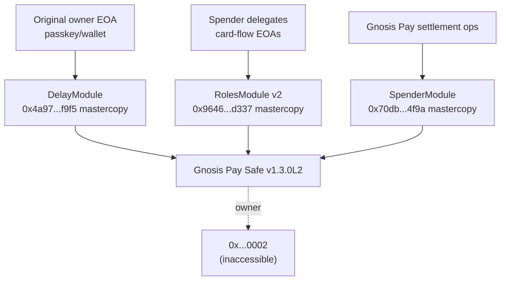
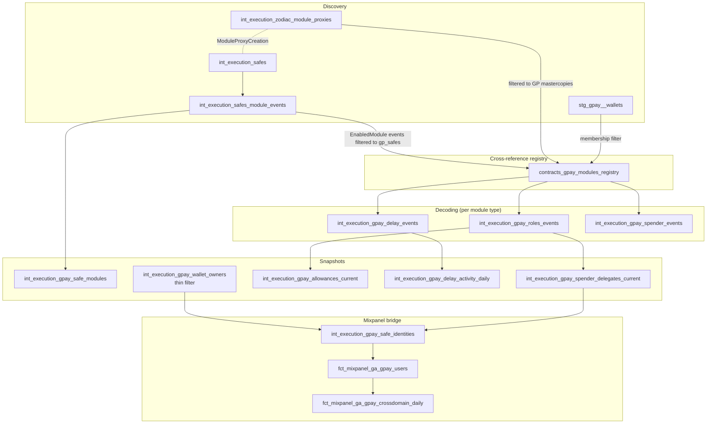

# Gnosis Pay

## Product Overview

[Gnosis Pay](https://gnosispay.com) is a Visa-network debit card issued against an on-chain smart account. Every Gnosis Pay account is a Safe with a specific module topology that combines [Zodiac](https://github.com/gnosisguild/zodiac) primitives with a Gnosis Pay-custom Spender (Bouncer) module. Card spends, daily limits, and admin actions are all enforced on-chain through that module stack.

The full product documentation lives at <https://docs.gnosispay.com/gp-onchain/about-GP-safe>. This page is the Cerebro analytics complement: it explains how we model the on-chain side of the product so you can answer questions like "how many GP cardholders changed their daily limit this month?", "which delegates are authorized to spend on this Safe?", or "how many Mixpanel users are also GP cardholders?".

## GP Safe architecture

Every Gnosis Pay Safe goes through a fixed onboarding ceremony defined in [`gnosispay/account-kit`](https://github.com/gnosispay/account-kit/blob/main/src/entrypoints/accounts-actions/accountSetup.ts). Four steps, all in the same on-chain transaction sequence:

1. **Transfer Safe ownership to the inaccessible sentinel `0x0000000000000000000000000000000000000002`.** This makes the Safe self-controlled — no human EOA can sign transactions directly anymore. All admin happens through modules.
2. **Enable the Zodiac Delay Module.** A delayed-execution queue with configurable cooldown (typically 3 minutes) and expiration. The original setup owner retains access to *this* module — that's the path back in for withdrawals, key rotation, and other admin.
3. **Enable the Zodiac Roles v2 Module.** A spending state machine with per-period allowances (the user's daily limit), function-scoped permissions (only ERC-20 transfers, only to whitelisted targets), and **delegates** — non-owner addresses authorized to trigger spends within the allowance.
4. **Enable the Gnosis Pay Spender ("Bouncer") Module.** GP's custom final gatekeeper for card-spend authorization, deployed and controlled by Gnosis Pay's settlement infrastructure.



After onboarding, the Safe's `getOwners()` returns `[0x...0002]` and the modules list returns the two currently-active module proxies (Delay + Roles) — see the Spender caveat below.

### GP Safe demographics (April 2025)

- **30,807** GP Safes in `stg_gpay__wallets ∩ int_execution_safes`
- **100% are Safe v1.3.0** (not v1.4.1, not L2, not Circles). This means none of the v1.4.1 ABI indexed-flag drift issues ([documented in the Safe page](../safe/index.md#abi-indexed-flag-drift-across-versions)) affect GP.
- Each Safe has exactly **2 Zodiac modules**: 1 DelayModule + 1 RolesModule (30,805 of each in `int_execution_gpay_safe_modules`).
- The Spender module is NOT enabled as a per-Safe Zodiac proxy — see [Spender architecture update](#spender-architecture-update-april-2025) below.

## Contracts & mastercopies

| Contract | Address | Source | Function |
|---|---|---|---|
| `ModuleProxyFactory` | `0x000000000000addb49795b0f9ba5bc298cdda236` | [`gnosis/zodiac`](https://github.com/gnosisguild/zodiac) | Canonical Zodiac factory; emits `ModuleProxyCreation(proxy, masterCopy)` per deployment. |
| `DelayModule mastercopy` | `0x4a97e65188a950dd4b0f21f9b5434daee0bbf9f5` | [`gnosis/zodiac-modifier-delay`](https://github.com/gnosisguild/zodiac-modifier-delay) | Cooldown queue. |
| `RolesModule v2 mastercopy` | `0x9646fdad06d3e24444381f44362a3b0eb343d337` | [`gnosis/zodiac-modifier-roles`](https://github.com/gnosisguild/zodiac-modifier-roles) | Allowance state + delegate assignments. |
| `SpenderModule mastercopy` | `0x70db53617d170a4e407e00dff718099539134f9a` | [`gnosispay/account-kit`](https://github.com/gnosispay/account-kit) | GP-custom; final gatekeeper for card-spend execution. |
| `EntryPoint v0.7` | `0x0000000071727de22e5e9d8baf0edac6f37da032` | ERC-4337 | Used by some GP flows for relayed transactions. |

These five addresses are hardcoded in `seeds/contracts_abi.csv` (one row each) so the signature generator produces the right topic0 hashes for every event we decode.

## Decoded events per module

Cerebro decodes the GP-relevant subset of each module's ABI. Type canonicalization (`uint` → `uint256`, etc.) is handled by the signature generator; argument names must match the deployed Blockscout ABI verbatim or the `decoded_params['key']` lookups silently return NULL.

### Zodiac Delay Module

| Event | Purpose | Where it surfaces |
|---|---|---|
| `DelaySetup(initiator, owner, avatar, target)` | Module enabled and configured for a Safe. | `int_execution_gpay_delay_events` |
| `TransactionAdded(queueNonce, txHash, to, value, data, operation)` | A queued admin action — withdraw, key rotation, etc. The single best on-chain "user did something admin-ish" signal. | `int_execution_gpay_delay_events` and the `int_execution_gpay_delay_activity_daily` rollup. |
| `TxCooldownSet(cooldown)` / `TxExpirationSet(expiration)` / `TxNonceSet(nonce)` | Module configuration mutations. | `int_execution_gpay_delay_events` |

### Zodiac Roles v2 Module

| Event | Purpose | Where it surfaces |
|---|---|---|
| `RolesModSetup(initiator, owner, avatar, target)` | Module enabled and configured for a Safe. | `int_execution_gpay_roles_events` |
| `AssignRoles(module, roleKeys, memberOf)` | Spender delegate assignment. The `roleKeys` and `memberOf` arrays are parallel — for each (key, true) pair the module address is granted that role. Unrolled into one row per (delegate, role_key) via `ARRAY JOIN`. **ABI note:** the `module` param was incorrectly declared `indexed: true` in the original CSV seed but the [Zodiac Roles v2 source](https://github.com/gnosis/zodiac-modifier-roles) has it non-indexed. Confirmed by 654/654 sampled raw logs having NULL topic1. Fixed via `scripts/signatures/flip_indexed_flags.py`. The `memberOf` param is `bool[]` — decoded by `decode_logs` as `["0","1"]` (decimal strings). | `int_execution_gpay_roles_events`, then `int_execution_gpay_spender_delegates_current` |
| `SetAllowance(allowanceKey, balance, maxRefill, refill, period, timestamp)` | The user's daily limit. `refill` is the per-period top-up (the canonical "daily limit" number), `period` is the refill window in seconds (typically 86400 = 24h), `maxRefill` is the cap on accumulation. | `int_execution_gpay_roles_events`, then `int_execution_gpay_allowances_current` |
| `ConsumeAllowance(allowanceKey, consumed, newBalance)` | A spend deducted from the allowance. Useful for burn-down history per Safe. | `int_execution_gpay_roles_events` |

### Gnosis Pay Spender Module

#### Spender architecture update (April 2025)

The initial design assumed every GP Safe enables a per-Safe Spender proxy (deployed via the Zodiac ModuleProxyFactory, like Delay and Roles). **This is wrong.** Investigation of on-chain data revealed:

- GP Safes only enable **2 modules** (Delay + Roles), not 3. No per-Safe Spender proxy appears in `int_execution_safes_module_events`.
- The actual card-spend flow uses a **single global Spender router** at `0xcff260bfbc199dc82717494299b1acade25f549b` (259k+ `Spend` events in Q1 2025 alone).
- The mastercopy at `0x70db53617d170a4e407e00dff718099539134f9a` IS in `seeds/contracts_abi.csv` (ABI pulled from Blockscout), but `int_execution_gpay_spender_events` remains **empty** because the model decodes from per-Safe proxies in `contracts_gpay_modules_registry`, which has zero SpenderModule entries.

**Pending refactor:** Change `int_execution_gpay_spender_events` to decode from the single global router address instead of per-Safe proxies. This requires:

1. Fetch the global router ABI: `python scripts/signatures/fetch_abi_to_csv.py --regen --name GpaySpenderRouter 0xcff260bfbc199dc82717494299b1acade25f549b`
2. Re-seed and regenerate signatures
3. Rewrite the model to use `contract_address = '0xcff260...'` instead of `contract_address_ref`
4. Drop `SpenderModule` from `contracts_gpay_modules_registry` since per-Safe Spender proxies don't exist

The Spender ABI from Blockscout includes `Spend(address asset, address account, address receiver, uint256 amount)` as the main card-spend event, plus standard Zodiac module events (`AvatarSet`, `TargetSet`, `OwnershipTransferred`, etc.).

## dbt pipeline

The full pipeline has three layers: discovery (which Safes/modules exist), decoding (what events did they emit), and snapshot (what's the current state per Safe).



### Discovery layer

| Model | Materialization | Purpose |
|---|---|---|
| `int_execution_zodiac_module_proxies` | Incremental | Decoded `ModuleProxyCreation` events from the Zodiac `ModuleProxyFactory` — every Zodiac module proxy ever deployed on Gnosis Chain, with its mastercopy. |
| `int_execution_safes_module_events` | Incremental | Decoded `EnabledModule` / `DisabledModule` / `ChangedGuard` / `ChangedModuleGuard` events for every Safe in `contracts_safe_registry`. Long-form history. |
| `stg_gpay__wallets` | View | The canonical "which Safes are GP?" source — sourced from `int_crawlers_data_labels WHERE project = 'gpay'` (Dune labels). Already existed before this work. |

### The cross-referenced registry

`contracts_gpay_modules_registry` is the linchpin: it joins three discovery sources to produce a high-confidence registry of every (GP Safe, module type, module proxy) triple.

```sql
-- models/execution/gpay/intermediate/contracts_gpay_modules_registry.sql (excerpt)
WITH gpay_safes AS (
    SELECT lower(address) AS pay_wallet FROM {{ ref('stg_gpay__wallets') }}
),
enabled_on_gp AS (
    SELECT DISTINCT lower(target_address) AS module_proxy, min(block_timestamp) AS first_enabled_at
    FROM {{ ref('int_execution_safes_module_events') }}
    WHERE event_kind = 'enabled_module'
      AND lower(safe_address) IN (SELECT pay_wallet FROM gpay_safes)
    GROUP BY module_proxy
)
SELECT
    e.module_proxy                   AS address,
    multiIf(
        p.master_copy = '0x4a97...', 'DelayModule',
        p.master_copy = '0x9646...', 'RolesModule',
        p.master_copy = '0x70db...', 'SpenderModule',
        'Unknown'
    )                                AS contract_type,
    p.master_copy                    AS abi_source_address,
    toUInt8(1)                       AS is_dynamic,
    e.first_enabled_at               AS start_blocktime,
    'gpay_module_enabled_x_proxy_factory' AS discovery_source
FROM enabled_on_gp e
INNER JOIN {{ ref('int_execution_zodiac_module_proxies') }} p
    ON p.proxy_address = e.module_proxy
WHERE p.master_copy IN ('0x4a97...', '0x9646...', '0x70db...')
```

The `INNER JOIN` requires evidence from BOTH sides: the Safe enabled this address as a module AND the Zodiac factory deployed this address against a known GP mastercopy. This filters out any spurious EnabledModule events pointing to addresses that aren't actually Zodiac module proxies. Expected row count: ≈3 × |stg_gpay__wallets| (one row per module type per GP Safe).

### Per-module decoding layer

Each `int_execution_gpay_*_events` model is a thin wrapper around `decode_logs(contract_address_ref=ref('contracts_gpay_modules_registry'), contract_type_filter='<ModuleType>')`. The reshape on top unpacks `decoded_params` into typed columns; nothing else.

| Model | Decodes | Notes |
|---|---|---|
| `int_execution_gpay_delay_events` | `DelayModule` proxies | `TransactionAdded` is the single most useful event — it marks every queued admin action. |
| `int_execution_gpay_roles_events` | `RolesModule` proxies | `AssignRoles` requires unrolling parallel `bytes32[]` and `bool[]` arrays via `ARRAY JOIN`. |
| `int_execution_gpay_spender_events` | `SpenderModule` proxies | Custom GP module — confirm event names against the Blockscout ABI before trusting the column lookups. |

### Snapshot layer

| Model | Materialization | Purpose |
|---|---|---|
| `int_execution_gpay_safe_modules` | Table | Current module topology per GP Safe: one row per `(gp_safe, contract_type, module_proxy)` where the latest event is `enabled_module`. |
| `int_execution_gpay_spender_delegates_current` | Table | Current spender list: replays `AssignRoles` and keeps `(roles_module, role_key, member)` rows whose latest `memberOf` is `true`. **Note:** as of April 2025, all 30,805 GP Safes assign the same single delegate address (`0x896a695d...`) — the GP backend spender key. Only 1 distinct pseudonym exists in the delegate identity_role. The bridge is structurally ready but produces 0 Mixpanel matches because the backend key isn't a user-facing identity. |
| `int_execution_gpay_allowances_current` | Table | Current daily limit per GP Safe: argMax over `SetAllowance` events. The `refill` column is the canonical "daily limit" number. |
| `int_execution_gpay_delay_activity_daily` | Incremental | Daily count of `TransactionAdded` events per GP Safe — privacy-respecting "user did something admin-ish today" signal. |
| `int_execution_gpay_wallet_owners` | Incremental | Refactored thin filter over `int_execution_safes_current_owners` — preserved schema, now reflects post-setup owner mutations. |

### Mixpanel bridge

The bridge gets its own page: [Mixpanel Bridge](mixpanel-bridge.md). Short version:

- `int_execution_gpay_safe_identities` produces one row per `(gp_safe, identity_role, user_pseudonym)` where `identity_role ∈ {initial_owner, delegate, safe_self}`. All addresses are pseudonymized via `pseudonymize_address` so raw EOAs never reach the marts layer.
- `fct_mixpanel_ga_gpay_users` joins the identity model against `stg_mixpanel_ga__events.user_id_hash` and denormalizes the per-Safe module topology, daily limit, and recent delay activity.
- `fct_mixpanel_ga_gpay_crossdomain_daily` (extended) provides the daily rollup of matched users by identity role plus dimensional metrics for delay activity and allowance changes.

## The thin-filter refactor of `int_execution_gpay_wallet_owners`

`int_execution_gpay_wallet_owners` existed before this work but had two issues:

1. **It hand-decoded `SafeSetup` events** with inline byte-offset arithmetic — duplicating logic that now lives in the `decode_logs` macro and `int_execution_safes_owner_events`.
2. **Its `ORDER BY` was `(pay_wallet)`** — meaning ReplacingMergeTree silently kept only one owner per multi-sig Safe on merge. Multi-owner Safes lost owners on merge.

The refactor turned it into a thin filter over `int_execution_safes_current_owners`:

```sql
-- models/execution/gpay/intermediate/int_execution_gpay_wallet_owners.sql
WITH gpay_safes AS (
    SELECT lower(address) AS pay_wallet FROM {{ ref('stg_gpay__wallets') }}
)
SELECT
    co.safe_address       AS pay_wallet,
    co.owner              AS owner,
    co.current_threshold  AS threshold,
    co.became_owner_at    AS block_timestamp
FROM {{ ref('int_execution_safes_current_owners') }} co
INNER JOIN gpay_safes gs ON co.safe_address = gs.pay_wallet
```

Order key is now `(pay_wallet, owner)` and the model picks up post-setup owner mutations automatically. **Breaking semantics to flag in any downstream consumer:**

- `block_timestamp` previously meant "Safe creation time"; it now means "last became-owner event time per (Safe, owner) pair". For an owner added post-setup, this is the `AddedOwner` event time. For an owner removed and re-added, it's the re-add time.
- Row count for multi-sig Safes increases (one row per current owner instead of one per Safe). Single-owner Safes unchanged.

Audit any consumer that uses `block_timestamp` as a "Safe creation date" filter — the most prominent is `fct_execution_gpay_owner_balances_by_token_daily`.

## Privacy

Every column that came from a wallet address goes through `pseudonymize_address` before reaching `fct_mixpanel_ga_gpay_users` or any cross-domain mart. Raw EOAs are visible only inside the gpay intermediate layer (where they're needed for the join to `stg_gpay__wallets` and for replaying the SafeSetup unroll); they never touch Mixpanel.

The Safe address itself (`gp_safe`) is treated as a smart-account identifier rather than as PII — it identifies a GP card, not a person. If that classification ever changes, the bridge model is the single point to flip.

See the [Privacy & Pseudonyms](../../data-pipeline/transformation/privacy-pseudonyms.md) deep dive for the full pattern.

## Backfill

The full GP stack (Phase 1 zodiac proxies → Phase 2 Safe module events → Phase 3 cross-ref registry → Phase 4 per-module decoders → Phase 5 snapshots → Phase 6 Mixpanel bridge) backfills via the standard refresh wrapper. The `meta.full_refresh.{start_date, batch_months}` config on each model determines its loop:

```bash
python scripts/full_refresh/refresh.py --select \
    int_execution_zodiac_module_proxies \
    int_execution_safes_module_events \
    contracts_gpay_modules_registry \
    int_execution_gpay_delay_events \
    int_execution_gpay_roles_events \
    int_execution_gpay_spender_events \
    int_execution_gpay_safe_modules \
    int_execution_gpay_spender_delegates_current \
    int_execution_gpay_allowances_current \
    int_execution_gpay_delay_activity_daily \
    int_execution_gpay_safe_identities \
    fct_mixpanel_ga_gpay_users
```

Order matters: the cross-reference registry must rebuild after every monthly batch of the upstream events models so each month's freshly-discovered modules are in the registry before the per-module decoders run for that month.

## Gotchas

- **The Safe address vs EOA owner mismatch.** Mixpanel's `distinct_id` may be the Safe address (smart account) OR the EOA that signs for it OR a delegate key, depending on which GP frontend flow created it. The bridge handles all three via the `identity_role` union — see [Mixpanel Bridge](mixpanel-bridge.md).
- **Roles v2 argument names are not canonical.** The signature generator canonicalizes types but not argument names, so a deployed mastercopy with a renamed parameter will silently produce NULL `decoded_params` lookups. Always confirm against a sample row from `int_execution_gpay_roles_events.decoded_params` after the first batch.
- **`int_execution_gpay_wallet_owners.block_timestamp` semantics changed.** Previously creation time, now last became-owner time. Audit downstream uses.
- **The Spender module ABI is not in any public Zodiac repo.** Pulled from Blockscout. If GP rotates the mastercopy, we have to refresh the ABI seed and re-run the signature generator.
- **RolesMod_v2 ABI had `module` wrongly indexed.** The Zodiac source says `event AssignRoles(address module, ...)` (no `indexed`). Our CSV had `"indexed":true`. This shifted the ABI offset calculation: `decode_logs` read `module` from topic1 (NULL), then tried to read `roleKeys` starting at word 1 of data (which was the module address, not the roleKeys offset). Result: empty JSON array → `ARRAY JOIN` dropped every row → 0 `AssignRoles` output. Fixed via `flip_indexed_flags.py`. Same for `SetDefaultRole`.
- **`int_execution_gpay_safe_modules` is a sibling of `int_execution_gpay_roles_events`, not downstream.** Running `--select int_execution_gpay_roles_events+` does NOT rebuild `safe_modules`. If `safe_modules` is empty, the entire delegate chain (`spender_delegates_current → safe_identities → fct`) silently produces 0 delegate rows. Always include `int_execution_gpay_safe_modules+` in the rebuild selector when rebuilding the GP stack.
- **GP Safes are 100% v1.3.0.** None of the v1.4.1 ABI drift issues affect GP. The broader Safe v1.4.1 AddedOwner/RemovedOwner fix (107k non-GP rows) and the singleton-upgrade-pattern refactor (~20k non-GP rows) are separate scope.
- **The per-Safe Spender proxy assumption was wrong.** GP Safes only enable 2 modules (Delay + Roles). The actual card-spend path goes through a single global Spender router at `0xcff260bfbc199dc82717494299b1acade25f549b`, not per-Safe proxies. See [Spender architecture update](#spender-architecture-update-april-2025).

## Related pages

- [Mixpanel Bridge](mixpanel-bridge.md) — the per-user fact + daily rollup on top of this stack.
- [Safe Protocol](../safe/index.md) — the foundation: how `int_execution_safes` and `contracts_safe_registry` are built and what they cover.
- [Registry pattern deep dive](../../data-pipeline/transformation/safe-module-registry-pattern.md) — how the two-layer registry pattern (`contracts_safe_registry` for Safe events, `contracts_gpay_modules_registry` for module events) works.
- [Privacy & Pseudonyms](../../data-pipeline/transformation/privacy-pseudonyms.md) — how owner addresses are pseudonymized for the Mixpanel join.
- [Gnosis App](../gnosis-app/index.md) — the parallel sector for the Gnosis App / Cometh / Circles user base.
