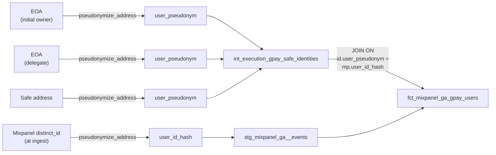

# Gnosis Pay → Mixpanel Bridge

This page is the deep dive on how Cerebro joins Gnosis Pay's on-chain Safe stack to Mixpanel product analytics. Read [the Gnosis Pay protocol page](index.md) first for the on-chain context, and the [Privacy & Pseudonyms](../../data-pipeline/transformation/privacy-pseudonyms.md) deep dive for the keyed-hash pattern that makes the join possible without leaking raw addresses.

## Why this is harder than it looks

The naive question — "is this Mixpanel user a Gnosis Pay cardholder?" — has a deceptively non-trivial answer because **the same person can appear in three different identity forms across the GP product flows**:

1. As the **original setup owner** of the Safe — the EOA they signed in with via passkey or wallet during onboarding, before ownership was transferred to the inaccessible sentinel `0x...0002`. After onboarding this EOA only has access through the Delay module.
2. As a **spender delegate** of the Safe — a delegate key authorized via the Roles module's `AssignRoles` event. This is what the GP card-flow infrastructure uses to trigger spends within the user's allowance. It may or may not be the same key as the original owner.
3. As the **Safe address itself** — some GP frontend flows call `mixpanel.identify(safeAddress)` rather than `mixpanel.identify(eoaAddress)`, so the smart-account address shows up as the user's `distinct_id`.

A bridge that picks one of these and ignores the other two will silently miss most of its target audience. Matching only on the EOA owner — the most obvious choice — collapses the match rate to near-zero, because the Mixpanel `distinct_id` for many users is *not* the EOA. The three forms must all be tried.

The solution: **pseudonymize all three candidate identifiers, store them in a single union table, and treat any match on any of the three as "this Mixpanel user is a GP cardholder"**. This is the union-match pattern from the [pseudonyms doc](../../data-pipeline/transformation/privacy-pseudonyms.md#rules-for-new-cross-domain-work).

## The identity model

`int_execution_gpay_safe_identities` is the catalog of every (GP Safe, identity role, pseudonym) triple. It's a long-form table — one row per identity, not one row per Safe — so a Safe with two initial owners and three delegates produces six rows (2 + 3 + 1 self).

```sql
-- models/execution/gpay/intermediate/int_execution_gpay_safe_identities.sql
WITH gp_safes AS (
    SELECT lower(address) AS gp_safe FROM {{ ref('stg_gpay__wallets') }}
),

initial_owners AS (
    SELECT
        oe.safe_address                            AS gp_safe,
        'initial_owner'                            AS identity_role,
        {{ pseudonymize_address('oe.owner') }}     AS user_pseudonym
    FROM {{ ref('int_execution_safes_owner_events') }} oe
    INNER JOIN gp_safes gs ON lower(oe.safe_address) = gs.gp_safe
    WHERE oe.event_kind = 'safe_setup' AND oe.owner IS NOT NULL
),

delegates AS (
    SELECT
        d.gp_safe,
        'delegate'                                       AS identity_role,
        {{ pseudonymize_address('d.delegate_address') }} AS user_pseudonym
    FROM {{ ref('int_execution_gpay_spender_delegates_current') }} d
),

safe_self AS (
    SELECT
        gp_safe,
        'safe_self'                              AS identity_role,
        {{ pseudonymize_address('gp_safe') }}    AS user_pseudonym
    FROM gp_safes
)

SELECT * FROM initial_owners
UNION ALL SELECT * FROM delegates
UNION ALL SELECT * FROM safe_self
```

Three identity roles, three sub-queries, one union. The privacy invariant — every column derived from a wallet address goes through `pseudonymize_address` — is enforced inline in each sub-query. The only column that is not pseudonymized is `gp_safe`, which we treat as a smart-account identifier rather than as PII (it identifies a card, not a person; if that classification ever changes, the bridge model is the single point to flip).

## The pseudonym flow end-to-end



The same `pseudonymize_address` macro is used on every edge of this diagram. The same `CEREBRO_PII_SALT` is used everywhere, automatically — there is no second salt, no second macro, no way to introduce a mismatch by accident. If the join produces zero rows, the cause is always one of:

1. The salt was different in two environments (someone forgot to set `CEREBRO_PII_SALT` in one of them).
2. The `distinct_id` is **not** in any of the three identity buckets (i.e., the user is genuinely not a GP cardholder, or the GP frontend uses a fourth identifier we haven't accounted for).

## The per-user fact

`fct_mixpanel_ga_gpay_users` is the workhorse table for downstream analytics. One row per `(user_id_hash, gp_safe)` pair, with denormalized columns for module topology, current daily limit, and recent delay activity.

```sql
-- models/mixpanel_ga/marts/fct_mixpanel_ga_gpay_users.sql (excerpt)
WITH mp_users AS (
    SELECT DISTINCT user_id_hash
    FROM {{ ref('stg_mixpanel_ga__events') }}
    WHERE is_production = 1 AND is_identified = 1
),

matches AS (
    SELECT
        mp.user_id_hash,
        id.gp_safe,
        groupArray(DISTINCT id.identity_role) AS matched_roles
    FROM mp_users mp
    INNER JOIN {{ ref('int_execution_gpay_safe_identities') }} id
        ON mp.user_id_hash = id.user_pseudonym
    GROUP BY mp.user_id_hash, id.gp_safe
)

SELECT
    m.user_id_hash,
    m.gp_safe,
    m.matched_roles,                                      -- which of (initial_owner, delegate, safe_self) matched
    groupArray(sm.contract_type)        AS enabled_modules,
    any(al.refill)                      AS daily_limit,
    any(al.period)                      AS allowance_period_seconds,
    coalesce(any(da.delay_tx_30d), 0)   AS delay_txs_last_30d
FROM matches m
LEFT JOIN {{ ref('int_execution_gpay_safe_modules') }}        sm ON sm.gp_safe = m.gp_safe
LEFT JOIN {{ ref('int_execution_gpay_allowances_current') }}  al ON al.gp_safe = m.gp_safe
LEFT JOIN (
    SELECT gp_safe, sum(tx_added_count) AS delay_tx_30d
    FROM {{ ref('int_execution_gpay_delay_activity_daily') }}
    WHERE date >= today() - 30
    GROUP BY gp_safe
) da ON da.gp_safe = m.gp_safe
GROUP BY m.user_id_hash, m.gp_safe, m.matched_roles
```

### Output schema

| Column | Type | Source | Notes |
|---|---|---|---|
| `user_id_hash` | UInt64 | `stg_mixpanel_ga__events` | Pseudonym; identical join key on both sides. |
| `gp_safe` | String | `stg_gpay__wallets` | Smart-account identifier. Lowercase, 0x-prefixed. |
| `matched_roles` | Array(String) | derived | Which of `initial_owner`, `delegate`, `safe_self` matched. Almost always one element; can be more for unusual setups. |
| `enabled_modules` | Array(String) | `int_execution_gpay_safe_modules` | Always `['DelayModule', 'RolesModule', 'SpenderModule']` for a fully onboarded GP Safe. Missing values flag a partial onboarding. |
| `daily_limit` | UInt128 | `int_execution_gpay_allowances_current` | The `refill` field from the latest `SetAllowance` event; in token base units. |
| `allowance_period_seconds` | UInt64 | `int_execution_gpay_allowances_current` | The `period` field. Almost always 86400 (24h). |
| `delay_txs_last_30d` | UInt64 | `int_execution_gpay_delay_activity_daily` | Count of `TransactionAdded` events in the trailing 30 days for this Safe. Privacy-respecting "user did something admin-y recently" signal. |

The model is materialized as a `table` and rebuilt fully on each run — it's small (one row per GP cardholder × per Safe they own, typically a 1:1 relationship).

## The daily rollup

`fct_mixpanel_ga_gpay_crossdomain_daily` already existed before this work — the original version produced `(date, mp_dau, onchain_active_users, matched_users, match_rate_pct)`. The expansion adds dimensional columns derived from `fct_mixpanel_ga_gpay_users`:

| New column | What it counts |
|---|---|
| `matched_by_initial_owner_users` | Distinct MP users matched via the `initial_owner` role |
| `matched_by_delegate_users` | Matched via the `delegate` role |
| `matched_by_safe_self_users` | Matched via the `safe_self` role |
| `users_with_delay_activity_7d` | Matched users whose `gp_safe` had `TransactionAdded` events in the last 7 days |
| `users_with_allowance_changes_30d` | Matched users whose `gp_safe` had `SetAllowance` events in the last 30 days |

The original `matched_users` column becomes `matched_users_any` — the union of the three role buckets — to preserve backward compatibility while reflecting the new reality.

## Match-rate diagnostics

Once the bridge is built, the headline number to watch is the match rate by role:

```sql
SELECT
    countIf(has(matched_roles, 'initial_owner'))  AS via_initial_owner,
    countIf(has(matched_roles, 'delegate'))       AS via_delegate,
    countIf(has(matched_roles, 'safe_self'))      AS via_safe_self,
    count()                                       AS total_matched_pairs,
    uniqExact(user_id_hash)                       AS distinct_mp_users
FROM dbt.fct_mixpanel_ga_gpay_users;
```

What to expect:

- `via_initial_owner` should dominate — the original setup owner is the most likely identifier the GP frontend uses.
- `via_safe_self` should be a small but non-zero tail — some flows do call `mixpanel.identify(safeAddress)`.
- `via_delegate` should be the smallest tail — delegate keys are usually backend-managed and not user-facing, so they rarely show up in Mixpanel.
- `distinct_mp_users` ÷ (count of `is_identified=1` MP users) gives the overall **GP cardholder coverage** of Mixpanel — the headline KPI for product analytics.

If `via_initial_owner` is near-zero, **the bridge is broken**, not the data. Investigate by sampling raw `distinct_id` values from a recent GP-era Mixpanel session and comparing them byte-for-byte against the three identity candidates for the corresponding Safe. The most common cause is a fourth identity form (a delegate key not yet in `AssignRoles`, a session-scoped key, etc.) that needs to be added as a new sub-query in `int_execution_gpay_safe_identities`.

## Operational rules

These are not optional — they protect the privacy guarantees the bridge depends on.

- **Never project a raw EOA into the marts layer.** If you need a raw address inside an intermediate model for join purposes, do the pseudonymization in the same model — never push the raw column downstream.
- **Never write `sipHash64(some_address)` directly.** Always use `pseudonymize_address`. Repo-grep guard:
  ```bash
  rg "sipHash64\(" models/ | rg -v "pseudonymize_address\|user_id_hash\|device_id_hash"
  ```
- **Salt rotation is permanent damage.** Rotating `CEREBRO_PII_SALT` invalidates every pseudonym in the warehouse. We do not rotate.
- **Audit `block_timestamp` semantics on consumers of `int_execution_gpay_wallet_owners`.** Refer to the [breaking semantics callout](index.md#the-thin-filter-refactor-of-int_execution_gpay_wallet_owners) on the GP protocol page.
- **If a new identity form is discovered (a fourth bucket), add it as a new sub-query in `int_execution_gpay_safe_identities`.** Don't change the existing three — they're all known-good and downstream `matched_roles` analysis depends on the role names being stable.

## Related pages

- [Gnosis Pay protocol overview](index.md) — the on-chain side: modules, allowances, delegates, the cross-referenced module registry.
- [Privacy & Pseudonyms](../../data-pipeline/transformation/privacy-pseudonyms.md) — the keyed-hash pattern, the salt contract, and the rules for new cross-domain work.
- [Safe protocol](../safe/index.md) — the foundation models (`int_execution_safes_owner_events`, etc.) that this bridge reads from.
- [Gnosis App heuristic sector](../gnosis-app/index.md) — the parallel bridge for a heuristic-derived user list, where Mixpanel is the *check* rather than the source of truth.
