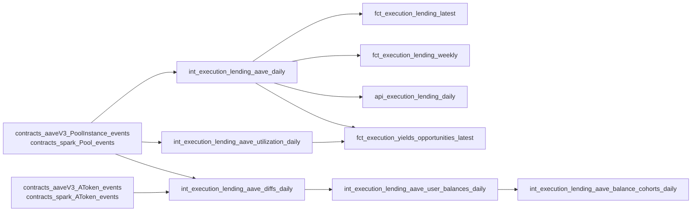

# Lending Rate Analytics

This page documents how the analytics pipeline derives daily supply APY, borrow APY, utilization rates, and per-user balance tracking from raw Aave V3 and SparkLend events on Gnosis Chain. For the underlying protocol mechanics and event structures, see the [Lending Protocols](index.md) hub page.

## Pipeline Overview



## Rate Derivation — `int_execution_lending_aave_daily`

This is the core rate model. It produces one row per `(date, protocol, token_address)` with supply APY, borrow APY, activity volumes, and user counts.

### Protocol-aware union

Raw Pool events from both protocols are combined at the top of the model:

```sql
SELECT 'Aave V3'   AS protocol, * FROM contracts_aaveV3_PoolInstance_events
UNION ALL
SELECT 'SparkLend' AS protocol, * FROM contracts_spark_Pool_events
```

Every downstream CTE partitions by `protocol` so the two markets never contaminate each other. The 15-reserve [`lending_market_mapping.csv`](https://github.com/gnosischain/dbt-cerebro/blob/main/seeds/lending_market_mapping.csv) seed resolves `(protocol, reserve_address)` → `(symbol, decimals, token_class)`.

### End-of-day rate snapshot

Multiple `ReserveDataUpdated` events can fire per reserve per day. The model takes the **last** observed rate within each day using `argMax`:

```sql
SELECT
    protocol,
    event_date,
    token_address,
    argMax(liquidity_rate_ray, block_timestamp) AS liquidity_rate_ray,
    argMax(variable_borrow_rate_ray, block_timestamp) AS variable_borrow_rate_ray,
    argMax(liquidity_index, block_timestamp) AS liquidity_index,
    argMax(variable_borrow_index, block_timestamp) AS variable_borrow_index
FROM rate_events
GROUP BY protocol, event_date, token_address
```

### RAY → APY conversion

The on-chain rate is a per-second APR in RAY (1e27). Continuous compounding over `seconds_per_year = 31536000` converts it to APY:

$$
\text{APY} = \left(1 + \frac{\text{liquidityRate}}{10^{27} \times 31{,}536{,}000}\right)^{31{,}536{,}000} - 1
$$

In ClickHouse:

```sql
CASE
    WHEN liquidity_rate_ray = 0 OR liquidity_rate_ray IS NULL THEN 0
    ELSE floor(
        (pow(1 + toFloat64(liquidity_rate_ray) / 1e27 / 31536000, 31536000) - 1) * 100,
        4
    )
END AS apy_daily
```

The same formula applies to `variable_borrow_rate_ray` → `borrow_apy_variable_daily`. The **spread** is the difference: `borrow_apy - supply_apy`.

### Forward-fill across eventless days

Not every reserve has a `ReserveDataUpdated` event every day (low-activity reserves may go days without one). The model generates a calendar of all `(protocol, token_address)` combinations, then forward-fills rates using:

```sql
last_value(apy_daily) IGNORE NULLS OVER (
    PARTITION BY protocol, token_address
    ORDER BY metric_date
    ROWS BETWEEN UNBOUNDED PRECEDING AND CURRENT ROW
) AS apy_daily
```

For incremental runs, the model also carries forward the last known rate from the existing table via an `argMax` lookup, ensuring no NULL gap at the batch boundary.

### Activity aggregation

Alongside rates, the model aggregates daily activity per `(protocol, token_address)`:

- **User counts**: `uniqExact(user_address)` for lenders and borrowers, plus ClickHouse `groupBitmapState(cityHash64(user_address))` bitmaps for efficient rolling-window deduplication via `groupBitmapMerge()`.
- **Volumes**: Daily `Supply`, `Borrow`, `Withdraw`, `Repay` volumes in token units (raw amounts divided by `10^decimals`).
- **Net supply change**: `deposits - withdrawals - liquidated_collateral` for TVL tracking.

### Output columns

| Column | Type | Description |
|--------|------|-------------|
| `date` | Date | Calendar day |
| `protocol` | String | `'Aave V3'` or `'SparkLend'` |
| `token_address` | String | Reserve token address (lowercase) |
| `symbol` | String | Reserve symbol (e.g. `WETH`, `WxDAI`) |
| `token_class` | String | `STABLECOIN` or `OTHERS` |
| `apy_daily` | Float64 | Annualized supply APY (%), forward-filled |
| `borrow_apy_variable_daily` | Float64 | Annualized variable borrow APY (%) |
| `spread_variable` | Float64 | `borrow_apy - apy_daily` |
| `liquidity_index` | Float64 | Protocol liquidityIndex (RAY), forward-filled |
| `variable_borrow_index` | Float64 | Protocol variableBorrowIndex (RAY) |
| `lenders_bitmap_state` | AggregateFunction | Bitmap for rolling-window unique lender counts |
| `borrowers_bitmap_state` | AggregateFunction | Bitmap for rolling-window unique borrower counts |
| `lenders_count_daily` | UInt64 | Unique lenders on this day |
| `borrowers_count_daily` | UInt64 | Unique borrowers on this day |
| `deposits_volume_daily` | Float64 | Supply event volume (token units) |
| `borrows_volume_daily` | Float64 | Borrow event volume (token units) |
| `withdrawals_volume_daily` | Float64 | Withdraw event volume (token units) |
| `repays_volume_daily` | Float64 | Repay event volume (token units) |
| `net_supply_change_daily` | Float64 | Deposits − withdrawals − liquidations (token units) |

## Utilization Rate — `int_execution_lending_aave_utilization_daily`

Utilization is computed from **exact WadRayMath** (UInt256 integer arithmetic), not from floating-point rate proxies.

### Scaled balance approach

Each Pool action (Supply/Withdraw/Borrow/Repay/LiquidationCall) is paired with the `ReserveDataUpdated` snapshot from the **same transaction** via an `ASOF INNER JOIN` on `(protocol, transaction_hash, token_address)` where `r.log_index < s.log_index`. This is correct for both Aave V3 (one RDU per action) and SparkLend (many RDUs interleaved from FlashLoans).

For supply-side actions:

```sql
-- Supply: rayDivFloor
intDiv(amount_raw * 1e27_uint256, liquidity_index) AS scaled_delta

-- Withdraw / LiquidationWithdraw: rayDivCeil (negative)
-intDiv(amount_raw * 1e27_uint256 + liquidity_index - 1, liquidity_index) AS scaled_delta
```

For borrow-side actions the same logic applies using `variable_borrow_index`.

### Running cumulative + utilization

Daily deltas are summed cumulatively via a running window:

```sql
sum(delta_supply) OVER (
    PARTITION BY protocol, token_address ORDER BY date
    ROWS BETWEEN UNBOUNDED PRECEDING AND CURRENT ROW
) AS cumulative_scaled_supply
```

Utilization is then:

```
utilization = (cumulative_scaled_borrow × variableBorrowIndex_eod)
            / (cumulative_scaled_supply × liquidityIndex_eod) × 100
```

### Output columns

| Column | Type | Description |
|--------|------|-------------|
| `date` | Date | Calendar day |
| `protocol` | String | `'Aave V3'` or `'SparkLend'` |
| `token_address` | String | Reserve token address |
| `cumulative_scaled_supply` | Int256 | Running total of scaled supply (RAY units) |
| `cumulative_scaled_borrow` | Int256 | Running total of scaled borrow (RAY units) |
| `utilization_rate` | Float64 | Reserve utilization as percentage |

## User Balance Tracking

### Per-user scaled balances (`int_execution_lending_aave_user_balances_daily`)

Reads daily per-user scaled deltas from `int_execution_lending_aave_diffs_daily` (which includes aToken `BalanceTransfer` events — both regular wallet-to-wallet transfers and liquidations where `receiveAToken=true`), builds running cumulative scaled balances in Int256, then converts to underlying amounts using the end-of-day `liquidityIndex`.

Key columns: `date`, `protocol`, `reserve_address`, `symbol`, `user_address`, `scaled_balance`, `balance` (human-readable), `balance_usd`.

### Balance cohorts (`int_execution_lending_aave_balance_cohorts_daily`)

Buckets users by deposit size (both USD and native units) for concentration analysis. Cohort buckets: `0-0.01`, `0.01-0.1`, `0.1-1`, `1-10`, `10-100`, `100-1K`, `1K-10K`, `10K-100K`, `100K-1M`, `1M+`.

Key columns: `date`, `protocol`, `reserve_address`, `symbol`, `cohort_unit` (`'usd'` or `'native'`), `balance_bucket`, `holders_in_bucket`, `value_native_in_bucket`, `value_usd_in_bucket`.

## Example Queries

### Supply APY comparison across protocols (last 30 days)

```sql
SELECT
    date,
    protocol,
    symbol,
    apy_daily AS supply_apy
FROM dbt.int_execution_lending_aave_daily
WHERE date >= today() - 30
  AND symbol = 'WxDAI'
ORDER BY date, protocol
```

### Utilization rate trend for WETH

```sql
SELECT
    date,
    protocol,
    utilization_rate
FROM dbt.int_execution_lending_aave_utilization_daily u
INNER JOIN dbt.lending_market_mapping m
    ON  m.protocol = u.protocol
   AND lower(m.reserve_address) = u.token_address
WHERE m.reserve_symbol = 'WETH'
  AND date >= today() - 90
ORDER BY date, protocol
```

### Top lenders by balance (latest day)

```sql
SELECT
    protocol,
    symbol,
    user_address,
    balance,
    balance_usd
FROM dbt.int_execution_lending_aave_user_balances_daily
WHERE date = (SELECT max(date) FROM dbt.int_execution_lending_aave_user_balances_daily)
  AND symbol = 'WxDAI'
ORDER BY balance_usd DESC
LIMIT 20
```

## See Also

- [Lending Protocols Overview](index.md) — shared mechanics, interest rate model, units
- [Savings xDAI](../savings/index.md) — vault APY methodology (analogous analytical approach)
- [Contract ABI Decoding](../../data-pipeline/transformation/abi-decoding.md)
