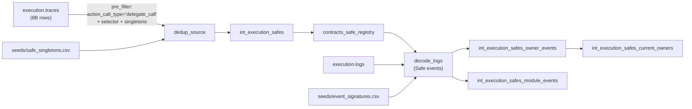

# Safe (Gnosis Safe)

## Protocol Overview

The [Safe](https://safe.global) smart account (formerly "Gnosis Safe") is the most widely deployed multi-signature wallet on EVM chains and the default smart-account substrate on Gnosis Chain. A Safe is a minimal proxy whose bytecode delegates every call into a **singleton** (or "mastercopy") contract that holds the actual logic. The proxy stores the per-wallet state (owners, threshold, nonce, modules, guard); the singleton contributes the code.

On Gnosis Chain, Safes have been deployed since the chain's earliest days. Cerebro tracks every Safe ever created — from the pre-factory v0.1.0 era in 2020 through v1.0.0, v1.1.0, v1.1.1, the Circles fork, v1.2.0, v1.3.0 (both standard and L2 variants), and v1.4.1 — with full historical owner mutation tracking.

## Why Safes matter for Cerebro

Safes are not interesting as "just another contract". They're interesting because every significant on-chain product on Gnosis Chain runs on top of them:

- **Gnosis Pay** — every GP debit card account is a Safe with a specific module topology ([Delay + Roles + Spender](../gnosis-pay/index.md)).
- **Circles V2** — every Circles avatar is a Safe, often deployed through the Cometh ERC-4337 bundler flow that powers the [Gnosis App sector](../gnosis-app/index.md).
- **Treasury, DAO, and custody** — most institutional activity on Gnosis Chain flows through a Safe, and attributing transactions to the correct decision-making entity requires tracking owner sets over time.

Cerebro provides the foundational Safe catalog that every higher-level model in the "smart account" stack joins against.

## Singletons & versions

Cerebro registers 12 singleton addresses in `seeds/safe_singletons.csv`. These are the full set of Safe mastercopies ever used on Gnosis Chain — both the canonical Safe releases and the Circles-specific fork.

| Address | Version | L2? | Setup selector | Notes |
|---|---|---|---|---|
| `0x8942595a2dc5181df0465af0d7be08c8f23c93af` | 0.1.0 | no | `0x0ec78d9e` | First-ever Safe, pre-ProxyFactory. Discoverable only via traces. |
| `0xb6029ea3b2c51d09a50b53ca8012feeb05bda35a` | 1.0.0 | no | `0xa97ab18a` | Original setup selector. |
| `0xae32496491b53841efb51829d6f886387708f99b` | 1.1.0 | no | `0xb63e800d` | First version to emit `SafeSetup`. |
| `0x34cfac646f301356faa8b21e94227e3583fe3f5f` | 1.1.1 | no | `0xb63e800d` | |
| `0x2cb0ebc503de87cfd8f0eceed8197bf7850184ae` | 1.1.1Circles | no | `0xb63e800d` | Circles' custom mastercopy — not deployed via the standard factory. |
| `0x6851d6fdfafd08c0295c392436245e5bc78b0185` | 1.2.0 | no | `0xb63e800d` | |
| `0xd9db270c1b5e3bd161e8c8503c55ceabee709552` | 1.3.0 | no | `0xb63e800d` | |
| `0x69f4d1788e39c87893c980c06edf4b7f686e2938` | 1.3.0 | no | `0xb63e800d` | EIP-155 variant. |
| `0x3e5c63644e683549055b9be8653de26e0b4cd36e` | 1.3.0L2 | yes | `0xb63e800d` | L2 singleton — emits additional tx events. |
| `0xfb1bffc9d739b8d520daf37df666da4c687191ea` | 1.3.0L2 | yes | `0xb63e800d` | EIP-155 L2 variant. |
| `0x41675c099f32341bf84bfc5382af534df5c7461a` | 1.4.1 | no | `0xb63e800d` | Most recent standard singleton. |
| `0x29fcb43b46531bca003ddc8fcb67ffe91900c762` | 1.4.1L2 | yes | `0xb63e800d` | Most recent L2 singleton. The GP Safe stack uses v1.3.0L2 today, not this. |

The three distinct setup selectors are why discovery needs a per-version selector match — not every Safe version has the same `setup(...)` function signature. The selector is stored in the seed so new versions can be added without touching SQL.

## Discovery pipeline

Safes are discovered from `execution.traces`, not from `execution.logs`. This is a deliberate choice:

1. **Pre-v1.1.0 Safes never emit `SafeSetup`.** The event was introduced in v1.1.0. An events-only approach would miss every Safe deployed in the chain's first year.
2. **`delegatecall` is the unique marker.** A Safe proxy's constructor immediately delegatecalls `setup(...)` on its singleton. Filtering traces on `action_call_type = 'delegate_call'` plus the singleton address plus one of the three setup selectors is the only reliable trace pattern that catches every Safe ever created.
3. **Traces are the biggest table in the warehouse.** 8B+ rows, 299 GiB. This is why the model uses `dedup_source(..., pre_filter=...)` — the pre-filter runs before the ROW_NUMBER window function so ClickHouse prunes monthly partitions before materializing anything.



The `int_execution_safes` model projects the raw trace match into a clean one-row-per-Safe table with the canonical lowercase-0x address shape the rest of the repo uses:

```sql
-- models/execution/safe/intermediate/int_execution_safes.sql (excerpt)
SELECT
    concat('0x', lower(tr.action_from))         AS safe_address,
    sg.version                                  AS creation_version,
    sg.is_l2                                    AS is_l2,
    concat('0x', lower(tr.action_to))           AS creation_singleton,
    toDate(tr.block_timestamp)                  AS block_date,
    tr.block_timestamp                          AS block_timestamp,
    tr.block_number, tr.transaction_hash,
    tr.result_gas_used                          AS gas_used
FROM traces tr
INNER JOIN singletons sg
    ON lower(tr.action_to) = sg.singleton_address
   AND lower(substring(tr.action_input, 1, 8)) = sg.setup_selector
```

## The Safe registry for decode_logs

Once `int_execution_safes` has a row for every Safe, `contracts_safe_registry` projects it into the shape [`decode_logs` expects](../../data-pipeline/transformation/safe-module-registry-pattern.md):

| Column | Source |
|---|---|
| `address` | `safe_address` (proxy) |
| `contract_type` | Always `'SafeProxy'` |
| `abi_source_address` | `creation_singleton` (the mastercopy — where the ABI lives) |
| `is_dynamic` | `1` (all Safes are chain-discovered) |
| `start_blocktime` | `block_timestamp` (Safe creation time; lower bound for event decoding) |
| `discovery_source` | `'traces:safe_setup_delegatecall'` |

Every downstream model that decodes Safe events — owner events, module events, and the planned `transactions` and `execution_events` follow-ups — calls:

```sql
{{ decode_logs(
    source_table         = source('execution','logs'),
    contract_address_ref = ref('contracts_safe_registry'),
    contract_type_filter = 'SafeProxy',
    output_json_type     = true,
    incremental_column   = 'block_timestamp',
    start_blocktime      = '2020-05-21'
) }}
```

This is the key win of the registry pattern: there is **one** compiled filter (`logs.address IN (SELECT address FROM contracts_safe_registry)`), and every Safe-event model inherits it. No per-model address lists, no stale whitelists.

## Decoded events

Cerebro decodes these Safe events for every Safe in the registry. Topic0 hashes are generated by [`scripts/signatures/signature_generator.py`](../../data-pipeline/transformation/abi-decoding.md) from the ABI fragments in `seeds/contracts_abi.csv` and live in `seeds/event_signatures.csv`.

| Event | Signature | Purpose | Model |
|---|---|---|---|
| `SafeSetup` | `SafeSetup(address,address[],uint256,address,address)` | Initial owner list + threshold at creation. | `int_execution_safes_owner_events` (`event_kind='safe_setup'`) |
| `AddedOwner` | `AddedOwner(address)` | Owner added post-setup via `addOwnerWithThreshold`. | `int_execution_safes_owner_events` (`event_kind='added_owner'`) |
| `RemovedOwner` | `RemovedOwner(address)` | Owner removed via `removeOwner` or `swapOwner`. | `int_execution_safes_owner_events` (`event_kind='removed_owner'`) |
| `ChangedThreshold` | `ChangedThreshold(uint256)` | Signer threshold changed. | `int_execution_safes_owner_events` (`event_kind='changed_threshold'`) |
| `ExecutionSuccess` | `ExecutionSuccess(bytes32,uint256)` | Successful `execTransaction`. Planned for the Safe transactions model. | *(planned)* |
| `ExecutionFailure` | `ExecutionFailure(bytes32,uint256)` | Failed `execTransaction`. | *(planned)* |
| `EnabledModule` | `EnabledModule(address)` | Zodiac/Safe module enabled on this Safe. | `int_execution_safes_module_events` |
| `DisabledModule` | `DisabledModule(address)` | Module disabled. | `int_execution_safes_module_events` |
| `ChangedGuard` | `ChangedGuard(address)` | Safe transaction guard changed. | `int_execution_safes_module_events` |
| `ChangedModuleGuard` | `ChangedModuleGuard(address)` | Module guard changed. | `int_execution_safes_module_events` |

Pre-v1.1.0 Safes never emit any of these (those Safes exist in `int_execution_safes` but produce zero rows in the event models).

!!! warning "The ABI is NOT identical across versions"
    The type signatures are the same (same keccak256 → same topic0), but the `indexed` flag differs. See the next section.

## ABI indexed-flag drift across versions

The canonical type signature (e.g., `EnabledModule(address)`) is the same across all Safe versions, so the topic0 hash is identical. But the Solidity `indexed` keyword — which controls whether a parameter is emitted in a topic slot or in the data field — **differs between versions**. An ABI mismatch causes `decode_logs` to read the parameter from the wrong location, producing NULL silently.

| Event | v0.1.0 – v1.3.0 | v1.4.1 / v1.4.1L2 | Source |
|---|---|---|---|
| `EnabledModule(address)` | `module` non-indexed (in data) | `module` **indexed** (in topic1) | `ModuleManager.sol` |
| `DisabledModule(address)` | non-indexed | **indexed** | `ModuleManager.sol` |
| `ChangedGuard(address)` | non-indexed (introduced in v1.3.0) | **indexed** | `GuardManager.sol` |
| `ChangedModuleGuard(address)` | non-indexed | **indexed** | `GuardManager.sol` |
| `AddedOwner(address)` | non-indexed | **indexed** | `OwnerManager.sol` |
| `RemovedOwner(address)` | non-indexed | **indexed** | `OwnerManager.sol` |
| `SafeSetup(...)` | `initiator` indexed, rest non-indexed | *same* | `Safe.sol` |
| `ChangedThreshold(uint256)` | non-indexed | *same* | `OwnerManager.sol` |
| `ExecutionSuccess/Failure(bytes32,uint256)` | non-indexed | *same* | `Safe.sol` |

**Status of fixes in `seeds/contracts_abi.csv`:**

- EnabledModule / DisabledModule / ChangedGuard / ChangedModuleGuard: **fixed** for v1.4.1 and v1.4.1L2 rows. The v0.1.0–v1.3.0L2 rows correctly have `indexed: false`.
- AddedOwner / RemovedOwner: **known issue** for v1.4.1 rows (CSV still has `indexed: false`, should be `true`). Affects 107k non-GP Safe events with NULL `owner`. All GP Safes are v1.3.0, so this does not affect Gnosis Pay.

**How to verify an indexed-flag mismatch:**

Pick a suspect event, query its topic1 nullness, and compare to the ABI:

```sql
SELECT
    lower(replaceAll(topic0, '0x', '')) AS topic0_hex,
    count()                             AS log_count,
    countIf(topic1 IS NULL)             AS null_topic1,
    countIf(topic1 IS NOT NULL)         AS has_topic1
FROM execution.logs
WHERE lower(replaceAll(topic0, '0x', '')) = '<topic0_hash>'
  AND block_timestamp >= toDateTime('2024-01-01')
  AND block_timestamp < toDateTime('2024-02-01')
GROUP BY topic0_hex
```

If the ABI says 1 indexed param but `null_topic1 / log_count ≈ 100%`, the ABI is wrong. Cross-check against the authoritative Solidity source at the correct version tag:

- Safe v1.3.0: [`safe-global/safe-smart-account` tag v1.3.0](https://github.com/safe-global/safe-smart-account/tree/v1.3.0/contracts/base)
- Safe v1.4.1: [`safe-global/safe-smart-account` tag v1.4.1](https://github.com/safe-global/safe-smart-account/tree/v1.4.1/contracts/base)

The `keccak256(canonical_type_signature)` does NOT depend on `indexed` — the topic0 hash is the same regardless of the flag. Only the decoder's behavior changes (which slot it reads from: topic or data).

## Singleton upgrade pattern (known limitation)

Safes can be upgraded post-deployment via `changeMasterCopy()` (v1.0.0–v1.3.0) or a direct write to the singleton storage slot. After an upgrade, the Safe's bytecode delegates into the new singleton — so every event emitted after the upgrade uses the **new** singleton's ABI layout.

Cerebro's `contracts_safe_registry.abi_source_address` is set to `creation_singleton` from `int_execution_safes`, which does not update after an upgrade. This means events from upgraded Safes are decoded with the stale ABI. The observable symptom is the same as an indexed-flag mismatch: NULL decoded params for events that have data in the raw log.

**Observed extent (April 2025):**

| creation_version | Upgrades detected | NULL owner rows | NULL module target rows |
|---|---:|---:|---:|
| `1.1.1Circles` | ~3,024 Safes | 15,366 | 4,369 |
| `1.3.0L2` | ~2,000 Safes | 3,494 | 1,808 |
| `1.3.0` | handful | 59 | 566 |
| **GP Safes (v1.3.0)** | **~0** | **6 (0.006%)** | **4 (0.006%)** |

GP Safes are effectively unaffected. The broader fix (for non-GP Safes) requires a time-windowed singleton history per Safe — tracking when each upgrade happened and routing each event to the correct ABI version at event time. Design notes are in the git history of the plan file.

## dbt model catalog

| Model | Materialization | Purpose | Batch |
|---|---|---|---|
| `int_execution_safes` | Incremental (`ReplacingMergeTree`) | One row per Safe ever deployed on Gnosis Chain. Traces-based discovery. | 3 months |
| `contracts_safe_registry` | Table | Registry consumed by `decode_logs` — maps every Safe proxy to its singleton ABI. | — |
| `int_execution_safes_owner_events` | Incremental | Long-form event log: SafeSetup (unrolled into one row per initial owner), AddedOwner, RemovedOwner, ChangedThreshold. | 3 months |
| `int_execution_safes_current_owners` | Table | Snapshot: for every `(safe, owner)` pair, keep the latest event via `argMax` and drop rows whose latest event is `removed_owner`. Denormalizes the current threshold onto every owner row. | — |
| `int_execution_safes_module_events` | Incremental | Long-form log of EnabledModule, DisabledModule, ChangedGuard, ChangedModuleGuard per Safe. *(Part A of the Gnosis Pay expansion.)* | 3 months |

All incremental models follow the repo-wide [full-refresh batch pattern](../../data-pipeline/transformation/dbt-cerebro.md) — `meta.full_refresh.{start_date, batch_months}` in schema.yml, consumed by `scripts/full_refresh/refresh.py`.

## Backfill

Traces-based discovery over 5+ years of Gnosis Chain cannot run in a single shot without OOMing. The backfill is a month-by-month loop, orchestrated by the refresh wrapper:

```bash
# Reads meta.full_refresh from the manifest and loops batches automatically
python scripts/full_refresh/refresh.py \
    --select int_execution_safes contracts_safe_registry int_execution_safes_owner_events
```

For the Safe creation model the batch loop runs 24 iterations at 3 months each (2020-05-21 → present), then finishes with a normal incremental run to flush the tail. The wrapper applies `--full-refresh` only on the first batch; every subsequent batch uses the `append` strategy so new data is added without rewriting existing partitions.

The three models must be chained in a single `--select` so dbt's DAG ordering rebuilds the registry between each creation batch and each owner-event batch — see [DAG ordering and the compile-time introspection trap](../../data-pipeline/transformation/safe-module-registry-pattern.md#dag-ordering-and-the-compile-time-introspection-trap).

## Gotchas (learned the hard way)

These are all mistakes we actually hit during the initial build. If you're extending the Safe stack or decoding a new Zodiac module on top of it, read them first.

- **`execution.traces.action_call_type = 'delegate_call'`** — lowercase, **with an underscore**. Not `DELEGATECALL`, not `delegatecall`. Uppercase, no-underscore, and mixed-case all silently match zero rows.
- **`execution.traces` and `execution.logs` store addresses and topic0 without the `0x` prefix.** Strip the prefix from the seed on the WHERE side, concat it back on the SELECT side. Our first run returned zero rows because the setup selectors were compared as `'0x0ec78d9e'` against storage-format `'0ec78d9e'`.
- **`result_gas_used`, not `action_gas_used`.** Traces expose both `action_gas` (gas provided) and `result_gas_used` (gas actually consumed). Dune's `gas_used` column maps to the latter. The old column name silently returned NULL and the `> 10000` filter discarded every row.
- **`partition_by` in the model config references the output column name, not the source column.** If you alias `tr.block_timestamp AS creation_time`, you must also update the config to `toStartOfMonth(creation_time)`. The first build of `int_execution_safes` failed with `Missing columns: 'block_timestamp'` because the config was still using the source name.
- **`allow_nullable_key: 1` must be set on any model ordered by a column inherited from `execution.traces.action_from`.** The traces column is `Nullable(String)`, and so is every derived column. `contracts_safe_registry` failed on its first build for exactly this reason.
- **`decode_logs`' compile-time introspection requires the referenced relation to exist at run time.** Never run a Safe-event model in isolation on a fresh warehouse — always chain it with `int_execution_safes` and `contracts_safe_registry` in the same `dbt run --select`.
- **ClickHouse `SELECT` aliases shadow source columns in `WHERE` clauses.** If you write `SELECT 'X' AS event_name FROM decoded WHERE event_name = 'X'`, ClickHouse evaluates the WHERE against the alias literal (`'X' = 'X'` → always TRUE), and every row passes. Fix: wrap the `FROM` in a pre-filter subquery so the WHERE runs in a scope where nothing shadows `event_name`: `FROM (SELECT * FROM decoded WHERE event_name = 'X') d`. Reproduction:
    ```sql
    WITH src AS (SELECT arrayJoin(['A','B','C','D']) AS event_name)
    SELECT 'Literal' AS event_name, count() FROM src WHERE event_name = 'A'
    -- Returns count=0 (not 1!) because WHERE evaluates 'Literal'='A' → FALSE
    ```
- **`decode_logs` had no `bool` / `bool[]` type branch until April 2025.** Static `bool` params decoded as NULL; `bool[]` elements decoded as 64-char hex strings (`"0x0000...0001"`). Fixed: both macros now emit `'0'`/`'1'` strings (matching the `uint*` convention). If you see a model comparing `decoded_params['someBool'] = 'true'`, update it to `= '1'`.

## Related pages

- [Registry pattern deep dive](../../data-pipeline/transformation/safe-module-registry-pattern.md) — how `decode_logs` consumes `contracts_safe_registry` to decode events per-Safe with the correct per-version ABI.
- [Gnosis Pay](../gnosis-pay/index.md) — the first production consumer of the `int_execution_safes_module_events` model, used to discover which Safes run the GP module topology.
- [Gnosis App](../gnosis-app/index.md) — a heuristic sector that uses `int_execution_safes` + `int_execution_safes_module_events` to identify users onboarded via the Circles InvitationModule flow.
- [Privacy & Pseudonyms](../../data-pipeline/transformation/privacy-pseudonyms.md) — how Safe owner addresses are pseudonymized before joining with Mixpanel.
